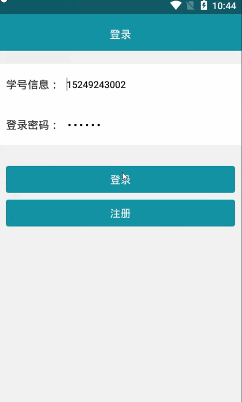
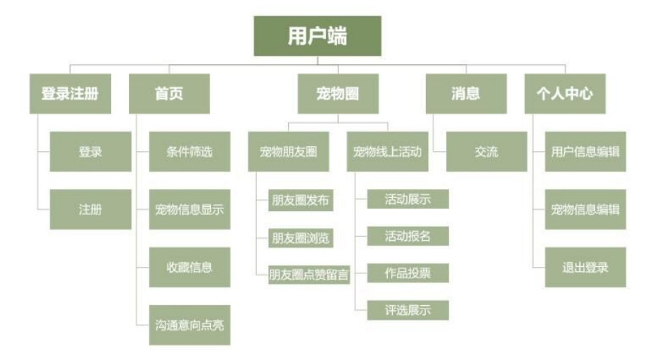

> **博主介绍：**
> 本人专注于Android/java/数据库/微信小程序技术领域的开发，以及有好几年的计算机毕业设计方面的实战开发经验和技术积累；尤其是在安卓（Android）的app的开发和微信小程序的开发，很是熟悉和了解；本人也是多年的Android开发人员；希望我发布的此篇文件可以帮助到您；
>
> 🍅 **文章末尾获取源码下载方式** 🍅

#### 功能演示

**详情演示视频请文字末尾公众号咨询，我会发给您；**

#### 1：后台演示

#### 2：客户端演示

#### 一、项目介绍

> >  
>  客户端：  
>  1：登录注册：用户可以通过自己的信息进行账号的注册  
>  2：宠物信息：列表显示发布的宠物想，可以通过条件对宠物信息进行筛选，以及沟通意向点亮  
>  3：宠物圈：用户可以发布宠物的动态信息，其他用户可以浏览，还可以点赞和留言  
>  4：活动信息：用户可以查看宠物线上活动信息，可以报名和投票  
>  5：场馆使用：选择发布的场馆，选择预约时间，提交预约，查看预约信息  
>  6：我的收藏：用户可以参看自己的收藏宠物信息；  
>  7：我的宠物：用户可以对自己发布的宠物信息进行编辑；  
>  8：个人信息：用户登录之后可以查看用户的基本资料以及对密码信息进行修改
>>

>> 后台服务端：  
>  1：用户管理：可以查看注册的用户信息  
>  2：宠物管理：查看用户发布的宠物信息；  
>  3：活动信息：添加和查看活动信息；
>
> 
>
> 技术信息：

#### 二、运行环境

> 1：客户端使用Android stuido进行开发；  
>  2：服务端后台使用Myeclipse2014进行开发；  
>  3：mysql数据库进行数据存储；  
>  4：需要jdk1.7以上  
>  5：使用雷电模拟器或者Androidstuio自带的模拟器进行运行

#### 三、使用技术

> **总体设计逻辑和思路：**  
>  1：先设计数据库表文件  
>  2：写服务端jsp页面以及写api接口给客户端提供数据  
>  3：完成后台服务端的数据交互，也就是jsp页面数据的存储和显示  
>  4：进行客户端页面的开发；  
>  5：进行客户端对api接口的调用，也就是获取数据库的数据以及在客户端进行显示
>
> **移动端：**  
>  1：使用android原生控件以及xml布局文件来完成界面的显示  
>  2：使用java代码完成功能的数据和逻辑交互  
>  3：使用http网络请求完成数据的请求；  
>  **4：使用json数据解析完成客户端数据的回调和显示**
>
> **服务端后台：**  
>  1：使用mysql完成数据的存储  
>  2：使用jdbc完成数据库和代码的逻辑交互  
>  3：使用jsp完成网页数据的显示  
>  4：使用java代码完成api接口的编写以及以及数据的回调

#### 四、数据库设计

    
    
    /*
    Navicat MySQL Data Transfer
    
    Source Server         : mydb
    Source Server Version : 50528
    Source Host           : localhost:3306
    Source Database       : petsdb
    
    Target Server Type    : MYSQL
    Target Server Version : 50528
    File Encoding         : 65001
    
    Date: 2021-12-01 20:36:51
    */
    
    SET FOREIGN_KEY_CHECKS=0;
    
    -- ----------------------------
    -- Table structure for applytb
    -- ----------------------------
    DROP TABLE IF EXISTS `applytb`;
    CREATE TABLE `applytb` (
      `applyId` int(11) NOT NULL AUTO_INCREMENT,
      `applyUserId` varchar(11) DEFAULT NULL,
      `applyUserName` varchar(255) DEFAULT NULL,
      `applyMessageId` varchar(11) DEFAULT NULL,
      `applyMessageName` varchar(255) DEFAULT NULL,
      `applyTime` varchar(100) DEFAULT NULL,
      `applyState` varchar(255) DEFAULT NULL,
      PRIMARY KEY (`applyId`)
    ) ENGINE=InnoDB AUTO_INCREMENT=19 DEFAULT CHARSET=utf8;
    
    -- ----------------------------
    -- Records of applytb
    -- ----------------------------
    INSERT INTO `applytb` VALUES ('8', '10', 'pony', '18', '为环卫工人送早餐', '2020-08-17 11:02', '1');
    INSERT INTO `applytb` VALUES ('9', '10', 'pony', '19', '凉水社区书籍分享', '2020-08-17 14:11', '1');
    INSERT INTO `applytb` VALUES ('10', '12', '小明', '21', '军训服回收', '2020-08-17 15:09', '2');
    INSERT INTO `applytb` VALUES ('11', '10', 'pony', '21', '军训服回收', '2020-08-18 10:42', '3');
    INSERT INTO `applytb` VALUES ('12', '14', '小卡卡', '21', '军训服回收', '2020-08-21 10:30', '2');
    INSERT INTO `applytb` VALUES ('13', '16', '99911', '18', '为环卫工人送早餐', '2020-09-15 10:27', '1');
    INSERT INTO `applytb` VALUES ('14', '16', '99911', '21', '军训服回收', '2020-09-15 10:32', '3');
    INSERT INTO `applytb` VALUES ('15', '105', '悦悦', '17', '共享单车归位', '2021-11-29 13:43', '1');
    INSERT INTO `applytb` VALUES ('16', '105', '悦悦', '15', '健康手语操', '2021-11-29 13:43', '2');
    INSERT INTO `applytb` VALUES ('17', '105', '悦悦', '18', '为环卫工人送早餐', '2021-11-29 13:46', '1');
    INSERT INTO `applytb` VALUES ('18', '105', '悦悦', '22', '运动损伤套餐', '2021-11-29 22:38', '1');
    
    -- ----------------------------
    -- Table structure for articletb
    -- ----------------------------
    DROP TABLE IF EXISTS `articletb`;
    CREATE TABLE `articletb` (
      `articleId` int(11) NOT NULL AUTO_INCREMENT,
      `articleTitle` varchar(255) DEFAULT NULL,
      `articleInfor` varchar(255) DEFAULT NULL,
      `articleImage` varchar(255) DEFAULT NULL,
      PRIMARY KEY (`articleId`)
    ) ENGINE=InnoDB AUTO_INCREMENT=3 DEFAULT CHARSET=utf8;
    
    -- ----------------------------
    -- Records of articletb
    -- ----------------------------
    INSERT INTO `articletb` VALUES ('1', '333', null, 'banner2.jpg');
    INSERT INTO `articletb` VALUES ('2', '爽肤水是否是', null, 'banner1.jpg');
    
    -- ----------------------------
    -- Table structure for petmsg
    -- ----------------------------
    DROP TABLE IF EXISTS `petmsg`;
    CREATE TABLE `petmsg` (
      `petId` int(50) NOT NULL AUTO_INCREMENT,
      `petName` varchar(255) DEFAULT NULL,
      `petPhone` varchar(255) DEFAULT NULL,
      `petYear` varchar(255) DEFAULT NULL,
      `petType` varchar(255) DEFAULT NULL,
      `petTypeMoney` varchar(255) DEFAULT NULL,
      `petFlag` varchar(255) DEFAULT NULL,
      `petMessage` varchar(1500) DEFAULT NULL,
      `petImg` varchar(255) DEFAULT NULL,
      `petTime` varchar(100) DEFAULT NULL,
      `petUserId` varchar(100) DEFAULT NULL,
      `petUserName` varchar(255) DEFAULT NULL,
      PRIMARY KEY (`petId`)
    ) ENGINE=InnoDB AUTO_INCREMENT=16 DEFAULT CHARSET=utf8;
    
    -- ----------------------------
    -- Records of petmsg
    -- ----------------------------
    INSERT INTO `petmsg` VALUES ('7', '宠物', '15249246666', '3年', null, null, '1', '阳光明媚的一天，格鲁家的小黄人一边哼着小曲一边擦玻璃。', '20181019152302.jpg', '2019-01-21 11:35', '106', '小丸子');
    INSERT INTO `petmsg` VALUES ('8', '呆呆', '15249246666', '3年', null, null, '1', '这时，他看到窗外的人们牵着各自的宠物从门前经过，小动物憨态可掬，与主人形影不离。', 'timg-10.jpeg', '2019-01-21 14:39', '106', '小丸子');
    INSERT INTO `petmsg` VALUES ('9', '宠物宝宝', '15249246666', '3年', null, null, '1', '小黄人不禁心生羡慕，多么希望自己也能养一只宠物。他拿着项圈问了格鲁那条疯狂的小狗，可是对方根本不领情。', 'timg-5.jpeg', '2019-01-21 17:07', '106', '小丸子');
    INSERT INTO `petmsg` VALUES ('10', '宠物宝宝', '15249246666', '3年', null, null, '1', '他又问了外面的松鼠、鸽子甚至渺小的瓢虫，最终一无所获。正在这时，一架迷你飞碟突然出现，吓了小黄人一跳。', 'timg-2.jpeg', '2019-01-21 17:18', '110', 'duoduo');
    INSERT INTO `petmsg` VALUES ('11', '宠物宝宝', '15249246666', '3年', null, null, '1', '很可爱，很听话，也很乖！', 'QQ截图20210908154309.jpg', '2021-11-29 12:34', '105', '悦悦');
    INSERT INTO `petmsg` VALUES ('12', '我的小可爱', '15249246666', '3年', null, null, '1', '很可爱，很听话，也很乖！', '20211127214501.jpg', '2021-11-29 22:44', '105', '悦悦');
    INSERT INTO `petmsg` VALUES ('13', '宠物宝宝', '15249246666', '2000', '犬类', '有偿', '2', '很可爱，很听话，也很乖！', '20211127222252.jpg', '2021-11-30 22:26', '105', '悦悦');
    INSERT INTO `petmsg` VALUES ('14', '宠宝', '15249246666', '3年', '猫类', '-1', '1', '很可爱，很听话，也很乖！', '20211026230634.jpg', '2021-11-30 22:55', '105', '悦悦');
    INSERT INTO `petmsg` VALUES ('15', '宠物宝宝', '15249246666', '300', '犬类', '有偿', '2', '很可爱，很听话，也很乖！', '20211127211809.jpg', '2021-11-30 22:56', '105', '悦悦');
    
    -- ----------------------------
    -- Table structure for praise
    -- ----------------------------
    DROP TABLE IF EXISTS `praise`;
    CREATE TABLE `praise` (
      `praiseId` int(50) NOT NULL AUTO_INCREMENT,
      `praiseUserId` varchar(100) NOT NULL,
      `praiseMessageId` varchar(50) NOT NULL,
      PRIMARY KEY (`praiseId`)
    ) ENGINE=InnoDB AUTO_INCREMENT=75 DEFAULT CHARSET=utf8;
    
    -- ----------------------------
    -- Records of praise
    -- ----------------------------
    INSERT INTO `praise` VALUES ('66', '105', '38');
    INSERT INTO `praise` VALUES ('67', '105', '37');
    INSERT INTO `praise` VALUES ('68', '105', '39');
    INSERT INTO `praise` VALUES ('69', '105', '40');
    INSERT INTO `praise` VALUES ('70', '105', '42');
    INSERT INTO `praise` VALUES ('71', '109', '44');
    INSERT INTO `praise` VALUES ('72', '105', '45');
    INSERT INTO `praise` VALUES ('73', '105', '46');
    INSERT INTO `praise` VALUES ('74', '109', '46');
    
    -- ----------------------------
    -- Table structure for projecttb
    -- ----------------------------
    DROP TABLE IF EXISTS `projecttb`;
    CREATE TABLE `projecttb` (
      `projectId` int(50) NOT NULL AUTO_INCREMENT,
      `projectName` varchar(255) DEFAULT NULL,
      `projectNumber` varchar(11) DEFAULT NULL,
      `projectAddress` varchar(255) DEFAULT NULL,
      `projectWeek` varchar(255) DEFAULT NULL,
      `projectMessage` varchar(255) DEFAULT NULL,
      `projectTime` varchar(100) DEFAULT NULL,
      `projectImg` varchar(255) DEFAULT NULL,
      PRIMARY KEY (`projectId`)
    ) ENGINE=InnoDB AUTO_INCREMENT=23 DEFAULT CHARSET=utf8;
    
    -- ----------------------------
    -- Records of projecttb
    -- ----------------------------
    INSERT INTO `projecttb` VALUES ('22', '运动损伤套餐', '7', '7', '星期一', '777', '2021-11-29 22:37:34', 'app_dry_rubbish.png');
    
    -- ----------------------------
    -- Table structure for reviewtb
    -- ----------------------------
    DROP TABLE IF EXISTS `reviewtb`;
    CREATE TABLE `reviewtb` (
      `reviewId` int(11) NOT NULL AUTO_INCREMENT,
      `reviewMessageId` int(11) DEFAULT NULL,
      `reviewContent` varchar(255) DEFAULT NULL,
      `reviewUserId` int(11) DEFAULT NULL,
      `reviewUserName` varchar(255) DEFAULT NULL,
      `reviewTime` varchar(100) DEFAULT NULL,
      `reviewFlag` varchar(255) DEFAULT NULL,
      PRIMARY KEY (`reviewId`)
    ) ENGINE=InnoDB AUTO_INCREMENT=35 DEFAULT CHARSET=utf8;
    
    -- ----------------------------
    -- Records of reviewtb
    -- ----------------------------
    INSERT INTO `reviewtb` VALUES ('31', '44', '你哈皮呀', '109', '小花花', '2021-03-17 23:42', null);
    INSERT INTO `reviewtb` VALUES ('32', '44', '45623', '105', '悦悦', '2021-11-29 13:40', null);
    INSERT INTO `reviewtb` VALUES ('33', '45', '8888888', '105', '悦悦', '2021-11-29 22:06', null);
    INSERT INTO `reviewtb` VALUES ('34', '46', '8888888888888', '105', '悦悦', '2021-11-29 22:45', null);
    
    -- ----------------------------
    -- Table structure for teamapplytb
    -- ----------------------------
    DROP TABLE IF EXISTS `teamapplytb`;
    CREATE TABLE `teamapplytb` (
      `teamApplyId` int(11) NOT NULL AUTO_INCREMENT,
      `teamApplySendUserId` int(11) DEFAULT NULL,
      `teamApplyReviceUserId` int(11) DEFAULT NULL,
      `teamApplyState` varchar(255) DEFAULT NULL,
      `teamTeamId` int(11) DEFAULT NULL,
      `teamDate` varchar(100) DEFAULT NULL,
      PRIMARY KEY (`teamApplyId`)
    ) ENGINE=InnoDB AUTO_INCREMENT=10 DEFAULT CHARSET=utf8;
    
    -- ----------------------------
    -- Records of teamapplytb
    -- ----------------------------
    INSERT INTO `teamapplytb` VALUES ('7', '109', '105', '2', '11', '2021-11');
    INSERT INTO `teamapplytb` VALUES ('8', '109', '106', '2', '8', '2021-10');
    INSERT INTO `teamapplytb` VALUES ('9', '109', '105', '2', '12', '2021-11');
    
    -- ----------------------------
    -- Table structure for token
    -- ----------------------------
    DROP TABLE IF EXISTS `token`;
    CREATE TABLE `token` (
      `tid` int(100) NOT NULL AUTO_INCREMENT,
      `uid` varchar(100) CHARACTER SET utf8 NOT NULL,
      `utoken` varchar(500) CHARACTER SET utf8 NOT NULL,
      PRIMARY KEY (`tid`)
    ) ENGINE=InnoDB AUTO_INCREMENT=146 DEFAULT CHARSET=latin1;
    
    -- ----------------------------
    -- Records of token
    -- ----------------------------
    INSERT INTO `token` VALUES ('140', '103', 'mRHEEi/RNNnCAUsC1qH4Rt7hLHOyXDZkRMJ0giwZZq0=@4ixh.cn.rongnav.com;4ixh.cn.rongcfg.com');
    INSERT INTO `token` VALUES ('141', '104', 'wzr+nt9zT+nCAUsC1qH4RpaqfFk72MwERMJ0giwZZq0=@4ixh.cn.rongnav.com;4ixh.cn.rongcfg.com');
    INSERT INTO `token` VALUES ('142', '105', 'rJRUNQLo5RfCAUsC1qH4RhEYmFA2SEoXRMJ0giwZZq0=@4ixh.cn.rongnav.com;4ixh.cn.rongcfg.com');
    INSERT INTO `token` VALUES ('143', '107', 'l+t213zhSFDCAUsC1qH4RnvHYZQyEXyWRMJ0giwZZq0=@4ixh.cn.rongnav.com;4ixh.cn.rongcfg.com');
    INSERT INTO `token` VALUES ('144', '108', '410+eC84tRfCAUsC1qH4Rnua6oerg5KeRMJ0giwZZq0=@4ixh.cn.rongnav.com;4ixh.cn.rongcfg.com');
    INSERT INTO `token` VALUES ('145', '109', 'qUhVLBfskPfCAUsC1qH4RgWB33qAKI6VRMJ0giwZZq0=@4ixh.cn.rongnav.com;4ixh.cn.rongcfg.com');
    
    -- ----------------------------
    -- Table structure for topictb
    -- ----------------------------
    DROP TABLE IF EXISTS `topictb`;
    CREATE TABLE `topictb` (
      `topicId` int(11) NOT NULL AUTO_INCREMENT,
      `topicInfor` varchar(255) DEFAULT NULL,
      `topicFile` varchar(255) DEFAULT NULL,
      `topicImg` varchar(255) DEFAULT NULL,
      `topicUserId` varchar(255) DEFAULT NULL,
      `topicUserName` varchar(255) DEFAULT NULL,
      `topicTime` varchar(100) DEFAULT NULL,
      PRIMARY KEY (`topicId`)
    ) ENGINE=InnoDB AUTO_INCREMENT=47 DEFAULT CHARSET=utf8;
    
    -- ----------------------------
    -- Records of topictb
    -- ----------------------------
    INSERT INTO `topictb` VALUES ('41', '大家有什么好的冬季健身计划吗？求分享', null, '20200121095012.jpg', '105', '悦悦', '2021-03-17 23:36');
    INSERT INTO `topictb` VALUES ('42', '大家有什么好的冬季健身计划吗？求分享', null, '20191124135829.jpg', '105', '悦悦', '2021-03-17 23:36');
    INSERT INTO `topictb` VALUES ('43', '今年春节过的还好吗？', null, '20200414212344.jpg', '109', '小花花', '2021-03-17 23:36');
    INSERT INTO `topictb` VALUES ('44', '还好吗？', null, '20200407191014.jpg', '105', '悦悦', '2021-03-17 23:41');
    INSERT INTO `topictb` VALUES ('45', '今年春节过的还好吗？', null, 'QQ截图20210908154309.jpg', '105', '悦悦', '2021-11-29 12:34');
    INSERT INTO `topictb` VALUES ('46', '今年春节过的还好吗？', null, '20211127211809.jpg', '105', '悦悦', '2021-11-29 22:45');
    
    -- ----------------------------
    -- Table structure for user
    -- ----------------------------
    DROP TABLE IF EXISTS `user`;
    CREATE TABLE `user` (
      `uid` int(255) NOT NULL AUTO_INCREMENT,
      `uname` varchar(200) CHARACTER SET utf8 NOT NULL,
      `uphone` varchar(100) CHARACTER SET utf8 NOT NULL,
      `upswd` varchar(200) CHARACTER SET utf8 NOT NULL,
      `uImg` varchar(255) CHARACTER SET utf8 DEFAULT NULL,
      `utime` varchar(300) CHARACTER SET utf8 NOT NULL,
      `utype` varchar(255) CHARACTER SET utf8 DEFAULT NULL,
      PRIMARY KEY (`uid`)
    ) ENGINE=InnoDB AUTO_INCREMENT=110 DEFAULT CHARSET=latin1;
    
    -- ----------------------------
    -- Records of user
    -- ----------------------------
    INSERT INTO `user` VALUES ('105', '悦悦', '15249243002', '123456', 'stuimg.png', '2021-03-17 23:23', '1');
    INSERT INTO `user` VALUES ('106', 'admin', 'admin', '123456', null, '2021-03-17 23:23', '3');
    INSERT INTO `user` VALUES ('109', '小花花', '15249246600', '123456', 'stuimg.png', '2021-03-17 23:23', '1');
    
    -- ----------------------------
    -- Table structure for worktb
    -- ----------------------------
    DROP TABLE IF EXISTS `worktb`;
    CREATE TABLE `worktb` (
      `workId` int(11) NOT NULL AUTO_INCREMENT,
      `workCourseId` int(11) DEFAULT NULL,
      `workCourseName` varchar(255) DEFAULT NULL,
      `workTitle` varchar(255) DEFAULT NULL,
      `workInfor` varchar(255) DEFAULT NULL,
      `workTime` varchar(100) DEFAULT NULL,
      `workFile` varchar(255) DEFAULT NULL,
      PRIMARY KEY (`workId`)
    ) ENGINE=InnoDB AUTO_INCREMENT=6 DEFAULT CHARSET=utf8;
    
    -- ----------------------------
    -- Records of worktb
    -- ----------------------------
    INSERT INTO `worktb` VALUES ('1', '10', '英语', '课前预习文件信息', '由乡村到城市的转移过程在任何国家都不可能是直线式的，而是充满了矛盾和曲折。其中，最为复杂的问题当推从“农民”到“市民”转化过程的长期性。', '2020-12-17 14:32', 'qidongtomcat.docx');
    INSERT INTO `worktb` VALUES ('2', '10', '英语', '给定资料', '因此，农业转移人口能否实现在地化，便成为其能否完成市民化的前提和关键', '2020-12-17 14:32', 'weixinxiaochengxu.docx');
    INSERT INTO `worktb` VALUES ('3', '10', '英语', '文件信息', '用JDK自带的keytool工具生成证书，可以用任意一台安装jdk的主机生成证书，无需申请，坏处是生成的证书没有通过认证，浏览器访问时，会出现不可信证书提醒，生成过程参考', '2020-12-17 14:32', '');
    INSERT INTO `worktb` VALUES ('4', '10', '英语', '1', '1111111111', '2021-02-24 00:55', '');
    INSERT INTO `worktb` VALUES ('5', '10', '英语', '休息', '休息休息休息休息休息休息休息休息休息休息休息休息休息休息休息休息休息休息休息休息休息休息', '2021-02-24 00:57', '');
    

#### 五、部分代码

#### 六、浏览更多Android毕业设计

[毕业设计-基于android的租房信息发布平台的APP_信息发布app源码_Android毕业设计源码的博客-
CSDN博客](https://blog.csdn.net/u014388322/article/details/100656450?spm=1001.2014.3001.5502
"毕业设计-基于android的租房信息发布平台的APP_信息发布app源码_Android毕业设计源码的博客-CSDN博客")

[毕业设计-基于android选课系统的设计与实现_android学生选课系统_Android毕业设计源码的博客-
CSDN博客](https://blog.csdn.net/u014388322/article/details/100656536?spm=1001.2014.3001.5502
"毕业设计-基于android选课系统的设计与实现_android学生选课系统_Android毕业设计源码的博客-CSDN博客")

[毕业设计之校园一卡通管理系统的设计与实现_一卡通管理系统实现_Android毕业设计源码的博客-
CSDN博客](https://blog.csdn.net/u014388322/article/details/126048550?spm=1001.2014.3001.5502
"毕业设计之校园一卡通管理系统的设计与实现_一卡通管理系统实现_Android毕业设计源码的博客-CSDN博客")

[基于Android的校园二手闲置物品交易系统设计与实现_基于android的二手交易平台_Android毕业设计源码的博客-
CSDN博客](https://blog.csdn.net/u014388322/article/details/128232475?spm=1001.2014.3001.5502
"基于Android的校园二手闲置物品交易系统设计与实现_基于android的二手交易平台_Android毕业设计源码的博客-CSDN博客")

[基于androidstudio校园快递APP系统的设计与实现_android studio论文_Android毕业设计源码的博客-
CSDN博客](https://blog.csdn.net/u014388322/article/details/128545390?spm=1001.2014.3001.5502
"基于androidstudio校园快递APP系统的设计与实现_android studio论文_Android毕业设计源码的博客-CSDN博客")

[基于android的商城购物定制APP_安卓开发购物app_Android毕业设计源码的博客-
CSDN博客](https://blog.csdn.net/u014388322/article/details/128746697?spm=1001.2014.3001.5502
"基于android的商城购物定制APP_安卓开发购物app_Android毕业设计源码的博客-CSDN博客")

> 更多毕业设计可以浏览我的个人主页哦！

#### 七、源码下载

> 大家 **点赞、收藏、关注、评论** 啦 、 **查看** 👇🏻👇🏻👇🏻 **获取联系方式** 👇🏻👇🏻👇🏻
>
> <https://download.csdn.net/download/u014388322/87473459>

