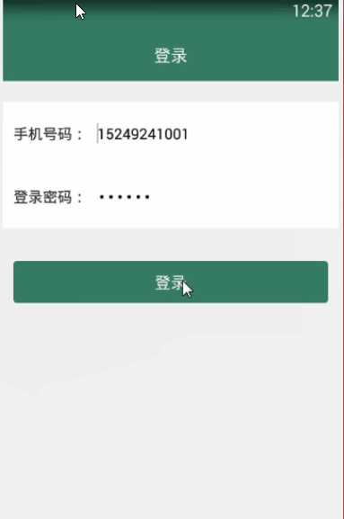

> **博主介绍：**
> 本人专注于Android/java/数据库/微信小程序技术领域的开发，以及有好几年的计算机毕业设计方面的实战开发经验和技术积累；尤其是在安卓（Android）的app的开发和微信小程序的开发，很是熟悉和了解；本人也是多年的Android开发人员；希望我发布的此篇文件可以帮助到您；
>
> 🍅 **文章末尾获取源码下载方式** 🍅

#### 后台演示：

#### 客户端演示：

#### 一、项目介绍

> 管理员身份功能介绍：
>
> 1：用户登录：管理用户的信息  
>  2：信息管理：管理发布的信息  
>  3：学生管理：管理学生的学籍信息  
>  4：宿舍管理：管理学生的宿舍分配清理  
>  5：缴费管理：管理学生缴费信息  
>  6：物资管理：管理学生物资信息
>
> 用户功能介绍：  
>  1：用户登录：用户通过自己的注册信息进行软件的登录  
>  2：学籍信息：查看自己的学籍信息  
>  3：宿舍信息：查看自己的宿舍信息  
>  4：物资信息：查看自己的物资信息  
>  5：缴费信息：查看自己的缴费信息  
>  6：资讯信息：查看发布的资讯信息  
>  7：个人信息：用户可以浏览个人信息，以及对密码进行修改；

#### 二、运行环境

> 1：客户端使用Android stuido进行开发；  
>  2：服务端后台使用Myeclipse2014进行开发；  
>  3：mysql数据库进行数据存储；  
>  4：需要jdk1.7以上  
>  5：使用雷电模拟器或者Androidstuio自带的模拟器进行运行

#### 三、使用技术

> **总体设计逻辑和思路：**  
>  1：先设计数据库表文件  
>  2：写服务端jsp页面以及写api接口给客户端提供数据  
>  3：完成后台服务端的数据交互，也就是jsp页面数据的存储和显示  
>  4：进行客户端页面的开发；  
>  5：进行客户端对api接口的调用，也就是获取数据库的数据以及在客户端进行显示
>
> **移动端：**  
>  1：使用android原生控件以及xml布局文件来完成界面的显示  
>  2：使用java代码完成功能的数据和逻辑交互  
>  3：使用http网络请求完成数据的请求；  
>  **4：使用json数据解析完成客户端数据的回调和显示**
>
> **服务端后台：**  
>  1：使用mysql完成数据的存储  
>  2：使用jdbc完成数据库和代码的逻辑交互  
>  3：使用jsp完成网页数据的显示  
>  4：使用java代码完成api接口的编写以及以及数据的回调

#### 四、数据库设计

> /*  
>  Navicat MySQL Data Transfer
>
> Source Server : mydata  
>  Source Server Version : 50537  
>  Source Host : localhost:3306  
>  Source Database : studentdb
>
> Target Server Type : MYSQL  
>  Target Server Version : 50537  
>  File Encoding : 65001
>
> Date: 2019-01-31 12:44:04  
>  */
>
> SET FOREIGN_KEY_CHECKS=0;
>
> \-- ----------------------------  
>  \-- Table structure for costtb  
>  \-- ----------------------------  
>  DROP TABLE IF EXISTS `costtb`;  
>  CREATE TABLE `costtb` (  
>  `costId` int(50) NOT NULL AUTO_INCREMENT,  
>  `costUserId` varchar(100) DEFAULT NULL,  
>  `costUserName` varchar(255) DEFAULT NULL,  
>  `costStudy` varchar(255) DEFAULT NULL,  
>  `costDormitory` varchar(255) DEFAULT NULL,  
>  `costTotal` varchar(255) DEFAULT NULL,  
>  `costTime` varchar(100) DEFAULT NULL,  
>  PRIMARY KEY (`costId`)  
>  ) ENGINE=InnoDB AUTO_INCREMENT=4 DEFAULT CHARSET=utf8;
>
> \-- ----------------------------  
>  \-- Records of costtb  
>  \-- ----------------------------  
>  INSERT INTO `costtb` VALUES ('1', '111', '小明', '4500', '1500', '6000',
> '2019-01-30 22:05');  
>  INSERT INTO `costtb` VALUES ('2', '112', '小花', '4500', '1500', '6000',
> '2019-01-30 22:05');  
>  INSERT INTO `costtb` VALUES ('3', '113', '多多', '4500', '3000', '7500',
> '2019-01-30 22:05');
>
> \-- ----------------------------  
>  \-- Table structure for dormitorytb  
>  \-- ----------------------------  
>  DROP TABLE IF EXISTS `dormitorytb`;  
>  CREATE TABLE `dormitorytb` (  
>  `dormitoryId` int(11) NOT NULL AUTO_INCREMENT,  
>  `dormitoryName` varchar(255) DEFAULT NULL,  
>  `dormitoryUserId` varchar(100) DEFAULT NULL,  
>  `dormitoryUserName` varchar(255) DEFAULT NULL,  
>  `dormitoryAddress` varchar(255) DEFAULT NULL,  
>  `dormitoryTime` varchar(100) DEFAULT NULL,  
>  PRIMARY KEY (`dormitoryId`)  
>  ) ENGINE=InnoDB AUTO_INCREMENT=2 DEFAULT CHARSET=utf8;
>
> \-- ----------------------------  
>  \-- Records of dormitorytb  
>  \-- ----------------------------  
>  INSERT INTO `dormitorytb` VALUES ('1', '一号宿舍楼', '111', '小明', '1楼101',
> '2019-01-30 21:51');
>
> \-- ----------------------------  
>  \-- Table structure for newsmessage  
>  \-- ----------------------------  
>  DROP TABLE IF EXISTS `newsmessage`;  
>  CREATE TABLE `newsmessage` (  
>  `newsId` int(100) NOT NULL AUTO_INCREMENT,  
>  `newsTitle` varchar(255) DEFAULT NULL,  
>  `newsContent` varchar(1500) DEFAULT NULL,  
>  `newsTime` varchar(100) DEFAULT NULL,  
>  PRIMARY KEY (`newsId`)  
>  ) ENGINE=InnoDB AUTO_INCREMENT=45 DEFAULT CHARSET=utf8;
>
> \-- ----------------------------  
>  \-- Records of newsmessage  
>  \-- ----------------------------  
>  INSERT INTO `newsmessage` VALUES ('41', '新生报道注意事项',
> '1、身份证\r\n2、毕业证书\r\n3、学位证书（如果无可忽略）\r\n4、资质证书（如英语等级证、其他资质证书）\r\n5、上份工作离职证明\r\n6、体检报告（如果公司要求，提前准备）\r\n以上资料都带原件，公司会看原件留复印件存档。',
> '2019-01-30 17:09');  
>  INSERT INTO `newsmessage` VALUES ('42', '缴费事项信息',
> '可以暂不缴费，凭录取通知书里的《厦门大学学生及家庭情况调查表》到学校办理绿色通道或者国家助学贷款，也可以在迎新系统的绿色通道、生源地贷页面提交相应材料，等待厦门大学学生资助管理中心审核。审核工作将于代扣结束后2-3天开始，请稍后再查看审核结果。',
> '2019-01-30 17:10');  
>  INSERT INTO `newsmessage` VALUES ('43', '军训事项信息',
> '一、出门前检查着装。检查自己军训服装，军帽、帽徽、臂章、腰带等穿戴好了吗，免得到时候“英雄白走路”。\r\n二、装束要舒适。军训服里面穿一件吸汗背心，袜子最好穿棉制运动袜，鞋子里面再垫一块剪成软鞋垫的卫生巾，这样脚会舒服点，腰带要适当紧一点，走起路来会更有精神劲儿。\r\n三、注意补充水份。用大容量的水瓶装运动饮料或茶水，盐水最佳，休息的时候就补充，不要拼命喝白开水或矿泉水。',
> '2019-01-30 17:10');  
>  INSERT INTO `newsmessage` VALUES ('44', '交通事项信息',
> '从出行者的角度看，道路标志标线、信号灯、车载导航设备、收音机交通广‘播、超速行驶时车辆信息系统的提示音等，都是交通信息；从“交通人”角度，小学老师教导“过马路要走人行横道”、交通违章伤亡照片宣传栏、交通违章后收到的罚单、警察的批评，也是交通信息；从交通系统角度看，道路交通量、平均乍速、违章行为、计算机交通数据库的内容、交通控制和通信系统中处理和传送的内容都是交通信息。如同信息在其他领域中一样，人们对交通信息的认识还处在经验水平上，远远没有上升到理论高度。',
> '2019-01-30 17:11');
>
> \-- ----------------------------  
>  \-- Table structure for signtb  
>  \-- ----------------------------  
>  DROP TABLE IF EXISTS `signtb`;  
>  CREATE TABLE `signtb` (  
>  `signId` int(50) NOT NULL AUTO_INCREMENT,  
>  `signMessageId` varchar(11) DEFAULT NULL,  
>  `signType` varchar(255) DEFAULT NULL,  
>  `signUserId` varchar(11) DEFAULT NULL,  
>  PRIMARY KEY (`signId`)  
>  ) ENGINE=InnoDB AUTO_INCREMENT=11 DEFAULT CHARSET=utf8;
>
> \-- ----------------------------  
>  \-- Records of signtb  
>  \-- ----------------------------  
>  INSERT INTO `signtb` VALUES ('7', '111', '1', '111');  
>  INSERT INTO `signtb` VALUES ('8', '1', '2', '111');  
>  INSERT INTO `signtb` VALUES ('9', '1', '3', '111');  
>  INSERT INTO `signtb` VALUES ('10', '1', '4', '111');
>
> \-- ----------------------------  
>  \-- Table structure for suppliestb  
>  \-- ----------------------------  
>  DROP TABLE IF EXISTS `suppliestb`;  
>  CREATE TABLE `suppliestb` (  
>  `suppliesId` int(50) NOT NULL AUTO_INCREMENT,  
>  `suppliesUserId` varchar(11) DEFAULT NULL,  
>  `suppliesUserName` varchar(255) DEFAULT NULL,  
>  `suppliesDormitory` varchar(255) DEFAULT NULL,  
>  `suppliesBook` varchar(255) DEFAULT NULL,  
>  `suppliesTime` varchar(100) DEFAULT NULL,  
>  PRIMARY KEY (`suppliesId`)  
>  ) ENGINE=InnoDB AUTO_INCREMENT=3 DEFAULT CHARSET=utf8;
>
> \-- ----------------------------  
>  \-- Records of suppliestb  
>  \-- ----------------------------  
>  INSERT INTO `suppliestb` VALUES ('1', '111', '小明', '棉被，洗漱工具', '所用到的书本和文具',
> '2019-01-30 22:15');
>
> \-- ----------------------------  
>  \-- Table structure for user  
>  \-- ----------------------------  
>  DROP TABLE IF EXISTS `user`;  
>  CREATE TABLE `user` (  
>  `userId` int(255) NOT NULL AUTO_INCREMENT,  
>  `userName` varchar(200) CHARACTER SET utf8 NOT NULL,  
>  `userSex` varchar(255) CHARACTER SET utf8 DEFAULT NULL,  
>  `userAge` varchar(255) CHARACTER SET utf8 DEFAULT NULL,  
>  `userClass` varchar(255) CHARACTER SET utf8 DEFAULT NULL,  
>  `userPhone` varchar(100) CHARACTER SET utf8 NOT NULL,  
>  `userPswd` varchar(200) CHARACTER SET utf8 NOT NULL,  
>  `userMajor` varchar(255) CHARACTER SET utf8 DEFAULT NULL,  
>  `userTime` varchar(300) CHARACTER SET utf8 NOT NULL,  
>  `userNo` varchar(100) CHARACTER SET utf8 DEFAULT NULL,  
>  `userAddress` varchar(255) CHARACTER SET utf8 DEFAULT NULL,  
>  PRIMARY KEY (`userId`)  
>  ) ENGINE=InnoDB AUTO_INCREMENT=115 DEFAULT CHARSET=latin1;
>
> \-- ----------------------------  
>  \-- Records of user  
>  \-- ----------------------------  
>  INSERT INTO `user` VALUES ('111', '小明', '男', '20', '计算机系一班', '15249241001',
> '123456', '计算机科学与技术', '2019-01-30 21:47', '10001', '陕西省西安市雁塔区');  
>  INSERT INTO `user` VALUES ('112', '小花', '女', '21', '计算机系一班', '15249241002',
> '123456', '计算机科学与技术', '2019-01-30 21:47', '10002', '陕西省西安市雁塔区');  
>  INSERT INTO `user` VALUES ('113', '多多', '男', '20', '计算机系一班', '15249241003',
> '123456', '计算机科学与技术', '2019-01-30 21:47', '10003', '陕西省西安市雁塔区');  
>

#### 五、部分代码

##### 1：首页信息

>  
>  public class MainIndexFragment extends BaseFragment implements Observer {  
>  // »ñÈ¡view  
>  private View rootView;  
>  View convertView;  
>  private GridviewForScrollView mChocieType;  
>  private List<NoticeModel> listMsg = new ArrayList<NoticeModel>();  
>  private TextView guide_title;
>
> private ListviewForScrollView mListMessage;  
>  
>  @Override  
>  public View onCreateView(LayoutInflater inflater, ViewGroup container,
> Bundle savedInstanceState) {  
>  rootView =
> LayoutInflater.from(getActivity()).inflate(R.layout.fragment_index, null);  
>  initWidget();  
>  initData();  
>  return rootView;  
>  }
>
> @Override  
>  public void initWidget() {
>
>  
>  mListMessage = (ListviewForScrollView)
> rootView.findViewById(R.id.mListMessage);  
>  guide_title = (TextView) rootView.findViewById(R.id.guide_title);
>
> mChocieType = (GridviewForScrollView)
> rootView.findViewById(R.id.mChocieType);
>
> mListMessage.setOnItemClickListener(new OnItemClickListener() {
>
> @Override  
>  public void onItemClick(AdapterView<?> arg0, View arg1, int position, long
> arg3) {
>
> Intent playMusic = new Intent(getActivity(), NoticeMessageActivity.class);  
>  playMusic.putExtra("msg", listMsg.get(position));  
>  startActivity(playMusic);  
>  }  
>  });  
>  }
>
> @Override  
>  public void onClick(View v) {  
>  }
>
> @Override  
>  public void initData() {  
>  // mtvTip.setText(checkBody());
>
> listPhoneMessage(false);
>
> MainIndexAdapter musicNetListAdapter = new MainIndexAdapter(getActivity(),
> Consts.choiceString);  
>  mChocieType.setAdapter(musicNetListAdapter);
>
> mChocieType.setOnItemClickListener(new OnItemClickListener() {
>
> @Override  
>  public void onItemClick(AdapterView<?> arg0, View arg1, int position, long
> arg3) {
>
> if (position == 0) {  
>  Intent intent = new Intent(getActivity(),
> UserStudentMessageActivity.class);  
>  getActivity().startActivity(intent);  
>  } else if (position == 1) {  
>  Intent intent = new Intent(getActivity(),
> UserDormitoryMessageActivity.class);  
>  getActivity().startActivity(intent);  
>  } else if (position == 2) {  
>  Intent intent = new Intent(getActivity(), UserCostMessageActivity.class);  
>  getActivity().startActivity(intent);  
>  } else if (position == 3) {  
>  Intent intent = new Intent(getActivity(),
> UserSuppliesMessageActivity.class);  
>  getActivity().startActivity(intent);  
>  }
>
> }  
>  });  
>  }
>
> private void listPhoneMessage(boolean isShow) {  
>  AjaxParams params = new AjaxParams();  
>  params.put("action_flag", "listPhoneMessage");  
>  httpPost(Consts.URL + Consts.APP.NewsAction, params,
> Consts.actionId.resultFlag, isShow, "ÕýÔÚ¼ÓÔØ...");  
>  }
>
> @Override  
>  protected void callBackSuccess(ResponseEntry entry, int actionId) {  
>  super.callBackSuccess(entry, actionId);
>
> switch (actionId) {  
>  case Consts.actionId.resultFlag:  
>  if (null != entry.getData() && !TextUtils.isEmpty(entry.getData())) {  
>  String jsonMsg = entry.getData().substring(1, entry.getData().length() -
> 1);
>
> if (null != jsonMsg && !TextUtils.isEmpty(jsonMsg)) {  
>  listMsg = mGson.fromJson(entry.getData(), new
> TypeToken<List<NoticeModel>>() {  
>  }.getType());  
>  NoticeAdapter noticeAdapter = new NoticeAdapter(getActivity(), listMsg);  
>  mListMessage.setAdapter(noticeAdapter);
>
> } else {  
>  }  
>  }  
>  break;
>
> default:  
>  break;  
>  }
>
> }
>
> @Override  
>  public void onResume() {  
>  super.onResume();  
>  UserObservable.getInstance().addObserver(MainIndexFragment.this);  
>  }  
>  
>  @Override  
>  public void onDestroy() {  
>  super.onDestroy();  
>  UserObservable.getInstance().deleteObserver(MainIndexFragment.this);  
>  }
>
> @Override  
>  public void update(Observable arg0, Object arg1) {  
>  }
>
> }  
>

##### 2：查看学生学籍信息

>  
>  public class UserStudentMessageActivity extends BaseActivity {  
>  // title  
>  private TextView mTvTitle;  
>  // 返回  
>  private ImageView mIvBack;  
>  // 查询按钮  
>  private TextView mtvtitle;  
>  private TextView mtvNo;  
>  BookModel noticeModel;
>
> private TextView mtv1;  
>  private TextView mtv2;  
>  private TextView mtv3;  
>  private TextView mtv4;  
>  private TextView mtv5;  
>  private TextView mtv6;  
>  private TextView mtv7;
>
> private Button mbtnPay;  
>  private TextView mtvShopPrice;
>
> private TextView mIvStu;
>
> @Override  
>  protected void onCreate(Bundle savedInstanceState) {  
>  super.onCreate(savedInstanceState);  
>  setContentView(R.layout.activity_toolmsg);  
>  initWidget();  
>  initData();  
>  }
>
> @Override  
>  public void initWidget() {
>
>  
>  mtv1 = (TextView) findViewById(R.id.mtv1);  
>  mtv2 = (TextView) findViewById(R.id.mtv2);  
>  mtv3 = (TextView) findViewById(R.id.mtv3);  
>  mtv4 = (TextView) findViewById(R.id.mtv4);
>
> mtv5 = (TextView) findViewById(R.id.mtv5);  
>  mtv6 = (TextView) findViewById(R.id.mtv6);  
>  mtv7 = (TextView) findViewById(R.id.mtv7);
>
>  
>  mIvStu = (TextView) findViewById(R.id.mIvStu);  
>  mIvStu.setOnClickListener(this);  
>  mIvStu.setVisibility(View.GONE);  
>  mIvStu.setText("收藏");  
>  mbtnPay = (Button) findViewById(R.id.mbtnPay);  
>  mbtnPay.setOnClickListener(this);  
>  mtvShopPrice = (TextView) findViewById(R.id.mtvShopPrice);
>
>  
>  mtvtitle = (TextView) findViewById(R.id.mtvtitle);  
>  mtvNo = (TextView) findViewById(R.id.mtvNo);
>
> mIvBack = (ImageView) findViewById(R.id.mIvBack);  
>  mTvTitle = (TextView) findViewById(R.id.mTvTitle);  
>  mTvTitle.setText("学生学籍详情");  
>  mIvBack.setVisibility(View.VISIBLE);  
>  mIvBack.setOnClickListener(this);
>
> }
>
> @Override  
>  public void onClick(View v) {
>
> switch (v.getId()) {  
>  case R.id.mIvBack:  
>  UserStudentMessageActivity.this.finish();  
>  break;  
>  case R.id.mbtnPay:  
>  addSign(true);  
>  break;
>
>  
>  }  
>  }  
>  UserModel userModel;  
>  @Override  
>  public void initData() {
>
>  
>  queryUser(true);
>
> }
>
> private void queryUser(boolean isShow) {  
>  AjaxParams params = new AjaxParams();  
>  params.put("action_flag", "queryUser");  
>  params.put("userId", MemberUserUtils.getUid(this));  
>  httpPost(Consts.URL + Consts.APP.MessageAction, params,
> Consts.actionId.resultCode, isShow, "正在登录...");  
>  }
>
> private void addSign(boolean isShow) {  
>  AjaxParams params = new AjaxParams();  
>  params.put("action_flag", "addSign");  
>  params.put("signMessageId",userModel.getUserId());  
>  params.put("signType", "1");  
>  params.put("signUserId", MemberUserUtils.getUid(this));  
>  httpPost(Consts.URL + Consts.APP.MessageAction, params,
> Consts.actionId.resultFlag, isShow, "正在提交...");  
>  }
>
> @Override  
>  protected void callBackSuccess(ResponseEntry entry, int actionId) {  
>  super.callBackSuccess(entry, actionId);  
>  switch (actionId) {
>
> case Consts.actionId.resultCode:
>
> if (null != entry.getData() && !TextUtils.isEmpty(entry.getData())) {
>
> userModel = mGson.fromJson(entry.getData(), UserModel.class);
>
> mtvtitle.setText(userModel.getUserName());  
>  mtvNo.setText("学号："+userModel.getUserNo());  
>  mtv1.setText("性别："+userModel.getUserSex());  
>  mtv2.setText("年龄："+userModel.getUserAge()+"岁");  
>  mtv3.setText("家庭住址："+userModel.getUserAddress());  
>  mtv5.setText("专业："+userModel.getUserMajor());  
>  mtv6.setText("班级："+userModel.getUserClass());  
>  mtv7.setText("手机："+userModel.getUserPhone());  
>  // 书名，出版社，种类  
>  mtvShopPrice.setText("注册时间："+userModel.getUserTime());
>
> if (userModel.isSignState()) {  
>  mbtnPay.setBackgroundResource(R.drawable.btn_no_hui);  
>  mbtnPay.setFocusable(false);  
>  mbtnPay.setClickable(false);  
>  mbtnPay.setText("你已确认");  
>  }
>
> }  
>  break;  
>  case Consts.actionId.resultFlag:
>
> ToastUtil.show(UserStudentMessageActivity.this, entry.getRepMsg());  
>  new Handler().postDelayed(new Runnable() {  
>  @Override  
>  public void run() {  
>  UserStudentMessageActivity.this.finish();  
>  }  
>  }, 1000);
>
> break;  
>  }
>
>  
>  }  
>  }  
>

#### 六、浏览更多Android毕业设计

[毕业设计-基于android的租房信息发布平台的APP_信息发布app源码_Android毕业设计源码的博客-
CSDN博客](https://blog.csdn.net/u014388322/article/details/100656450?spm=1001.2014.3001.5502
"毕业设计-基于android的租房信息发布平台的APP_信息发布app源码_Android毕业设计源码的博客-CSDN博客")

[毕业设计-基于android选课系统的设计与实现_android学生选课系统_Android毕业设计源码的博客-
CSDN博客](https://blog.csdn.net/u014388322/article/details/100656536?spm=1001.2014.3001.5502
"毕业设计-基于android选课系统的设计与实现_android学生选课系统_Android毕业设计源码的博客-CSDN博客")

[毕业设计之校园一卡通管理系统的设计与实现_一卡通管理系统实现_Android毕业设计源码的博客-
CSDN博客](https://blog.csdn.net/u014388322/article/details/126048550?spm=1001.2014.3001.5502
"毕业设计之校园一卡通管理系统的设计与实现_一卡通管理系统实现_Android毕业设计源码的博客-CSDN博客")

[基于Android的校园二手闲置物品交易系统设计与实现_基于android的二手交易平台_Android毕业设计源码的博客-
CSDN博客](https://blog.csdn.net/u014388322/article/details/128232475?spm=1001.2014.3001.5502
"基于Android的校园二手闲置物品交易系统设计与实现_基于android的二手交易平台_Android毕业设计源码的博客-CSDN博客")

[基于androidstudio校园快递APP系统的设计与实现_android studio论文_Android毕业设计源码的博客-
CSDN博客](https://blog.csdn.net/u014388322/article/details/128545390?spm=1001.2014.3001.5502
"基于androidstudio校园快递APP系统的设计与实现_android studio论文_Android毕业设计源码的博客-CSDN博客")

[基于android的商城购物定制APP_安卓开发购物app_Android毕业设计源码的博客-
CSDN博客](https://blog.csdn.net/u014388322/article/details/128746697?spm=1001.2014.3001.5502
"基于android的商城购物定制APP_安卓开发购物app_Android毕业设计源码的博客-CSDN博客")

> 更多毕业设计可以浏览我的个人主页哦！

#### 七、源码下载

> ​
>
> <https://download.csdn.net/download/u014388322/88156140>
>
> ​

