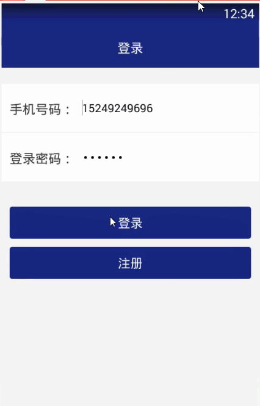

> **博主介绍：**
> 本人专注于Android/java/数据库/微信小程序技术领域的开发，以及有好几年的计算机毕业设计方面的实战开发经验和技术积累；尤其是在安卓（Android）的app的开发和微信小程序的开发，很是熟悉和了解；本人也是多年的Android开发人员；希望我发布的此篇文件可以帮助到您；
>
> 🍅 **文章末尾获取源码下载方式** 🍅

#### 功能演示

#### 一、项目介绍

> 1：通过编辑功能可以实现旅游时间及地点的记忆。
>
> 2：记录景区景点和特色小吃信息。
>
> 3：获取与陌生人相识的过程，通过时刻的图片以及影像来进行记忆的存储。
>
> 4：记录当天或某时刻所对应的心情。
>
> 5：系统根据数据分析用户当天的生活状态。
>
> 6：实现所收集到的信息存储入数据库的功能。
>
> 功能需求
>
> 1：数据录入功能：记录景区的特色小吃信息如何表现更为美观，记录当天或某时刻的心情。
>
> 2：时刻录入功能：通过视频或者图片的方式进行记忆的存储。
>
> 3：分析数据功能：通过合理的数据分析当天用户的生活状态。
>
> 4：数据存储功能：通过对于记忆信息存储到数据库中。

#### 二、运行环境

> 1：客户端使用Android stuido进行开发；  
>  2：服务端后台使用Myeclipse2014进行开发；  
>  3：mysql数据库进行数据存储；  
>  4：需要jdk1.7以上  
>  5：使用雷电模拟器或者Androidstuio自带的模拟器进行运行

#### 三、使用技术

> **总体设计逻辑和思路：**  
>  1：先设计数据库表文件  
>  2：写服务端jsp页面以及写api接口给客户端提供数据  
>  3：完成后台服务端的数据交互，也就是jsp页面数据的存储和显示  
>  4：进行客户端页面的开发；  
>  5：进行客户端对api接口的调用，也就是获取数据库的数据以及在客户端进行显示
>
> **移动端：**  
>  1：使用android原生控件以及xml布局文件来完成界面的显示  
>  2：使用java代码完成功能的数据和逻辑交互  
>  3：使用http网络请求完成数据的请求；  
>  **4：使用json数据解析完成客户端数据的回调和显示**
>
> **服务端后台：**  
>  1：使用mysql完成数据的存储  
>  2：使用jdbc完成数据库和代码的逻辑交互  
>  3：使用jsp完成网页数据的显示  
>  4：使用java代码完成api接口的编写以及以及数据的回调

#### 四、数据库设计

    
    
    /*
    Navicat MySQL Data Transfer
    
    Source Server         : mydb
    Source Server Version : 50528
    Source Host           : localhost:3306
    Source Database       : memorydb
    
    Target Server Type    : MYSQL
    Target Server Version : 50528
    File Encoding         : 65001
    
    Date: 2019-03-05 00:43:38
    */
    
    SET FOREIGN_KEY_CHECKS=0;
    
    -- ----------------------------
    -- Table structure for gotb
    -- ----------------------------
    DROP TABLE IF EXISTS `gotb`;
    CREATE TABLE `gotb` (
      `goId` int(50) NOT NULL AUTO_INCREMENT,
      `goMessage` varchar(255) DEFAULT NULL,
      `goUserId` varchar(200) DEFAULT NULL,
      `goUserName` varchar(255) DEFAULT NULL,
      `goTime` varchar(200) DEFAULT NULL,
      PRIMARY KEY (`goId`)
    ) ENGINE=InnoDB AUTO_INCREMENT=7 DEFAULT CHARSET=utf8;
    
    -- ----------------------------
    -- Records of gotb
    -- ----------------------------
    INSERT INTO `gotb` VALUES ('4', '今天读了一本很不错的书籍', '106', '小丸子', '2019-03-04 23:07');
    INSERT INTO `gotb` VALUES ('5', '火影很好看', '106', '小丸子', '2019-03-04 23:10');
    INSERT INTO `gotb` VALUES ('6', '最近的都要还可以', '106', '小丸子', '2019-03-05 00:37');
    
    -- ----------------------------
    -- Table structure for plantb
    -- ----------------------------
    DROP TABLE IF EXISTS `plantb`;
    CREATE TABLE `plantb` (
      `planId` int(50) NOT NULL AUTO_INCREMENT,
      `planName` varchar(255) DEFAULT NULL,
      `planTime` varchar(255) DEFAULT NULL,
      `planUserId` varchar(100) DEFAULT NULL,
      `planUserName` varchar(255) DEFAULT NULL,
      PRIMARY KEY (`planId`)
    ) ENGINE=InnoDB AUTO_INCREMENT=10 DEFAULT CHARSET=utf8;
    
    -- ----------------------------
    -- Records of plantb
    -- ----------------------------
    INSERT INTO `plantb` VALUES ('6', '大明宫', '2019-03-04 23:03', '106', '小丸子');
    INSERT INTO `plantb` VALUES ('7', '北京故宫', '2019-03-04 23:03', '106', '小丸子');
    INSERT INTO `plantb` VALUES ('8', '海南三亚', '2019-03-04 23:03', '106', '小丸子');
    INSERT INTO `plantb` VALUES ('9', '兵马俑', '2019-03-05 00:36', '106', '小丸子');
    
    -- ----------------------------
    -- Table structure for recordtb
    -- ----------------------------
    DROP TABLE IF EXISTS `recordtb`;
    CREATE TABLE `recordtb` (
      `recordId` int(50) NOT NULL AUTO_INCREMENT,
      `recordUserId` varchar(11) DEFAULT NULL,
      `recordUserName` varchar(255) DEFAULT NULL,
      `recordMessage` varchar(255) DEFAULT NULL,
      `recordType` varchar(255) DEFAULT NULL,
      `recordFile` varchar(255) DEFAULT NULL,
      `recordTime` varchar(100) DEFAULT NULL,
      PRIMARY KEY (`recordId`)
    ) ENGINE=InnoDB AUTO_INCREMENT=6 DEFAULT CHARSET=utf8;
    
    -- ----------------------------
    -- Records of recordtb
    -- ----------------------------
    INSERT INTO `recordtb` VALUES ('1', '106', '小丸子', '一路走来，太累了，停下来歇歇吧，多休息一会，是为了走更远的路', '图片', 'timg-4.jpeg', '2019-03-05 00:11');
    INSERT INTO `recordtb` VALUES ('2', '106', '小丸子', '我们的记忆', '视频', 'xian_duanshipin_01.mp4', '2019-03-05 00:14');
    INSERT INTO `recordtb` VALUES ('3', '106', '小丸子', '一路走来，太累了，停下来歇歇吧，多休息一会，是为了走更远的路', '图片', 'timg-8.jpeg', '2019-03-05 00:28');
    INSERT INTO `recordtb` VALUES ('4', '106', '小丸子', '一路走来，太累了，停下来歇歇吧，多休息一会，是为了走更远的路', '图片', 'timg-7.jpeg', '2019-03-05 00:30');
    INSERT INTO `recordtb` VALUES ('5', '106', '小丸子', '一路走来，太累了，停下来歇歇吧，多休息一会，是为了走更远的路', '图片', 'timg.jpeg', '2019-03-05 00:36');
    
    -- ----------------------------
    -- Table structure for reviewmsg
    -- ----------------------------
    DROP TABLE IF EXISTS `reviewmsg`;
    CREATE TABLE `reviewmsg` (
      `reviewId` int(50) NOT NULL AUTO_INCREMENT,
      `reviewMessageId` varchar(100) DEFAULT NULL,
      `reviewContent` varchar(500) DEFAULT NULL,
      `reviewUserId` varchar(100) DEFAULT NULL,
      `reviewUserName` varchar(255) DEFAULT NULL,
      `reviewTime` varchar(100) DEFAULT NULL,
      PRIMARY KEY (`reviewId`)
    ) ENGINE=InnoDB AUTO_INCREMENT=15 DEFAULT CHARSET=utf8;
    
    -- ----------------------------
    -- Records of reviewmsg
    -- ----------------------------
    INSERT INTO `reviewmsg` VALUES ('11', '11', '9898989', '106', '小丸子', '2019-03-04 23:20');
    INSERT INTO `reviewmsg` VALUES ('12', '11', '1111', '106', '小丸子', '2019-03-04 23:20');
    INSERT INTO `reviewmsg` VALUES ('13', '13', 'hello', '106', '小丸子', '2019-03-05 00:35');
    INSERT INTO `reviewmsg` VALUES ('14', '13', '9999', '106', '小丸子', '2019-03-05 00:35');
    
    -- ----------------------------
    -- Table structure for topicmsg
    -- ----------------------------
    DROP TABLE IF EXISTS `topicmsg`;
    CREATE TABLE `topicmsg` (
      `topicId` int(50) NOT NULL AUTO_INCREMENT,
      `topicMessage` varchar(255) DEFAULT NULL,
      `topicImg` varchar(1500) DEFAULT NULL,
      `topicTime` varchar(100) DEFAULT NULL,
      `topicUserId` varchar(100) DEFAULT NULL,
      `topicUserName` varchar(255) DEFAULT NULL,
      PRIMARY KEY (`topicId`)
    ) ENGINE=InnoDB AUTO_INCREMENT=14 DEFAULT CHARSET=utf8;
    
    -- ----------------------------
    -- Records of topicmsg
    -- ----------------------------
    INSERT INTO `topicmsg` VALUES ('12', '什么样的专业容易就业？', 'timg-6.jpeg,timg-7.jpeg', '2019-03-05 00:31', '106', '小丸子');
    INSERT INTO `topicmsg` VALUES ('13', '这个地方特别美，建议大家都去看啊', 'timg-2.jpeg,timg-3.jpeg', '2019-03-05 00:35', '106', '小丸子');
    
    -- ----------------------------
    -- Table structure for user
    -- ----------------------------
    DROP TABLE IF EXISTS `user`;
    CREATE TABLE `user` (
      `userId` int(255) NOT NULL AUTO_INCREMENT,
      `userName` varchar(200) CHARACTER SET utf8 NOT NULL,
      `userPhone` varchar(100) CHARACTER SET utf8 NOT NULL,
      `userPswd` varchar(200) CHARACTER SET utf8 NOT NULL,
      `userTime` varchar(300) CHARACTER SET utf8 NOT NULL,
      PRIMARY KEY (`userId`)
    ) ENGINE=InnoDB AUTO_INCREMENT=110 DEFAULT CHARSET=latin1;
    
    -- ----------------------------
    -- Records of user
    -- ----------------------------
    INSERT INTO `user` VALUES ('106', '小丸子', '15249249696', '123456', '2019-03-04 17:03');
    
    -- ----------------------------
    -- Table structure for usermsg
    -- ----------------------------
    DROP TABLE IF EXISTS `usermsg`;
    CREATE TABLE `usermsg` (
      `petId` int(50) NOT NULL AUTO_INCREMENT,
      `petType` varchar(255) DEFAULT NULL,
      `petMessage` varchar(1500) DEFAULT NULL,
      `petImg` varchar(255) DEFAULT NULL,
      `petTime` varchar(100) DEFAULT NULL,
      `petUserId` varchar(100) DEFAULT NULL,
      `petUserName` varchar(255) DEFAULT NULL,
      PRIMARY KEY (`petId`)
    ) ENGINE=InnoDB AUTO_INCREMENT=16 DEFAULT CHARSET=utf8;
    
    -- ----------------------------
    -- Records of usermsg
    -- ----------------------------
    INSERT INTO `usermsg` VALUES ('11', '景区景点', '一路走来，太累了，停下来歇歇吧，多休息一会，是为了走更远的路', 'timg-2.jpeg', '2019-03-04 22:43', '106', '小丸子');
    INSERT INTO `usermsg` VALUES ('13', '景区景点', '一路走来，太累了，停下来歇歇吧，多休息一会，是为了走更远的路', 'timg-9.jpeg', '2019-03-04 22:55', '106', '小丸子');
    INSERT INTO `usermsg` VALUES ('14', '特色小吃', '一路走来，太累了，停下来歇歇吧，多休息一会，是为了走更远的路', 'u=3627469918,1717382061&fm=26&gp=0.jpg', '2019-03-04 22:55', '106', '小丸子');
    INSERT INTO `usermsg` VALUES ('15', '景区景点', '一路走来，太累了，停下来歇歇吧，多休息一会，是为了走更远的路', 'timg-1.jpeg', '2019-03-05 00:35', '106', '小丸子');
    

#### 五、部分代码

#### 六、浏览更多Android毕业设计

[毕业设计-基于android的租房信息发布平台的APP_信息发布app源码_Android毕业设计源码的博客-
CSDN博客](https://blog.csdn.net/u014388322/article/details/100656450?spm=1001.2014.3001.5502
"毕业设计-基于android的租房信息发布平台的APP_信息发布app源码_Android毕业设计源码的博客-CSDN博客")

[毕业设计-基于android选课系统的设计与实现_android学生选课系统_Android毕业设计源码的博客-
CSDN博客](https://blog.csdn.net/u014388322/article/details/100656536?spm=1001.2014.3001.5502
"毕业设计-基于android选课系统的设计与实现_android学生选课系统_Android毕业设计源码的博客-CSDN博客")

[毕业设计之校园一卡通管理系统的设计与实现_一卡通管理系统实现_Android毕业设计源码的博客-
CSDN博客](https://blog.csdn.net/u014388322/article/details/126048550?spm=1001.2014.3001.5502
"毕业设计之校园一卡通管理系统的设计与实现_一卡通管理系统实现_Android毕业设计源码的博客-CSDN博客")

[基于Android的校园二手闲置物品交易系统设计与实现_基于android的二手交易平台_Android毕业设计源码的博客-
CSDN博客](https://blog.csdn.net/u014388322/article/details/128232475?spm=1001.2014.3001.5502
"基于Android的校园二手闲置物品交易系统设计与实现_基于android的二手交易平台_Android毕业设计源码的博客-CSDN博客")

[基于androidstudio校园快递APP系统的设计与实现_android studio论文_Android毕业设计源码的博客-
CSDN博客](https://blog.csdn.net/u014388322/article/details/128545390?spm=1001.2014.3001.5502
"基于androidstudio校园快递APP系统的设计与实现_android studio论文_Android毕业设计源码的博客-CSDN博客")

[基于android的商城购物定制APP_安卓开发购物app_Android毕业设计源码的博客-
CSDN博客](https://blog.csdn.net/u014388322/article/details/128746697?spm=1001.2014.3001.5502
"基于android的商城购物定制APP_安卓开发购物app_Android毕业设计源码的博客-CSDN博客")

> 更多毕业设计可以浏览我的个人主页哦！

#### 七、源码下载

> 大家 **点赞、收藏、关注、评论** 啦 、 **查看** 👇🏻👇🏻👇🏻 **获取联系方式** 👇🏻👇🏻👇🏻
>
> <https://download.csdn.net/download/u014388322/87473510>
>
> ​

