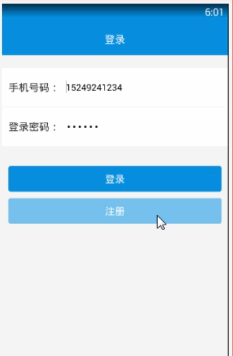

> **博主介绍：**
> 本人专注于Android/java/数据库/微信小程序技术领域的开发，以及有好几年的计算机毕业设计方面的实战开发经验和技术积累；尤其是在安卓（Android）的app的开发和微信小程序的开发，很是熟悉和了解；本人也是多年的Android开发人员；希望我发布的此篇文件可以帮助到您；
>
> 🍅 **文章末尾获取源码下载方式** 🍅

#### 功能演示

##### 1：后台演示

#####  2：客户端演示

#### 一、项目介绍

> (1）仿真试题生成功能。实现无纸化考试模拟系统﹑模拟系统可生成大里仿真试题，题型分布合理，覆盖各类考点。  
>  (2）考试记录管理功能。可统计试题正确率，分析试卷题目，分析用户易出错的题型，并设置重做试卷﹑重做错题功能。  
>  (3）错题记录功能。记录用户做模拟题中的出错题目，分析用户未掌握的知识点。
>
> (4）按章练习功能。提供按章练习功能,并可根据用户指定章节生成模拟试卷。
>
> (5）判分功能  
>

#### 二、运行环境

> 1：客户端使用Android stuido进行开发；  
>  2：服务端后台使用Myeclipse2014进行开发；  
>  3：mysql数据库进行数据存储；  
>  4：需要jdk1.7以上  
>  5：使用雷电模拟器或者Androidstuio自带的模拟器进行运行

#### 三、使用技术

> **总体设计逻辑和思路：**  
>  1：先设计数据库表文件  
>  2：写服务端jsp页面以及写api接口给客户端提供数据  
>  3：完成后台服务端的数据交互，也就是jsp页面数据的存储和显示  
>  4：进行客户端页面的开发；  
>  5：进行客户端对api接口的调用，也就是获取数据库的数据以及在客户端进行显示
>
> **移动端：**  
>  1：使用android原生控件以及xml布局文件来完成界面的显示  
>  2：使用java代码完成功能的数据和逻辑交互  
>  3：使用http网络请求完成数据的请求；  
>  **4：使用json数据解析完成客户端数据的回调和显示**
>
> **服务端后台：**  
>  1：使用mysql完成数据的存储  
>  2：使用jdbc完成数据库和代码的逻辑交互  
>  3：使用jsp完成网页数据的显示  
>  4：使用java代码完成api接口的编写以及以及数据的回调

#### 四、数据库设计

    
    
    /*
    Navicat MySQL Data Transfer
    
    Source Server         : mydata
    Source Server Version : 50537
    Source Host           : localhost:3306
    Source Database       : accountingdb
    
    Target Server Type    : MYSQL
    Target Server Version : 50537
    File Encoding         : 65001
    
    Date: 2019-03-28 18:02:40
    */
    
    SET FOREIGN_KEY_CHECKS=0;
    
    -- ----------------------------
    -- Table structure for errortb
    -- ----------------------------
    DROP TABLE IF EXISTS `errortb`;
    CREATE TABLE `errortb` (
      `errorId` int(11) NOT NULL AUTO_INCREMENT,
      `errorUserId` varchar(11) DEFAULT NULL,
      `errorIds` varchar(255) DEFAULT NULL,
      PRIMARY KEY (`errorId`)
    ) ENGINE=InnoDB AUTO_INCREMENT=3 DEFAULT CHARSET=utf8;
    
    -- ----------------------------
    -- Records of errortb
    -- ----------------------------
    INSERT INTO `errortb` VALUES ('1', '11', '13,16,17,14,15');
    
    -- ----------------------------
    -- Table structure for exame
    -- ----------------------------
    DROP TABLE IF EXISTS `exame`;
    CREATE TABLE `exame` (
      `eId` int(50) NOT NULL AUTO_INCREMENT,
      `eTitle` varchar(200) NOT NULL,
      `eA` varchar(200) NOT NULL,
      `eB` varchar(200) NOT NULL,
      `eC` varchar(200) NOT NULL,
      `eD` varchar(200) NOT NULL,
      `eOk` varchar(100) NOT NULL,
      `eTime` varchar(100) NOT NULL,
      `eTypeId` varchar(11) DEFAULT NULL,
      `eTypeName` varchar(255) DEFAULT NULL,
      PRIMARY KEY (`eId`)
    ) ENGINE=InnoDB AUTO_INCREMENT=18 DEFAULT CHARSET=utf8;
    
    -- ----------------------------
    -- Records of exame
    -- ----------------------------
    INSERT INTO `exame` VALUES ('13', '某企业为增值税一般纳税人，2014年应交各种税金为：增值税350万元', '5', '15', '50', '30', 'A', '2019-03-28 14:43', '33', '第一节　会计概念、职能和目标');
    INSERT INTO `exame` VALUES ('14', '某企业采用权益法核算长期股权投资，被投资单位宣告发放现金股利时', '冲减投资收益', '增加投资收益', '冲减长期股权投资', '增加资本公积', 'C', '2019-03-28 14:44', '33', '第一节　会计概念、职能和目标');
    INSERT INTO `exame` VALUES ('15', '下列交易或事项中，不应确认为营业外收人的是', '捐赠利得', '收到与收益有关的政府补', '出售无形资产的净收益', '转让无形资产', 'C', '2019-03-28 14:45', '33', '第一节　会计概念、职能和目标');
    INSERT INTO `exame` VALUES ('16', '下列各项中，不属于现金流量表“现金及现金等价物”的是', '银行本票', '持有2个月内到期国债', '银行承兑汇票', '库存现金', 'A', '2019-03-28 14:46', '33', '第一节　会计概念、职能和目标');
    INSERT INTO `exame` VALUES ('17', '甲股份有限公司委托乙证券公司发行普通股，股票面值总额4000万元', '4000', '500', '600', '360', 'B', '2019-03-28 14:46', '33', '第一节　会计概念、职能和目标');
    
    -- ----------------------------
    -- Table structure for scoretb
    -- ----------------------------
    DROP TABLE IF EXISTS `scoretb`;
    CREATE TABLE `scoretb` (
      `scoreId` int(50) NOT NULL AUTO_INCREMENT,
      `scoreScore` varchar(255) DEFAULT NULL,
      `scoreErrorIds` varchar(255) DEFAULT NULL,
      `scoreUserId` varchar(11) DEFAULT NULL,
      `scoreUserName` varchar(255) DEFAULT NULL,
      `scoreTime` varchar(100) DEFAULT NULL,
      PRIMARY KEY (`scoreId`)
    ) ENGINE=InnoDB AUTO_INCREMENT=18 DEFAULT CHARSET=utf8;
    
    -- ----------------------------
    -- Records of scoretb
    -- ----------------------------
    INSERT INTO `scoretb` VALUES ('2', '10', '3,5', '11', 'pony', '2019-03-25 17:51');
    INSERT INTO `scoretb` VALUES ('3', '10', '3,5', '11', 'pony', '2019-03-25 17:52');
    INSERT INTO `scoretb` VALUES ('4', '20', '5', '11', 'pony', '2019-03-25 17:57');
    INSERT INTO `scoretb` VALUES ('5', '10', '13,15,16,17', '11', 'pony', '2019-03-28 15:30');
    INSERT INTO `scoretb` VALUES ('6', '10', '13,14,16,17', '11', 'pony', '2019-03-28 16:14');
    INSERT INTO `scoretb` VALUES ('7', '20', '13,16,17', '11', 'pony', '2019-03-28 16:41');
    INSERT INTO `scoretb` VALUES ('8', '10', '13,14,15,16', '11', 'pony', '2019-03-28 17:03');
    INSERT INTO `scoretb` VALUES ('9', '10', '13,14,15,16', '11', 'pony', '2019-03-28 17:04');
    INSERT INTO `scoretb` VALUES ('10', '20', '13,16,17', '11', 'pony', '2019-03-28 17:18');
    INSERT INTO `scoretb` VALUES ('11', '30', '16,17', '11', 'pony', '2019-03-28 17:19');
    INSERT INTO `scoretb` VALUES ('12', '20', '13,16,17', '11', 'pony', '2019-03-28 17:22');
    INSERT INTO `scoretb` VALUES ('13', '20', '13,16,17', '11', 'pony', '2019-03-28 17:24');
    INSERT INTO `scoretb` VALUES ('14', '0', '13,14,15,16,17', '11', 'pony', '2019-03-28 17:56');
    INSERT INTO `scoretb` VALUES ('15', '20', '13,16,17', '11', 'pony', '2019-03-28 17:58');
    INSERT INTO `scoretb` VALUES ('16', '10', '13,14,15,16', '11', 'pony', '2019-03-28 17:59');
    INSERT INTO `scoretb` VALUES ('17', '10', '13,15,16,17', '11', 'pony', '2019-03-28 18:00');
    
    -- ----------------------------
    -- Table structure for sqltb
    -- ----------------------------
    DROP TABLE IF EXISTS `sqltb`;
    CREATE TABLE `sqltb` (
      `sqlId` int(50) NOT NULL AUTO_INCREMENT,
      `sqlName` varchar(255) DEFAULT NULL,
      `sqlMessage` varchar(255) DEFAULT NULL,
      `sqlTime` varchar(100) DEFAULT NULL,
      PRIMARY KEY (`sqlId`)
    ) ENGINE=InnoDB AUTO_INCREMENT=6 DEFAULT CHARSET=utf8;
    
    -- ----------------------------
    -- Records of sqltb
    -- ----------------------------
    INSERT INTO `sqltb` VALUES ('2', '查询语句', 'select * from sqltb', '2019-03-25 11:35');
    INSERT INTO `sqltb` VALUES ('3', '删除语句', 'delete from sqltb', '2019-03-25 11:35');
    INSERT INTO `sqltb` VALUES ('5', '增加sql', 'select * from show', '2019-03-25 11:36');
    
    -- ----------------------------
    -- Table structure for typetb
    -- ----------------------------
    DROP TABLE IF EXISTS `typetb`;
    CREATE TABLE `typetb` (
      `typeId` int(50) NOT NULL AUTO_INCREMENT,
      `typeName` varchar(255) DEFAULT NULL,
      `typeTime` varchar(100) DEFAULT NULL,
      PRIMARY KEY (`typeId`)
    ) ENGINE=InnoDB AUTO_INCREMENT=40 DEFAULT CHARSET=utf8;
    
    -- ----------------------------
    -- Records of typetb
    -- ----------------------------
    INSERT INTO `typetb` VALUES ('33', '第一节　会计概念、职能和目标', '2019-03-28 14:22');
    INSERT INTO `typetb` VALUES ('34', '第二节　会计基本假设', '2019-03-28 14:22');
    INSERT INTO `typetb` VALUES ('35', '第三节　会计要素及其确认与计量', '2019-03-28 14:22');
    INSERT INTO `typetb` VALUES ('36', '第四节　会计科目和借贷记账法', '2019-03-28 14:22');
    INSERT INTO `typetb` VALUES ('37', '第五节　会计凭证', '2019-03-28 14:22');
    INSERT INTO `typetb` VALUES ('38', '第六节　财产清查', '2019-03-28 14:22');
    INSERT INTO `typetb` VALUES ('39', '第七节　财务报告', '2019-03-28 14:23');
    
    -- ----------------------------
    -- Table structure for user
    -- ----------------------------
    DROP TABLE IF EXISTS `user`;
    CREATE TABLE `user` (
      `uid` int(50) NOT NULL AUTO_INCREMENT,
      `uname` varchar(100) NOT NULL,
      `uphone` varchar(100) NOT NULL,
      `upswd` varchar(100) NOT NULL,
      `utime` varchar(100) NOT NULL,
      PRIMARY KEY (`uid`)
    ) ENGINE=InnoDB AUTO_INCREMENT=15 DEFAULT CHARSET=utf8;
    
    -- ----------------------------
    -- Records of user
    -- ----------------------------
    INSERT INTO `user` VALUES ('11', 'pony', '15249241234', '123456', '2019-03-24 14:50');
    INSERT INTO `user` VALUES ('12', 'yn', '15249243636', '123456', '2019-03-24 17:12');
    INSERT INTO `user` VALUES ('13', 'jack', '15249243333', '123456', '2019-03-24 22:46');
    

#### 五、部分代码

#### 六、浏览更多Android毕业设计

[毕业设计-基于android的租房信息发布平台的APP_信息发布app源码_Android毕业设计源码的博客-
CSDN博客](https://blog.csdn.net/u014388322/article/details/100656450?spm=1001.2014.3001.5502
"毕业设计-基于android的租房信息发布平台的APP_信息发布app源码_Android毕业设计源码的博客-CSDN博客")

[毕业设计-基于android选课系统的设计与实现_android学生选课系统_Android毕业设计源码的博客-
CSDN博客](https://blog.csdn.net/u014388322/article/details/100656536?spm=1001.2014.3001.5502
"毕业设计-基于android选课系统的设计与实现_android学生选课系统_Android毕业设计源码的博客-CSDN博客")

[毕业设计之校园一卡通管理系统的设计与实现_一卡通管理系统实现_Android毕业设计源码的博客-
CSDN博客](https://blog.csdn.net/u014388322/article/details/126048550?spm=1001.2014.3001.5502
"毕业设计之校园一卡通管理系统的设计与实现_一卡通管理系统实现_Android毕业设计源码的博客-CSDN博客")

[基于Android的校园二手闲置物品交易系统设计与实现_基于android的二手交易平台_Android毕业设计源码的博客-
CSDN博客](https://blog.csdn.net/u014388322/article/details/128232475?spm=1001.2014.3001.5502
"基于Android的校园二手闲置物品交易系统设计与实现_基于android的二手交易平台_Android毕业设计源码的博客-CSDN博客")

[基于androidstudio校园快递APP系统的设计与实现_android studio论文_Android毕业设计源码的博客-
CSDN博客](https://blog.csdn.net/u014388322/article/details/128545390?spm=1001.2014.3001.5502
"基于androidstudio校园快递APP系统的设计与实现_android studio论文_Android毕业设计源码的博客-CSDN博客")

[基于android的商城购物定制APP_安卓开发购物app_Android毕业设计源码的博客-
CSDN博客](https://blog.csdn.net/u014388322/article/details/128746697?spm=1001.2014.3001.5502
"基于android的商城购物定制APP_安卓开发购物app_Android毕业设计源码的博客-CSDN博客")

> 更多毕业设计可以浏览我的个人主页哦！

#### 七、源码下载

> 大家 **点赞、收藏、关注、评论** 啦 、 **查看** 👇🏻👇🏻👇🏻 **获取联系方式** 👇🏻👇🏻👇🏻
>
> <https://download.csdn.net/download/u014388322/88189466>
>
> ​

