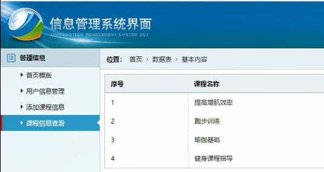
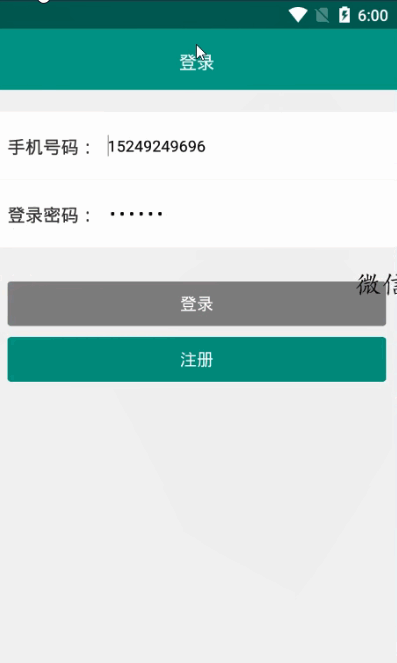

> **博主介绍：**
> 本人专注于Android/java/数据库/微信小程序技术领域的开发，以及有好几年的计算机毕业设计方面的实战开发经验和技术积累；尤其是在安卓（Android）的app的开发和微信小程序的开发，很是熟悉和了解；本人也是多年的Android开发人员；希望我发布的此篇文件可以帮助到您；
>
> 🍅 **文章末尾获取源码下载方式** 🍅

**目录**

功能演示

1：后台演示

2：客户端演示

一、项目介绍

二、运行环境

三、使用技术

四、数据库设计

五、部分代码

六、浏览更多Android毕业设计

七、源码下载

* * *

#### 功能演示

**详情演示视频请文字末尾公众号咨询，我会发给您；**

#### 1：后台演示

#### 2：客户端演示

#### 一、项目介绍

> 客户端：  
>  1：登录注册：用户可以通过自己的信息进行账号的注册  
>  2：训练模块：有关于燃脂训练，塑形训练，增肌训练的一些视频  
>  3：跑步模块：有跑步界面，可以进行跑步计时，用户点击开始计时，结束计时  
>  4：数据模块：有自己每天训练时长记录，完成几次训练，消耗多少能量，累计训练天数，训练总时长  
>  5：信息编辑：有自己可编辑的身高数据，体重数据，BIM指数  
>  6：发现模块：上面有一些关于健身的文章；  
>  7：个人信息：用户登录之后可以查看用户的基本资料以及对密码和头像信息进行修改
>
> 后台服务端：  
>  1：用户管理：可以查看注册的用户信息  
>  2：训练信息：添加和查看训练视频信息；

#### 二、运行环境

> 1：客户端使用Android stuido进行开发；  
>  2：服务端后台使用Myeclipse2014进行开发；  
>  3：mysql数据库进行数据存储；  
>  4：需要jdk1.7以上  
>  5：使用雷电模拟器或者Androidstuio自带的模拟器进行运行

#### 三、使用技术

> **总体设计逻辑和思路：**  
>  1：先设计数据库表文件  
>  2：写服务端jsp页面以及写api接口给客户端提供数据  
>  3：完成后台服务端的数据交互，也就是jsp页面数据的存储和显示  
>  4：进行客户端页面的开发；  
>  5：进行客户端对api接口的调用，也就是获取数据库的数据以及在客户端进行显示
>
> **移动端：**  
>  1：使用android原生控件以及xml布局文件来完成界面的显示  
>  2：使用java代码完成功能的数据和逻辑交互  
>  3：使用http网络请求完成数据的请求；  
>  **4：使用json数据解析完成客户端数据的回调和显示**
>
> **服务端后台：**  
>  1：使用mysql完成数据的存储  
>  2：使用jdbc完成数据库和代码的逻辑交互  
>  3：使用jsp完成网页数据的显示  
>  4：使用java代码完成api接口的编写以及以及数据的回调

#### 四、数据库设计

#### 五、部分代码

#### 六、浏览更多Android毕业设计

[毕业设计-基于android的租房信息发布平台的APP_信息发布app源码_Android毕业设计源码的博客-
CSDN博客](https://blog.csdn.net/u014388322/article/details/100656450?spm=1001.2014.3001.5502
"毕业设计-基于android的租房信息发布平台的APP_信息发布app源码_Android毕业设计源码的博客-CSDN博客")

[毕业设计-基于android选课系统的设计与实现_android学生选课系统_Android毕业设计源码的博客-
CSDN博客](https://blog.csdn.net/u014388322/article/details/100656536?spm=1001.2014.3001.5502
"毕业设计-基于android选课系统的设计与实现_android学生选课系统_Android毕业设计源码的博客-CSDN博客")

[毕业设计之校园一卡通管理系统的设计与实现_一卡通管理系统实现_Android毕业设计源码的博客-
CSDN博客](https://blog.csdn.net/u014388322/article/details/126048550?spm=1001.2014.3001.5502
"毕业设计之校园一卡通管理系统的设计与实现_一卡通管理系统实现_Android毕业设计源码的博客-CSDN博客")

[基于Android的校园二手闲置物品交易系统设计与实现_基于android的二手交易平台_Android毕业设计源码的博客-
CSDN博客](https://blog.csdn.net/u014388322/article/details/128232475?spm=1001.2014.3001.5502
"基于Android的校园二手闲置物品交易系统设计与实现_基于android的二手交易平台_Android毕业设计源码的博客-CSDN博客")

[基于androidstudio校园快递APP系统的设计与实现_android studio论文_Android毕业设计源码的博客-
CSDN博客](https://blog.csdn.net/u014388322/article/details/128545390?spm=1001.2014.3001.5502
"基于androidstudio校园快递APP系统的设计与实现_android studio论文_Android毕业设计源码的博客-CSDN博客")

[基于android的商城购物定制APP_安卓开发购物app_Android毕业设计源码的博客-
CSDN博客](https://blog.csdn.net/u014388322/article/details/128746697?spm=1001.2014.3001.5502
"基于android的商城购物定制APP_安卓开发购物app_Android毕业设计源码的博客-CSDN博客")

> 更多毕业设计可以浏览我的个人主页哦！

#### 七、源码下载

> 大家 **点 赞、收藏、关注、评论**啦 、 **查看** 👇🏻👇🏻👇🏻 **获取联系方式** 👇🏻👇🏻👇🏻
>
> <https://download.csdn.net/download/u014388322/87473453>

