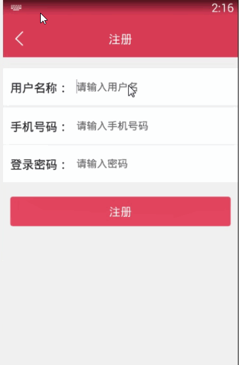

> **博主介绍：**
> 本人专注于Android/java/数据库/微信小程序技术领域的开发，以及有好几年的计算机毕业设计方面的实战开发经验和技术积累；尤其是在安卓（Android）的app的开发和微信小程序的开发，很是熟悉和了解；本人也是多年的Android开发人员；希望我发布的此篇文件可以帮助到您；
>
> 🍅 **文章末尾获取源码下载方式** 🍅

#### 功能演示

#### 一、项目介绍

> 1：有自己收藏的减肥计划和攻略。。  
>  2：可以制定自己的减肥计划，运动计划  
>  3：推荐页面 ：推荐减肥计划，减肥运动，饮食方案，让用户可以收藏  
>  4；更新网上一些关于减肥的资讯，减肥常识，减肥小知识  
>  5；社区页面 ：用户可以发表自己的文字，图片之类的，别的用户可以收藏，点赞  
>  6；个人页面 ：会员注册与登录  
>  7；个人页面 ：会员注册与登录根据数据计算BMI  
>  8；个人页面 ：会员注册与登录减肥记录（时长，运动类型）

#### 二、运行环境

> 1：客户端使用Android stuido进行开发；  
>  2：服务端后台使用Myeclipse2014进行开发；  
>  3：mysql数据库进行数据存储；  
>  4：需要jdk1.7以上  
>  5：使用雷电模拟器或者Androidstuio自带的模拟器进行运行

#### 三、使用技术

> **总体设计逻辑和思路：**  
>  1：先设计数据库表文件  
>  2：写服务端jsp页面以及写api接口给客户端提供数据  
>  3：完成后台服务端的数据交互，也就是jsp页面数据的存储和显示  
>  4：进行客户端页面的开发；  
>  5：进行客户端对api接口的调用，也就是获取数据库的数据以及在客户端进行显示
>
> **移动端：**  
>  1：使用android原生控件以及xml布局文件来完成界面的显示  
>  2：使用java代码完成功能的数据和逻辑交互  
>  3：使用http网络请求完成数据的请求；  
>  **4：使用json数据解析完成客户端数据的回调和显示**
>
> **服务端后台：**  
>  1：使用mysql完成数据的存储  
>  2：使用jdbc完成数据库和代码的逻辑交互  
>  3：使用jsp完成网页数据的显示  
>  4：使用java代码完成api接口的编写以及以及数据的回调

#### 四、数据库设计

> /*  
>  Navicat MySQL Data Transfer
>
> Source Server : mydata  
>  Source Server Version : 50537  
>  Source Host : localhost:3306  
>  Source Database : reducedb
>
> Target Server Type : MYSQL  
>  Target Server Version : 50537  
>  File Encoding : 65001
>
> Date: 2019-02-01 14:40:10  
>  */
>
> SET FOREIGN_KEY_CHECKS=0;
>
> \-- ----------------------------  
>  \-- Table structure for admintb  
>  \-- ----------------------------  
>  DROP TABLE IF EXISTS `admintb`;  
>  CREATE TABLE `admintb` (  
>  `adminId` int(50) NOT NULL AUTO_INCREMENT,  
>  `adminName` varchar(255) DEFAULT NULL,  
>  `adminMessage` varchar(255) DEFAULT NULL,  
>  `adminUserId` varchar(100) DEFAULT NULL,  
>  `adminUserName` varchar(255) DEFAULT NULL,  
>  `adminType` varchar(255) DEFAULT NULL,  
>  `adminCreatime` varchar(100) DEFAULT NULL,  
>  PRIMARY KEY (`adminId`)  
>  ) ENGINE=InnoDB AUTO_INCREMENT=20 DEFAULT CHARSET=utf8;
>
> \-- ----------------------------  
>  \-- Records of admintb  
>  \-- ----------------------------  
>  INSERT INTO `admintb` VALUES ('13', '我计划周末去健身', '2019-01-9 14:40', '106',
> '106', '2', '2019-01-09');  
>  INSERT INTO `admintb` VALUES ('16', '60', '跑步', '106', '106', '3',
> '2019-01-09');  
>  INSERT INTO `admintb` VALUES ('17', '运动', '2019-01-9 21:03', '106', '106',
> '2', '2019-01-09');  
>  INSERT INTO `admintb` VALUES ('18', '我计划周末去健身', '2019-02-9 20:06', '106',
> '106', '2', '2019-01-09');  
>  INSERT INTO `admintb` VALUES ('19', '100', '锻炼', '106', '106', '3',
> '2019-01-09');
>
> \-- ----------------------------  
>  \-- Table structure for collectmsg  
>  \-- ----------------------------  
>  DROP TABLE IF EXISTS `collectmsg`;  
>  CREATE TABLE `collectmsg` (  
>  `collectId` int(50) NOT NULL AUTO_INCREMENT,  
>  `collectUserId` varchar(100) DEFAULT NULL,  
>  `collectMessageId` varchar(100) DEFAULT NULL,  
>  `collectTime` varchar(100) DEFAULT NULL,  
>  `collectType` varchar(255) DEFAULT NULL,  
>  PRIMARY KEY (`collectId`)  
>  ) ENGINE=InnoDB AUTO_INCREMENT=60 DEFAULT CHARSET=utf8;
>
> \-- ----------------------------  
>  \-- Records of collectmsg  
>  \-- ----------------------------  
>  INSERT INTO `collectmsg` VALUES ('37', '106', '44', '2019-01-09 16:03',
> '1');  
>  INSERT INTO `collectmsg` VALUES ('38', '106', '45', '2019-01-09 16:03',
> '1');  
>  INSERT INTO `collectmsg` VALUES ('42', null, null, '2019-01-09 17:07',
> null);  
>  INSERT INTO `collectmsg` VALUES ('43', null, null, '2019-01-09 17:07',
> null);  
>  INSERT INTO `collectmsg` VALUES ('46', '106', '46', '2019-01-09 18:03',
> '1');  
>  INSERT INTO `collectmsg` VALUES ('47', '106', '43', '2019-01-09 18:06',
> '1');  
>  INSERT INTO `collectmsg` VALUES ('48', '106', '10', '2019-01-09 18:06',
> '2');  
>  INSERT INTO `collectmsg` VALUES ('49', '106', '9', '2019-01-09 18:06',
> '2');  
>  INSERT INTO `collectmsg` VALUES ('50', '106', '44', '2019-02-01 11:17',
> '1');  
>  INSERT INTO `collectmsg` VALUES ('52', '106', '11', '2019-02-01 13:45',
> '2');  
>  INSERT INTO `collectmsg` VALUES ('53', '109', '43', '2019-02-01 14:03',
> '1');  
>  INSERT INTO `collectmsg` VALUES ('54', '109', '11', '2019-02-01 14:04',
> '2');  
>  INSERT INTO `collectmsg` VALUES ('55', '109', '11', '2019-02-01 14:04',
> '2');  
>  INSERT INTO `collectmsg` VALUES ('56', '110', '43', '2019-02-01 14:16',
> '1');  
>  INSERT INTO `collectmsg` VALUES ('57', '110', '13', '2019-02-01 14:17',
> '2');  
>  INSERT INTO `collectmsg` VALUES ('58', '110', '12', '2019-02-01 14:17',
> '2');  
>  INSERT INTO `collectmsg` VALUES ('59', '110', '45', '2019-02-01 14:19',
> '1');
>
> \-- ----------------------------  
>  \-- Table structure for newsmessage  
>  \-- ----------------------------  
>  DROP TABLE IF EXISTS `newsmessage`;  
>  CREATE TABLE `newsmessage` (  
>  `newsId` int(100) NOT NULL AUTO_INCREMENT,  
>  `newsTitle` varchar(255) DEFAULT NULL,  
>  `newsType` varchar(255) DEFAULT NULL,  
>  `newsContent` varchar(1500) DEFAULT NULL,  
>  `newsTime` varchar(100) DEFAULT NULL,  
>  PRIMARY KEY (`newsId`)  
>  ) ENGINE=InnoDB AUTO_INCREMENT=47 DEFAULT CHARSET=utf8;
>
> \-- ----------------------------  
>  \-- Records of newsmessage  
>  \-- ----------------------------  
>  INSERT INTO `newsmessage` VALUES ('43', '减肥就这么简单', '减肥计划',
> '减肥的原理是一段时期内（一般是3个月-6个月）总摄入的能量（一般以1000卡路里为单位，也叫大卡，英文kcal）小于总消耗的能量，就能瘦。\r\n总摄入的能量就是吃下去的食物包含的能量（热量），比如100克肥肉（脂肪）大约含900大卡的能量，100克糖含400大卡能量。喜欢吃零食的，可以看一下包装上的能量标注，都会标注每100克零食所含的能量，饮料也一样。一般标注的是千焦（KJ），除以4.186就是大卡',
> '2019-01-09 11:22');  
>  INSERT INTO `newsmessage` VALUES ('44', '原理篇和饮食篇', '饮食方案',
> '当一个人总摄入大于身体需要消耗的能量时，人体就会把多余的能量变成脂肪存储下来，像存钱一样存着，留着以后花。但如果一直存钱，人就渐渐肥起来。当一个人总摄入大于身体需要消耗的能量时，人体就会把多余的能量变成脂肪存储下来，像存钱一样存着，留着以后花。但如果一直存钱，人就渐渐肥起来。',
> '2019-01-09 11:22');  
>  INSERT INTO `newsmessage` VALUES ('45', '一样的坚持', '减肥运动',
> '减肥并不是一两天就能见效的，必须要持之以恒才能达到效果。“少吃多动”说说简单，无非就是消耗的能量大于所摄取的能量，但如果你三天打鱼两天晒网，兴趣来了动一下，没兴趣了就大吃大喝，这样效果肯定甚微。',
> '2019-01-09 11:23');  
>  INSERT INTO `newsmessage` VALUES ('46', '今天下雨了', '减肥计划',
> '今天下雨了今天下雨了今天下雨了今天下雨了今天下雨了今天下雨了今天下雨了今天下雨了今天下雨了今天下雨了今天下雨了今天下雨了今天下雨了今天下雨了',
> '2019-01-09 18:02');
>
> \-- ----------------------------  
>  \-- Table structure for praise  
>  \-- ----------------------------  
>  DROP TABLE IF EXISTS `praise`;  
>  CREATE TABLE `praise` (  
>  `praiseId` int(50) NOT NULL AUTO_INCREMENT,  
>  `praiseUserId` varchar(100) DEFAULT NULL,  
>  `praiseMessageId` varchar(100) DEFAULT NULL,  
>  `praiseTime` varchar(100) DEFAULT NULL,  
>  PRIMARY KEY (`praiseId`)  
>  ) ENGINE=InnoDB AUTO_INCREMENT=50 DEFAULT CHARSET=utf8;
>
> \-- ----------------------------  
>  \-- Records of praise  
>  \-- ----------------------------  
>  INSERT INTO `praise` VALUES ('45', '106', '11', '2019-02-01 11:40');  
>  INSERT INTO `praise` VALUES ('46', '108', '11', '2019-02-01 12:15');  
>  INSERT INTO `praise` VALUES ('47', '109', '12', '2019-02-01 14:15');  
>  INSERT INTO `praise` VALUES ('48', '110', '13', '2019-02-01 14:17');  
>  INSERT INTO `praise` VALUES ('49', '106', '13', '2019-02-01 14:18');
>
> \-- ----------------------------  
>  \-- Table structure for reviewmsg  
>  \-- ----------------------------  
>  DROP TABLE IF EXISTS `reviewmsg`;  
>  CREATE TABLE `reviewmsg` (  
>  `reviewId` int(50) NOT NULL AUTO_INCREMENT,  
>  `reviewMessageId` varchar(100) DEFAULT NULL,  
>  `reviewContent` varchar(500) DEFAULT NULL,  
>  `reviewUserId` varchar(100) DEFAULT NULL,  
>  `reviewUserName` varchar(255) DEFAULT NULL,  
>  `reviewTime` varchar(100) DEFAULT NULL,  
>  PRIMARY KEY (`reviewId`)  
>  ) ENGINE=InnoDB AUTO_INCREMENT=10 DEFAULT CHARSET=utf8;
>
> \-- ----------------------------  
>  \-- Records of reviewmsg  
>  \-- ----------------------------  
>  INSERT INTO `reviewmsg` VALUES ('1', '7', '666', '106', '小丸子', '2018-09-17
> 16:42');  
>  INSERT INTO `reviewmsg` VALUES ('2', '7', '.我来看看', '106', '小丸子',
> '2018-09-17 16:50');  
>  INSERT INTO `reviewmsg` VALUES ('3', '7', '啦啦啦', '106', '小丸子', '2018-09-17
> 16:50');  
>  INSERT INTO `reviewmsg` VALUES ('4', '7', 'wolaikakank', '109', '小花',
> '2018-09-19 16:42');  
>  INSERT INTO `reviewmsg` VALUES ('5', '7', 'enenen', '109', '小花',
> '2018-09-19 16:42');  
>  INSERT INTO `reviewmsg` VALUES ('6', '11', '8888', '106', '小丸子',
> '2019-02-01 13:58');  
>  INSERT INTO `reviewmsg` VALUES ('7', '11', '889898', '106', '小丸子',
> '2019-02-01 13:58');  
>  INSERT INTO `reviewmsg` VALUES ('8', '11', '090909090', '109', 'diadai',
> '2019-02-01 14:04');  
>  INSERT INTO `reviewmsg` VALUES ('9', '11', '989898', '110', 'tom',
> '2019-02-01 14:17');
>
> \-- ----------------------------  
>  \-- Table structure for topicmsg  
>  \-- ----------------------------  
>  DROP TABLE IF EXISTS `topicmsg`;  
>  CREATE TABLE `topicmsg` (  
>  `topicId` int(50) NOT NULL AUTO_INCREMENT,  
>  `topicMessage` varchar(255) DEFAULT NULL,  
>  `topicImg` varchar(1500) DEFAULT NULL,  
>  `topicTime` varchar(100) DEFAULT NULL,  
>  `topicUserId` varchar(100) DEFAULT NULL,  
>  `topicUserName` varchar(255) DEFAULT NULL,  
>  PRIMARY KEY (`topicId`)  
>  ) ENGINE=InnoDB AUTO_INCREMENT=14 DEFAULT CHARSET=utf8;
>
> \-- ----------------------------  
>  \-- Records of topicmsg  
>  \-- ----------------------------  
>  INSERT INTO `topicmsg` VALUES ('9', '今天看到一个可爱的宠物，分享给大家看看，大家可以在评论区留言讨论哦！',
> '20180502170044.jpg', '2019-01-09 17:25', '106', '小丸子');  
>  INSERT INTO `topicmsg` VALUES ('10', '看看我的成果', 'timg-10.jpeg', '2019-01-09
> 18:06', '106', '小丸子');  
>  INSERT INTO `topicmsg` VALUES ('11', 'nihao a ', 'timg-2.jpeg', '2019-02-01
> 11:26', '107', 'duoduo');  
>  INSERT INTO `topicmsg` VALUES ('12', 'woshi daidai', '20181019152302.jpg',
> '2019-02-01 14:04', '109', 'diadai');  
>  INSERT INTO `topicmsg` VALUES ('13', 'laikankank', 'timg-10.jpeg',
> '2019-02-01 14:17', '110', 'tom');
>
> \-- ----------------------------  
>  \-- Table structure for user  
>  \-- ----------------------------  
>  DROP TABLE IF EXISTS `user`;  
>  CREATE TABLE `user` (  
>  `userId` int(255) NOT NULL AUTO_INCREMENT,  
>  `userName` varchar(200) CHARACTER SET utf8 NOT NULL,  
>  `userPhone` varchar(100) CHARACTER SET utf8 NOT NULL,  
>  `userPswd` varchar(200) CHARACTER SET utf8 NOT NULL,  
>  `userTime` varchar(300) CHARACTER SET utf8 NOT NULL,  
>  PRIMARY KEY (`userId`)  
>  ) ENGINE=InnoDB AUTO_INCREMENT=111 DEFAULT CHARSET=latin1;
>
> \-- ----------------------------  
>  \-- Records of user  
>  \-- ----------------------------  
>  INSERT INTO `user` VALUES ('106', '小丸子', '15249249696', '123456',
> '2019-01-08 17:03');  
>  INSERT INTO `user` VALUES ('107', 'duoduo', '15249246666', '123456',
> '2019-02-01 11:25');  
>  INSERT INTO `user` VALUES ('108', '99', '15249248888', '123456',
> '2019-02-01 12:14');  
>  INSERT INTO `user` VALUES ('109', 'diadai', '15249248989', '123456',
> '2019-02-01 14:03');  
>  INSERT INTO `user` VALUES ('110', 'tom', '15249241234', '123456',
> '2019-02-01 14:16');  
>

#### 五、部分代码

##### 1：添加减肥记录

>  
>  public class CreateRecordActivity extends BaseActivity {
>
> // title  
>  private TextView mTvTitle;  
>  // 返回  
>  private ImageView mIvBack;  
>  // 查询按钮  
>  private Button mbtnAdd;
>
> private EditText adminName;  
>  private EditText adminMessage;
>
> @Override  
>  protected void onCreate(Bundle savedInstanceState) {  
>  super.onCreate(savedInstanceState);  
>  setContentView(R.layout.activity_creat_record);  
>  initWidget();  
>  initData();  
>  }
>
> @Override  
>  public void initWidget() {
>
> adminName = (EditText) findViewById(R.id.adminName);  
>  adminMessage = (EditText) findViewById(R.id.adminMessage);
>
> mbtnAdd = (Button) findViewById(R.id.mbtnAdd);  
>  mIvBack = (ImageView) findViewById(R.id.mIvBack);  
>  mTvTitle = (TextView) findViewById(R.id.mTvTitle);  
>  mTvTitle.setText("添加减肥记录");  
>  mIvBack.setVisibility(View.VISIBLE);  
>  mIvBack.setOnClickListener(this);  
>  mbtnAdd.setOnClickListener(this);
>
> }
>
> @Override  
>  public void onClick(View v) {
>
> switch (v.getId()) {  
>  case R.id.mIvBack:  
>  CreateRecordActivity.this.finish();  
>  break;  
>  case R.id.mbtnAdd:  
>  addAdmin(true);  
>  break;
>
> }  
>  }
>
> @Override  
>  public void initData() {
>
> }
>
> private void addAdmin(boolean isShow) {  
>  AjaxParams params = new AjaxParams();  
>  params.put("action_flag", "addAdmin");  
>  params.put("adminName",adminName.getText().toString());  
>  params.put("adminMessage", adminMessage.getText().toString());  
>  params.put("adminUserId", MemberUserUtils.getUid(this));  
>  params.put("adminUserName", MemberUserUtils.getUid(this));  
>  params.put("adminType", "3");  
>  httpPost(Consts.URL + Consts.APP.MessageAction, params,
> Consts.actionId.resultFlag, isShow, "正在提交...");  
>  }
>
> @Override  
>  protected void callBackSuccess(ResponseEntry entry, int actionId) {  
>  super.callBackSuccess(entry, actionId);  
>  RecordObservable.getInstance().notifyStepChange("updateOK");  
>  CustomToast.showToast(this,entry.getRepMsg());  
>  new Handler().postDelayed(new Runnable() {  
>  @Override  
>  public void run() {  
>  CreateRecordActivity.this.finish();  
>  }  
>  }, 1000);  
>  }
>
> @Override  
>  protected void callBackAllFailure(String strMsg, int actionId) {  
>  super.callBackAllFailure(strMsg, actionId);  
>  ToastUtil.show(CreateRecordActivity.this, strMsg);
>
> }
>
>  
>  }  
>

##### 2：查看记录信息

>  
>  public class PlanFragment extends BaseFragment implements
> Observer,AdminListner {  
>  private ImageView mviCreateMessage;  
>  // 获取view  
>  private View rootView;  
>  // 获取控件  
>  private ListView mListMessage;  
>  private List<AdminModel> list_result = new ArrayList<AdminModel>();
>
> DialogMsg dialogMsg;  
>  @Override  
>  public View onCreateView(LayoutInflater inflater, ViewGroup container,
> Bundle savedInstanceState) {  
>  rootView =
> LayoutInflater.from(getActivity()).inflate(R.layout.fragment_message_send,
> null);  
>  initWidget();  
>  initData();  
>  return rootView;  
>  }
>
> @Override  
>  public void initWidget() {  
>  dialogMsg = new DialogMsg(getActivity());
>
> dialogMsg.submit_ok().setOnClickListener(new View.OnClickListener() {  
>  @Override  
>  public void onClick(View v) {  
>  mp.pause();  
>  dialogMsg.Close();  
>  }  
>  });
>
>  
>  dialogMsg.submit_no().setOnClickListener(new View.OnClickListener() {  
>  @Override  
>  public void onClick(View v) {  
>  mp.pause();  
>  dialogMsg.Close();  
>  }  
>  });  
>  mviCreateMessage = (ImageView)
> rootView.findViewById(R.id.mviCreateMessage);  
>  mviCreateMessage.setOnClickListener(this);  
>  mListMessage = (ListView) rootView.findViewById(R.id.mListMessage);  
>  }
>
> @Override  
>  public void onClick(View v) {
>
> }
>
> @Override  
>  public void initData() {
>
> listPhoneDeliveryMessage(false);  
>  mviCreateMessage.setOnClickListener(new View.OnClickListener() {  
>  @Override  
>  public void onClick(View v) {  
>  Intent intent = new Intent(getActivity(), CreatePlanActivity.class);  
>  startActivity(intent);  
>  }  
>  });  
>  }
>
> @Override  
>  protected void callBackAllFailure(String strMsg, int actionId) {  
>  super.callBackAllFailure(strMsg, actionId);  
>  ToastUtil.show(getActivity(), strMsg);
>
> }  
>  private void listPhoneDeliveryMessage(boolean isShow) {  
>  AjaxParams params = new AjaxParams();  
>  params.put("action_flag", "listAdminPhoneMessage");  
>  params.put("adminUserId", MemberUserUtils.getUid(getActivity()));  
>  params.put("adminType","2");  
>  httpPost(Consts.URL + Consts.APP.MessageAction, params,
> Consts.actionId.resultCode, isShow, "正在加载...");  
>  }
>
>  
>  private void deleteAdmin(boolean isShow,AdminModel adminModel) {  
>  AjaxParams params = new AjaxParams();  
>  params.put("action_flag", "deleteAdmin");  
>  params.put("adminId", adminModel.getAdminId());  
>  httpPost(Consts.URL + Consts.APP.MessageAction, params,
> Consts.actionId.resultState, isShow, "正在加载...");  
>  }
>
>  
>  PlanAdapter dataAdapter;  
>  @Override  
>  protected void callBackSuccess(ResponseEntry entry, int actionId) {  
>  super.callBackSuccess(entry, actionId);
>
> switch (actionId) {  
>  case Consts.actionId.resultCode:  
>  if (null != entry.getData() && !TextUtils.isEmpty(entry.getData())) {  
>  String jsonMsg = entry.getData().substring(1, entry.getData().length() -
> 1);
>
> if (null != jsonMsg && !TextUtils.isEmpty(jsonMsg)) {  
>  list_result = mGson.fromJson(entry.getData(), new
> TypeToken<List<AdminModel>>() {  
>  }.getType());  
>  dataAdapter= new PlanAdapter(getActivity(), list_result,PlanFragment.this);  
>  mListMessage.setAdapter(dataAdapter);
>
>  
>  SimpleDateFormat df = new SimpleDateFormat("yyyy-MM-dd HH:mm");// 设置日期格式  
>  SimpleDateFormat simpleDateFormat = new SimpleDateFormat("yyyy-MM-dd
> HH:mm");// 24小时制  
>  long timeChoice;  
>  long nowChoice;
>
> List<String> listCheck = new ArrayList<String>();
>
> for (int i = 0; i < list_result.size(); i++) {
>
> String timeMessage = list_result.get(i).getAdminMessage();  
>  try {  
>  timeChoice = simpleDateFormat.parse(timeMessage).getTime();  
>  nowChoice = simpleDateFormat.parse(df.format(new Date()) + "").getTime();
>
> Log.i("pony_log", "courseTime:" + ((timeChoice - nowChoice) / 1000 / 60) +
> "");  
>  long courseTime = ((timeChoice - nowChoice) / 1000 / 60);  
>  if (0 < courseTime && courseTime <= 30) {  
>  Log.i("pony_log", list_result.get(i).getAdminMessage());  
>  listCheck.add(list_result.get(i).getAdminName());  
>  }  
>  } catch (ParseException e) {  
>  e.printStackTrace();  
>  }
>
> }
>
> if (listCheck.size() > 0 && isCheck == false) {
>
> String courseMsg = "";  
>  for (int i = 0; i < listCheck.size(); i++) {  
>  courseMsg = listCheck.get(i) + ","+ courseMsg ;  
>  }  
>  dialogMsg.Set_Msg("减肥提醒：("+ courseMsg.substring(0, courseMsg.length() -
> 1)+")");  
>  dialogMsg.Show();  
>  isCheck = true;  
>  openAssetMusics();  
>  }
>
> } else {  
>  }  
>  }  
>  break;
>
> case Consts.actionId.resultState:  
>  list_result.remove(posDelete);  
>  dataAdapter.notifyDataSetChanged();  
>  break;
>
> }  
>  }  
>  private MediaPlayer mp;  
>  private boolean isCheck = false;  
>  private void openAssetMusics() {
>
> // try {  
>  // // 播放 assets/a2.mp3 音乐文件  
>  // mediaPlayer = MediaPlayer.create(getApplicationContext(),
> R.raw.just_blue);  
>  // AssetFileDescriptor fd = getActivity().getAssets().openFd("voice.mp3");  
>  // mediaPlayer = new MediaPlayer();  
>  // mediaPlayer.setDataSource(fd.getFileDescriptor(), fd.getStartOffset(),
> fd.getLength());  
>  // mediaPlayer.prepare();  
>  // mediaPlayer.start();  
>  // } catch (IOException e) {  
>  // e.printStackTrace();  
>  // }
>
> mp = new MediaPlayer();  
>  AssetFileDescriptor file = getResources().openRawResourceFd(R.raw.voice);  
>  try {  
>  mp.setDataSource(file.getFileDescriptor(), file.getStartOffset(),  
>  file.getLength());  
>  mp.prepare();  
>  file.close();  
>  } catch (IOException e) {  
>  e.printStackTrace();  
>  }  
>  mp.setVolume(0.5f, 0.5f);  
>  mp.setLooping(true);  
>  mp.start();  
>  }
>
> @Override  
>  public void onPause() {  
>  super.onPause();
>
> }  
>  private int posDelete;  
>  @Override  
>  public void setDelete(int pos, AdminModel adminModel) {  
>  posDelete = pos;  
>  deleteAdmin(false, adminModel);  
>  }
>
> @Override  
>  public void setUpdate(int pos, AdminModel adminModel) {  
>  // Intent intent = new Intent(this, UpdateDMActivity.class);  
>  // intent.putExtra("msg", adminModel);  
>  // startActivity(intent);  
>  }
>
> @Override  
>  public void onResume() {  
>  super.onResume();  
>  PlanObservable.getInstance().addObserver(PlanFragment.this);  
>  }
>
> @Override  
>  public void onDestroy() {  
>  super.onDestroy();  
>  PlanObservable.getInstance().addObserver(PlanFragment.this);  
>  }
>
> @Override  
>  public void update(Observable observable, Object data) {  
>  listPhoneDeliveryMessage(false);  
>  }  
>  }
>
>  
>

#### 六、浏览更多Android毕业设计

[毕业设计-基于android的租房信息发布平台的APP_信息发布app源码_Android毕业设计源码的博客-
CSDN博客](https://blog.csdn.net/u014388322/article/details/100656450?spm=1001.2014.3001.5502
"毕业设计-基于android的租房信息发布平台的APP_信息发布app源码_Android毕业设计源码的博客-CSDN博客")

[毕业设计-基于android选课系统的设计与实现_android学生选课系统_Android毕业设计源码的博客-
CSDN博客](https://blog.csdn.net/u014388322/article/details/100656536?spm=1001.2014.3001.5502
"毕业设计-基于android选课系统的设计与实现_android学生选课系统_Android毕业设计源码的博客-CSDN博客")

[毕业设计之校园一卡通管理系统的设计与实现_一卡通管理系统实现_Android毕业设计源码的博客-
CSDN博客](https://blog.csdn.net/u014388322/article/details/126048550?spm=1001.2014.3001.5502
"毕业设计之校园一卡通管理系统的设计与实现_一卡通管理系统实现_Android毕业设计源码的博客-CSDN博客")

[基于Android的校园二手闲置物品交易系统设计与实现_基于android的二手交易平台_Android毕业设计源码的博客-
CSDN博客](https://blog.csdn.net/u014388322/article/details/128232475?spm=1001.2014.3001.5502
"基于Android的校园二手闲置物品交易系统设计与实现_基于android的二手交易平台_Android毕业设计源码的博客-CSDN博客")

[基于androidstudio校园快递APP系统的设计与实现_android studio论文_Android毕业设计源码的博客-
CSDN博客](https://blog.csdn.net/u014388322/article/details/128545390?spm=1001.2014.3001.5502
"基于androidstudio校园快递APP系统的设计与实现_android studio论文_Android毕业设计源码的博客-CSDN博客")

[基于android的商城购物定制APP_安卓开发购物app_Android毕业设计源码的博客-
CSDN博客](https://blog.csdn.net/u014388322/article/details/128746697?spm=1001.2014.3001.5502
"基于android的商城购物定制APP_安卓开发购物app_Android毕业设计源码的博客-CSDN博客")

> 更多毕业设计可以浏览我的个人主页哦！

#### 七、源码下载

> <https://download.csdn.net/download/u014388322/88155142>
>
> ​

