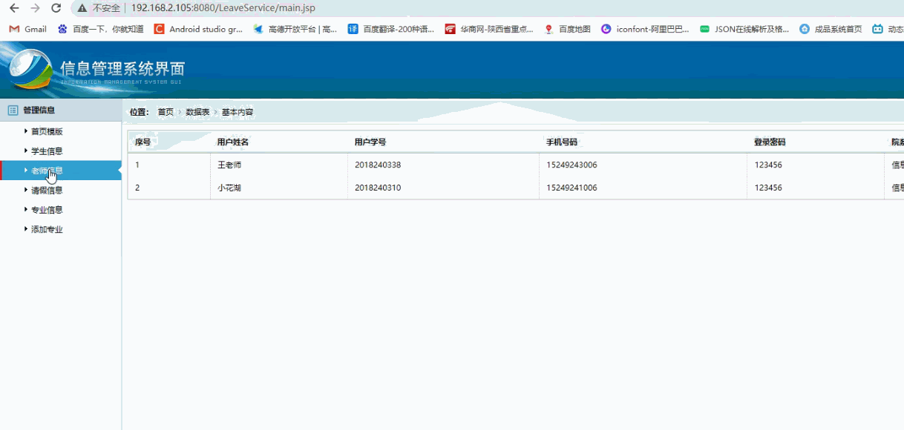
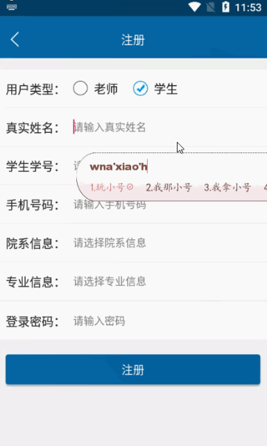

> **博主介绍：**
> 本人专注于Android/java/数据库/微信小程序技术领域的开发，以及有好几年的计算机毕业设计方面的实战开发经验和技术积累；尤其是在安卓（Android）的app的开发和微信小程序的开发，很是熟悉和了解；本人也是多年的Android开发人员；希望我发布的此篇文件可以帮助到您；
>
> 🍅 **文章末尾获取源码下载方式** 🍅

#### 功能演示

**详情演示视频可以咨询后面的公众号； **

##### 1：后台演示

##### 2：客户端演示

#### 一、项目介绍

> 下拉列表选择,同步到个人主页(院系、专业)  
>  一、注册登录:  
>  1：学生端用"规定学号样式"注册()，
>
> 2：选择"院系",“专业",“班级”1.2登录页面logo，
>
> 3：首页轮播图片  
>  4：提供部份logo，图片，其余可根据需要自行安排  
>  二、请销假
>
> 1：学生能够实现请假、销假申请，以及筛选条件查看请销假详情（请假附件可添加图片，文件)  
>  2：教师端可实时接收处理,并分类统计  
>  三、拓展页面(应用)  
>  1：查看已办或待办事件  
>  2：可给自己添加日程安排（提醒)  
>  3：学校新闻  
>  (直接跳转到学校官网页面, https://www.jzci.edu.cn/)  
>  四、设置页面  
>  个人信息：用户登录之后可以查看用户的基本资料以及对密码信息进行修改

#### 二、运行环境

> 1：客户端使用Android stuido进行开发；  
>  2：服务端后台使用Myeclipse2014进行开发；  
>  3：mysql数据库进行数据存储；  
>  4：需要jdk1.7以上  
>  5：使用雷电模拟器或者Androidstuio自带的模拟器进行运行

#### 三、使用技术

> **总体设计逻辑和思路：**  
>  1：先设计数据库表文件  
>  2：写服务端jsp页面以及写api接口给客户端提供数据  
>  3：完成后台服务端的数据交互，也就是jsp页面数据的存储和显示  
>  4：进行客户端页面的开发；  
>  5：进行客户端对api接口的调用，也就是获取数据库的数据以及在客户端进行显示
>
> **移动端：**  
>  1：使用android原生控件以及xml布局文件来完成界面的显示  
>  2：使用java代码完成功能的数据和逻辑交互  
>  3：使用http网络请求完成数据的请求；  
>  **4：使用json数据解析完成客户端数据的回调和显示**
>
> **服务端后台：**  
>  1：使用mysql完成数据的存储  
>  2：使用jdbc完成数据库和代码的逻辑交互  
>  3：使用jsp完成网页数据的显示  
>  4：使用java代码完成api接口的编写以及以及数据的回调

#### 四、数据库设计

    
    
    /*
    Navicat MySQL Data Transfer
    
    Source Server         : mydb
    Source Server Version : 50528
    Source Host           : localhost:3306
    Source Database       : leavedb
    
    Target Server Type    : MYSQL
    Target Server Version : 50528
    File Encoding         : 65001
    
    Date: 2022-04-17 13:35:13
    */
    
    SET FOREIGN_KEY_CHECKS=0;
    
    -- ----------------------------
    -- Table structure for admintb
    -- ----------------------------
    DROP TABLE IF EXISTS `admintb`;
    CREATE TABLE `admintb` (
      `adminId` int(11) NOT NULL AUTO_INCREMENT,
      `adminName` varchar(255) DEFAULT NULL,
      `adminPswd` varchar(255) DEFAULT NULL,
      PRIMARY KEY (`adminId`)
    ) ENGINE=InnoDB AUTO_INCREMENT=2 DEFAULT CHARSET=utf8;
    
    -- ----------------------------
    -- Records of admintb
    -- ----------------------------
    INSERT INTO `admintb` VALUES ('1', 'admin', '123456');
    
    -- ----------------------------
    -- Table structure for applymetb
    -- ----------------------------
    DROP TABLE IF EXISTS `applymetb`;
    CREATE TABLE `applymetb` (
      `applymeId` int(11) NOT NULL AUTO_INCREMENT,
      `applymeyUserId` varchar(11) DEFAULT NULL,
      `applymeUserName` varchar(255) DEFAULT NULL,
      `applymeType` varchar(255) DEFAULT NULL,
      `applymeStartDate` varchar(100) DEFAULT NULL,
      `applymeEndDate` varchar(100) DEFAULT NULL,
      `applymeInfor` varchar(500) DEFAULT NULL,
      `applymeTime` varchar(100) DEFAULT NULL,
      `applymeState` varchar(255) DEFAULT NULL,
      `applymeNoInfor` varchar(255) DEFAULT NULL,
      `applymeClass` varchar(255) DEFAULT NULL,
      PRIMARY KEY (`applymeId`)
    ) ENGINE=InnoDB AUTO_INCREMENT=20 DEFAULT CHARSET=utf8;
    
    -- ----------------------------
    -- Records of applymetb
    -- ----------------------------
    INSERT INTO `applymetb` VALUES ('16', '112', '小明', '病假', '2022-04-13 23:40', '2022-04-14 23:40', '要去买东西请假一段时间', '2022-04-13 23:40', '5', null, '信息工程学院');
    INSERT INTO `applymetb` VALUES ('17', '123', '王小明', '病假', '2022-04-13 23:56', '2022-04-16 23:56', '要去买东西请假一段时间', '2022-04-13 23:56', '2', null, '智能工程学院');
    INSERT INTO `applymetb` VALUES ('18', '112', '小明', '事假', '2022-04-16 00:25', '2022-04-18 00:25', '要去买东西请假一段时间', '2022-04-16 00:25', '5', null, '信息工程学院');
    INSERT INTO `applymetb` VALUES ('19', '112', '小明', '病假', '2022-04-16 00:30', '2022-04-17 00:31', '要去买东西请假一段时间', '2022-04-16 00:31', '5', null, '信息工程学院');
    
    -- ----------------------------
    -- Table structure for plantb
    -- ----------------------------
    DROP TABLE IF EXISTS `plantb`;
    CREATE TABLE `plantb` (
      `planId` int(11) NOT NULL AUTO_INCREMENT,
      `planUserId` int(11) DEFAULT NULL,
      `planTitle` varchar(255) DEFAULT NULL,
      `planTip` varchar(255) DEFAULT NULL,
      `planFlag` varchar(255) DEFAULT NULL,
      `planMessage` varchar(255) DEFAULT NULL,
      `planstate` varchar(255) DEFAULT NULL,
      PRIMARY KEY (`planId`)
    ) ENGINE=InnoDB AUTO_INCREMENT=96 DEFAULT CHARSET=utf8;
    
    -- ----------------------------
    -- Records of plantb
    -- ----------------------------
    INSERT INTO `plantb` VALUES ('91', '112', 'shijain', '已办理', '2', '111111', '1');
    INSERT INTO `plantb` VALUES ('93', '112', 'dadada', '2022-04-13 23:20:00', '1', 'dadadada:00', '1');
    INSERT INTO `plantb` VALUES ('94', '123', '记单词', '未办理', '2', '', '1');
    INSERT INTO `plantb` VALUES ('95', '123', '学习', '2022-04-15 23:56:00', '1', '好好学习:00', '1');
    
    -- ----------------------------
    -- Table structure for token
    -- ----------------------------
    DROP TABLE IF EXISTS `token`;
    CREATE TABLE `token` (
      `tid` int(100) NOT NULL AUTO_INCREMENT,
      `uid` varchar(100) CHARACTER SET utf8 NOT NULL,
      `utoken` varchar(500) CHARACTER SET utf8 NOT NULL,
      PRIMARY KEY (`tid`)
    ) ENGINE=InnoDB AUTO_INCREMENT=144 DEFAULT CHARSET=latin1;
    
    -- ----------------------------
    -- Records of token
    -- ----------------------------
    INSERT INTO `token` VALUES ('115', '92', '1IbkIPHZ4ql+337R4ala/CvwBvuqr97RjQi5uLqItZQHbQeOQtvD7mGGro2GXplL6A4Ffw8eCIH4qW5FoOzRkw==');
    INSERT INTO `token` VALUES ('116', '93', 's3lW4XU0gZbk+LIzkzvtCyfe2p3VNew29bDtQiHjV9V2RkRFm9MJi+E0SshT7pH9uK2rzAfsdDI=');
    INSERT INTO `token` VALUES ('117', '94', 'Ir0xCjYKSQ1Qlw3dP5j3GTD73K3+3uRZGpOSjlb+djynVhukD4t/ith/BKLy+H7HZr0S3r3cWCBBoI2bW00tFg==');
    INSERT INTO `token` VALUES ('118', '95', 'XrkK7jAnG1lOAXCvP5mmWivwBvuqr97RjQi5uLqItZQHbQeOQtvD7on5XcLKOoZkubXP1pLz5ev4qW5FoOzRkw==');
    INSERT INTO `token` VALUES ('119', '96', '81VsTmiCEJ0vYek0VyMTCuPZyX50Qjvw8IfFfqYdtQkN/BT6pINSpMW9lmXMzMnSMQSby6pJP54=');
    INSERT INTO `token` VALUES ('120', '97', 'gT93UtDVud44JVeFoClgICfe2p3VNew29bDtQiHjV9WAszKiFi7Xv6ZNr+8Rih+coDiwuPVF4RE=');
    INSERT INTO `token` VALUES ('121', '98', 'cMRP4GtM0cWcKlB4wluc3ife2p3VNew29bDtQiHjV9WAszKiFi7Xv9nv7d+VdOBhUZQPf/g6Y9c=');
    INSERT INTO `token` VALUES ('122', '99', 'ZNh/wsov+gRf5AYrommYoivwBvuqr97RjQi5uLqItZRX3RQx9HRsmNMRhiNXnW/KFwO5tjZbBaf4qW5FoOzRkw==');
    INSERT INTO `token` VALUES ('123', '100', 'i5Z8RFhOY3iMvLBydyA+bife2p3VNew29bDtQiHjV9WAszKiFi7Xv8yk3mR6sQja1LNQ37E82dc=');
    INSERT INTO `token` VALUES ('124', '101', '+s5IyAmWRJpG/dVpIB1w8TD73K3+3uRZGpOSjlb+djw7GdNa1yA19ILbaTqOLOcqnLtBpBbIoYBBoI2bW00tFg==');
    INSERT INTO `token` VALUES ('125', '102', 'cMrO9EDZyWeM4ZQAUL7woDD73K3+3uRZGpOSjlb+djw7GdNa1yA19BST21AyKvb9XYKEW2hBaWVBoI2bW00tFg==');
    INSERT INTO `token` VALUES ('126', '103', 'g6LJPY10+OJBFo9+vY4Y4yfe2p3VNew29bDtQiHjV9VFSW5AaKNu0ENxv8opzWB6xYjIEuGs3P0=');
    INSERT INTO `token` VALUES ('127', '104', 't/BrP6qSZtfKgXUMisCBnVfvyqxV71MxQaCNm1tNLRY=@zp0x.cn.rongnav.com;zp0x.cn.rongcfg.com');
    INSERT INTO `token` VALUES ('128', '105', '4gRi9Yq0+z7KgXUMisCBnTWz7iT3TQjhQaCNm1tNLRY=@zp0x.cn.rongnav.com;zp0x.cn.rongcfg.com');
    INSERT INTO `token` VALUES ('129', '106', 'C9+fRlGiU3nKgXUMisCBnVAK4/8HxFB5QaCNm1tNLRY=@zp0x.cn.rongnav.com;zp0x.cn.rongcfg.com');
    INSERT INTO `token` VALUES ('130', '107', 'l+t213zhSFDCAUsC1qH4RhRSm/4WVAjwRMJ0giwZZq0=@4ixh.cn.rongnav.com;4ixh.cn.rongcfg.com');
    INSERT INTO `token` VALUES ('131', '108', '410+eC84tRfCAUsC1qH4RoEs7/vEarunRMJ0giwZZq0=@4ixh.cn.rongnav.com;4ixh.cn.rongcfg.com');
    INSERT INTO `token` VALUES ('132', '109', 'qUhVLBfskPfCAUsC1qH4RmxYwynanbKuRMJ0giwZZq0=@4ixh.cn.rongnav.com;4ixh.cn.rongcfg.com');
    INSERT INTO `token` VALUES ('133', '110', 'SdZWweWCOQPCAUsC1qH4RndlF98qpA4ERMJ0giwZZq0=@4ixh.cn.rongnav.com;4ixh.cn.rongcfg.com');
    INSERT INTO `token` VALUES ('134', '111', 'hsOZccsK03jCAUsC1qH4Rp2Er8o8YjOXRMJ0giwZZq0=@4ixh.cn.rongnav.com;4ixh.cn.rongcfg.com');
    INSERT INTO `token` VALUES ('135', '112', '3VSpiIwAsnrCAUsC1qH4RpQDyhwpfHurRMJ0giwZZq0=@4ixh.cn.rongnav.com;4ixh.cn.rongcfg.com');
    INSERT INTO `token` VALUES ('136', '113', 'WBV8pdFwi8PCAUsC1qH4RjKdeGPeG0H7RMJ0giwZZq0=@4ixh.cn.rongnav.com;4ixh.cn.rongcfg.com');
    INSERT INTO `token` VALUES ('137', '114', 'jKFEMeIeepjCAUsC1qH4RoPFclsFmn4TRMJ0giwZZq0=@4ixh.cn.rongnav.com;4ixh.cn.rongcfg.com');
    INSERT INTO `token` VALUES ('138', '118', '5NWwWGftOwnCAUsC1qH4RqWfBdO103JERMJ0giwZZq0=@4ixh.cn.rongnav.com;4ixh.cn.rongcfg.com');
    INSERT INTO `token` VALUES ('139', '119', 'SfS/uXrzwJ/CAUsC1qH4RpNvTwn5BEQNRMJ0giwZZq0=@4ixh.cn.rongnav.com;4ixh.cn.rongcfg.com');
    INSERT INTO `token` VALUES ('140', '120', 'XtBtct3WZrrCAUsC1qH4RpVt5KtxbQYfRMJ0giwZZq0=@4ixh.cn.rongnav.com;4ixh.cn.rongcfg.com');
    INSERT INTO `token` VALUES ('141', '121', 'jJIQa3IUFZbCAUsC1qH4RiRYed0ldRZWRMJ0giwZZq0=@4ixh.cn.rongnav.com;4ixh.cn.rongcfg.com');
    INSERT INTO `token` VALUES ('142', '122', 'Jjqoad/LbFTCAUsC1qH4RgB11XxY2ljkRMJ0giwZZq0=@4ixh.cn.rongnav.com;4ixh.cn.rongcfg.com');
    INSERT INTO `token` VALUES ('143', '123', 'dcJqnfd8fDXCAUsC1qH4RnWdbQGidnKqRMJ0giwZZq0=@4ixh.cn.rongnav.com;4ixh.cn.rongcfg.com');
    
    -- ----------------------------
    -- Table structure for typetb
    -- ----------------------------
    DROP TABLE IF EXISTS `typetb`;
    CREATE TABLE `typetb` (
      `typeId` int(50) NOT NULL AUTO_INCREMENT,
      `typeName` varchar(255) DEFAULT NULL,
      PRIMARY KEY (`typeId`)
    ) ENGINE=InnoDB AUTO_INCREMENT=30 DEFAULT CHARSET=utf8;
    
    -- ----------------------------
    -- Records of typetb
    -- ----------------------------
    INSERT INTO `typetb` VALUES ('21', '计科');
    INSERT INTO `typetb` VALUES ('22', '网工');
    INSERT INTO `typetb` VALUES ('23', '物联');
    
    -- ----------------------------
    -- Table structure for user
    -- ----------------------------
    DROP TABLE IF EXISTS `user`;
    CREATE TABLE `user` (
      `uid` int(255) NOT NULL AUTO_INCREMENT,
      `uname` varchar(200) CHARACTER SET utf8 NOT NULL,
      `uphone` varchar(100) NOT NULL,
      `upswd` varchar(200) NOT NULL,
      `utime` varchar(300) NOT NULL,
      `uImg` varchar(255) CHARACTER SET utf8 DEFAULT NULL,
      `utype` varchar(500) CHARACTER SET utf8 DEFAULT NULL,
      `uclass` varchar(255) CHARACTER SET utf8 DEFAULT NULL,
      `umajor` varchar(255) CHARACTER SET utf8 DEFAULT NULL,
      `uno` varchar(11) CHARACTER SET utf8 DEFAULT NULL,
      PRIMARY KEY (`uid`)
    ) ENGINE=InnoDB AUTO_INCREMENT=128 DEFAULT CHARSET=latin1;
    
    -- ----------------------------
    -- Records of user
    -- ----------------------------
    INSERT INTO `user` VALUES ('107', '小明的爸爸', '15249243012', '123456', '2022-04-13 16:07', '83025aafa40f4bfbe09aa3f3b9816df9f6361821.png', '学生', null, null, '2018240337');
    INSERT INTO `user` VALUES ('108', '王老师', '15249243006', '123456', '2022-04-13 16:07', 'a71ea8d3fd1f4134d102aec59ed180c3d0c85eaf.png', '老师', '信息工程学院', '计科', '2018240338');
    INSERT INTO `user` VALUES ('112', '小花的爸爸', '15249241003', '123456', '2022-04-13 16:07', '20170908172539.png', '学生', '信息工程学院', '计科', '2018240339');
    INSERT INTO `user` VALUES ('121', '小花湖', '15249241006', '123456', '2022-04-13 16:07', 'stuimg.png', '老师', '信息工程学院', '计科', '2018240310');
    INSERT INTO `user` VALUES ('123', '王小明', '15249241015', '123456', '2022-04-13 23:54', '20170908172539.png', '学生', '智能工程学院', '计科', '202215691');
    INSERT INTO `user` VALUES ('125', '小红花会', '15249246111', '123456', '2022-04-16 00:30', 'stuimg.png', '学生', '大数据学院', '22,网工', '2022263215');
    INSERT INTO `user` VALUES ('127', '888', '15249243467', '123456', '2022-04-16 23:17', 'stuimg.png', '学生', '大数据学院', '21,计科', '2022263211');
    

#### 五、部分代码

##### 1：添加请假信息代码

    
    
    
    public class CreatApplyActivity extends BaseActivity implements TimeUtilDialog.TimePickerDialogInterface {
    
        // title
        private TextView mTvTitle;
        // 返回
        private ImageView mIvBack;
        // 查询按钮
        private Button mSubmit, startTime, endTime,choiceImage;
        private EditText applyMessage;
    
        private EditText tv1;
    
        TimeUtilDialog mTimePickerDialog;
    
        private RadioGroup mrdChoice;
        private RadioButton mrb1 = null;
        private RadioButton mrb2 = null;
        private RadioButton mrb3 = null;
        private String choiceInfor = "病假";
    
    
    
        @Override
        protected void onCreate(Bundle savedInstanceState) {
            super.onCreate(savedInstanceState);
            setContentView(R.layout.activity_create_apply);
            initWidget();
            initData();
        }
    
        @Override
        public void initWidget() {
            mTimePickerDialog = new TimeUtilDialog(this);
    
            applyMessage = (EditText) findViewById(R.id.applyMessage);
    
    
            tv1 = (EditText) findViewById(R.id.tv1);
    
    
            startTime = (Button) findViewById(R.id.startTime);
            endTime = (Button) findViewById(R.id.endTime);
            mSubmit = (Button) findViewById(R.id.mSubmit);
            mIvBack = (ImageView) findViewById(R.id.mIvBack);
            mTvTitle = (TextView) findViewById(R.id.mTvTitle);
    
            mIvBack.setVisibility(View.VISIBLE);
            mIvBack.setOnClickListener(this);
            mSubmit.setOnClickListener(this);
    
            mTvTitle.setText("添加请假信息");
            startTime.setOnClickListener(this);
            endTime.setOnClickListener(this);
    
            mrdChoice = (RadioGroup) findViewById(R.id.mrdChoice);
            mrb1 = (RadioButton) findViewById(R.id.mrb1);
            mrb2 = (RadioButton) findViewById(R.id.mrb2);
            mrb3 = (RadioButton) findViewById(R.id.mrb3);
            mrdChoice.setOnCheckedChangeListener(new RadioGroup.OnCheckedChangeListener() {
    
                @Override
                public void onCheckedChanged(RadioGroup group, int checkedId) {
                    if (checkedId == mrb1.getId()) {
                        choiceInfor = "病假";
                    } else if (checkedId == mrb2.getId()) {
                        choiceInfor = "事假";
                    }else if (checkedId == mrb3.getId()) {
                        choiceInfor = "其他";
                    }
                }
            });
    
            choiceImage = (Button) findViewById(R.id.choiceImage);
            choiceImage.setOnClickListener(this);
    
        }
    
        @Override
        public void onClick(View v) {
    
            switch (v.getId()) {
                case R.id.mIvBack:
                    CreatApplyActivity.this.finish();
                    break;
    
                case R.id.mSubmit:
    
    
                    if (mListImage.size() == 0) {
                        addApplyMeGame(true);
                    } else {
                        UploadFileTask uploadFileTaskSend = new UploadFileTask(this);
                        uploadFileTaskSend.execute(mListImage.get(0));
                    }
    
                    break;
                case R.id.startTime:
                    tipFlag = 1;
                    flag = true;
                    mTimePickerDialog.showDatePickerDialog();
                    break;
                case R.id.endTime:
                    tipFlag = 2;
                    flag = true;
                    mTimePickerDialog.showDatePickerDialog();
                    break;
                case R.id.choiceImage:
    
                    Intent intent = new Intent(this, ChoiceLocalFileActivity.class);
                    intent.putExtra("msg", "img");
                    this.startActivityForResult(intent, 10);
    
                    break;
    
    
            }
        }
    
        @Override
        public void initData() {
    
            applyMessage.setText("要去买东西请假一段时间");
            tv1.setText(MemberUserUtils.getName(this));
    
    
        }
    
        private List<String> mListImage = new ArrayList<String>();
        private String filePath;
        private String videoName;
    
        @Override
        protected void onActivityResult(int requestCode, int resultCode, Intent data) {
            super.onActivityResult(requestCode, resultCode, data);
    
                filePath = data.getStringExtra("msg");
                videoName = data.getStringExtra("name");
                choiceImage.setText(videoName);
                mListImage.add(filePath);
    
        }
    
    
        private void addApplyMeGame(boolean isShow) {
            AjaxParams params = new AjaxParams();
            params.put("action_flag", "addApplyMeGame");
            params.put("applymeUserName", tv1.getText().toString());
            params.put("applymeType",choiceInfor);
            params.put("applymeStartDate", startTime.getText().toString());
            params.put("applymeEndDate", endTime.getText().toString());
            params.put("applymeInfor", applyMessage.getText().toString());
            params.put("applymeyUserId", MemberUserUtils.getUid(this));
            params.put("applymeClass", MemberUserUtils.getClassInfor(this));
            params.put("videoImage", mListImage.get(0).split("\\/")[mListImage.get(0).split("\\/").length - 1]);
            httpPost(Consts.URL + Consts.APP.MessageAction, params, Consts.actionId.resultCode, isShow, "正在加载...");
        }
    
    
        @Override
        protected void callBackSuccess(ResponseEntry entry, int actionId) {
            super.callBackSuccess(entry, actionId);
    
            switch (actionId) {
                case Consts.actionId.resultCode:
                    CustomToast.showToast(this, entry.getRepMsg());
                    new Handler().postDelayed(new Runnable() {
                        @Override
                        public void run() {
                            CreatApplyActivity.this.finish();
                        }
                    }, 1000);
                    break;
    
            }
    
    
        }
    
        @Override
        protected void callBackAllFailure(String strMsg, int actionId) {
            super.callBackAllFailure(strMsg, actionId);
            CustomToast.showToast(CreatApplyActivity.this, strMsg);
    
        }
    
        @Override
        public void positiveListener() {
            String year = mTimePickerDialog.getYear() + "";
    
            String hour = mTimePickerDialog.getHour() + "";
            String minute = mTimePickerDialog.getMinute() + "";
            String month;
            String day;
    
            if (mTimePickerDialog.getMonth() < 10) {
                month = "0" + (mTimePickerDialog.getMonth());
            } else {
                month = "" + (mTimePickerDialog.getMonth());
            }
            if (mTimePickerDialog.getDay() < 10) {
                day = "0" + (mTimePickerDialog.getDay());
            } else {
                day = "" + (mTimePickerDialog.getDay());
            }
            if (mTimePickerDialog.getMinute() < 10) {
                minute = "0" + (mTimePickerDialog.getMinute());
            } else {
                minute = "" + (mTimePickerDialog.getMinute());
            }
    
            if (mTimePickerDialog.getHour() < 10) {
                hour = "0" + (mTimePickerDialog.getHour());
            } else {
                hour = "" + (mTimePickerDialog.getHour());
            }
    //		submitTime.setText(year + "-" + month + "-" + day);
    //		if (flag) {
    //			mTimePickerDialog.showTimePickerDialog();
    //
    //			submitTime.setText(year + "-" + month + "-" + day + " " + hour + ":" + minute);
    //
    //		}
    
    
            if (tipFlag == 1) {
                if (flag) {
                    mTimePickerDialog.showTimePickerDialog();
                    startTime.setText(year + "-" + month + "-" + day);
                } else {
                    startTime.setText(year + "-" + month + "-" + day + " " + hour + ":" + minute);
                }
    
    
            } else if (tipFlag == 2) {
                if (flag) {
                    mTimePickerDialog.showTimePickerDialog();
                    endTime.setText(year + "-" + month + "-" + day);
                } else {
                    endTime.setText(year + "-" + month + "-" + day + " " + hour + ":" + minute);
                }
    
    
            }
    
    //        if (flag) {
    //            mTimePickerDialog.showTimePickerDialog();
    //            submitTime.setText(year + "-" + month + "-" + day);
    //        } else {
    //            submitTime.setText(year + "-" + month + "-" + day + " " + hour + ":" + minute);
    //        }
            flag = false;
    
        }
    
        private int tipFlag = 1;
        private boolean flag = true;
    
        @Override
        public void negativeListener() {
            // TODO Auto-generated method stub
    
        }
        public class UploadFileTask extends AsyncTask<String, Void, String> {
    
            /**
             */
            private Activity context = null;
    
            public UploadFileTask(Activity ctx) {
                this.context = ctx;
    
            }
    
            @Override
            protected void onPostExecute(String result) {
                if (UploadUtils.SUCCESS.equalsIgnoreCase(result)) {
    
                        addApplyMeGame(true);
                        // 返回HTML页面的内容
                } else {
                    ToastUtil.show(CreatApplyActivity.this, " 图片上传失败");
                }
            }
    
            @Override
            protected void onPreExecute() {
            }
    
            @Override
            protected void onCancelled() {
                super.onCancelled();
            }
    
            @Override
            protected String doInBackground(String... params) {
                File file = new File(params[0]);
                return UploadUtils.uploadFile(file, Consts.URL + Consts.APP.MessageAction + "?action_flag=uploadVideo");
            }
    
            @Override
            protected void onProgressUpdate(Void... values) {
            }
    
        }
    }
    

##### 2：用户登录代码

    
    
    /**
     * 登录页面
     *
     * @author WangXuan
     */
    
    public class LoginActivity extends BaseActivity {
        // title
        private TextView mTvTitle;
        // 登录用户名称
        private EditText mLoginNumber;
        // 登录密码
        private EditText mLoginPswd;
        // 登录按钮
        private Button mLogin;
        private Button mEnterpriseQuery;
        private LinearLayout mllTop;
        private UserModel userModel;
    
    
    
    
        String[] permissions = new String[]{
                Manifest.permission.ACCESS_FINE_LOCATION,
                Manifest.permission.WRITE_EXTERNAL_STORAGE,
        };
        private static final int ACCESS_FINE_LOCATION = 1;
        private static final int WRITE_EXTERNAL_STORAGE = 2;
        List<String> mPermissionList = new ArrayList<String>();
    
    
    
        @Override
        protected void onCreate(Bundle savedInstanceState) {
            super.onCreate(savedInstanceState);
            setContentView(R.layout.activity_login);
            initWidget();
            checkPermission();
        }
    
        /**
         * 控件初始化
         */
        @Override
        public void initWidget() {
    
    
            mdialog = new LoadingDialog(this, "正在登录");
            mTvTitle = (TextView) findViewById(R.id.mTvTitle);
            mTvTitle.setText("登录");
            mLoginNumber = (EditText) findViewById(R.id.mLoginNumber);
            mLoginPswd = (EditText) findViewById(R.id.mLoginPswd);
            mLogin = (Button) findViewById(R.id.mLogin);
            mEnterpriseQuery = (Button) findViewById(R.id.mEnterpriseQuery);
            // mLoginNumber.setInputType(EditorInfo.TYPE_CLASS_PHONE);
            // 事件的监听
            mLogin.setOnClickListener(this);
            mEnterpriseQuery.setOnClickListener(this);
            // 给输入框设置默认的测试数据
    
            mLoginNumber.setText("2018240310");
            mLoginPswd.setText("123456");
    
        }
    
        @Override
        public void onClick(View v) {
    
            switch (v.getId()) {
                case R.id.mLogin:
                    if (TextUtils.isEmpty(mLoginNumber.getText().toString())) {
    
                        CustomToast.showToast(this, "请输入学号信息");
                        return;
                    }
                    if (TextUtils.isEmpty(mLoginPswd.getText().toString())) {
                        CustomToast.showToast(this, "请输入登录密码");
                        return;
                    }
                    LoginUserPost(true);
                    break;
    
                case R.id.mEnterpriseQuery:
                    Intent mEnterpriseQuery = new Intent(LoginActivity.this, RegisterActivity.class);
                    startActivity(mEnterpriseQuery);
                default:
                    break;
            }
        }
    
        @Override
        public void initData() {
        }
    
        /**
         * 用户的登录
         *
         * @param isShow
         */
        private void LoginUserPost(boolean isShow) {
            AjaxParams params = new AjaxParams();
            params.put("uphone", mLoginNumber.getText().toString());
            params.put("upswd", mLoginPswd.getText().toString());
            httpPost(Consts.URL + Consts.APP.loginUser, params, Consts.actionId.resultFlag, isShow, "正在登录...");
        }
    
        @Override
        protected void callBackSuccess(ResponseEntry entry, int actionId) {
            super.callBackSuccess(entry, actionId);
    
            switch (actionId) {
                case Consts.actionId.resultFlag:
    
                    if (null != entry.getData() && !TextUtils.isEmpty(entry.getData())) {
                        userModel = mGson.fromJson(entry.getData(), UserModel.class);
                        MemberUserUtils.setToken(LoginActivity.this, userModel.getUtoken());
                        MemberUserUtils.setUid(LoginActivity.this, userModel.getUid() + "");
                        MemberUserUtils.setClassInfor(LoginActivity.this, userModel.getUclass());
                        MemberUserUtils.setName(LoginActivity.this, userModel.getUname());
                        MemberUserUtils.setLoginFlag(this, userModel.getUtype());
                        MemberUserUtils.putBean(LoginActivity.this, "user_messgae", userModel);
    
    
                        Intent intent = new Intent(LoginActivity.this, FrameworkActivity.class);
                        startActivity(intent);
                        finish();
    
                    }
                    break;
    
            }
    
        }
    
        @Override
        protected void callBackAllFailure(String strMsg, int actionId) {
            super.callBackAllFailure(strMsg, actionId);
            CustomToast.showToast(this, strMsg);
        }
    
    
        /**
         * 建立与融云服务器
         *
         * @param token
         */
        private void connect(String token) {
    
    
            Log.e("Pony_log", "--onTokenIncorrect");
            RongIM.connect(token, new RongIMClient.ConnectCallback() {
                @Override
                public void onDatabaseOpened(RongIMClient.DatabaseOpenStatus code) {
                    //消息数据库打开，可以进入到主页面
                }
    
                @Override
                public void onSuccess(String s) {
                    //连接成功
    
    
    
    
                }
    
                @Override
                public void onError(RongIMClient.ConnectionErrorCode errorCode) {
                    if (errorCode.equals(RongIMClient.ConnectionErrorCode.RC_CONN_TOKEN_INCORRECT)) {
                        //从 APP 服务获取新 token，并重连
                    } else {
                        //无法连接 IM 服务器，请根据相应的错误码作出对应处理
                    }
                }
            });
    
    
        }
    
        private void checkPermission(){
            for (int i = 0; i < permissions.length; i++) {
                if (ContextCompat.checkSelfPermission(this, permissions[i]) != PackageManager.PERMISSION_GRANTED) {
                    mPermissionList.add(permissions[i]);
                }
            }
    
            if (mPermissionList.isEmpty()) {//未授予的权限为空，表示都授予了
                initWidget();
                initData();
            } else {//请求权限方法
                String[] permissions = mPermissionList.toArray(new String[mPermissionList.size()]);//将List转为数组
                ActivityCompat.requestPermissions(this, permissions, ACCESS_FINE_LOCATION);
            }
    
        }
    
        @Override
        public void onRequestPermissionsResult(int requestCode, String[] permissions, int[] grantResults) {
    
            if (requestCode == ACCESS_FINE_LOCATION) {
                if (grantResults[0] == PackageManager.PERMISSION_GRANTED) {
                    initWidget();
                    initData();
                } else {
                    ToastUtil.show(this,"权限已拒绝");
                }
            }else if (requestCode == WRITE_EXTERNAL_STORAGE){
                for (int i = 0; i < grantResults.length; i++) {
                    if (grantResults[i] != PackageManager.PERMISSION_GRANTED) {
                        //判断是否勾选禁止后不再询问
                        boolean showRequestPermission = ActivityCompat.shouldShowRequestPermissionRationale(this, permissions[i]);
                        if (showRequestPermission) {
                            ToastUtil.show(this,"权限未申请");
                        }
                    }
                }
            }
            super.onRequestPermissionsResult(requestCode, permissions, grantResults);
        }
        /**
         * 检查是否拥有权限
         *
         * @param thisActivity
         * @param permission
         * @param requestCode
         * @param errorText
         */
        protected void checkPermission(Activity thisActivity, String permission, int requestCode, String errorText) {
            //判断当前Activity是否已经获得了该权限
            if (ContextCompat.checkSelfPermission(thisActivity, permission) != PackageManager.PERMISSION_GRANTED) {
                //如果App的权限申请曾经被用户拒绝过，就需要在这里跟用户做出解释
                if (ActivityCompat.shouldShowRequestPermissionRationale(thisActivity,
                        permission)) {
    
                    ToastUtil.show(this,errorText);
                    //进行权限请求
                    ActivityCompat.requestPermissions(thisActivity,
                            new String[]{permission},
                            requestCode);
                } else {
                    //进行权限请求
                    ActivityCompat.requestPermissions(thisActivity,
                            new String[]{permission},
                            requestCode);
                }
            } else {
    
            }
        }
    
    }

#### 六、浏览更多Android毕业设计

[毕业设计-基于android的租房信息发布平台的APP_信息发布app源码_Android毕业设计源码的博客-
CSDN博客](https://blog.csdn.net/u014388322/article/details/100656450?spm=1001.2014.3001.5502
"毕业设计-基于android的租房信息发布平台的APP_信息发布app源码_Android毕业设计源码的博客-CSDN博客")

[毕业设计-基于android选课系统的设计与实现_android学生选课系统_Android毕业设计源码的博客-
CSDN博客](https://blog.csdn.net/u014388322/article/details/100656536?spm=1001.2014.3001.5502
"毕业设计-基于android选课系统的设计与实现_android学生选课系统_Android毕业设计源码的博客-CSDN博客")

[毕业设计之校园一卡通管理系统的设计与实现_一卡通管理系统实现_Android毕业设计源码的博客-
CSDN博客](https://blog.csdn.net/u014388322/article/details/126048550?spm=1001.2014.3001.5502
"毕业设计之校园一卡通管理系统的设计与实现_一卡通管理系统实现_Android毕业设计源码的博客-CSDN博客")

[基于Android的校园二手闲置物品交易系统设计与实现_基于android的二手交易平台_Android毕业设计源码的博客-
CSDN博客](https://blog.csdn.net/u014388322/article/details/128232475?spm=1001.2014.3001.5502
"基于Android的校园二手闲置物品交易系统设计与实现_基于android的二手交易平台_Android毕业设计源码的博客-CSDN博客")

[基于androidstudio校园快递APP系统的设计与实现_android studio论文_Android毕业设计源码的博客-
CSDN博客](https://blog.csdn.net/u014388322/article/details/128545390?spm=1001.2014.3001.5502
"基于androidstudio校园快递APP系统的设计与实现_android studio论文_Android毕业设计源码的博客-CSDN博客")

[基于android的商城购物定制APP_安卓开发购物app_Android毕业设计源码的博客-
CSDN博客](https://blog.csdn.net/u014388322/article/details/128746697?spm=1001.2014.3001.5502
"基于android的商城购物定制APP_安卓开发购物app_Android毕业设计源码的博客-CSDN博客")

> 更多毕业设计可以浏览我的个人主页哦！

#### 七、源码下载

> 大家 **点赞、收藏、关注、评论** 啦 、 **查看** 👇🏻👇🏻👇🏻 **获取联系方式** 👇🏻👇🏻👇🏻
>
> <https://download.csdn.net/download/u014388322/87473508>
>
> ​

