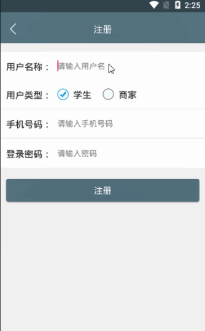

> **博主介绍：**
> 本人专注于Android/java/数据库/微信小程序技术领域的开发，以及有好几年的计算机毕业设计方面的实战开发经验和技术积累；尤其是在安卓（Android）的app的开发和微信小程序的开发，很是熟悉和了解；本人也是多年的Android开发人员；希望我发布的此篇文件可以帮助到您；
>
> 🍅 **文章末尾获取源码下载方式** 🍅

#### 功能演示

**详情演示视频请文字末尾公众号咨询，我会发给您；**

#### 1：后台演示

#### 2：客户端演示

#### 一、项目介绍

> 该系统为手机app，分为用户登录和注册，开设校园资讯模块，校园兼职模块，校园外卖模块以及失物招领和兴趣交友模五大模块。分为管理员，学生，商家三种角色。
>
> 一、校园资讯模块包含校内通知，校园活动。管理员可通过后台发布活动资讯等，学生可以在app中看到已发布的资讯及活动。
>
>
> 二、校园兼职模块可以发布招募信息，包括岗位，薪资，联系方式以及工作内容工作地点等相关信息，想要找兼职的学生也可以求职。另外，校园外卖中的商家也可以再次进行兼职招聘。本模块通过公告栏方式呈现。
>
>
> 三、校园外卖模块可以进驻校园内的餐饮，可以进行订餐等服务。商家可以在后台发布兼职招聘信息和美食相关信息，学生可以在手机客户端下单想要的美食并看到对应美食库存，下单后管理员可以在后台查看订单数据，也可以系统内查看到在这一时间段内是哪个兼职员工负责。
>
>
> 四、失物招领模块分为两部分，一部分可以发布捡到的物品，另一部分可以发布自己丢失的物品进行寻找。用户在手机客户端发布捡到的物品或者发布丢失的物品，而为了保护个人隐私，捡到或丢失物品的人可以通过站内信联系发布人留下联系方式。本模块通过公告栏方式呈现。
>
> 五、兴趣交友模块可以划分兴趣板块发布话题、内容等。这一模块也可以通过站内信联系。
>
> 六、管理员可以对app内所有信息进行管理，用户可以在app中修改信息，用户的所有信息都将被写入数据库。

#### 二、运行环境

> 1：客户端使用Android stuido进行开发；  
>  2：服务端后台使用Myeclipse2014进行开发；  
>  3：mysql数据库进行数据存储；  
>  4：需要jdk1.7以上  
>  5：使用雷电模拟器或者Androidstuio自带的模拟器进行运行

#### 三、使用技术

> **总体设计逻辑和思路：**  
>  1：先设计数据库表文件  
>  2：写服务端jsp页面以及写api接口给客户端提供数据  
>  3：完成后台服务端的数据交互，也就是jsp页面数据的存储和显示  
>  4：进行客户端页面的开发；  
>  5：进行客户端对api接口的调用，也就是获取数据库的数据以及在客户端进行显示
>
> **移动端：**  
>  1：使用android原生控件以及xml布局文件来完成界面的显示  
>  2：使用java代码完成功能的数据和逻辑交互  
>  3：使用http网络请求完成数据的请求；  
>  **4：使用json数据解析完成客户端数据的回调和显示**
>
> **服务端后台：**  
>  1：使用mysql完成数据的存储  
>  2：使用jdbc完成数据库和代码的逻辑交互  
>  3：使用jsp完成网页数据的显示  
>  4：使用java代码完成api接口的编写以及以及数据的回调

#### 四、数据库设计

    
    
    /*
    Navicat MySQL Data Transfer
    
    Source Server         : mydb
    Source Server Version : 50528
    Source Host           : localhost:3306
    Source Database       : schoolinfordb
    
    Target Server Type    : MYSQL
    Target Server Version : 50528
    File Encoding         : 65001
    
    Date: 2022-03-01 22:36:10
    */
    
    SET FOREIGN_KEY_CHECKS=0;
    
    -- ----------------------------
    -- Table structure for emailtb
    -- ----------------------------
    DROP TABLE IF EXISTS `emailtb`;
    CREATE TABLE `emailtb` (
      `emailId` int(11) NOT NULL AUTO_INCREMENT,
      `emailReceiptMessage` varchar(500) DEFAULT NULL,
      `emailReceiptUserId` int(11) DEFAULT NULL,
      `emailSendUserId` int(11) DEFAULT NULL,
      `emailTime` varchar(100) DEFAULT NULL,
      PRIMARY KEY (`emailId`)
    ) ENGINE=InnoDB AUTO_INCREMENT=16 DEFAULT CHARSET=utf8;
    
    -- ----------------------------
    -- Records of emailtb
    -- ----------------------------
    INSERT INTO `emailtb` VALUES ('13', '最近怎么样？还好吗？', '92', '92', '2022-01-26 10:02');
    INSERT INTO `emailtb` VALUES ('14', '最近怎么样？还好吗？', '92', '98', '2022-01-28 11:55');
    INSERT INTO `emailtb` VALUES ('15', '最近怎么样？还好吗？', '116', '116', '2022-01-28 14:26');
    
    -- ----------------------------
    -- Table structure for imgdb
    -- ----------------------------
    DROP TABLE IF EXISTS `imgdb`;
    CREATE TABLE `imgdb` (
      `imgId` int(11) NOT NULL AUTO_INCREMENT,
      `imgName` varchar(255) DEFAULT NULL,
      `imgPhone` varchar(255) DEFAULT NULL,
      `imgAddress` varchar(255) DEFAULT NULL,
      `imgMsg` varchar(255) DEFAULT NULL,
      `imgMessage` varchar(1000) DEFAULT NULL,
      `imgUserId` varchar(11) DEFAULT NULL,
      `imgUserName` varchar(255) DEFAULT NULL,
      `imgTime` varchar(100) DEFAULT NULL,
      `imgFlag` varchar(255) DEFAULT NULL,
      PRIMARY KEY (`imgId`)
    ) ENGINE=InnoDB AUTO_INCREMENT=39 DEFAULT CHARSET=utf8;
    
    -- ----------------------------
    -- Records of imgdb
    -- ----------------------------
    INSERT INTO `imgdb` VALUES ('17', null, null, null, 'null', '你好啊', '92', 'pony', '2022-01-26 11:01', '1');
    INSERT INTO `imgdb` VALUES ('18', null, null, null, 'null', '888888888', '92', 'pony', '2022-01-26 11:01', '1');
    INSERT INTO `imgdb` VALUES ('19', null, null, null, '20200327173200.jpg', '99999999999', '92', 'pony', '2022-01-26 11:01', '1');
    INSERT INTO `imgdb` VALUES ('20', null, null, null, '1497354410177.jpg,1497354412179.jpg,1497354411282.jpg,1497354412956.jpg,dmg_11.jpg,1501153404918.jpg', '9999999999999999', '92', 'pony', '2022-01-26 11:01', '1');
    INSERT INTO `imgdb` VALUES ('21', null, null, null, '20200414165228.jpg', '我的发布', '105', '小哲理', '2022-01-26 11:01', '1');
    INSERT INTO `imgdb` VALUES ('23', null, null, null, '20200420210827.jpg', '你给号啊', '108', '王小康', '2022-01-26 11:01', '1');
    INSERT INTO `imgdb` VALUES ('24', '1111', 'Iphone手机', '图书馆A区阅读室', 'ca6bded2.jpg', 'iPhone X采用“刘海屏”形式的全面屏设计，取消了苹果沿用了10年的底部Home键。分为64GB和256GB两个版本，有银色和深空灰色两种配色', '92', 'pony', '2022-01-26 09:33', '2');
    INSERT INTO `imgdb` VALUES ('25', '华为手机', '15249240000', '图书馆A区阅读室', 'dadaadada.jpg', 'iPhone X采用“刘海屏”形式的全面屏设计，取消了苹果沿用了10年的底部Home键。分为64GB和256GB两个版本，有银色和深空灰色两种配色', '92', 'pony', '2022-01-26 09:51', '3');
    INSERT INTO `imgdb` VALUES ('26', 'Iphone手机', '15249240000', '图书馆A区阅读室', 'book_dl_4.jpg', 'iPhone X采用“刘海屏”形式的全面屏设计，取消了苹果沿用了10年的底部Home键。分为64GB和256GB两个版本，有银色和深空灰色两种配色', '92', 'pony', '2022-01-26 09:53', '2');
    INSERT INTO `imgdb` VALUES ('27', 'Iphone', '15249240000', '图书馆A区阅读室', 'book_dl_6.jpg', 'iPhone X采用“刘海屏”形式的全面屏设计，取消了苹果沿用了10年的底部Home键。分为64GB和256GB两个版本，有银色和深空灰色两种配色', '92', 'pony', '2022-01-26 09:53', '2');
    INSERT INTO `imgdb` VALUES ('28', '小野鸡炖蘑菇', '10', '3', 'book_dl_4.jpg', '', '92', 'pony', '2022-01-26 11:01', '4');
    INSERT INTO `imgdb` VALUES ('29', '炖蘑菇', '10', '4', '1501153404918.jpg', '', '92', 'pony', '2022-01-26 11:01', '4');
    INSERT INTO `imgdb` VALUES ('30', '小野鸡', '10', '5', 'dadaadada.jpg', '', '92', 'pony', '2022-01-26 11:01', '4');
    INSERT INTO `imgdb` VALUES ('31', 'null', '', '', 'dadaadada.jpg', '888888888', '98', '小明', '2022-01-26 11:01', '1');
    INSERT INTO `imgdb` VALUES ('32', '华为手机', '15249240000', '图书馆A区阅读室', '1497354412179.jpg', 'iPhone X采用“刘海屏”形式的全面屏设计，取消了苹果沿用了10年的底部Home键。分为64GB和256GB两个版本，有银色和深空灰色两种配色', '116', '小女孩', '2022-01-28 14:26', '2');
    INSERT INTO `imgdb` VALUES ('33', '华为16手机', '15249240000', '图书馆A区阅读室', '47060002977bb9d58522.jpg', 'iPhone X采用“刘海屏”形式的全面屏设计，取消了苹果沿用了10年的底部Home键。分为64GB和256GB两个版本，有银色和深空灰色两种配色', '116', '小女孩', '2022-01-28 14:26', '3');
    INSERT INTO `imgdb` VALUES ('34', 'null', '', '', 'book_dl_4.jpg', '777777777777777777', '116', '小女孩', '2022-01-28 14:27', '1');
    INSERT INTO `imgdb` VALUES ('35', '蘑菇', '10', '6', 'book_dl_3.jpg', '', '117', '米饭商家', '2022-01-28 14:27', '4');
    INSERT INTO `imgdb` VALUES ('36', '小野鸡炖蘑菇', '10', '2', 'weixintupian_20200506145916.jpg', '', '92', '岐山臊子面', '2022-03-01 21:54', '4');
    INSERT INTO `imgdb` VALUES ('37', '小野鸡炖蘑菇', '25', '13', 'ms6.jpg', '', '92', '岐山臊子面', '2022-03-01 21:56', '4');
    INSERT INTO `imgdb` VALUES ('38', '美食', '15', '14', '20170908172539.png', '', '92', '岐山臊子面', '2022-03-01 22:33', '4');
    
    -- ----------------------------
    -- Table structure for jijiantb
    -- ----------------------------
    DROP TABLE IF EXISTS `jijiantb`;
    CREATE TABLE `jijiantb` (
      `jijianId` int(11) NOT NULL AUTO_INCREMENT,
      `jijianName` varchar(255) DEFAULT NULL,
      `jijianAddresse` varchar(255) DEFAULT NULL,
      `jijianPhone` varchar(255) DEFAULT NULL,
      `jijianUserId` int(11) DEFAULT NULL,
      PRIMARY KEY (`jijianId`)
    ) ENGINE=InnoDB AUTO_INCREMENT=17 DEFAULT CHARSET=utf8;
    
    -- ----------------------------
    -- Records of jijiantb
    -- ----------------------------
    INSERT INTO `jijiantb` VALUES ('14', '小明', '98', '15249241002', '92');
    INSERT INTO `jijiantb` VALUES ('15', '小女孩', '116', '15249241004', '117');
    INSERT INTO `jijiantb` VALUES ('16', '小明', '98', '15249241002', '117');
    
    -- ----------------------------
    -- Table structure for jobtb
    -- ----------------------------
    DROP TABLE IF EXISTS `jobtb`;
    CREATE TABLE `jobtb` (
      `tipId` int(11) NOT NULL AUTO_INCREMENT,
      `tipTitle` varchar(255) DEFAULT NULL,
      `tipType` varchar(255) DEFAULT NULL,
      `tipPhone` varchar(255) DEFAULT NULL,
      `tipAddress` varchar(255) DEFAULT NULL,
      `tipMessage` varchar(5000) DEFAULT NULL,
      `tipTime` varchar(100) DEFAULT NULL,
      `tipUserId` varchar(11) DEFAULT NULL,
      `tipUserName` varchar(255) DEFAULT NULL,
      PRIMARY KEY (`tipId`)
    ) ENGINE=InnoDB AUTO_INCREMENT=22 DEFAULT CHARSET=utf8;
    
    -- ----------------------------
    -- Records of jobtb
    -- ----------------------------
    INSERT INTO `jobtb` VALUES ('17', '校园招聘会', '100元/天', '15249241001', '西安市雁塔区', '在现代社会里，保洁服务已经越来越被大家接受和需要，并已经进入了千家万户的生活中。是人们提升现代生活质量的一个里程碑。它使人们的居住环境的质量不断提高。\r\n', '2022-01-26 11:01', null, null);
    INSERT INTO `jobtb` VALUES ('18', '软件行业招聘会', '200元/天', '15249241001', '西安市雁塔区', '世界上最早的一份汽车保险出现在1898年的美国。美国的旅行者保险有限公司在1898年给纽约布法罗的杜鲁门马丁上了第一份汽车保险。马丁非常担心自己的爱车会被马冲撞。美国全国只有4000多辆汽车，而马的数量却达到了2000万匹，马车仍然是主要的交通工具。在100多年之后，美国有2.2亿辆汽车，而马的数量已经减少到200万匹。一个多世纪前还被视为新鲜事物的汽车保险已经成为再平常不过的事情。', '2022-01-26 11:01', null, null);
    INSERT INTO `jobtb` VALUES ('20', '招聘外卖员', '10元/单', '15249240000', '校园餐厅A区1001档口', '了解餐馆附近街道，善于利用各种地图工具;能够安排好自己的送餐工具;有耐心,身体健康,五官端正,普通话标准', '2022-01-28 10:12:52', '92', '岐山臊子面');
    INSERT INTO `jobtb` VALUES ('21', '外卖员', '10元/单', '15249240000', '校园餐厅A区1001档口', '了解餐馆附近街道，善于利用各种地图工具;能够安排好自己的送餐工具;有耐心,身体健康,五官端正,普通话标准', '2022-01-28 14:28:09', '117', '米饭商家');
    
    -- ----------------------------
    -- Table structure for ordertb
    -- ----------------------------
    DROP TABLE IF EXISTS `ordertb`;
    CREATE TABLE `ordertb` (
      `orderId` int(11) NOT NULL AUTO_INCREMENT,
      `orderMessageId` varchar(100) DEFAULT NULL,
      `orderMessageName` varchar(255) DEFAULT NULL,
      `orderMessageMoney` varchar(255) DEFAULT NULL,
      `orderUserId` varchar(100) DEFAULT NULL,
      `orderUserName` varchar(255) DEFAULT NULL,
      `orderName` varchar(255) DEFAULT NULL,
      `orderPhone` varchar(255) DEFAULT NULL,
      `orderAddress` varchar(500) DEFAULT NULL,
      `orderCreatime` varchar(100) DEFAULT NULL,
      `orderSendUserId` varchar(500) DEFAULT NULL,
      `orderPersonId` varchar(255) DEFAULT NULL,
      `orderPersonName` varchar(255) DEFAULT NULL,
      `orderPersonPhone` varchar(255) DEFAULT NULL,
      PRIMARY KEY (`orderId`)
    ) ENGINE=InnoDB AUTO_INCREMENT=40 DEFAULT CHARSET=utf8;
    
    -- ----------------------------
    -- Records of ordertb
    -- ----------------------------
    INSERT INTO `ordertb` VALUES ('31', '30', '小野鸡', '10', '92', 'pony', '小明', '15249240000', '宿舍楼A区B栋楼1001室', '2022-01-26 11:11', '92', null, null, null);
    INSERT INTO `ordertb` VALUES ('32', '28', '小野鸡炖蘑菇', '10', '92', 'pony', '小明', '15249240000', '宿舍楼A区B栋楼1001室', '2022-01-26 11:33', '92', '', '', '');
    INSERT INTO `ordertb` VALUES ('33', '28', '小野鸡炖蘑菇', '10', '98', '小明', '小明', '15249240000', '宿舍楼A区B栋楼1001室', '2022-01-28 09:22', '92', '98', '小明', '15249241002');
    INSERT INTO `ordertb` VALUES ('34', '35', '蘑菇', '10', '116', '小女孩', '小明', '15249240000', '宿舍楼A区B栋楼1001室', '2022-01-28 14:28', '117', '98', '小明', '15249241002');
    INSERT INTO `ordertb` VALUES ('35', '37', '小野鸡炖蘑菇', '25', '98', '小明', '小明', '15249240000', '宿舍楼A区B栋楼1001室', '2022-03-01 22:25', '92', null, null, null);
    INSERT INTO `ordertb` VALUES ('36', '37', '小野鸡炖蘑菇', '25', '98', '小明', '小明', '15249240000', '宿舍楼A区B栋楼1001室', '2022-03-01 22:28', '92', null, null, null);
    INSERT INTO `ordertb` VALUES ('37', '37', '小野鸡炖蘑菇', '25', '98', '小明', '小明', '15249240000', '宿舍楼A区B栋楼1001室', '2022-03-01 22:28', '92', null, null, null);
    INSERT INTO `ordertb` VALUES ('38', '38', '美食', '15', '98', '小明', '小明', '15249240000', '宿舍楼A区B栋楼1001室', '2022-03-01 22:34', '92', null, null, null);
    INSERT INTO `ordertb` VALUES ('39', '38', '美食', '15', '98', '小明', '小明', '15249240000', '宿舍楼A区B栋楼1001室', '2022-03-01 22:34', '92', null, null, null);
    
    -- ----------------------------
    -- Table structure for praisetb
    -- ----------------------------
    DROP TABLE IF EXISTS `praisetb`;
    CREATE TABLE `praisetb` (
      `praiseId` int(11) NOT NULL AUTO_INCREMENT,
      `praiseMessageId` int(11) DEFAULT NULL,
      `praiseNumber` int(11) DEFAULT NULL,
      `praiseUserId` int(11) DEFAULT NULL,
      PRIMARY KEY (`praiseId`)
    ) ENGINE=InnoDB AUTO_INCREMENT=40 DEFAULT CHARSET=utf8;
    
    -- ----------------------------
    -- Records of praisetb
    -- ----------------------------
    INSERT INTO `praisetb` VALUES ('27', '9', '3', '106');
    INSERT INTO `praisetb` VALUES ('28', '10', '1', '109');
    INSERT INTO `praisetb` VALUES ('31', '8', '1', '106');
    INSERT INTO `praisetb` VALUES ('32', '12', '1', '106');
    INSERT INTO `praisetb` VALUES ('37', '15', '1', '92');
    INSERT INTO `praisetb` VALUES ('38', '14', '1', '92');
    INSERT INTO `praisetb` VALUES ('39', '16', '1', '103');
    
    -- ----------------------------
    -- Table structure for reviewtb
    -- ----------------------------
    DROP TABLE IF EXISTS `reviewtb`;
    CREATE TABLE `reviewtb` (
      `reviewId` int(11) NOT NULL AUTO_INCREMENT,
      `reviewMessageId` int(11) DEFAULT NULL,
      `reviewMessage` varchar(255) DEFAULT NULL,
      `reviewUserId` int(11) DEFAULT NULL,
      `reviewUserName` varchar(255) DEFAULT NULL,
      `reviewTime` varchar(100) DEFAULT NULL,
      PRIMARY KEY (`reviewId`)
    ) ENGINE=InnoDB AUTO_INCREMENT=21 DEFAULT CHARSET=utf8;
    
    -- ----------------------------
    -- Records of reviewtb
    -- ----------------------------
    INSERT INTO `reviewtb` VALUES ('18', '31', '5656', '98', '小明', '2022-01-28 11:52');
    INSERT INTO `reviewtb` VALUES ('19', '34', '666666666666', '116', '小女孩', '2022-01-28 14:27');
    INSERT INTO `reviewtb` VALUES ('20', '34', '666666666666额特特', '116', '小女孩', '2022-01-28 14:27');
    
    -- ----------------------------
    -- Table structure for tiptb
    -- ----------------------------
    DROP TABLE IF EXISTS `tiptb`;
    CREATE TABLE `tiptb` (
      `tipId` int(11) NOT NULL AUTO_INCREMENT,
      `tipTitle` varchar(255) DEFAULT NULL,
      `tipType` varchar(255) DEFAULT NULL,
      `tipMessage` varchar(5000) DEFAULT NULL,
      `tipTime` varchar(100) DEFAULT NULL,
      `tipPhone` varchar(255) DEFAULT NULL,
      `tipAddress` varchar(255) DEFAULT NULL,
      PRIMARY KEY (`tipId`)
    ) ENGINE=InnoDB AUTO_INCREMENT=19 DEFAULT CHARSET=utf8;
    
    -- ----------------------------
    -- Records of tiptb
    -- ----------------------------
    INSERT INTO `tiptb` VALUES ('7', '最新开学通知', '校园新闻', '世界上最早的一份汽车保险出现在1898年的美国。美国的旅行者保险有限公司在1898年给纽约布法罗的杜鲁门马丁上了第一份汽车保险。马丁非常担心自己的爱车会被马冲撞。美国全国只有4000多辆汽车，而马的数量却达到了2000万匹，马车仍然是主要的交通工具。在100多年之后，美国有2.2亿辆汽车，而马的数量已经减少到200万匹。一个多世纪前还被视为新鲜事物的汽车保险已经成为再平常不过的事情。', '2022-01-26 11:01', null, null);
    INSERT INTO `tiptb` VALUES ('10', '疫情期间返校须知', '校园新闻', '世界上最早的一份汽车保险出现在1898年的美国。美国的旅行者保险有限公司在1898年给纽约布法罗的杜鲁门马丁上了第一份汽车保险。马丁非常担心自己的爱车会被马冲撞。美国全国只有4000多辆汽车，而马的数量却达到了2000万匹，马车仍然是主要的交通工具。在100多年之后，美国有2.2亿辆汽车，而马的数量已经减少到200万匹。一个多世纪前还被视为新鲜事物的汽车保险已经成为再平常不过的事情。', '2022-01-26 11:01', null, null);
    INSERT INTO `tiptb` VALUES ('17', '校园招聘会', '招聘信息', '在现代社会里，保洁服务已经越来越被大家接受和需要，并已经进入了千家万户的生活中。是人们提升现代生活质量的一个里程碑。它使人们的居住环境的质量不断提高。\r\n', '2022-01-26 11:01', '15249241001', '西安市雁塔区');
    INSERT INTO `tiptb` VALUES ('18', '软件行业招聘会', '招聘信息', '世界上最早的一份汽车保险出现在1898年的美国。美国的旅行者保险有限公司在1898年给纽约布法罗的杜鲁门马丁上了第一份汽车保险。马丁非常担心自己的爱车会被马冲撞。美国全国只有4000多辆汽车，而马的数量却达到了2000万匹，马车仍然是主要的交通工具。在100多年之后，美国有2.2亿辆汽车，而马的数量已经减少到200万匹。一个多世纪前还被视为新鲜事物的汽车保险已经成为再平常不过的事情。', '2022-01-26 11:01', '15249241001', '小明');
    
    -- ----------------------------
    -- Table structure for token
    -- ----------------------------
    DROP TABLE IF EXISTS `token`;
    CREATE TABLE `token` (
      `tid` int(100) NOT NULL AUTO_INCREMENT,
      `uid` varchar(100) CHARACTER SET utf8 NOT NULL,
      `utoken` varchar(500) CHARACTER SET utf8 NOT NULL,
      PRIMARY KEY (`tid`)
    ) ENGINE=InnoDB AUTO_INCREMENT=134 DEFAULT CHARSET=latin1;
    
    -- ----------------------------
    -- Records of token
    -- ----------------------------
    INSERT INTO `token` VALUES ('115', '92', '1IbkIPHZ4ql+337R4ala/CvwBvuqr97RjQi5uLqItZQHbQeOQtvD7mGGro2GXplL6A4Ffw8eCIH4qW5FoOzRkw==');
    INSERT INTO `token` VALUES ('116', '93', 's3lW4XU0gZbk+LIzkzvtCyfe2p3VNew29bDtQiHjV9V2RkRFm9MJi+E0SshT7pH9uK2rzAfsdDI=');
    INSERT INTO `token` VALUES ('117', '94', 'Ir0xCjYKSQ1Qlw3dP5j3GTD73K3+3uRZGpOSjlb+djynVhukD4t/ith/BKLy+H7HZr0S3r3cWCBBoI2bW00tFg==');
    INSERT INTO `token` VALUES ('118', '95', 'XrkK7jAnG1lOAXCvP5mmWivwBvuqr97RjQi5uLqItZQHbQeOQtvD7on5XcLKOoZkubXP1pLz5ev4qW5FoOzRkw==');
    INSERT INTO `token` VALUES ('119', '96', '81VsTmiCEJ0vYek0VyMTCuPZyX50Qjvw8IfFfqYdtQkN/BT6pINSpMW9lmXMzMnSMQSby6pJP54=');
    INSERT INTO `token` VALUES ('120', '97', 'gT93UtDVud44JVeFoClgICfe2p3VNew29bDtQiHjV9WAszKiFi7Xv6ZNr+8Rih+coDiwuPVF4RE=');
    INSERT INTO `token` VALUES ('121', '98', 'cMRP4GtM0cWcKlB4wluc3ife2p3VNew29bDtQiHjV9WAszKiFi7Xv9nv7d+VdOBhUZQPf/g6Y9c=');
    INSERT INTO `token` VALUES ('122', '99', 'ZNh/wsov+gRf5AYrommYoivwBvuqr97RjQi5uLqItZRX3RQx9HRsmNMRhiNXnW/KFwO5tjZbBaf4qW5FoOzRkw==');
    INSERT INTO `token` VALUES ('123', '100', 'i5Z8RFhOY3iMvLBydyA+bife2p3VNew29bDtQiHjV9WAszKiFi7Xv8yk3mR6sQja1LNQ37E82dc=');
    INSERT INTO `token` VALUES ('124', '101', '+s5IyAmWRJpG/dVpIB1w8TD73K3+3uRZGpOSjlb+djw7GdNa1yA19ILbaTqOLOcqnLtBpBbIoYBBoI2bW00tFg==');
    INSERT INTO `token` VALUES ('125', '102', 'cMrO9EDZyWeM4ZQAUL7woDD73K3+3uRZGpOSjlb+djw7GdNa1yA19BST21AyKvb9XYKEW2hBaWVBoI2bW00tFg==');
    INSERT INTO `token` VALUES ('126', '103', 'g6LJPY10+OJBFo9+vY4Y4yfe2p3VNew29bDtQiHjV9VFSW5AaKNu0ENxv8opzWB6xYjIEuGs3P0=');
    INSERT INTO `token` VALUES ('127', '104', 't/BrP6qSZtfKgXUMisCBnVfvyqxV71MxQaCNm1tNLRY=@zp0x.cn.rongnav.com;zp0x.cn.rongcfg.com');
    INSERT INTO `token` VALUES ('128', '105', '4gRi9Yq0+z7KgXUMisCBnTWz7iT3TQjhQaCNm1tNLRY=@zp0x.cn.rongnav.com;zp0x.cn.rongcfg.com');
    INSERT INTO `token` VALUES ('129', '106', 'C9+fRlGiU3nKgXUMisCBnQF1JfU/lSaaQaCNm1tNLRY=@zp0x.cn.rongnav.com;zp0x.cn.rongcfg.com');
    INSERT INTO `token` VALUES ('130', '107', '6VM9tkbywgjKgXUMisCBnYHTkLfDR16oQaCNm1tNLRY=@zp0x.cn.rongnav.com;zp0x.cn.rongcfg.com');
    INSERT INTO `token` VALUES ('131', '108', '0g7y7WTp2QTKgXUMisCBnZNVpr2nYXyFQaCNm1tNLRY=@zp0x.cn.rongnav.com;zp0x.cn.rongcfg.com');
    INSERT INTO `token` VALUES ('132', '109', 'JNEx2AZEfUnKgXUMisCBnfgb1l9flCvfQaCNm1tNLRY=@zp0x.cn.rongnav.com;zp0x.cn.rongcfg.com');
    INSERT INTO `token` VALUES ('133', '110', 'YVvYEOsZyX/KgXUMisCBneato8t56M1kQaCNm1tNLRY=@zp0x.cn.rongnav.com;zp0x.cn.rongcfg.com');
    
    -- ----------------------------
    -- Table structure for user
    -- ----------------------------
    DROP TABLE IF EXISTS `user`;
    CREATE TABLE `user` (
      `uid` int(255) NOT NULL AUTO_INCREMENT,
      `uname` varchar(200) CHARACTER SET utf8 NOT NULL,
      `uphone` varchar(100) NOT NULL,
      `utype` varchar(255) CHARACTER SET utf8 DEFAULT NULL,
      `upswd` varchar(200) NOT NULL,
      `utime` varchar(300) NOT NULL,
      PRIMARY KEY (`uid`)
    ) ENGINE=InnoDB AUTO_INCREMENT=118 DEFAULT CHARSET=latin1;
    
    -- ----------------------------
    -- Records of user
    -- ----------------------------
    INSERT INTO `user` VALUES ('92', '岐山臊子面', '15249241001', '商家', '123456', '2022-01-26 11:01');
    INSERT INTO `user` VALUES ('98', '小明', '15249241002', '学生', '123456', '2022-01-26 11:01');
    INSERT INTO `user` VALUES ('115', 'xiaohua', '15249241003', '学生', '123456', '2022-01-28 14:23');
    INSERT INTO `user` VALUES ('116', '小女孩', '15249241004', '学生', '123456', '2022-01-28 14:25');
    INSERT INTO `user` VALUES ('117', '米饭商家', '15249241005', '商家', '123456', '2022-01-28 14:27');
    

#### 五、部分代码

#### 六、浏览更多Android毕业设计

[毕业设计-基于android的租房信息发布平台的APP_信息发布app源码_Android毕业设计源码的博客-
CSDN博客](https://blog.csdn.net/u014388322/article/details/100656450?spm=1001.2014.3001.5502
"毕业设计-基于android的租房信息发布平台的APP_信息发布app源码_Android毕业设计源码的博客-CSDN博客")

[毕业设计-基于android选课系统的设计与实现_android学生选课系统_Android毕业设计源码的博客-
CSDN博客](https://blog.csdn.net/u014388322/article/details/100656536?spm=1001.2014.3001.5502
"毕业设计-基于android选课系统的设计与实现_android学生选课系统_Android毕业设计源码的博客-CSDN博客")

[毕业设计之校园一卡通管理系统的设计与实现_一卡通管理系统实现_Android毕业设计源码的博客-
CSDN博客](https://blog.csdn.net/u014388322/article/details/126048550?spm=1001.2014.3001.5502
"毕业设计之校园一卡通管理系统的设计与实现_一卡通管理系统实现_Android毕业设计源码的博客-CSDN博客")

[基于Android的校园二手闲置物品交易系统设计与实现_基于android的二手交易平台_Android毕业设计源码的博客-
CSDN博客](https://blog.csdn.net/u014388322/article/details/128232475?spm=1001.2014.3001.5502
"基于Android的校园二手闲置物品交易系统设计与实现_基于android的二手交易平台_Android毕业设计源码的博客-CSDN博客")

[基于androidstudio校园快递APP系统的设计与实现_android studio论文_Android毕业设计源码的博客-
CSDN博客](https://blog.csdn.net/u014388322/article/details/128545390?spm=1001.2014.3001.5502
"基于androidstudio校园快递APP系统的设计与实现_android studio论文_Android毕业设计源码的博客-CSDN博客")

[基于android的商城购物定制APP_安卓开发购物app_Android毕业设计源码的博客-
CSDN博客](https://blog.csdn.net/u014388322/article/details/128746697?spm=1001.2014.3001.5502
"基于android的商城购物定制APP_安卓开发购物app_Android毕业设计源码的博客-CSDN博客")

> 更多毕业设计可以浏览我的个人主页哦！

#### 七、源码下载

> 大家 **点赞、收藏、关注、评论** 啦 、 **查看** 👇🏻👇🏻👇🏻 **获取联系方式** 👇🏻👇🏻👇🏻
>
> <https://download.csdn.net/download/u014388322/88192348>
>
> ​

