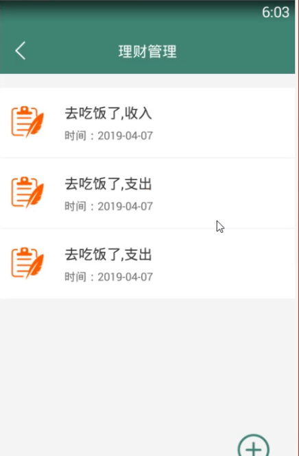
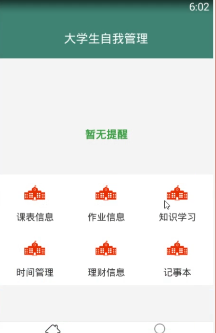

> **博主介绍：**
> 本人专注于Android/java/数据库/微信小程序技术领域的开发，以及有好几年的计算机毕业设计方面的实战开发经验和技术积累；尤其是在安卓（Android）的app的开发和微信小程序的开发，很是熟悉和了解；本人也是多年的Android开发人员；希望我发布的此篇文件可以帮助到您；
>
> 🍅 **文章末尾获取源码下载方式** 🍅

#### 一、项目介绍

> 一、个人基本资料  
>  包括姓名、年龄、性别、身份证、学历证、手机号码+  
>  二、学习管理  
>  1学知识管理  
>  （1）：可以记录和查询课程表  
>  （2）：作业完成情况问题记录加一个拍照上传错题本  
>  3提醒考  
>  2.学时间管理  
>  （1）：到点提醒该学习什么课程,夏习知识点试复习时间及合理规划时间  
>  （2）：提醒作业时间  
>  注:都是可以添加·查看,修改及提醒  
>  三、其他  
>  1 理财：记录画一笔收与支出,统计每月的收入白支出:  
>  2.记事本

#### 二、运行环境

> 1：客户端使用Android stuido进行开发；  
>  2：服务端后台使用Myeclipse2014进行开发；  
>  3：mysql数据库进行数据存储；  
>  4：需要jdk1.7以上  
>  5：使用雷电模拟器或者Androidstuio自带的模拟器进行运行

#### 三、使用技术

> **总体设计逻辑和思路：**  
>  1：先设计数据库表文件  
>  2：写服务端jsp页面以及写api接口给客户端提供数据  
>  3：完成后台服务端的数据交互，也就是jsp页面数据的存储和显示  
>  4：进行客户端页面的开发；  
>  5：进行客户端对api接口的调用，也就是获取数据库的数据以及在客户端进行显示
>
> **移动端：**  
>  1：使用android原生控件以及xml布局文件来完成界面的显示  
>  2：使用java代码完成功能的数据和逻辑交互  
>  3：使用http网络请求完成数据的请求；  
>  **4：使用json数据解析完成客户端数据的回调和显示**
>
> **服务端后台：**  
>  1：使用mysql完成数据的存储  
>  2：使用jdbc完成数据库和代码的逻辑交互  
>  3：使用jsp完成网页数据的显示  
>  4：使用java代码完成api接口的编写以及以及数据的回调

#### 四、软件截图

#### 五、部分代码

##### 1：添加学习知识

>  
>  public class CreatStudyActivity extends BaseActivity implements
> ImageItemClickListner {  
>  // 标题  
>  private TextView mTvTitle;  
>  // 返回  
>  private ImageView mIvBack;
>
>  
>  GridLayout grid_instructor;  
>  HorizontalScrollView horizontalscrollview;  
>  private ArrayList<SelectImageItem> imageItems = new
> ArrayList<SelectImageItem>();  
>  private SelectedImageAdapter selectedImageAdapter;  
>  private Button mSubmit;  
>  private File imgPath;  
>  public LoadingDialog mdialog;  
>  private List<String> mListImage = new ArrayList<String>();  
>  private int imgPosFlag = 0;  
>  private String picPath = null;  
>  private EditText post_title;  
>  private EditText post_content;  
>  // 图片上传表示位  
>  private int imageFlagNumber = 0;
>
> private TextView interestHobby;  
>  private EditText interestMessage;  
>  private EditText courseName;  
>  
>  @Override  
>  protected void onCreate(Bundle savedInstanceState) {  
>  super.onCreate(savedInstanceState);  
>  setContentView(R.layout.activity_creat_ins);  
>  initWidget();  
>  initData();  
>  }
>
> @Override  
>  public void onClick(View v) {  
>  switch (v.getId()) {  
>  case R.id.mIvBack:  
>  finish();  
>  break;
>
> case R.id.mSubmit:  
>  if (TextUtils.isEmpty(interestMessage.getText().toString())) {  
>  ToastUtil.ShowCentre(this, "请输入内容");  
>  return;  
>  }
>
>  
>  Log.e("pony_log", imageFlagNumber + "");
>
> imageFlagNumber = 0;  
>  UploadFileTask uploadFileTask = new UploadFileTask(this);  
>  uploadFileTask.execute(mListImage.get(imageFlagNumber));
>
>  
>  break;
>
> }  
>  }
>
> @Override  
>  public void initWidget() {
>
>  
>  courseName = (EditText) findViewById(R.id.courseName);  
>  interestHobby = (TextView) findViewById(R.id.interestHobby);  
>  interestMessage = (EditText) findViewById(R.id.interestMessage);  
>  mdialog = new LoadingDialog(this, "上传图片...");  
>  mSubmit = (Button) findViewById(R.id.mSubmit);  
>  grid_instructor = (GridLayout) findViewById(R.id.grid_instructor);  
>  horizontalscrollview = (HorizontalScrollView)
> findViewById(R.id.horizontalscrollview);  
>  mIvBack = (ImageView) findViewById(R.id.mIvBack);  
>  mTvTitle = (TextView) findViewById(R.id.mTvTitle);  
>  mTvTitle.setText("添加知识学习信息");  
>  mIvBack.setVisibility(View.VISIBLE);  
>  mIvBack.setOnClickListener(this);  
>  mSubmit.setOnClickListener(this);
>
> }  
>  @Override  
>  public void initData() {  
>
> ImageLoader.getInstance().init(ImageLoaderConfiguration.createDefault(this));  
>  initSelectedGridView();  
>  }
>
> private void initSelectedGridView() {  
>  selectedImageAdapter = new SelectedImageAdapter(this, imageItems);  
>  SelectImageItem addItem = new SelectImageItem();  
>  addItem.setSid(100);// 添加的图标  
>  imageItems.add(addItem);  
>  selectedImageAdapter.notifyDataSetChanged();  
>  grid_instructor.setGridAdapter(selectedImageAdapter,
> CreatStudyActivity.this);
>
> }
>
> @Override  
>  public void imageItemClick(int position, SelectImageItem imageItem) {  
>  if (imageItem != null) {  
>  int sid = imageItem.getSid();  
>  if (sid == 100) {
>
> if (CreatStudyActivity.this.getIntent().getIntExtra("photo_message", 0) ==
> 1) {  
>  goCameraActivity();  
>  } else {  
>  // 添加图片  
>  Intent intentImages = new Intent(CreatStudyActivity.this,
> SelectImagesActivity.class);  
>  intentImages.putExtra("image_count", imageItems.size());  
>  intentImages.putExtra("max_count", "1");  
>  startActivityForResult(intentImages, 1);  
>  }  
>  } else {  
>  Intent intentPicture = new Intent(CreatStudyActivity.this,
> ShowCreatePicturesActivity.class);  
>  intentPicture.putExtra("position", position);  
>  intentPicture.putExtra("piction_path", imageItems);  
>  startActivityForResult(intentPicture, 3);  
>  }  
>  }  
>  }
>
> private void addNewItemWithPre(String cameraPath) {
>
> int count = selectedImageAdapter.getCount();  
>  if (count > 0) {  
>  int selectCount = count - 1;  
>  SelectImageItem item = new SelectImageItem();  
>  item.setUrl(cameraPath);  
>  imageItems.add(selectCount, item);  
>  }  
>  }
>
> private void scrollgridView() {  
>  final int count = selectedImageAdapter.getCount();  
>  if (count > 1) {  
>  new Handler().postDelayed(new Runnable() {  
>  @Override  
>  public void run() {  
>  horizontalscrollview.smoothScrollTo(2000, 0);  
>  }  
>  }, 500);  
>  }  
>  }
>
> @Override  
>  protected void onActivityResult(int requestCode, int resultCode, Intent
> data) {  
>  super.onActivityResult(requestCode, resultCode, data);
>
> if (requestCode == 5) {  
>  Log.d("camera", "" + (data == null));  
>  if (mCameraFile == null || !mCameraFile.exists()) {  
>  return;  
>  }  
>  imgPath = mCameraFile;  
>  mListImage.add(mCameraFile.getAbsolutePath());  
>  addNewItemWithPre(mCameraFile.getAbsolutePath());  
>  }
>
> if (requestCode == 1) {  
>  if (data != null) {
>
> if (0 == data.getIntExtra("action", -1)) {  
>  String cameraPath = data.getStringExtra("camera_path");  
>  addNewItemWithPre(cameraPath);
>
> } else if (1 == data.getIntExtra("action", -1)) {  
>  ArrayList<CharSequence> charSequences =
> data.getCharSequenceArrayListExtra("images");  
>  for (CharSequence ss : charSequences) {  
>  Log.e("pony_log", "image:" + ss.toString());  
>  picPath = ss.toString();  
>  mListImage.add(ss.toString());  
>  addNewItemWithPre(ss.toString());  
>  }  
>  }  
>  selectedImageAdapter.notifyDataSetChanged();  
>  scrollgridView();  
>  }  
>  }
>
> if (requestCode == 3) {  
>  if (data != null) {  
>  @SuppressWarnings("unchecked")  
>  ArrayList<SelectImageItem> imgUrls = (ArrayList<SelectImageItem>)
> data.getSerializableExtra("data");  
>  if (imgUrls != null && imgUrls.size() > 0) {  
>  imageItems.clear();  
>  imageItems.addAll(imgUrls);  
>  selectedImageAdapter.notifyDataSetChanged();  
>  scrollgridView();  
>  }  
>  }  
>  }  
>  grid_instructor.setGridAdapter(selectedImageAdapter,
> CreatStudyActivity.this);  
>  }
>
> private Uri mOutPutFileUri;  
>  private File mCameraFile;
>
> // 去拍照  
>  private void goCameraActivity() {  
>  Intent intent = new Intent(MediaStore.ACTION_IMAGE_CAPTURE);  
>  // dailyyoga_camera文件夹  
>  File parentFile = new
> File(Environment.getExternalStorageDirectory().toString() +
> "/dailyyoga_camera");  
>  if (!parentFile.exists()) {  
>  parentFile.mkdirs();  
>  }  
>  mCameraFile = new File(parentFile + "/" + System.currentTimeMillis() +
> ".jpg");  
>  mOutPutFileUri = Uri.fromFile(mCameraFile);  
>  intent.putExtra(MediaStore.EXTRA_OUTPUT, mOutPutFileUri);  
>  startActivityForResult(intent, 5);  
>  }
>
>  
>  private void createTopicPost(boolean isShow) {  
>  
>  //对图片路径的处理  
>  String imagePath = "";  
>  for (int i = 0; i < mListImage.size(); i++) {  
>  String[] arrPath = mListImage.get(i).split("\\\/");  
>  imagePath = arrPath[arrPath.length - 1] +","+imagePath;  
>  }  
>
>
> AjaxParams params = new AjaxParams();  
>  params.put("action_flag", "addHome");  
>  params.put("homeCourse", TextUtils.isEmpty(courseName.getText().toString())
> ? "" : courseName.getText().toString());  
>  params.put("homeMessage",
> TextUtils.isEmpty(interestMessage.getText().toString()) ? "" :
> interestMessage.getText().toString());  
>  params.put("homeUserId", MemberUserUtils.getUid(this));  
>  params.put("homeUserName", MemberUserUtils.getName(this));  
>  params.put("homeImg", imagePath.substring(0, imagePath.length()-1));  
>  
>  params.put("homeType","2");  
>  httpPost(Consts.URL + Consts.APP.MessageAction, params,
> Consts.actionId.resultCode, isShow, "正在上传...");
>
> }
>
> @Override  
>  protected void callBackSuccess(ResponseEntry entry, int actionId) {  
>  super.callBackSuccess(entry, actionId);
>
> switch (actionId) {  
>  case Consts.actionId.resultCode:  
>  ToastUtil.show(CreatStudyActivity.this, entry.getRepMsg());  
>  new Handler().postDelayed(new Runnable() {  
>  //  
>  @Override  
>  public void run() {  
>  finish();  
>  }  
>  }, 2000);  
>  break;  
>  }
>
>  
>  }
>
> @Override  
>  protected void callBackAllFailure(String strMsg, int actionId) {  
>  super.callBackAllFailure(strMsg, actionId);  
>  mdialog.dismiss();  
>  ToastUtil.show(CreatStudyActivity.this, strMsg);
>
> }
>
> public class UploadFileTask extends AsyncTask<String, Void, String> {
>
> /**  
>  * 可变长的输入参数，与AsyncTask.exucute()对应  
>  */  
>  private Activity context = null;
>
> public UploadFileTask(Activity ctx) {  
>  this.context = ctx;
>
> }
>
> @Override  
>  protected void onPostExecute(String result) {  
>  imageFlagNumber++;  
>  if (UploadUtils.SUCCESS.equalsIgnoreCase(result)) {  
>  if (imageFlagNumber < mListImage.size()) {  
>  UploadFileTask uploadFileTask = new
> UploadFileTask(CreatStudyActivity.this);  
>  uploadFileTask.execute(mListImage.get(imageFlagNumber));  
>  } else if (imageFlagNumber == mListImage.size()) {
>
> createTopicPost(true);  
>  // 返回HTML页面的内容
>
> }  
>  } else {  
>  ToastUtil.show(CreatStudyActivity.this, " 图片上传失败");  
>  }  
>  }
>
> @Override  
>  protected void onPreExecute() {  
>  }
>
> @Override  
>  protected void onCancelled() {  
>  super.onCancelled();  
>  }
>
> @Override  
>  protected String doInBackground(String... params) {  
>  File file = new File(params[0]);  
>  return UploadUtils.uploadFile(file, Consts.URL +
> Consts.APP.MessageAction+"?action_flag=addHome");  
>  }
>
> @Override  
>  protected void onProgressUpdate(Void... values) {  
>  }
>
> }  
>  }  
>

##### 2：登录界面

> public class LoginActivity extends BaseActivity {  
>  private static boolean isServerSideLogin = false;  
>  // title  
>  private TextView mTvTitle;  
>  // µÇ¼Óû§Ãû³Æ  
>  private EditText mLoginNumber;  
>  // µÇ¼ÃÜÂë  
>  private EditText mLoginPswd;  
>  // µÇ¼°´Å¥  
>  private Button mLogin;  
>  private Button mEnterpriseQuery;  
>  private LinearLayout mllTop;  
>  @Override  
>  protected void onCreate(Bundle savedInstanceState) {  
>  super.onCreate(savedInstanceState);  
>  setContentView(R.layout.activity_login);  
>  initWidget();  
>  }
>
> /**  
>  * ¿Ø¼þ³õʼ»¯  
>  */  
>  @Override  
>  public void initWidget() {  
>  
>  mdialog = new LoadingDialog(this, "ÕýÔڵǼ");  
>  mTvTitle = (TextView) findViewById(R.id.mTvTitle);  
>  mTvTitle.setText("怬");  
>  mLoginNumber = (EditText) findViewById(R.id.mLoginNumber);  
>  mLoginPswd = (EditText) findViewById(R.id.mLoginPswd);  
>  mLogin = (Button) findViewById(R.id.mLogin);  
>  mEnterpriseQuery = (Button) findViewById(R.id.mEnterpriseQuery);  
>  // mLoginNumber.setInputType(EditorInfo.TYPE_CLASS_PHONE);  
>  // ʼþµÄ¼àÌý  
>  mLogin.setOnClickListener(this);  
>  mEnterpriseQuery.setOnClickListener(this);  
>  // ¸øÊäÈë¿òÉèÖÃĬÈϵIJâÊÔÊý¾Ý  
>  mLoginNumber.setSelection(mLoginNumber.getText().length());  
>  // mLoginNumber.setText("TEA20170123164556");  
>  mLoginNumber.setText("15249243002");  
>  mLoginPswd.setText("123456");  
>  }
>
> @Override  
>  public void onClick(View v) {
>
> switch (v.getId()) {  
>  case R.id.mLogin:  
>  if (TextUtils.isEmpty(mLoginNumber.getText().toString())) {  
>  ToastUtil.ShowCentre(LoginActivity.this, "ÇëÊäÈëÊÖ»úºÅÂë");  
>  return;  
>  }  
>  if (TextUtils.isEmpty(mLoginPswd.getText().toString())) {  
>  ToastUtil.ShowCentre(LoginActivity.this, "ÇëÊäÈëµÇ¼ÃÜÂë");  
>  return;  
>  }
>
> // Intent intent = new Intent(LoginActivity.this, FrameworkActivity.class);  
>  // startActivity(intent);  
>  // finish();  
>  //  
>  LoginUserPost(true);  
>  //  
>  break;  
>  case R.id.mEnterpriseQuery:  
>  Intent mEnterpriseQuery = new Intent(LoginActivity.this,
> RegisterCreatActivity.class);  
>  startActivity(mEnterpriseQuery);  
>  default:  
>  break;  
>  }  
>  }
>
> @Override  
>  public void initData() {  
>  }
>
> /**  
>  * Óû§µÄµÇ¼  
>  *  
>  * @param isShow  
>  */  
>  private void LoginUserPost(boolean isShow) {  
>  AjaxParams params = new AjaxParams();  
>  params.put("action_flag", "login");  
>  params.put("userPhone", mLoginNumber.getText().toString());  
>  params.put("userPswd", mLoginPswd.getText().toString());  
>  httpPost(Consts.URL + Consts.APP.RegisterAction, params,
> Consts.actionId.resultFlag, isShow, "ÕýÔڵǼ...");  
>  }
>
> @Override  
>  protected void callBackSuccess(ResponseEntry entry, int actionId) {  
>  super.callBackSuccess(entry, actionId);
>
> switch (actionId) {  
>  case Consts.actionId.resultFlag:
>
> if (null != entry.getData() && !TextUtils.isEmpty(entry.getData())) {  
>  UserModel userModel = mGson.fromJson(entry.getData(), UserModel.class);  
>  MemberUserUtils.setUid(LoginActivity.this, userModel.getUserId());  
>  MemberUserUtils.setName(LoginActivity.this, userModel.getUserName());  
>  MemberUserUtils.putBean(LoginActivity.this, "user_messgae", userModel);  
>  Intent intent = new Intent(LoginActivity.this, FrameworkActivity.class);  
>  startActivity(intent);  
>  finish();
>
> }  
>  break;
>
> }
>
> }
>
> @Override  
>  protected void callBackAllFailure(String strMsg, int actionId) {  
>  super.callBackAllFailure(strMsg, actionId);
>
> ToastUtil.show(LoginActivity.this, strMsg);
>
> }  
>  
>
>
>  
>  }  
>

#### 六、浏览更多Android毕业设计

[毕业设计-基于android的租房信息发布平台的APP_信息发布app源码_Android毕业设计源码的博客-
CSDN博客](https://blog.csdn.net/u014388322/article/details/100656450?spm=1001.2014.3001.5502
"毕业设计-基于android的租房信息发布平台的APP_信息发布app源码_Android毕业设计源码的博客-CSDN博客")

[毕业设计-基于android选课系统的设计与实现_android学生选课系统_Android毕业设计源码的博客-
CSDN博客](https://blog.csdn.net/u014388322/article/details/100656536?spm=1001.2014.3001.5502
"毕业设计-基于android选课系统的设计与实现_android学生选课系统_Android毕业设计源码的博客-CSDN博客")

[毕业设计之校园一卡通管理系统的设计与实现_一卡通管理系统实现_Android毕业设计源码的博客-
CSDN博客](https://blog.csdn.net/u014388322/article/details/126048550?spm=1001.2014.3001.5502
"毕业设计之校园一卡通管理系统的设计与实现_一卡通管理系统实现_Android毕业设计源码的博客-CSDN博客")

[基于Android的校园二手闲置物品交易系统设计与实现_基于android的二手交易平台_Android毕业设计源码的博客-
CSDN博客](https://blog.csdn.net/u014388322/article/details/128232475?spm=1001.2014.3001.5502
"基于Android的校园二手闲置物品交易系统设计与实现_基于android的二手交易平台_Android毕业设计源码的博客-CSDN博客")

[基于androidstudio校园快递APP系统的设计与实现_android studio论文_Android毕业设计源码的博客-
CSDN博客](https://blog.csdn.net/u014388322/article/details/128545390?spm=1001.2014.3001.5502
"基于androidstudio校园快递APP系统的设计与实现_android studio论文_Android毕业设计源码的博客-CSDN博客")

[基于android的商城购物定制APP_安卓开发购物app_Android毕业设计源码的博客-
CSDN博客](https://blog.csdn.net/u014388322/article/details/128746697?spm=1001.2014.3001.5502
"基于android的商城购物定制APP_安卓开发购物app_Android毕业设计源码的博客-CSDN博客")

> 更多毕业设计可以浏览我的个人主页哦！

#### 七、源码下载

> <https://download.csdn.net/download/u014388322/88175062>
>
> ​

