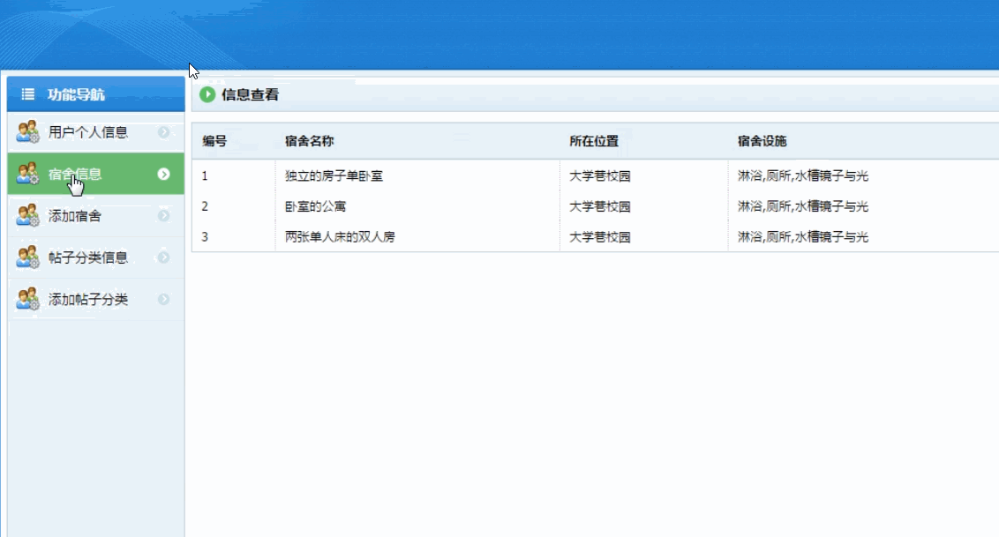
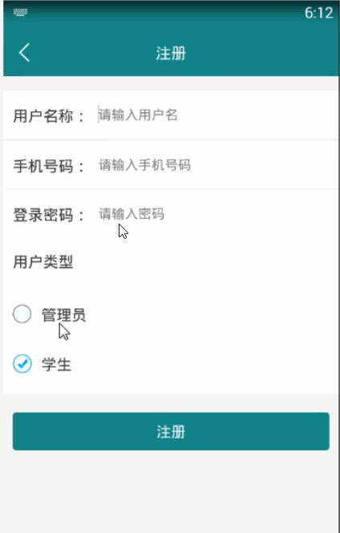

> **博主介绍：**
> 本人专注于Android/java/数据库/微信小程序技术领域的开发，以及有好几年的计算机毕业设计方面的实战开发经验和技术积累；尤其是在安卓（Android）的app的开发和微信小程序的开发，很是熟悉和了解；本人也是多年的Android开发人员；希望我发布的此篇文件可以帮助到您；
>
> 🍅 **文章末尾获取源码下载方式** 🍅

#### 功能演示

##### 1：后台演示

##### 2：客户端演示

#### 一、项目介绍

> 1.  
>  登录注册功能（要求使用邮箱验证（邮箱发送验证码））验证码之类的  
>  自动识别登录的账号为用户账号还是管理员账号  
>  普通用户进入界面（界面拥有3项功能 可以像微信一样在正下方分开设置button）
>
> 管理宿舍功能  
>  2.1（普通用户）  
>  功能1，学生可以向学校申请宿舍，更换宿舍，退宿3种要求  
>  首先从数据库里读出该学生的宿舍信息显示在页面上（姓名 学号 校区 宿舍楼名称 FLAT number room number）  
>  没有则显示无  
>  在信息下面有3个button分别为 申请宿舍 更换宿舍 退宿  
>  
>  点击申请宿舍 为显示https://www.herts.ac.uk/life/student-accommodation  
>  这个网址一样的宿舍内容一样，分别可以点击，点击进去显示是否申请，如申请则发送信息到管理者账户此申请内容  
>  
>  更换宿舍与退宿如上  
>  并可以在基础页面下面有一个框显示当前处理的申请的结果（等待/批准/拒绝）  
>  2.2（管理者用户）  
>  功能1，显示管理者信息，名称 职工号  
>  显示出当前需要处理普通用户的内容（并可以点击更多进行操作） 批准 /拒绝  
>  管理者可以一些button 查看当前学校住宿情况  
>  管理者可以查看当前学校所有学生的住宿情况并管理学生的住宿情况（增删改查）  
>  并且可以增加 宿舍楼和flat以及room
>
> 贴吧功能  
>  3.1 类似一个小贴吧有着4-5个分类（数据库可以命名a，b，c，d），学生可以进行发帖，只能对自己的帖子进行增删改查  
>  首先 先显示出所有的帖子像贴吧一样的那种
>
> 3.2 管理员可以对所有的帖子增删改查  
>  所有的帖子存进数据库
>
> 闲鱼功能  
>  4.1 学生可以在上面出售物品，像淘宝一样，但是不需要搜寻，从数据库显示出所有的物品（图片，名称，价格，详情）  
>  在该页面最上方显示 我的购买，我的出售，我要出售 3个button 以及 （电子产品，书籍，家具，厨具，其他）这5个方向的出售物品分类  
>  
>  其每个分类下方显示出所有的物品  
>  单击可以进行购买，当单击进行购买的时候显示出联系人的具体方式，并把该物品下架，并添加到购买者的 我的购买（数据库）中以及出售者  
>  的我的出售（数据库中）

#### 二、运行环境

> 1：客户端使用Android stuido进行开发；  
>  2：服务端后台使用Myeclipse2014进行开发；  
>  3：mysql数据库进行数据存储；  
>  4：需要jdk1.7以上  
>  5：使用雷电模拟器或者Androidstuio自带的模拟器进行运行

#### 三、使用技术

> **总体设计逻辑和思路：**  
>  1：先设计数据库表文件  
>  2：写服务端jsp页面以及写api接口给客户端提供数据  
>  3：完成后台服务端的数据交互，也就是jsp页面数据的存储和显示  
>  4：进行客户端页面的开发；  
>  5：进行客户端对api接口的调用，也就是获取数据库的数据以及在客户端进行显示
>
> **移动端：**  
>  1：使用android原生控件以及xml布局文件来完成界面的显示  
>  2：使用java代码完成功能的数据和逻辑交互  
>  3：使用http网络请求完成数据的请求；  
>  **4：使用json数据解析完成客户端数据的回调和显示**
>
> **服务端后台：**  
>  1：使用mysql完成数据的存储  
>  2：使用jdbc完成数据库和代码的逻辑交互  
>  3：使用jsp完成网页数据的显示  
>  4：使用java代码完成api接口的编写以及以及数据的回调

#### 四、数据库设计

> /*  
>  Navicat MySQL Data Transfer
>
> Source Server : mydata  
>  Source Server Version : 50537  
>  Source Host : localhost:3306  
>  Source Database : dormitorydb
>
> Target Server Type : MYSQL  
>  Target Server Version : 50537  
>  File Encoding : 65001
>
> Date: 2019-02-15 18:17:05  
>  */
>
> SET FOREIGN_KEY_CHECKS=0;
>
> \-- ----------------------------  
>  \-- Table structure for admintb  
>  \-- ----------------------------  
>  DROP TABLE IF EXISTS `admintb`;  
>  CREATE TABLE `admintb` (  
>  `adminId` int(50) NOT NULL AUTO_INCREMENT,  
>  `adminName` varchar(255) DEFAULT NULL,  
>  `adminMoney` varchar(255) DEFAULT NULL,  
>  `adminMessage` varchar(255) DEFAULT NULL,  
>  `adminUserId` varchar(100) DEFAULT NULL,  
>  `adminUserName` varchar(255) DEFAULT NULL,  
>  `adminUserPhone` varchar(255) DEFAULT NULL,  
>  `adminType` varchar(255) DEFAULT NULL,  
>  `adminCreatime` varchar(100) DEFAULT NULL,  
>  PRIMARY KEY (`adminId`)  
>  ) ENGINE=InnoDB AUTO_INCREMENT=25 DEFAULT CHARSET=utf8;
>
> \-- ----------------------------  
>  \-- Records of admintb  
>  \-- ----------------------------  
>  INSERT INTO `admintb` VALUES ('10', '帮我取个快递', '10',
> '东西在学校门后，是经度快递，快递员电话是15249248888，到了可以给他打电话！', '106', '小丸子', '15249249696',
> '1', '2019-01-22 11:39');  
>  INSERT INTO `admintb` VALUES ('12', '计算机基础', null,
> '通常是按计算机中硬件所采用的电子逻辑器件划分成电子管、晶体管、中小规模集成电路、大规模超大规模集成电路四个阶段；', '106', '小丸子',
> null, '2', '2019-01-22 11:39');  
>  INSERT INTO `admintb` VALUES ('13', 'java', null, '我的课程 笔记信息', '106',
> '小丸子', null, '2', '2019-01-22 11:39');  
>  INSERT INTO `admintb` VALUES ('16', '帮我取个快递', '6',
> '东西在学校门后，是经度快递，快递员电话是15249248888，到了可以给他打电话！', '106', '小丸子', '15249249696',
> '1', '2019-01-22 17:44');  
>  INSERT INTO `admintb` VALUES ('17', '帮我取个快递', '5',
> '东西在学校门后，是经度快递，快递员电话是15249248888，到了可以给他打电话！', '106', '小丸子', '15249249696',
> '1', '2019-01-22 17:51');  
>  INSERT INTO `admintb` VALUES ('18', '英语学习班', '6',
> '计算机是一种能够输入信息，存储信息，并按照人们意志（这些意志就是顺序）对信息进行加工处理，最后输出人们所需要信息的自动执行的电子装置。',
> '106', '小丸子', '15249249696', '3', '2019-01-23 09:58');  
>  INSERT INTO `admintb` VALUES ('19', '计算机基础', null,
> '通常是按计算机中硬件所采用的电子逻辑器件划分成电子管、晶体管、中小规模集成电路、大规模超大规模集成电路四个阶段；', '99', '小明',
> null, '2', '2019-01-23 10:26');  
>  INSERT INTO `admintb` VALUES ('20', '送东西', '10',
> '东西在学校门后，是经度快递，快递员电话是15249248888，到了可以给他打电话！', '106', '小丸子', '15249249696',
> '1', '2019-01-23 11:13');  
>  INSERT INTO `admintb` VALUES ('22', '买东西', '50',
> '帮我买一个东西东西在学校门后，是经度快递，快递员电话是15249248888，到了可以给他打电话！', '106', '小丸子',
> '15249249696', '1', '2019-01-23 11:18');  
>  INSERT INTO `admintb` VALUES ('23', '计算机基础android', null,
> '通常是按计算机中硬件所采用的电子逻辑器件划分成电子管、晶体管、中小规模集成电路、大规模超大规模集成电路四个阶段；', '106', '小丸子',
> null, '2', '2019-01-23 11:19');  
>  INSERT INTO `admintb` VALUES ('24', '数学学习班', '10',
> '计算机是一种能够输入信息，存储信息，并按照人们意志（这些意志就是顺序）对信息进行加工处理，最后输出人们所需要信息的自动执行的电子装置。',
> '106', '小丸子', '15249249696', '3', '2019-01-23 11:19');
>
> \-- ----------------------------  
>  \-- Table structure for applytb  
>  \-- ----------------------------  
>  DROP TABLE IF EXISTS `applytb`;  
>  CREATE TABLE `applytb` (  
>  `applyId` int(50) NOT NULL AUTO_INCREMENT,  
>  `applyMessageId` varchar(11) DEFAULT NULL,  
>  `applyMessageName` varchar(255) DEFAULT NULL,  
>  `applyUserId` varchar(11) DEFAULT NULL,  
>  `applyUserName` varchar(255) DEFAULT NULL,  
>  `applyTime` varchar(100) DEFAULT NULL,  
>  `applyState` varchar(255) DEFAULT NULL,  
>  PRIMARY KEY (`applyId`)  
>  ) ENGINE=InnoDB AUTO_INCREMENT=4 DEFAULT CHARSET=utf8;
>
> \-- ----------------------------  
>  \-- Records of applytb  
>  \-- ----------------------------  
>  INSERT INTO `applytb` VALUES ('3', '5', '独立的房子单卧室', '106', '小丸子',
> '2019-02-15 18:14', '2');
>
> \-- ----------------------------  
>  \-- Table structure for dormitorytb  
>  \-- ----------------------------  
>  DROP TABLE IF EXISTS `dormitorytb`;  
>  CREATE TABLE `dormitorytb` (  
>  `dormitoryId` int(11) NOT NULL AUTO_INCREMENT,  
>  `dormitoryName` varchar(255) DEFAULT NULL,  
>  `dormitoryAddress` varchar(255) DEFAULT NULL,  
>  `dormitoryFacilities` varchar(255) DEFAULT NULL,  
>  `dormitoryMessage` varchar(1500) DEFAULT NULL,  
>  `dormitoryTime` varchar(100) DEFAULT NULL,  
>  `dormitoryImg` varchar(255) DEFAULT NULL,  
>  PRIMARY KEY (`dormitoryId`)  
>  ) ENGINE=InnoDB AUTO_INCREMENT=6 DEFAULT CHARSET=utf8;
>
> \-- ----------------------------  
>  \-- Records of dormitorytb  
>  \-- ----------------------------  
>  INSERT INTO `dormitorytb` VALUES ('3', '独立的房子单卧室', '大学巷校园', '淋浴,厕所,水槽镜子与光',
> '欢迎来到住宿赫特福德大学。 当你收到一个提供一个学习的地方,你可以申请住宿。欢迎来到住宿赫特福德大学。
> 当你收到一个提供一个学习的地方,你可以申请住宿。', '2019-02-13 16:35:15', 'sushe_7.jpg');  
>  INSERT INTO `dormitorytb` VALUES ('4', '卧室的公寓', '大学巷校园', '淋浴,厕所,水槽镜子与光',
> '酒店式服务公寓的目标市场主要以在华从事商务活动，较长期居住的外国人为主，虽然没有特定的标准，较长期居住的定义一般在4天或以上。这个市场的主要客人有长期在华的商务人士，外企的经营管理者以及正在放长假的家庭来华旅游等。',
> '2019-02-13 16:37:41', 'sushe_8.jpeg');  
>  INSERT INTO `dormitorytb` VALUES ('5', '两张单人床的双人房', '大学巷校园',
> '淋浴,厕所,水槽镜子与光',
> '酒店式公寓吸引懒人和忙人。在酒店式公寓既能享受酒店提供的殷勤服务，又能享受居家的快乐，住户不仅有独立的卧室、客厅、卫浴间、衣帽间等等，还可以在厨房里自己烹饪美味的家肴。',
> '2019-02-13 16:38:28', 'sushe_2.jpg');
>
> \-- ----------------------------  
>  \-- Table structure for ordermsg  
>  \-- ----------------------------  
>  DROP TABLE IF EXISTS `ordermsg`;  
>  CREATE TABLE `ordermsg` (  
>  `orderId` int(50) NOT NULL AUTO_INCREMENT,  
>  `orderMessageId` varchar(50) DEFAULT NULL,  
>  `orderMessageName` varchar(255) DEFAULT NULL,  
>  `orderMessageMoney` varchar(255) DEFAULT NULL,  
>  `orderUserId` varchar(100) DEFAULT NULL,  
>  `orderUserName` varchar(255) DEFAULT NULL,  
>  `orderTime` varchar(100) DEFAULT NULL,  
>  PRIMARY KEY (`orderId`)  
>  ) ENGINE=InnoDB AUTO_INCREMENT=9 DEFAULT CHARSET=utf8;
>
> \-- ----------------------------  
>  \-- Records of ordermsg  
>  \-- ----------------------------  
>  INSERT INTO `ordermsg` VALUES ('8', '9', 'Java开发基础', '60', '106', '小丸子',
> '2019-02-15 18:13');
>
> \-- ----------------------------  
>  \-- Table structure for qiangdantb  
>  \-- ----------------------------  
>  DROP TABLE IF EXISTS `qiangdantb`;  
>  CREATE TABLE `qiangdantb` (  
>  `qiangdanId` int(50) NOT NULL AUTO_INCREMENT,  
>  `qiangdanUserId` varchar(100) DEFAULT NULL,  
>  `qiangdanMessgaeId` varchar(100) DEFAULT NULL,  
>  `qiangdanTime` varchar(100) DEFAULT NULL,  
>  PRIMARY KEY (`qiangdanId`)  
>  ) ENGINE=InnoDB AUTO_INCREMENT=5 DEFAULT CHARSET=utf8;
>
> \-- ----------------------------  
>  \-- Records of qiangdantb  
>  \-- ----------------------------  
>  INSERT INTO `qiangdantb` VALUES ('1', '106', '10', '2019-01-22 17:41');  
>  INSERT INTO `qiangdantb` VALUES ('2', '106', '16', '2019-01-22 17:45');  
>  INSERT INTO `qiangdantb` VALUES ('3', '106', '10', '2019-01-22 17:46');  
>  INSERT INTO `qiangdantb` VALUES ('4', '99', '22', '2019-01-23 11:20');
>
> \-- ----------------------------  
>  \-- Table structure for shoptb  
>  \-- ----------------------------  
>  DROP TABLE IF EXISTS `shoptb`;  
>  CREATE TABLE `shoptb` (  
>  `shopId` int(50) NOT NULL AUTO_INCREMENT,  
>  `shopName` varchar(255) DEFAULT NULL,  
>  `shopMoney` varchar(255) DEFAULT NULL,  
>  `shopType` varchar(255) DEFAULT NULL,  
>  `shopMessage` varchar(1500) DEFAULT NULL,  
>  `shopImg` varchar(1500) DEFAULT NULL,  
>  `shopUserId` varchar(100) DEFAULT NULL,  
>  `shopUserName` varchar(255) DEFAULT NULL,  
>  `shopTime` varchar(100) DEFAULT NULL,  
>  PRIMARY KEY (`shopId`)  
>  ) ENGINE=InnoDB AUTO_INCREMENT=11 DEFAULT CHARSET=utf8;
>
> \-- ----------------------------  
>  \-- Records of shoptb  
>  \-- ----------------------------  
>  INSERT INTO `shoptb` VALUES ('8', 'NIKE球鞋', '500', '其他',
> '篮球鞋即SNEAKER，同时也将球鞋爱好者融入到SNEAKER一词中，使得SNEAKER有更宽泛的定义。', 'timg-2.jpeg',
> '106', '小丸子', '2019-02-13 16:46');  
>  INSERT INTO `shoptb` VALUES ('9', 'Java开发基础', '60', '书籍',
> '一般酒店式公寓的公共设施均类似酒店，所以居住者的身份和气派也可彰显。', 'timg-5.jpeg', '106', '小丸子',
> '2019-02-13 16:46');  
>  INSERT INTO `shoptb` VALUES ('10', 'NIKE球鞋', '60', '球鞋', '篮球鞋即SNEAKER',
> 'timg-4.jpeg', '106', '小丸子', '2019-02-15 18:13');
>
> \-- ----------------------------  
>  \-- Table structure for studypersontb  
>  \-- ----------------------------  
>  DROP TABLE IF EXISTS `studypersontb`;  
>  CREATE TABLE `studypersontb` (  
>  `studypersonId` int(50) NOT NULL AUTO_INCREMENT,  
>  `studypersonUserId` varchar(11) DEFAULT NULL,  
>  `studypersonMessageId` varchar(11) DEFAULT NULL,  
>  `studypersonTime` varchar(100) DEFAULT NULL,  
>  PRIMARY KEY (`studypersonId`)  
>  ) ENGINE=InnoDB AUTO_INCREMENT=6 DEFAULT CHARSET=utf8;
>
> \-- ----------------------------  
>  \-- Records of studypersontb  
>  \-- ----------------------------  
>  INSERT INTO `studypersontb` VALUES ('1', '106', '18', '2019-01-23 10:06');  
>  INSERT INTO `studypersontb` VALUES ('2', '99', '18', '2019-01-23 10:24');  
>  INSERT INTO `studypersontb` VALUES ('4', '106', '24', '2019-01-23 11:19');  
>  INSERT INTO `studypersontb` VALUES ('5', '99', '24', '2019-01-23 11:20');
>
> \-- ----------------------------  
>  \-- Table structure for topictb  
>  \-- ----------------------------  
>  DROP TABLE IF EXISTS `topictb`;  
>  CREATE TABLE `topictb` (  
>  `topicId` int(11) NOT NULL AUTO_INCREMENT,  
>  `topicTypeId` varchar(11) DEFAULT NULL,  
>  `topicTypeName` varchar(255) DEFAULT NULL,  
>  `topicMessage` varchar(1500) DEFAULT NULL,  
>  `topicUserId` varchar(11) DEFAULT NULL,  
>  `topicUserName` varchar(255) DEFAULT NULL,  
>  `topicTime` varchar(100) DEFAULT NULL,  
>  PRIMARY KEY (`topicId`)  
>  ) ENGINE=InnoDB AUTO_INCREMENT=7 DEFAULT CHARSET=utf8;
>
> \-- ----------------------------  
>  \-- Records of topictb  
>  \-- ----------------------------  
>  INSERT INTO `topictb` VALUES ('3', '26', '文学', '大家都看过流浪地球了吗？看后感觉怎么样呢！',
> '106', '小丸子', '2019-02-13 17:35');  
>  INSERT INTO `topictb` VALUES ('5', '29', '音乐', '周杰伦的歌曲很好听', '110', '呆呆',
> '2019-02-13 17:40');
>
> \-- ----------------------------  
>  \-- Table structure for typetb  
>  \-- ----------------------------  
>  DROP TABLE IF EXISTS `typetb`;  
>  CREATE TABLE `typetb` (  
>  `typeId` int(50) NOT NULL AUTO_INCREMENT,  
>  `typeName` varchar(255) DEFAULT NULL,  
>  `typeTime` varchar(100) DEFAULT NULL,  
>  PRIMARY KEY (`typeId`)  
>  ) ENGINE=InnoDB AUTO_INCREMENT=31 DEFAULT CHARSET=utf8;
>
> \-- ----------------------------  
>  \-- Records of typetb  
>  \-- ----------------------------  
>  INSERT INTO `typetb` VALUES ('26', '文学', '2019-02-13 17:05');  
>  INSERT INTO `typetb` VALUES ('27', '摄影', '2019-02-13 17:05');  
>  INSERT INTO `typetb` VALUES ('28', '美食', '2019-02-13 17:05');  
>  INSERT INTO `typetb` VALUES ('29', '音乐', '2019-02-13 17:05');  
>  INSERT INTO `typetb` VALUES ('30', '旅游', '2019-02-13 17:05');
>
> \-- ----------------------------  
>  \-- Table structure for user  
>  \-- ----------------------------  
>  DROP TABLE IF EXISTS `user`;  
>  CREATE TABLE `user` (  
>  `userId` int(255) NOT NULL AUTO_INCREMENT,  
>  `userName` varchar(200) CHARACTER SET utf8 NOT NULL,  
>  `userPhone` varchar(100) CHARACTER SET utf8 NOT NULL,  
>  `userPswd` varchar(200) CHARACTER SET utf8 NOT NULL,  
>  `userTime` varchar(300) CHARACTER SET utf8 NOT NULL,  
>  `userType` varchar(255) DEFAULT NULL,  
>  `userNo` varchar(100) DEFAULT NULL,  
>  PRIMARY KEY (`userId`)  
>  ) ENGINE=InnoDB AUTO_INCREMENT=114 DEFAULT CHARSET=latin1;
>
> \-- ----------------------------  
>  \-- Records of user  
>  \-- ----------------------------  
>  INSERT INTO `user` VALUES ('99', '小明', '15249241234', '123456', '2019-01-22
> 16:15', '1', 'NO20190214111540');  
>  INSERT INTO `user` VALUES ('106', '小丸子', '15249249696', '123456',
> '2019-01-22 17:03', '2', 'NO20190214111542');  
>  INSERT INTO `user` VALUES ('113', 'daidai', '15249245656', '123456',
> '2019-02-15 16:01', '2', 'NO20190215160138');  
>

#### 五、部分代码

##### 1：注册源码

>  
>  public class RegisterActivity extends BaseActivity {  
>  // 标题  
>  private TextView mTvTitle;  
>  // 返回  
>  private ImageView mIvBack;  
>  private Button mSubmit;
>
> private EditText metName;  
>  private EditText metPhone;  
>  private EditText metPswd;
>
> private int choiceType = 1;  
>  private RadioGroup mrgChoice;  
>  private RadioButton mrb1 = null;  
>  private RadioButton mrb2 = null;
>
> @Override  
>  protected void onCreate(Bundle savedInstanceState) {  
>  super.onCreate(savedInstanceState);  
>  setContentView(R.layout.activity_creat_register);  
>  initWidget();  
>  initData();  
>  }
>
> @Override  
>  public void onClick(View v) {  
>  switch (v.getId()) {  
>  case R.id.mIvBack:  
>  finish();  
>  break;  
>  case R.id.mSubmit:  
>  createTopicPost(true);  
>  break;  
>  }  
>  }
>
> @Override  
>  public void initWidget() {  
>  mrgChoice = (RadioGroup) findViewById(R.id.mrgChoice);
>
> mrb1 = (RadioButton) findViewById(R.id.mrb1);  
>  mrb2 = (RadioButton) findViewById(R.id.mrb2);  
>  metName = (EditText) findViewById(R.id.metName);  
>  metPhone = (EditText) findViewById(R.id.metPhone);  
>  metPswd = (EditText) findViewById(R.id.metPswd);
>
> mSubmit = (Button) findViewById(R.id.mSubmit);  
>  mIvBack = (ImageView) findViewById(R.id.mIvBack);  
>  mTvTitle = (TextView) findViewById(R.id.mTvTitle);  
>  mTvTitle.setText("注册");  
>  mIvBack.setVisibility(View.VISIBLE);  
>  mIvBack.setOnClickListener(this);  
>  mSubmit.setOnClickListener(this);
>
> }
>
> @Override  
>  public void initData() {  
>  mrgChoice.setOnCheckedChangeListener(new
> RadioGroup.OnCheckedChangeListener() {
>
> @Override  
>  public void onCheckedChanged(RadioGroup group, int checkedId) {  
>  if (checkedId == mrb1.getId()) {  
>  choiceType = 1;  
>  } else if (checkedId == mrb2.getId()) {  
>  choiceType = 2;  
>  }  
>  }  
>  });  
>  }
>
>  
>  private void createTopicPost(boolean isShow) {
>
> AjaxParams params = new AjaxParams();  
>  params.put("action_flag", "addUser");  
>  params.put("uname", metName.getText().toString());  
>  params.put("uphone", metPhone.getText().toString());  
>  params.put("upswd", metPswd.getText().toString());  
>  params.put("userType", choiceType+"");  
>  httpPost(Consts.URL + Consts.APP.RegisterAction, params,
> Consts.actionId.resultCode, isShow, "正在注册...");  
>  }
>
> @Override  
>  protected void callBackSuccess(ResponseEntry entry, int actionId) {  
>  super.callBackSuccess(entry, actionId);  
>  CustomToast.showToast(this,entry.getRepMsg());  
>  new Handler().postDelayed(new Runnable() {  
>  @Override  
>  public void run() {  
>  finish();  
>  }  
>  }, 2000);  
>  }
>
> @Override  
>  protected void callBackAllFailure(String strMsg, int actionId) {  
>  super.callBackAllFailure(strMsg, actionId);  
>  CustomToast.showToast(this,strMsg);  
>  }
>
>  
>  }  
>

2：二手物品详情

>  
>  public class ShopMessageActivity extends BaseActivity {  
>  ShopBean intersetModel;  
>  // title  
>  private TextView mTvTitle;  
>  // 返回  
>  private ImageView mIvBack;
>
> private TextView mtvMessagetitle;  
>  private TextView mtvShopPrice;  
>  private TextView mtvType;  
>  private TextView mtvcontent;  
>  private ImageView guide_image;  
>  private TextView mtvShopPriceTip;  
>  private Button mbtnPay;
>
>  
>  private ScrollView mslView;  
>  private TextView mIvStu;
>
> @Override  
>  protected void onCreate(Bundle savedInstanceState) {  
>  super.onCreate(savedInstanceState);  
>  setContentView(R.layout.activity_shopmessage);  
>  initWidget();  
>  initData();  
>  }
>
> @Override  
>  public void initWidget() {
>
> mtvShopPriceTip = (TextView)findViewById(R.id.mtvShopPriceTip);  
>  mIvStu = (TextView)findViewById(R.id.mIvStu);  
>  mslView = (ScrollView) findViewById(R.id.mslView);  
>  mbtnPay = (Button) findViewById(R.id.mbtnPay);  
>  mbtnPay.setOnClickListener(this);  
>  mtvShopPrice = (TextView) findViewById(R.id.mtvShopPrice);
>
> mtvShopPrice.setOnClickListener(this);  
>  guide_image = (ImageView) findViewById(R.id.guide_image);
>
>  
>  mtvType = (TextView) findViewById(R.id.mtvType);
>
> mtvMessagetitle = (TextView) findViewById(R.id.mtvMessagetitle);  
>  mtvcontent = (TextView) findViewById(R.id.mtvcontent);
>
> mIvBack = (ImageView) findViewById(R.id.mIvBack);  
>  mTvTitle = (TextView) findViewById(R.id.mTvTitle);  
>  mTvTitle.setText("商品详情");  
>  mIvBack.setVisibility(View.VISIBLE);  
>  mIvBack.setOnClickListener(this);
>
> mIvStu.setVisibility(View.GONE);  
>  mIvStu.setOnClickListener(this);
>
> }
>
> @Override  
>  public void onClick(View v) {
>
> switch (v.getId()) {  
>  case R.id.mIvBack:  
>  ShopMessageActivity.this.finish();  
>  break;
>
> case R.id.mbtnPay:  
>  Intent intent = new Intent(this, PayMessageActivity.class);  
>  intent.putExtra("msg",intersetModel);  
>  startActivity(intent);  
>  break;
>
> }  
>  }
>
> @SuppressLint("SetTextI18n")  
>  @Override  
>  public void initData() {
>
> intersetModel = (ShopBean) this.getIntent().getSerializableExtra("msg");  
>  mtvMessagetitle.setText(intersetModel.getShopName());  
>  mtvShopPrice.setText("价位：" + intersetModel.getShopMoney()+"元");  
>  mtvType.setText("类型：" + intersetModel.getShopType());  
>  mtvcontent.setText(" "+intersetModel.getShopMessage());  
>  mtvShopPriceTip.setText("价位：" + intersetModel.getShopMoney()+"元/件");
>
> if (!TextUtils.isEmpty(intersetModel.getShopImg())) {  
>  Picasso.with(this).load(Consts.URL_IMAGE +
> intersetModel.getShopImg()).placeholder(R.drawable.default_drawable_show_pictrue)  
>  .into(guide_image);  
>  }
>
> mbtnPay.setText("确定购买");
>
> }
>
> }  
>

#### 六、浏览更多Android毕业设计

[毕业设计-基于android的租房信息发布平台的APP_信息发布app源码_Android毕业设计源码的博客-
CSDN博客](https://blog.csdn.net/u014388322/article/details/100656450?spm=1001.2014.3001.5502
"毕业设计-基于android的租房信息发布平台的APP_信息发布app源码_Android毕业设计源码的博客-CSDN博客")

[毕业设计-基于android选课系统的设计与实现_android学生选课系统_Android毕业设计源码的博客-
CSDN博客](https://blog.csdn.net/u014388322/article/details/100656536?spm=1001.2014.3001.5502
"毕业设计-基于android选课系统的设计与实现_android学生选课系统_Android毕业设计源码的博客-CSDN博客")

[毕业设计之校园一卡通管理系统的设计与实现_一卡通管理系统实现_Android毕业设计源码的博客-
CSDN博客](https://blog.csdn.net/u014388322/article/details/126048550?spm=1001.2014.3001.5502
"毕业设计之校园一卡通管理系统的设计与实现_一卡通管理系统实现_Android毕业设计源码的博客-CSDN博客")

[基于Android的校园二手闲置物品交易系统设计与实现_基于android的二手交易平台_Android毕业设计源码的博客-
CSDN博客](https://blog.csdn.net/u014388322/article/details/128232475?spm=1001.2014.3001.5502
"基于Android的校园二手闲置物品交易系统设计与实现_基于android的二手交易平台_Android毕业设计源码的博客-CSDN博客")

[基于androidstudio校园快递APP系统的设计与实现_android studio论文_Android毕业设计源码的博客-
CSDN博客](https://blog.csdn.net/u014388322/article/details/128545390?spm=1001.2014.3001.5502
"基于androidstudio校园快递APP系统的设计与实现_android studio论文_Android毕业设计源码的博客-CSDN博客")

[基于android的商城购物定制APP_安卓开发购物app_Android毕业设计源码的博客-
CSDN博客](https://blog.csdn.net/u014388322/article/details/128746697?spm=1001.2014.3001.5502
"基于android的商城购物定制APP_安卓开发购物app_Android毕业设计源码的博客-CSDN博客")

> 更多毕业设计可以浏览我的个人主页哦！

#### 七、源码下载

> <https://download.csdn.net/download/u014388322/88175073>​

