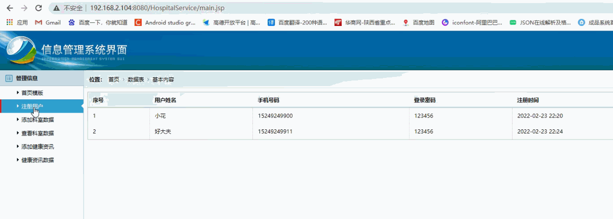
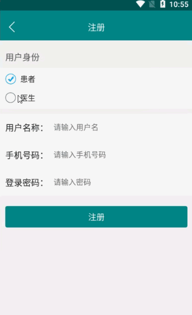

> **博主介绍：**
> 本人专注于Android/java/数据库/微信小程序技术领域的开发，以及有好几年的计算机毕业设计方面的实战开发经验和技术积累；尤其是在安卓（Android）的app的开发和微信小程序的开发，很是熟悉和了解；本人也是多年的Android开发人员；希望我发布的此篇文件可以帮助到您；
>
> 🍅 **文章末尾获取源码下载方式** 🍅

#### 功能演示

**详情演示视频请文字末尾公众号咨询，我会发给您；**

#### 1：后台演示

#### 2：客户端演示

#### 一、项目介绍

> 患者客户端：
>
> 1：注册登录：使用分配的账号进行登录；
>
> 2：科室医生：用户可以根据科室查看医生信息；
>
> 3：咨询通信：用户可以对自己咨询的医生进行点对点聊天咨询；
>
> 4：病历信息：通过医生的咨询之后医生会给自己填写病历信息，用户自己可以查看
>
> 5：健康资讯：用户可以查看健康养生方面的资讯信息
>
> 6：个人信息：查看自己的个人信息以及对密码进行修改
>
> 医生客户端：
>
> 1：注册登录：使用分配的账号进行登录；
>
> 2：咨询患者：医生可以查看患者对自己的咨询信息；
>
> 3：病历信息：医生可以对咨询的患者生成病历档案信息
>
> 5：健康资讯：用户可以查看健康养生方面的资讯信息
>
> 6：个人信息：查看自己的个人信息以及对密码进行修改
>
> 后台管理员：
>
> 1：用户信息：可以查看注册的用户信息
>
> 2：科室信息：添加和浏览科室信息
>
> 3：健康资讯：添加和浏览健康资讯

#### 二、运行环境

> 1：客户端使用Android stuido进行开发；  
>  2：服务端后台使用Myeclipse2014进行开发；  
>  3：mysql数据库进行数据存储；  
>  4：需要jdk1.7以上  
>  5：使用雷电模拟器或者Androidstuio自带的模拟器进行运行

#### 三、使用技术

> **总体设计逻辑和思路：**  
>  1：先设计数据库表文件  
>  2：写服务端jsp页面以及写api接口给客户端提供数据  
>  3：完成后台服务端的数据交互，也就是jsp页面数据的存储和显示  
>  4：进行客户端页面的开发；  
>  5：进行客户端对api接口的调用，也就是获取数据库的数据以及在客户端进行显示
>
> **移动端：**  
>  1：使用android原生控件以及xml布局文件来完成界面的显示  
>  2：使用java代码完成功能的数据和逻辑交互  
>  3：使用http网络请求完成数据的请求；  
>  **4：使用json数据解析完成客户端数据的回调和显示**
>
> **服务端后台：**  
>  1：使用mysql完成数据的存储  
>  2：使用jdbc完成数据库和代码的逻辑交互  
>  3：使用jsp完成网页数据的显示  
>  4：使用java代码完成api接口的编写以及以及数据的回调

#### 四、数据库设计

    
    
    /*
    Navicat MySQL Data Transfer
    
    Source Server         : mydb
    Source Server Version : 50528
    Source Host           : localhost:3306
    Source Database       : familydoctordb
    
    Target Server Type    : MYSQL
    Target Server Version : 50528
    File Encoding         : 65001
    
    Date: 2022-02-23 23:02:29
    */
    
    SET FOREIGN_KEY_CHECKS=0;
    
    -- ----------------------------
    -- Table structure for applymsg
    -- ----------------------------
    DROP TABLE IF EXISTS `applymsg`;
    CREATE TABLE `applymsg` (
      `applyId` int(50) NOT NULL AUTO_INCREMENT,
      `applyUserId` varchar(11) DEFAULT NULL,
      `applyUserName` varchar(255) DEFAULT NULL,
      `applyMessageId` varchar(11) DEFAULT NULL,
      `applyMessageName` varchar(255) DEFAULT NULL,
      `applyTime` varchar(100) DEFAULT NULL,
      `applyState` varchar(255) DEFAULT NULL,
      `applyDeptId` int(11) DEFAULT NULL,
      `applyNotice` varchar(1000) DEFAULT NULL,
      PRIMARY KEY (`applyId`)
    ) ENGINE=InnoDB AUTO_INCREMENT=39 DEFAULT CHARSET=utf8;
    
    -- ----------------------------
    -- Records of applymsg
    -- ----------------------------
    INSERT INTO `applymsg` VALUES ('36', '82', '患者姓名：小花-患者手机号码：15249249900', '70', '小明', '2022-02-23 22:26', '1', '3', null);
    INSERT INTO `applymsg` VALUES ('37', '82', '患者姓名：小花-患者手机号码：15249249900', '83', '好大夫', '2022-02-23 22:27', '2', '3', '没有在医疗机构建立门（急）诊病历档案的，患者就诊的门（急）诊病历等由患者自行保管，患者有责任妥善保存，使其保持原貌及完整性，不得在病历上涂改、添加等。如果患者丢失自行保管的病历资料');
    INSERT INTO `applymsg` VALUES ('38', '85', '患者姓名：患者表明-患者手机号码：15249249936', '84', '王医生', '2022-02-24 22:57', '2', '3', '好好休息没有在医疗机构建立门（急）诊病历档案的，患者就诊的门（急）诊病历等由患者自行保管，患者有责任妥善保存，使其保持原貌及完整性，不得在病历上涂改、添加等。如果患者丢失自行保管的病历资料');
    
    -- ----------------------------
    -- Table structure for departmentmsg
    -- ----------------------------
    DROP TABLE IF EXISTS `departmentmsg`;
    CREATE TABLE `departmentmsg` (
      `departmentId` int(50) NOT NULL AUTO_INCREMENT,
      `departmentName` varchar(255) DEFAULT NULL,
      `departmentTime` varchar(100) DEFAULT NULL,
      PRIMARY KEY (`departmentId`)
    ) ENGINE=InnoDB AUTO_INCREMENT=9 DEFAULT CHARSET=utf8;
    
    -- ----------------------------
    -- Records of departmentmsg
    -- ----------------------------
    INSERT INTO `departmentmsg` VALUES ('3', '外科', '2020-03-13 16:42');
    INSERT INTO `departmentmsg` VALUES ('4', '内科', '2020-03-13 16:42');
    INSERT INTO `departmentmsg` VALUES ('5', '眼科', '2020-03-13 16:42');
    INSERT INTO `departmentmsg` VALUES ('6', '儿科', '2020-03-13 16:42');
    INSERT INTO `departmentmsg` VALUES ('7', '耳鼻科', '2020-03-13 16:42');
    INSERT INTO `departmentmsg` VALUES ('8', '妇产科', '2020-03-13 16:42');
    
    -- ----------------------------
    -- Table structure for doctormsg
    -- ----------------------------
    DROP TABLE IF EXISTS `doctormsg`;
    CREATE TABLE `doctormsg` (
      `doctorId` int(11) NOT NULL AUTO_INCREMENT,
      `departmentName` varchar(255) DEFAULT NULL,
      `doctorName` varchar(255) DEFAULT NULL,
      `doctorAge` varchar(255) DEFAULT NULL,
      `doctorPhone` varchar(255) DEFAULT NULL,
      `doctorSex` varchar(255) DEFAULT NULL,
      `doctorYear` varchar(255) DEFAULT NULL,
      `doctorMessage` varchar(1500) DEFAULT NULL,
      `departmentId` varchar(100) DEFAULT NULL,
      `doctorTime` varchar(255) DEFAULT NULL,
      `doctorPswd` varchar(255) DEFAULT NULL,
      `doctorNumber` varchar(100) DEFAULT NULL,
      PRIMARY KEY (`doctorId`)
    ) ENGINE=InnoDB AUTO_INCREMENT=15 DEFAULT CHARSET=utf8;
    
    -- ----------------------------
    -- Records of doctormsg
    -- ----------------------------
    INSERT INTO `doctormsg` VALUES ('3', '外科', '小明', '45', '15249243002', '男', '5年', '三级教授，主任医师、博士生导师，曾任西京医院泌尿外科主任14年，培养研究生数十名，获得多项国家自然基金，出版了多部著作，发表论文数百篇。多次在国外进行学术交流。于1992年在美国休斯顿肿瘤中心学习工作，重点研究前列腺癌的诊治，取得很大进展。 ', '3', 'doctor_8.jpg', '123456', '6');
    INSERT INTO `doctormsg` VALUES ('4', '内科', '小多多', '45', '15249243003', '女', '10年', '1938年11月生。第四军医大学西京医院血液内科教授、主任医师、博士研究生导师。原血液内科主任、校专家组成员，现任陕西省医学会疑难血液病会诊中心主任、中华医学会血液学会常委、中华医学会医疗事故鉴定专家、中华医学会陕西血液病学会名誉主任委员、陕西省抗癌协会血液肿瘤专业委员会名誉主任委员、中国医师协会血液病分会顾问、《临床血液学杂志》《中华临床医学荟萃杂志》等多家学术期刊常务编委。', '4', 'doctor_4.jpg', '123456', '20');
    INSERT INTO `doctormsg` VALUES ('5', '外科', '小花', '45', '15249243004', '女', '8年', '著名消化病学专家，中国工程院院士，第四军医大学校长，全军消化病研究所所长，肿瘤生物学国家重点实验室主任，国家临床药理基地主任，中华消化学会主任委员，中国抗癌协会副理事长，亚太胃肠病学会常务理事兼奖励委员会主席，国家教育部长江学者奖励计划特聘教授。', '3', 'doctor_3.png', '123456', '20');
    INSERT INTO `doctormsg` VALUES ('7', '外科', 'pony大夫', '45', '15249243001', '男', '10', '三级教授，主任医师、博士生导师，曾任西京医院泌尿外科主任14年，培养研究生数十名，获得多项国家自然基金，出版了多部著作，发表论文数百篇。多次在国外进行学术交流。于1992年在美国休斯顿肿瘤中心学习工作，重点研究前列腺癌的诊治，取得很大进展。 ', '3', '2020-03-05 10:55:05', '123456', '20');
    INSERT INTO `doctormsg` VALUES ('9', '外科', '李大夫', '45', '15249242000', '男', '15', '李大夫李大夫李大夫李大夫李大夫李大夫李大夫李大夫李大夫李大夫李大夫李大夫李大夫李大夫李大夫李大夫李大夫李大夫李大夫李大夫李大夫李大夫李大夫李大夫李大夫李大夫李大夫李大夫李大夫李大夫李大夫李大夫李大夫李大夫李大夫', '3', '2020-03-05 11:19:07', '123456', '15');
    INSERT INTO `doctormsg` VALUES ('10', '外科', '小哦哦', '45', '15249245001', '男', '10', '小哦哦小哦哦小哦哦小哦哦小哦哦小哦哦小哦哦小哦哦小哦哦小哦哦小哦哦小哦哦小哦哦小哦哦小哦哦小哦哦小哦哦小哦哦小哦哦小哦哦小哦哦小哦哦小哦哦小哦哦', '3', '2020-03-05 13:38:18', '123456', '30');
    INSERT INTO `doctormsg` VALUES ('11', '外科', '小卡卡', '56', '15249248888', '男', '10', '小卡卡小卡卡小卡卡小卡卡小卡卡小卡卡小卡卡小卡卡小卡卡小卡卡小卡卡小卡卡小卡卡小卡卡小卡卡小卡卡小卡卡小卡卡小卡卡小卡卡小卡卡小卡卡小卡卡小卡卡小卡卡小卡卡小卡卡', '3', '2020-03-13 15:22:14', '123456', '10');
    INSERT INTO `doctormsg` VALUES ('12', '外科', '王大夫', '45', '15249249999', '男', '15', '王大夫王大夫王大夫王大夫王大夫王大夫王大夫王大夫王大夫王大夫王大夫王大夫王大夫王大夫王大夫王大夫王大夫王大夫王大夫王大夫王大夫王大夫王大夫王大夫王大夫王大夫王大夫', '3', '2020-03-13 17:10:36', '123456', '20');
    INSERT INTO `doctormsg` VALUES ('13', '外科', '88', '46', '8', '男', '18', '1111111111111111111111', '3', '2020-04-10 17:58:22', '123456', '111');
    INSERT INTO `doctormsg` VALUES ('14', '外科', '小哦哦哦', '19', '1111111111111', '男', '11', '111111111111111111', '3', '2020-04-10 18:00:04', '123456', '1');
    
    -- ----------------------------
    -- Table structure for newsmsg
    -- ----------------------------
    DROP TABLE IF EXISTS `newsmsg`;
    CREATE TABLE `newsmsg` (
      `newsId` int(50) NOT NULL AUTO_INCREMENT,
      `newsName` varchar(255) DEFAULT NULL,
      `newsMessage` varchar(1500) DEFAULT NULL,
      `newsTime` varchar(100) DEFAULT NULL,
      PRIMARY KEY (`newsId`)
    ) ENGINE=InnoDB AUTO_INCREMENT=9 DEFAULT CHARSET=utf8;
    
    -- ----------------------------
    -- Records of newsmsg
    -- ----------------------------
    INSERT INTO `newsmsg` VALUES ('3', '普通感冒', '起病较急，潜伏期1～3天不等，随病毒而异，肠病毒较短，腺病毒、呼吸道合胞病毒等较长。主要表现为鼻部症状，如喷嚏、鼻塞、流清水样鼻涕，也可表现为咳嗽、咽干、咽痒或灼热感，甚至鼻后滴漏感。发病同时或数小时后可有喷嚏、鼻塞、流清水样鼻涕等症状。2～3天后鼻涕变稠，常伴咽痛、流泪、味觉减退、呼吸不畅、声嘶等。一般无发热及全身症状，或仅有低热、不适、轻度畏寒、头痛。体检可见鼻腔黏膜充血、水肿、有分泌物，咽部轻度充血。', '2022-02-23 22:24');
    INSERT INTO `newsmsg` VALUES ('4', '急性病毒性咽炎或喉炎', '急性病毒性咽炎 多由鼻病毒、腺病毒以及肠道病毒、呼吸道合胞病毒等引起。临床特征为咽部发痒或灼热感，咳嗽少见，咽痛不明显。当吞咽疼痛时，常提示有链球菌感染。腺病毒等感染时可有发热和乏力。腺病毒咽炎可伴有眼结合膜炎。体检咽部明显充血水肿，颌下淋巴结肿大且触痛。', '2022-02-23 22:24');
    INSERT INTO `newsmsg` VALUES ('5', '急性疱疹性咽峡炎', '常由柯萨奇病毒A引起，表现为明显咽痛、发热，病程约1周，多于夏季发作，儿童多见，偶见于成年人。体检可见咽充血，软腭、悬雍垂、咽及扁桃体表面有灰白色疱疹及浅表溃疡，周围有红晕，以后形成疱疹。', '2022-02-23 22:24');
    INSERT INTO `newsmsg` VALUES ('6', '细菌性咽-扁桃体炎', '多由溶血性链球菌，其次为流感嗜血杆菌、肺炎球菌、葡萄球菌等引起。起病急、明显咽痛、畏寒、发热（体温可达39℃以上）。体检可见咽部明显充血，扁桃体肿大、充血，表面有黄色脓性分泌物，颌下淋巴结肿大、压痛，肺部无异常体征。', '2022-02-23 22:24');
    INSERT INTO `newsmsg` VALUES ('7', '血常规', '因病毒类型繁多，且明确类型对治疗无明显帮助，一般无需明确病原学检查。必要时可用免疫荧光法、酶联免疫吸附法、病毒分离鉴定、病毒血清学检查等确定病毒类型。细菌培养可判断细菌类型并做药物敏感试验以指导临床用药。', '2022-02-23 22:24');
    
    -- ----------------------------
    -- Table structure for token
    -- ----------------------------
    DROP TABLE IF EXISTS `token`;
    CREATE TABLE `token` (
      `tid` int(100) NOT NULL AUTO_INCREMENT,
      `uid` varchar(100) CHARACTER SET utf8 NOT NULL,
      `utoken` varchar(500) CHARACTER SET utf8 NOT NULL,
      PRIMARY KEY (`tid`)
    ) ENGINE=InnoDB AUTO_INCREMENT=85 DEFAULT CHARSET=latin1;
    
    -- ----------------------------
    -- Records of token
    -- ----------------------------
    INSERT INTO `token` VALUES ('68', '69', 'wfWat4NLJgfaiMiaS86nrhwlncVXsk+9hN1tOu7Ik+z+ToFVCY8+i1wYy0Kv24RpLdZT2ANUVwydSUPfUu3bUA==');
    INSERT INTO `token` VALUES ('69', '70', 'w6+vq4bRLqGPGY987tcpPUzn74FIE47cQOLCQHAtF4jn+eT0vTxSC6yNLGdOKQVESviTWWsWBjy3NtvUWyMElw==');
    INSERT INTO `token` VALUES ('70', '71', '2Br1ucAroMqDQGMAGQQJpBwlncVXsk+9hN1tOu7Ik+z+ToFVCY8+i3WL4AMgay8+oiY4iYN5YYedSUPfUu3bUA==');
    INSERT INTO `token` VALUES ('71', '72', '6DNp6nJgl79WD+9/IplP/RwlncVXsk+9hN1tOu7Ik+z+ToFVCY8+iz0p+k6p+MuiZ6ScqXWIAIGdSUPfUu3bUA==');
    INSERT INTO `token` VALUES ('72', '73', '59k3mNDJ36MosrAzJed6eBwlncVXsk+9hN1tOu7Ik+z+ToFVCY8+i7oTe7/mDnYuGSZFt12+I92dSUPfUu3bUA==');
    INSERT INTO `token` VALUES ('73', '74', 'ON5mxJ8fmKqgEFKBO+J/ShwlncVXsk+9hN1tOu7Ik+zjL1kfNlQPsoXk9bZpsgeZNzOLITAuvNmdSUPfUu3bUA==');
    INSERT INTO `token` VALUES ('74', '75', 'R3L0IMcb5EbVp27B8nW/ZhwlncVXsk+9hN1tOu7Ik+xlPivuRNm9qRyHP5U/RHqX+N57snl03QOdSUPfUu3bUA==');
    INSERT INTO `token` VALUES ('75', '76', 'qk86MsVbBHdWD+9/IplP/RwlncVXsk+9hN1tOu7Ik+xlPivuRNm9qVtX6bgv6ODZH4bzWsRFGV2dSUPfUu3bUA==');
    INSERT INTO `token` VALUES ('76', '77', 'AGMhhOpks1Xfun0FR+bxXRwlncVXsk+9hN1tOu7Ik+xlPivuRNm9qdrNWWGtFLqD6pvMdzxBIvGdSUPfUu3bUA==');
    INSERT INTO `token` VALUES ('77', '78', 'RuKeyVypzY1aagtom53wlNHdXqr5nbSo@bjm7.cn.rongnav.com;bjm7.cn.rongcfg.com');
    INSERT INTO `token` VALUES ('78', '79', 'sCNc/28/Lhhaagtom53wlIjbY3ofZBsr@bjm7.cn.rongnav.com;bjm7.cn.rongcfg.com');
    INSERT INTO `token` VALUES ('79', '80', 'TRHnhTJRbIpaagtom53wlCHBsheu9b2v@bjm7.cn.rongnav.com;bjm7.cn.rongcfg.com');
    INSERT INTO `token` VALUES ('80', '81', 'o1RnfHugQytaagtom53wlLFEn1CRcokS@bjm7.cn.rongnav.com;bjm7.cn.rongcfg.com');
    INSERT INTO `token` VALUES ('81', '82', 'k11D5S6tqALvo+7HIz//2hExfZ/1nGby@4ixh.cn.rongnav.com;4ixh.cn.rongcfg.com');
    INSERT INTO `token` VALUES ('82', '83', 'qA5X2jt0F4nvo+7HIz//2mWHYqj02JtS@4ixh.cn.rongnav.com;4ixh.cn.rongcfg.com');
    INSERT INTO `token` VALUES ('83', '84', 'Uv4UpBBEgdHvo+7HIz//2hWnpT02786x@4ixh.cn.rongnav.com;4ixh.cn.rongcfg.com');
    INSERT INTO `token` VALUES ('84', '85', 'gNcgv8OvYnfvo+7HIz//2mT0pI+/1TM5@4ixh.cn.rongnav.com;4ixh.cn.rongcfg.com');
    
    -- ----------------------------
    -- Table structure for user
    -- ----------------------------
    DROP TABLE IF EXISTS `user`;
    CREATE TABLE `user` (
      `uid` int(255) NOT NULL AUTO_INCREMENT,
      `uname` varchar(200) CHARACTER SET utf8 NOT NULL,
      `uphone` varchar(100) NOT NULL,
      `upswd` varchar(200) NOT NULL,
      `utime` varchar(300) NOT NULL,
      `utype` varchar(255) DEFAULT NULL,
      `usex` varchar(255) CHARACTER SET utf8 DEFAULT NULL,
      `uemail` varchar(255) CHARACTER SET utf8 DEFAULT NULL,
      `uimg` varchar(255) CHARACTER SET utf8 DEFAULT NULL,
      `udepartID` int(11) DEFAULT NULL,
      `udepartName` varchar(255) CHARACTER SET utf8 DEFAULT NULL,
      `uLeave` varchar(255) CHARACTER SET utf8 DEFAULT NULL,
      PRIMARY KEY (`uid`)
    ) ENGINE=InnoDB AUTO_INCREMENT=86 DEFAULT CHARSET=latin1;
    
    -- ----------------------------
    -- Records of user
    -- ----------------------------
    INSERT INTO `user` VALUES ('82', '小花', '15249249900', '123456', '2022-02-23 22:20', '1', null, null, 'stuimg.png', '3', '外科', '主治医师');
    INSERT INTO `user` VALUES ('83', '好大夫', '15249249911', '123456', '2022-02-23 22:24', '2', null, null, 'icon_yisheng.png', '3', '外科', '主治医师');
    INSERT INTO `user` VALUES ('84', '王医生', '15249249901', '123456', '2022-02-23 22:55', '2', null, null, 'icon_yisheng.png', '3', '外科', '主治医师');
    INSERT INTO `user` VALUES ('85', '患者表明', '15249249936', '123456', '2022-02-23 22:56', '1', null, null, 'stuimg.png', '3', '外科', '主治医师');
    

#### 五、部分代码

##### 1：用户登录代码

    
    
    public class LoginActivity extends BaseActivity {
    	// title
    	private TextView mTvTitle;
    	// 登录用户名称
    	private EditText mLoginNumber;
    	// 登录密码
    	private EditText mLoginPswd;
    	// 登录按钮
    	private Button mLogin;
    	private Button mEnterpriseQuery;
    	private LinearLayout mllTop;
    	private UserModel userModel;
    
    	private CheckBox login_for_pswd;
    
    	@Override
    	protected void onCreate(Bundle savedInstanceState) {
    		super.onCreate(savedInstanceState);
    		setContentView(R.layout.activity_login);
    
    		if(MemberUserUtils.getJIzHuFlag(this).equals("true")&&!TextUtils.isEmpty(MemberUserUtils.getUid(this))){
    			LoginUserPost(true);
    		}else{
    			initWidget();
    		}
    
    
    	}
    
    	/**
    	 * 控件初始化
    	 */
    	@Override
    	public void initWidget() {
    		login_for_pswd = (CheckBox) findViewById(R.id.login_for_pswd);
    		mdialog = new LoadingDialog(this, "正在登录");
    		mTvTitle = (TextView) findViewById(R.id.mTvTitle);
    		mTvTitle.setText("登录");
    		mLoginNumber = (EditText) findViewById(R.id.mLoginNumber);
    		mLoginPswd = (EditText) findViewById(R.id.mLoginPswd);
    		mLogin = (Button) findViewById(R.id.mLogin);
    		mEnterpriseQuery = (Button) findViewById(R.id.mEnterpriseQuery);
    		// mLoginNumber.setInputType(EditorInfo.TYPE_CLASS_PHONE);
    		// 事件的监听
    		mLogin.setOnClickListener(this);
    		mEnterpriseQuery.setOnClickListener(this);
    		// 给输入框设置默认的测试数据
    		mLoginNumber.setSelection(mLoginNumber.getText().length());
    
    		mLoginNumber.setText("15249249900");
    		mLoginPswd.setText("123456");
    
    		login_for_pswd.setOnCheckedChangeListener(new CompoundButton.OnCheckedChangeListener() {
    			@Override
    			public void onCheckedChanged(CompoundButton compoundButton, boolean b) {
    				if(b){
    					MemberUserUtils.setJIzHuFlag(LoginActivity.this,"true");
    				}else{
    					MemberUserUtils.setJIzHuFlag(LoginActivity.this,"false");
    				}
    			}
    		});
    	}
    
    	@Override
    	public void onClick(View v) {
    
    		switch (v.getId()) {
    		case R.id.mLogin:
    			if (TextUtils.isEmpty(mLoginNumber.getText().toString())) {
    				ToastUtil.ShowCentre(LoginActivity.this, "请输入手机号码");
    				return;
    			}
    			if (TextUtils.isEmpty(mLoginPswd.getText().toString())) {
    				ToastUtil.ShowCentre(LoginActivity.this, "请输入登录密码");
    				return;
    			}
    
    			MemberUserUtils.setPhone(this, mLoginNumber.getText().toString());
    			MemberUserUtils.setPswd(this, mLoginPswd.getText().toString());
    
    			LoginUserPost(true);
    			break;
    
    		case R.id.mEnterpriseQuery:
    			Intent mEnterpriseQuery = new Intent(LoginActivity.this, RegisterCreatActivity.class);
    			startActivity(mEnterpriseQuery);
    		default:
    			break;
    		}
    	}
    
    	@Override
    	public void initData() {
    	}
    
    	/**
    	 * 用户的登录
    	 * 
    	 * @param isShow
    	 */
    	private void LoginUserPost(boolean isShow) {
    		AjaxParams params = new AjaxParams();
    		if(MemberUserUtils.getJIzHuFlag(this).equals("true")){
    			params.put("uphone", MemberUserUtils.getPhone(this));
    			params.put("upswd", MemberUserUtils.getPswd(this));
    		}else{
    			params.put("uphone", mLoginNumber.getText().toString());
    			params.put("upswd", mLoginPswd.getText().toString());
    		}
    		httpPost(Consts.URL + Consts.APP.loginUser, params, Consts.actionId.resultFlag, isShow, "正在登录...");
    	}
    
    	@Override
    	protected void callBackSuccess(ResponseEntry entry, int actionId) {
    		super.callBackSuccess(entry, actionId);
    
    		switch (actionId) {
    		case Consts.actionId.resultFlag:
    
    			if (null != entry.getData() && !TextUtils.isEmpty(entry.getData())) {
    				userModel = mGson.fromJson(entry.getData(), UserModel.class);
    				MemberUserUtils.setToken(LoginActivity.this, userModel.getUtoken());
    				MemberUserUtils.setUid(LoginActivity.this, userModel.getUid());
    				MemberUserUtils.setName(LoginActivity.this, userModel.getUname());
    				MemberUserUtils.setLoginFlag(LoginActivity.this, userModel.getUtype());
    				MemberUserUtils.putBean(LoginActivity.this, "user_messgae", userModel);
    
    				connect(userModel.getUtoken());
    			}
    			break;
    
    		}
    
    	}
    
    	@Override
    	protected void callBackAllFailure(String strMsg, int actionId) {
    		super.callBackAllFailure(strMsg, actionId);
    		ToastUtil.show(LoginActivity.this, strMsg);
    
    	}
    
    	/**
    	 * 建立与融云服务器
    	 *
    	 * @param token
    	 */
    	private void connect(String token) {
    
    
    		Log.e("Pony_log", "--onTokenIncorrect");
    		RongIM.connect(token, new RongIMClient.ConnectCallback() {
    			@Override
    			public void onDatabaseOpened(RongIMClient.DatabaseOpenStatus code) {
    				//消息数据库打开，可以进入到主页面
    			}
    
    			@Override
    			public void onSuccess(String s) {
    
    				Intent intent = new Intent(LoginActivity.this, FrameworkActivity.class);
    				startActivity(intent);
    				finish();
    			}
    
    			@Override
    			public void onError(RongIMClient.ConnectionErrorCode errorCode) {
    
    
    				Log.i("pony_log","errorCode:"+errorCode);
    				if (errorCode.equals(RongIMClient.ConnectionErrorCode.RC_CONN_TOKEN_INCORRECT)) {
    					//从 APP 服务获取新 token，并重连
    				} else {
    					//无法连接 IM 服务器，请根据相应的错误码作出对应处理
    				}
    			}
    		});
    
    
    	}
    
    }
    

##### 2：我的预约代码

    
    
    
    public class MyApplyActivity extends BaseActivity implements IntersetListner {
    
    	// 标题
    	private TextView mTvTitle;
    	// 返回
    	private ImageView mIvBack;
    	private TextView mIvStu;
    	private ListView mListMessage;
    	private List<ApplyModel> list_result = new ArrayList<ApplyModel>();
    	private String state;
    	private LinearLayout mllNomessage;
    	private DialogMsg dialogMsg;
    	private int posNumber;
    	OrderDoctorAdapter categoryAdapter ;
    	@Override
    	protected void onCreate(Bundle savedInstanceState) {
    		super.onCreate(savedInstanceState);
    		setContentView(R.layout.activity_im);
    		initWidget();
    		initData();
    	}
    
    	@Override
    	public void onClick(View v) {
    		switch (v.getId()) {
    		case R.id.mIvBack:
    			finish();
    			break;
    		case R.id.mIvStu:
    			break;
    
    		}
    	}
    
    	@Override
    	public void initWidget() {
    		dialogMsg = new DialogMsg(this);
    		mIvStu = (TextView) findViewById(R.id.mIvStu);
    		mIvStu.setText("添加");
    		mIvStu.setVisibility(View.GONE);
    		mllNomessage = (LinearLayout) findViewById(R.id.mllNomessage);
    		mListMessage = (ListView) findViewById(R.id.mListMessage);
    
    		mIvBack = (ImageView) findViewById(R.id.mIvBack);
    		mTvTitle = (TextView) findViewById(R.id.mTvTitle);
    		state = this.getIntent().getStringExtra("state");
    		mTvTitle.setText("我的预约");
    		mIvBack.setVisibility(View.VISIBLE);
    		mIvBack.setOnClickListener(this);
    		mIvStu.setOnClickListener(this);
    	}
    
    	@Override
    	public void initData() {
    		MessageAction(true);
    		mListMessage.setOnItemClickListener(new OnItemClickListener() {
    
    			@Override
    			public void onItemClick(AdapterView<?> arg0, View arg1, int pos, long arg3) {
    
    
    				if(list_result.get(pos).getApplyState().equals("2")){
    					Intent playMusic = new Intent(MyApplyActivity.this, LookNoticeActivity.class);
    					playMusic.putExtra("msg",list_result.get(pos));// 序列化,要注意转化(Serializable)
    					startActivity(playMusic);
    				}else{
    					ToastUtil.show(MyApplyActivity.this,"暂无病历信息");
    				}
    
    
    			}
    		});
    		mListMessage.setOnLongClickListener(new OnLongClickListener() {
    
    			@Override
    			public boolean onLongClick(View v) {
    			
    				return false;
    			}
    		});
    	}
    
    	private void MessageAction(boolean isShow) {
    		AjaxParams params = new AjaxParams();
    		params.put("action_flag", "listMesageBorrow");
    		params.put("applyUserId", MemberUserUtils.getUid(this));
    		httpPost(Consts.URL + Consts.APP.HospitalAction, params, Consts.actionId.resultFlag, isShow, "正在加载...");
    	}
    	
    	private void deleteMessage(boolean isShow,ApplyModel applyModel) {
    		AjaxParams params = new AjaxParams();
    		params.put("action_flag", "deleteApplayMessage");
    		params.put("applyId", applyModel.getApplyId());
    		httpPost(Consts.URL + Consts.APP.HospitalAction, params, Consts.actionId.resultCode, isShow, "正在加载...");
    	}
    	
    	@Override
    	protected void callBackSuccess(ResponseEntry entry, int actionId) {
    		super.callBackSuccess(entry, actionId);
    
    		switch (actionId) {
    		case Consts.actionId.resultFlag:
    			if (null != entry.getData() && !TextUtils.isEmpty(entry.getData())) {
    
    				String jsonMsg = entry.getData().substring(1, entry.getData().length() - 1);
    				if (null != jsonMsg && !TextUtils.isEmpty(jsonMsg)) {
    					list_result = mGson.fromJson(entry.getData(), new TypeToken<List<ApplyModel>>() {
    					}.getType());
    					categoryAdapter= new OrderDoctorAdapter(MyApplyActivity.this, list_result,MyApplyActivity.this);
    					mListMessage.setAdapter(categoryAdapter);
    				} else {
    					mllNomessage.setVisibility(View.VISIBLE);
    				}
    			}
    			break;
    		case Consts.actionId.resultCode:
    			list_result.remove(posIndex);
    			categoryAdapter.notifyDataSetChanged();
    			ToastUtil.show(MyApplyActivity.this, entry.getRepMsg());
    			break;
    		default:
    			break;
    		}
    
    	}
    
    	@Override
    	protected void callBackAllFailure(String strMsg, int actionId) {
    		super.callBackAllFailure(strMsg, actionId);
    		ToastUtil.show(MyApplyActivity.this, strMsg);
    
    	}
    
    	@Override
    	protected void onResume() {
    		super.onResume();
    
    	}
    
    
    	private int posIndex;
    	@Override
    	public void setDelete(int pos, ApplyModel intersetModel) {
    		posIndex = pos;
    		deleteMessage(false,intersetModel);
    	}
    
    	@Override
    	public void setUpdate(int pos, ApplyModel applyModel) {
    		Intent intent = new Intent(this, ApplyDoctorActivity.class);
    		intent.putExtra("msg", applyModel);
    		startActivity(intent);
    	}
    
    }
    

#### 六、浏览更多Android毕业设计

[毕业设计-基于android的租房信息发布平台的APP_信息发布app源码_Android毕业设计源码的博客-
CSDN博客](https://blog.csdn.net/u014388322/article/details/100656450?spm=1001.2014.3001.5502
"毕业设计-基于android的租房信息发布平台的APP_信息发布app源码_Android毕业设计源码的博客-CSDN博客")

[毕业设计-基于android选课系统的设计与实现_android学生选课系统_Android毕业设计源码的博客-
CSDN博客](https://blog.csdn.net/u014388322/article/details/100656536?spm=1001.2014.3001.5502
"毕业设计-基于android选课系统的设计与实现_android学生选课系统_Android毕业设计源码的博客-CSDN博客")

[毕业设计之校园一卡通管理系统的设计与实现_一卡通管理系统实现_Android毕业设计源码的博客-
CSDN博客](https://blog.csdn.net/u014388322/article/details/126048550?spm=1001.2014.3001.5502
"毕业设计之校园一卡通管理系统的设计与实现_一卡通管理系统实现_Android毕业设计源码的博客-CSDN博客")

[基于Android的校园二手闲置物品交易系统设计与实现_基于android的二手交易平台_Android毕业设计源码的博客-
CSDN博客](https://blog.csdn.net/u014388322/article/details/128232475?spm=1001.2014.3001.5502
"基于Android的校园二手闲置物品交易系统设计与实现_基于android的二手交易平台_Android毕业设计源码的博客-CSDN博客")

[基于androidstudio校园快递APP系统的设计与实现_android studio论文_Android毕业设计源码的博客-
CSDN博客](https://blog.csdn.net/u014388322/article/details/128545390?spm=1001.2014.3001.5502
"基于androidstudio校园快递APP系统的设计与实现_android studio论文_Android毕业设计源码的博客-CSDN博客")

[基于android的商城购物定制APP_安卓开发购物app_Android毕业设计源码的博客-
CSDN博客](https://blog.csdn.net/u014388322/article/details/128746697?spm=1001.2014.3001.5502
"基于android的商城购物定制APP_安卓开发购物app_Android毕业设计源码的博客-CSDN博客")

> 更多毕业设计可以浏览我的个人主页哦！

#### 七、源码下载

> 大家 **点赞、收藏、关注、评论** 啦 、 **查看** 👇🏻👇🏻👇🏻 **获取联系方式** 👇🏻👇🏻👇🏻
>
> <https://download.csdn.net/download/u014388322/87473476>
>
> ​

