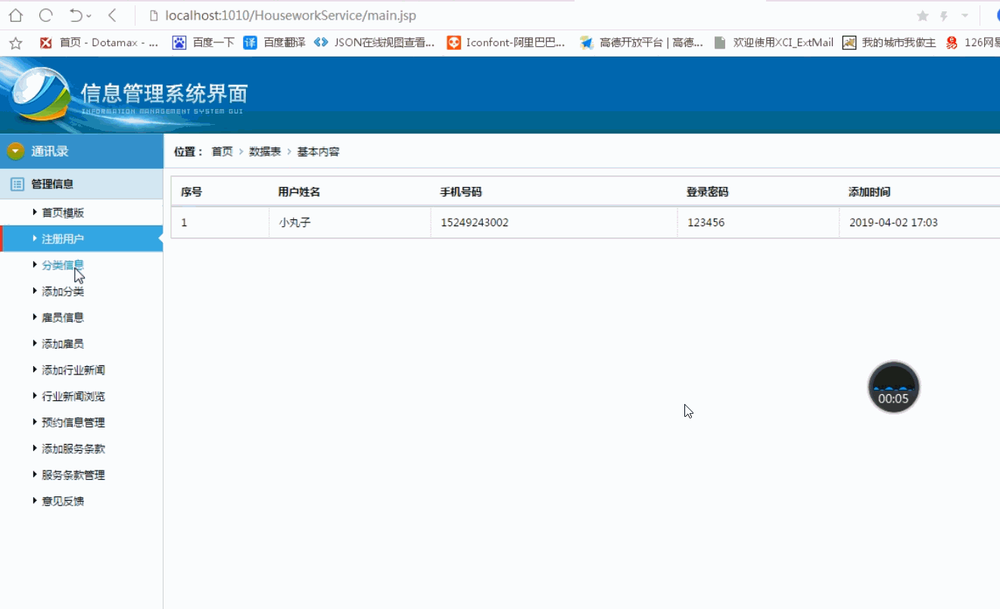
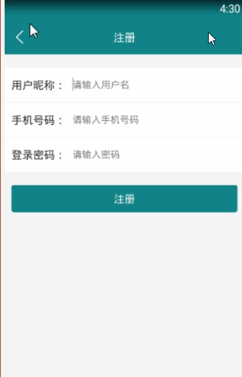

> **博主介绍：**
> 本人专注于Android/java/数据库/微信小程序技术领域的开发，以及有好几年的计算机毕业设计方面的实战开发经验和技术积累；尤其是在安卓（Android）的app的开发和微信小程序的开发，很是熟悉和了解；本人也是多年的Android开发人员；希望我发布的此篇文件可以帮助到您；
>
> 🍅 **文章末尾获取源码下载方式** 🍅

**目录**

功能演示

1：后台演示

2：客户端演示

一、项目介绍

二、运行环境

三、使用技术

四、数据库设计

五、部分代码

1：服务详情

2：服务列表

六、浏览更多Android毕业设计

七、源码下载

* * *

#### 功能演示

##### 1：后台演示

##### 2：客户端演示

#### 一、项目介绍

> **管理员：**
>
> 1：用户信息管理  
>  2：家政行业新闻发布  
>  3：雇员信息管理  
>  4：预约记录管理  
>  5：服务条款管理  
>  6：系统管理  
>  7：雇员评价管理  
>  **用户：**  
>  1：注册与登录  
>  2：浏览服务人员信息列表，以及对详情的查看  
>  3：在线预约  
>  4：对服务满意度进行评价和反馈  
>  5：在线留言以及意见反馈  
>  6：雇员信息排行榜  
>  7：修改密码  
>

#### 二、运行环境

> 1：客户端使用Android stuido进行开发；  
>  2：服务端后台使用Myeclipse2014进行开发；  
>  3：mysql数据库进行数据存储；  
>  4：需要jdk1.7以上  
>  5：使用雷电模拟器或者Androidstuio自带的模拟器进行运行

#### 三、使用技术

> **总体设计逻辑和思路：**  
>  1：先设计数据库表文件  
>  2：写服务端jsp页面以及写api接口给客户端提供数据  
>  3：完成后台服务端的数据交互，也就是jsp页面数据的存储和显示  
>  4：进行客户端页面的开发；  
>  5：进行客户端对api接口的调用，也就是获取数据库的数据以及在客户端进行显示
>
> **移动端：**  
>  1：使用android原生控件以及xml布局文件来完成界面的显示  
>  2：使用java代码完成功能的数据和逻辑交互  
>  3：使用http网络请求完成数据的请求；  
>  **4：使用json数据解析完成客户端数据的回调和显示**
>
> **服务端后台：**  
>  1：使用mysql完成数据的存储  
>  2：使用jdbc完成数据库和代码的逻辑交互  
>  3：使用jsp完成网页数据的显示  
>  4：使用java代码完成api接口的编写以及以及数据的回调

#### 四、数据库设计

> /*  
>  Navicat MySQL Data Transfer
>
> Source Server : mydata  
>  Source Server Version : 50537  
>  Source Host : localhost:3306  
>  Source Database : houseworkdb
>
> Target Server Type : MYSQL  
>  Target Server Version : 50537  
>  File Encoding : 65001
>
> Date: 2019-04-03 16:38:25  
>  */
>
> SET FOREIGN_KEY_CHECKS=0;
>
> \-- ----------------------------  
>  \-- Table structure for address  
>  \-- ----------------------------  
>  DROP TABLE IF EXISTS `address`;  
>  CREATE TABLE `address` (  
>  `addressId` int(50) NOT NULL AUTO_INCREMENT,  
>  `addressHouse` varchar(300) NOT NULL,  
>  `addressNo` varchar(100) DEFAULT NULL,  
>  `addressUserName` varchar(255) DEFAULT NULL,  
>  `addressUserPhone` varchar(255) DEFAULT NULL,  
>  `addressUserId` varchar(100) DEFAULT NULL,  
>  PRIMARY KEY (`addressId`)  
>  ) ENGINE=InnoDB AUTO_INCREMENT=19 DEFAULT CHARSET=utf8;
>
> \-- ----------------------------  
>  \-- Records of address  
>  \-- ----------------------------  
>  INSERT INTO `address` VALUES ('14', '多多小区', '1002', 'pony', '102', '106');  
>  INSERT INTO `address` VALUES ('15', '66', '88', '88', '88', '106');  
>  INSERT INTO `address` VALUES ('16', '99', '99', '99', '99', '106');  
>  INSERT INTO `address` VALUES ('17', '多多小区', '1002', 'pony', '15249248989',
> '106');
>
> \-- ----------------------------  
>  \-- Table structure for clausetb  
>  \-- ----------------------------  
>  DROP TABLE IF EXISTS `clausetb`;  
>  CREATE TABLE `clausetb` (  
>  `clauseId` int(50) NOT NULL AUTO_INCREMENT,  
>  `clauseTitle` varchar(255) DEFAULT NULL,  
>  `clauseMessage` varchar(2500) DEFAULT NULL,  
>  `clauseTime` varchar(100) DEFAULT NULL,  
>  PRIMARY KEY (`clauseId`)  
>  ) ENGINE=InnoDB AUTO_INCREMENT=3 DEFAULT CHARSET=utf8;
>
> \-- ----------------------------  
>  \-- Records of clausetb  
>  \-- ----------------------------  
>  INSERT INTO `clausetb` VALUES ('2', '活动行用户协议',
> '活动行是由北京艾科创意信息技术有限公司拥有所有权与经营权产品。用户在接受活动行的服务之前，请务必仔细阅读本条款并同意本声明。访问者访问本网站或通过各类方式使用本网站的行为，都将被视为是对本声明全部内容的无异议的认可。\r\n1.1
> 用户直接或间接通过各类方式（如站外API引用等）产生与本网站相关的行为时，都将被视为已无条件接受本声明所涉及的全部内容；若用户对本声明的任何条款有异议，请停止使用活动行所提供的全部服务。\r\n\r\n1.2
> 当用户使用活动行的服务时，需遵守中国的法律法规并保证信息的真实性，同时应当恪守以下承诺：\r\n1)活动行在修改条款时不再另行通知用户，用户可随时通过活动行网站浏览最新服务协议条款。用户只有在同意遵守相关法律法规和本协议时，才有权使用活动行的服务，无论用户是否有意访问或使用此服务。\r\n2)如果用户不同意活动行对协议相关条款的修改，则有权停止使用服务。如果继续使用服务，则视为已接受活动行最新服务协议条款。\r\n3)用户注册时请按照提示填写正确的手机号、邮箱、姓名和密码，并确保日后更新的相关资料具有有效性和合法性。若用户提交任何违法或者活动行认为不适合在其平台上展示的资料，活动行则有理由怀疑用户的资料属于恶意操作，并且有权暂停或终止用户的账号。\r\n4)活动行仅对用户的信息与资料进行形式审查，不进行实质性审查（实质性审查包括但不限于鉴别、核实任何登记资料的真实性、正确性以及是否为最新资料的审查）对此所产生的纠纷活动行不承担过错责任。\r\n5)用户有保证其信息和资料详尽、准确并对其及进行时更改的义务。\r\n6)用户有义务在其注册信息发生变动时，及时更新相关资料以保证在使用该信息时的准确性和合法性。',
> '2019-04-03 16:09');
>
> \-- ----------------------------  
>  \-- Table structure for newsmessage  
>  \-- ----------------------------  
>  DROP TABLE IF EXISTS `newsmessage`;  
>  CREATE TABLE `newsmessage` (  
>  `newsId` int(100) NOT NULL AUTO_INCREMENT,  
>  `newsTitle` varchar(255) DEFAULT NULL,  
>  `newsContent` varchar(5000) DEFAULT NULL,  
>  `newsTime` varchar(100) DEFAULT NULL,  
>  PRIMARY KEY (`newsId`)  
>  ) ENGINE=InnoDB AUTO_INCREMENT=82 DEFAULT CHARSET=utf8;
>
> \-- ----------------------------  
>  \-- Records of newsmessage  
>  \-- ----------------------------  
>  INSERT INTO `newsmessage` VALUES ('72', '吴善波一行来我院访问交流',
> '3月21日上午，浙江师范大学杭州幼儿师范学院党委书记吴善波一行来我院访问交流。学院党委书记刘星喜、纪委书记宣仲义等出席座谈会。吴善波表示，近年来行知学院发展迅速，在学院运营管理方面经验丰富，希望通过此次交流访问能够学习和了解相关经验和做法。',
> '2019-04-03 15:21');  
>  INSERT INTO `newsmessage` VALUES ('73', '爱老敬老 浙师大学生陪老人过元旦',
> '明天就是元旦了，浙师大行知学院的学生志愿者们来到市爱心老年公寓，和爷爷奶奶一起欢度佳节明天就是元旦了，浙师大行知学院的学生志愿者们来到市爱心老年公寓，和爷爷奶奶一起欢度佳节明天就是元旦了，浙师大行知学院的学生志愿者们来到市爱心老年公寓，和爷爷奶奶一起欢度佳节；',
> '2019-04-03 15:23');  
>  INSERT INTO `newsmessage` VALUES ('74', '昨天，在兰溪举行的这个省级峰会上',
> '明天就是元旦了，浙师大行知学院的学生志愿者们来到市爱心老年公寓，和爷爷奶奶一起欢度佳节明天就是元旦了，浙师大行知学院的学生志愿者们来到市爱心老年公寓，和爷爷奶奶一起欢度佳节明天就是元旦了，浙师大行知学院的学生志愿者们来到市爱心老年公寓，和爷爷奶奶一起欢度佳节',
> '2019-04-03 15:24');
>
> \-- ----------------------------  
>  \-- Table structure for ordermsg  
>  \-- ----------------------------  
>  DROP TABLE IF EXISTS `ordermsg`;  
>  CREATE TABLE `ordermsg` (  
>  `orderId` int(50) NOT NULL AUTO_INCREMENT,  
>  `orderMessageId` varchar(50) DEFAULT NULL,  
>  `orderMessageName` varchar(255) DEFAULT NULL,  
>  `orderMessageMoney` varchar(255) DEFAULT NULL,  
>  `orderUserId` varchar(100) DEFAULT NULL,  
>  `orderUserName` varchar(255) DEFAULT NULL,  
>  `orderTime` varchar(100) DEFAULT NULL,  
>  PRIMARY KEY (`orderId`)  
>  ) ENGINE=InnoDB AUTO_INCREMENT=11 DEFAULT CHARSET=utf8;
>
> \-- ----------------------------  
>  \-- Records of ordermsg  
>  \-- ----------------------------  
>  INSERT INTO `ordermsg` VALUES ('9', '2', '清洗玻璃', '500', '106', '小丸子',
> '2019-04-03 15:43');  
>  INSERT INTO `ordermsg` VALUES ('10', '2', '清洗玻璃', '500', '106', '小丸子',
> '2019-04-03 16:30');
>
> \-- ----------------------------  
>  \-- Table structure for review  
>  \-- ----------------------------  
>  DROP TABLE IF EXISTS `review`;  
>  CREATE TABLE `review` (  
>  `reviewId` int(50) NOT NULL AUTO_INCREMENT,  
>  `reviewUserId` varchar(50) NOT NULL,  
>  `reviewUserName` varchar(100) NOT NULL,  
>  `reviewMessageId` varchar(100) NOT NULL,  
>  `reviewReviewContent` varchar(300) NOT NULL,  
>  `reviewType` varchar(255) DEFAULT NULL,  
>  `reviewCreatime` varchar(100) NOT NULL,  
>  PRIMARY KEY (`reviewId`)  
>  ) ENGINE=InnoDB AUTO_INCREMENT=107 DEFAULT CHARSET=utf8;
>
> \-- ----------------------------  
>  \-- Records of review  
>  \-- ----------------------------  
>  INSERT INTO `review` VALUES ('103', '106', '小丸子', '', '111111111111111',
> '2', '2019-04-03 16:09:43');  
>  INSERT INTO `review` VALUES ('104', '106', '小丸子', '2', '1111111', '1',
> '2019-04-03 16:10:08');  
>  INSERT INTO `review` VALUES ('105', '106', '小丸子', '2', 'henbucuo ', '1',
> '2019-04-03 16:31:00');  
>  INSERT INTO `review` VALUES ('106', '106', '小丸子', '', 'nihaoa', '2',
> '2019-04-03 16:31:31');
>
> \-- ----------------------------  
>  \-- Table structure for servicetb  
>  \-- ----------------------------  
>  DROP TABLE IF EXISTS `servicetb`;  
>  CREATE TABLE `servicetb` (  
>  `serviceId` int(11) NOT NULL AUTO_INCREMENT,  
>  `serviceName` varchar(255) DEFAULT NULL,  
>  `serviceTypeId` varchar(100) DEFAULT NULL,  
>  `serviceTypeName` varchar(255) DEFAULT NULL,  
>  `serviceMoney` varchar(255) DEFAULT NULL,  
>  `serviceUserName` varchar(255) DEFAULT NULL,  
>  `serviceUserPhone` varchar(255) DEFAULT NULL,  
>  `serviceMessage` varchar(1500) DEFAULT NULL,  
>  `serviceTime` varchar(100) DEFAULT NULL,  
>  PRIMARY KEY (`serviceId`)  
>  ) ENGINE=InnoDB AUTO_INCREMENT=4 DEFAULT CHARSET=utf8;
>
> \-- ----------------------------  
>  \-- Records of servicetb  
>  \-- ----------------------------  
>  INSERT INTO `servicetb` VALUES ('1', '房间打扫', '12', '打扫', '300', '王女士',
> '15249248888',
> '从事各类保洁服务，服务范围广，服务质量优，从业以来，受到广大消费者和业内人士的好评。因为我们服务跨度大，服务要求的不同，我不断总结经验，已经制定出了一套完善的服务体系，保质保量的前提下，较大限度的节约时间。',
> '2018-12-12 09:50');  
>  INSERT INTO `servicetb` VALUES ('2', '清洗玻璃', '12', '打扫', '500', '王女士',
> '15249248888',
> '从事各类保洁服务，服务范围广，服务质量优，从业以来，受到广大消费者和业内人士的好评。因为我们服务跨度大，服务要求的不同，我不断总结经验，已经制定出了一套完善的服务体系，保质保量的前提下，较大限度的节约时间。',
> '2018-12-12 09:57');  
>  INSERT INTO `servicetb` VALUES ('3', '清洗油烟机', '12', '打扫', '500', '王女士',
> '15249248888',
> '从事各类保洁服务，服务范围广，服务质量优，从业以来，受到广大消费者和业内人士的好评。因为我们服务跨度大，服务要求的不同，我不断总结经验，已经制定出了一套完善的服务体系，保质保量的前提下，较大限度的节约时间。',
> '2018-12-12 09:59');
>
> \-- ----------------------------  
>  \-- Table structure for typetb  
>  \-- ----------------------------  
>  DROP TABLE IF EXISTS `typetb`;  
>  CREATE TABLE `typetb` (  
>  `typeId` int(50) NOT NULL AUTO_INCREMENT,  
>  `typeName` varchar(255) DEFAULT NULL,  
>  `typeTime` varchar(100) DEFAULT NULL,  
>  PRIMARY KEY (`typeId`)  
>  ) ENGINE=InnoDB AUTO_INCREMENT=18 DEFAULT CHARSET=utf8;
>
> \-- ----------------------------  
>  \-- Records of typetb  
>  \-- ----------------------------  
>  INSERT INTO `typetb` VALUES ('12', '打扫', '2019-04-03 09:21');  
>  INSERT INTO `typetb` VALUES ('13', '买菜', '2019-04-03 09:19');  
>  INSERT INTO `typetb` VALUES ('14', '做饭', '2019-04-03 09:19');  
>  INSERT INTO `typetb` VALUES ('15', '家庭保洁', '2019-04-03 09:20');  
>  INSERT INTO `typetb` VALUES ('16', '母婴服务', '2019-04-03 09:20');  
>  INSERT INTO `typetb` VALUES ('17', '物品维修', '2019-04-03 09:20');
>
> \-- ----------------------------  
>  \-- Table structure for user  
>  \-- ----------------------------  
>  DROP TABLE IF EXISTS `user`;  
>  CREATE TABLE `user` (  
>  `userId` int(255) NOT NULL AUTO_INCREMENT,  
>  `userName` varchar(200) CHARACTER SET utf8 NOT NULL,  
>  `userPhone` varchar(100) CHARACTER SET utf8 NOT NULL,  
>  `userPswd` varchar(200) CHARACTER SET utf8 NOT NULL,  
>  `userAddress` varchar(255) CHARACTER SET utf8 DEFAULT NULL,  
>  `userTime` varchar(300) CHARACTER SET utf8 NOT NULL,  
>  PRIMARY KEY (`userId`)  
>  ) ENGINE=InnoDB AUTO_INCREMENT=110 DEFAULT CHARSET=latin1;
>
> \-- ----------------------------  
>  \-- Records of user  
>  \-- ----------------------------  
>  INSERT INTO `user` VALUES ('106', '小丸子', '15249243002', '123456', '多多小区',
> '2019-04-02 17:03');  
>

#### 五、部分代码

##### 1：服务详情

>  
>  public class ServiceMessageActivity extends BaseActivity {  
>  // title  
>  private TextView mTvTitle;  
>  // 返回  
>  private ImageView mIvBack;  
>  // 查询按钮  
>  private TextView mtvShowtitle;  
>  
>  ServiceModel serviceModel;
>
> private Button mbtnPay;
>
>  
>  private TextView mtvMsgOne;  
>  private TextView mtvMsgTwo;  
>  private TextView mtvMsgThree;  
>  private TextView mtvMsgFour;  
>  private TextView mtvcontent;  
>  private TextView mtvMoney;  
>  
>  
>  
>  @Override  
>  protected void onCreate(Bundle savedInstanceState) {  
>  super.onCreate(savedInstanceState);  
>  setContentView(R.layout.activity_linesmsg);  
>  initWidget();  
>  initData();  
>  }
>
> @Override  
>  public void initWidget() {
>
>  
>  
>  mtvMsgOne = (TextView) findViewById(R.id.mtvMsgOne);  
>  mtvMsgTwo = (TextView) findViewById(R.id.mtvMsgTwo);  
>  mtvMsgThree = (TextView) findViewById(R.id.mtvMsgThree);  
>  mtvMsgFour = (TextView) findViewById(R.id.mtvMsgFour);  
>  mtvcontent = (TextView) findViewById(R.id.mtvcontent);  
>  mtvMoney = (TextView) findViewById(R.id.mtvMoney);  
>  
>  mbtnPay = (Button) findViewById(R.id.mbtnPay);  
>  mbtnPay.setOnClickListener(this);
>
> mtvShowtitle = (TextView) findViewById(R.id.mtvtitle);  
>  mtvcontent = (TextView) findViewById(R.id.mtvcontent);
>
> mIvBack = (ImageView) findViewById(R.id.mIvBack);  
>  mTvTitle = (TextView) findViewById(R.id.mTvTitle);  
>  mTvTitle.setText("服务详情");  
>  mIvBack.setVisibility(View.VISIBLE);  
>  mIvBack.setOnClickListener(this);
>
> }
>
> @Override  
>  public void onClick(View v) {
>
> switch (v.getId()) {  
>  case R.id.mIvBack:  
>  ServiceMessageActivity.this.finish();  
>  break;
>
> case R.id.mbtnPay:  
>  Intent mbtnPay = new Intent(this, PayMessageActivity.class);  
>  mbtnPay.putExtra("msg", serviceModel);  
>  startActivity(mbtnPay);  
>  break;
>
>  
>  }  
>  }
>
> @Override  
>  public void initData() {  
>  
>  mtvMsgOne = (TextView) findViewById(R.id.mtvMsgOne);  
>  mtvMsgTwo = (TextView) findViewById(R.id.mtvMsgTwo);  
>  mtvMsgThree = (TextView) findViewById(R.id.mtvMsgThree);  
>  mtvMsgFour = (TextView) findViewById(R.id.mtvMsgFour);  
>  mtvcontent = (TextView) findViewById(R.id.mtvcontent);  
>  mtvMoney = (TextView) findViewById(R.id.mtvMoney);  
>  
>
>
> serviceModel = (ServiceModel) this.getIntent().getSerializableExtra("msg");  
>  mtvShowtitle.setText(serviceModel.getServiceName());  
>  mtvMsgOne.setText("类型："+serviceModel.getServiceTypeName());  
>  mtvMsgTwo.setText("价格："+serviceModel.getServiceMoney()+"元/次");  
>  mtvMsgThree.setText("联系人："+serviceModel.getServiceUserName());  
>  mtvMsgFour.setText("手机："+serviceModel.getServiceUserPhone());  
>  mtvcontent.setText(" "+serviceModel.getServiceMessage());  
>  mtvMoney.setText(serviceModel.getServiceMoney()+"元/次");  
>  
>  // 书名，出版社，种类  
>  }
>
> }  
>

##### 2：服务列表

>  
>  public class ServiceFragment extends BaseFragment {  
>  // 获取view  
>  private View rootView;  
>  
>  
>  // 获取控件  
>  private ListView mListMessage;  
>  View convertView;  
>  
>  private List<ServiceModel> list_result = new ArrayList<ServiceModel>();  
>  ServiceListListAdapter orderListAdapter;  
>  @Override  
>  public View onCreateView(LayoutInflater inflater, ViewGroup container,
> Bundle savedInstanceState) {  
>  rootView =
> LayoutInflater.from(getActivity()).inflate(R.layout.fragment_news, null);  
>  initWidget();  
>  initData();  
>  return rootView;  
>  }
>
> @Override  
>  public void initWidget() {
>
> mListMessage = (ListView) rootView.findViewById(R.id.mListMessage);  
>  }
>
> @Override  
>  public void onClick(View v) {  
>  
>  }
>
> @Override  
>  public void initData() {  
>  listServicePhoneMessage(true);  
>  mListMessage.setOnItemClickListener(new OnItemClickListener() {  
>  @Override  
>  public void onItemClick(AdapterView<?> arg0, View arg1, int pos, long arg3)
> {
>
> Intent intent = new Intent(getActivity(), ServiceMessageActivity.class);  
>  intent.putExtra("msg", list_result.get(pos));  
>  getActivity().startActivity(intent);  
>  }  
>  });  
>  }
>
> private void listServicePhoneMessage(boolean isShow) {  
>  AjaxParams params = new AjaxParams();  
>  params.put("action_flag", "listServicePhoneMessage");  
>  httpPost(Consts.URL + Consts.APP.MessageAction, params,
> Consts.actionId.resultFlag, isShow, "正在加载...");  
>  }
>
> @Override  
>  protected void callBackSuccess(ResponseEntry entry, int actionId) {  
>  super.callBackSuccess(entry, actionId);
>
> switch (actionId) {  
>  case Consts.actionId.resultFlag:  
>  if (null != entry.getData() && !TextUtils.isEmpty(entry.getData())) {
>
> String jsonMsg = entry.getData().substring(1, entry.getData().length() - 1);  
>  if (null != jsonMsg && !TextUtils.isEmpty(jsonMsg)) {  
>  list_result = mGson.fromJson(entry.getData(), new
> TypeToken<List<ServiceModel>>() {  
>  }.getType());  
>  orderListAdapter = new ServiceListListAdapter(getActivity(), list_result);  
>  mListMessage.setAdapter(orderListAdapter);  
>  } else {  
>  }  
>  }  
>  break;
>
> default:  
>  break;  
>  }
>
> }
>
> }  
>

#### 六、浏览更多Android毕业设计

[毕业设计-基于android的租房信息发布平台的APP_信息发布app源码_Android毕业设计源码的博客-
CSDN博客](https://blog.csdn.net/u014388322/article/details/100656450?spm=1001.2014.3001.5502
"毕业设计-基于android的租房信息发布平台的APP_信息发布app源码_Android毕业设计源码的博客-CSDN博客")

[毕业设计-基于android选课系统的设计与实现_android学生选课系统_Android毕业设计源码的博客-
CSDN博客](https://blog.csdn.net/u014388322/article/details/100656536?spm=1001.2014.3001.5502
"毕业设计-基于android选课系统的设计与实现_android学生选课系统_Android毕业设计源码的博客-CSDN博客")

[毕业设计之校园一卡通管理系统的设计与实现_一卡通管理系统实现_Android毕业设计源码的博客-
CSDN博客](https://blog.csdn.net/u014388322/article/details/126048550?spm=1001.2014.3001.5502
"毕业设计之校园一卡通管理系统的设计与实现_一卡通管理系统实现_Android毕业设计源码的博客-CSDN博客")

[基于Android的校园二手闲置物品交易系统设计与实现_基于android的二手交易平台_Android毕业设计源码的博客-
CSDN博客](https://blog.csdn.net/u014388322/article/details/128232475?spm=1001.2014.3001.5502
"基于Android的校园二手闲置物品交易系统设计与实现_基于android的二手交易平台_Android毕业设计源码的博客-CSDN博客")

[基于androidstudio校园快递APP系统的设计与实现_android studio论文_Android毕业设计源码的博客-
CSDN博客](https://blog.csdn.net/u014388322/article/details/128545390?spm=1001.2014.3001.5502
"基于androidstudio校园快递APP系统的设计与实现_android studio论文_Android毕业设计源码的博客-CSDN博客")

[基于android的商城购物定制APP_安卓开发购物app_Android毕业设计源码的博客-
CSDN博客](https://blog.csdn.net/u014388322/article/details/128746697?spm=1001.2014.3001.5502
"基于android的商城购物定制APP_安卓开发购物app_Android毕业设计源码的博客-CSDN博客")

> 更多毕业设计可以浏览我的个人主页哦！

#### 七、源码下载

> ​<https://download.csdn.net/download/u014388322/88179104>​

