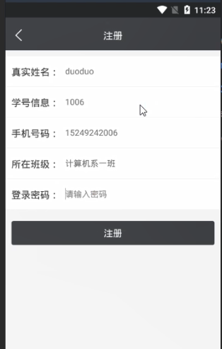
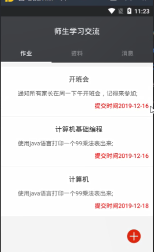
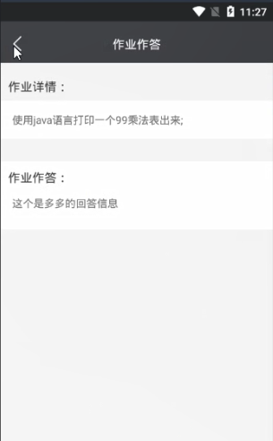
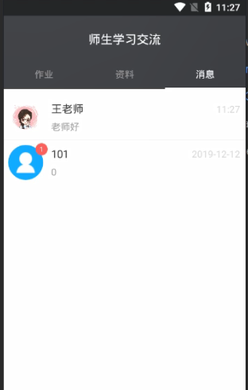
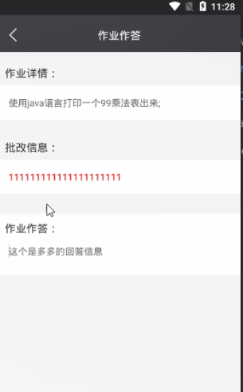
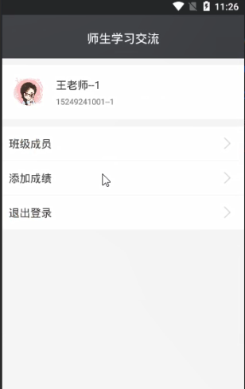

> **博主介绍：**
> 本人专注于Android/java/数据库/微信小程序技术领域的开发，以及有好几年的计算机毕业设计方面的实战开发经验和技术积累；尤其是在安卓（Android）的app的开发和微信小程序的开发，很是熟悉和了解；本人也是多年的Android开发人员；希望我发布的此篇文件可以帮助到您；
>
> 🍅 **文章末尾获取源码下载方式** 🍅

#### 一、项目介绍

> 系统分为学习资料，作业，师生交流，个人资料四大模块
>
> （1）学生端：
>
> 新用户需要填写真实姓名，学号，密码，班级等信息进行注册。已经注册的用户可以直接用户和密码进行登陆，修改个人信息
>
> 1.学习资料功能：学生可以查找对自己有用的资料
>
> 2.作业功能：登陆的学生可以查看自己的作业
>
> 3.师生交流：登陆的学生可以和本班级老师交流（包括对学习的情况反馈、问题提问等）
>
> 4.成绩查询：学生可以查询自己的成绩
>
> （2）教师端：
>
> 1.教师通过账号登陆，拥有管理员权限，填写账号密码登陆账号之后，可以修改个人信息
>
> 2.学习资历功能：教师发布学习资料（课件、微课视频等）供学生学习，包括对学习资料的编辑
>
> 3.作业功能：教师发布作业让学生查看，教师可进行增删改查
>
> 4.师生交流：教师可以和本班级的学生进行交流
>
> 5.作业批改：教师可以在线批改学生提交的作业或测试试卷
>
> 设计的软件能够实现预期的功能，且界面美观、运行流畅稳定

#### 二、运行环境

> 1：客户端使用Android stuido进行开发；  
>  2：服务端后台使用Myeclipse2014进行开发；  
>  3：mysql数据库进行数据存储；  
>  4：需要jdk1.7以上  
>  5：使用雷电模拟器或者Androidstuio自带的模拟器进行运行

#### 三、使用技术

> **总体设计逻辑和思路：**  
>  1：先设计数据库表文件  
>  2：写服务端jsp页面以及写api接口给客户端提供数据  
>  3：完成后台服务端的数据交互，也就是jsp页面数据的存储和显示  
>  4：进行客户端页面的开发；  
>  5：进行客户端对api接口的调用，也就是获取数据库的数据以及在客户端进行显示
>
> **移动端：**  
>  1：使用android原生控件以及xml布局文件来完成界面的显示  
>  2：使用java代码完成功能的数据和逻辑交互  
>  3：使用http网络请求完成数据的请求；  
>  **4：使用json数据解析完成客户端数据的回调和显示**
>
> **服务端后台：**  
>  1：使用mysql完成数据的存储  
>  2：使用jdbc完成数据库和代码的逻辑交互  
>  3：使用jsp完成网页数据的显示  
>  4：使用java代码完成api接口的编写以及以及数据的回调

#### 四、软件截图

#### 五、部分代码

##### 1：添加成绩

>  
>  public class CreateStudentScoreActivity extends BaseActivity {
>
> // title  
>  private TextView mTvTitle;  
>  // 返回  
>  private ImageView mIvBack;  
>  // 查询按钮  
>  private Button mbtnAdd;
>
> private ChoiceStudentAdapter choiceStudentAdapter;
>
> private DialogListMsg dialogListMsg;
>
> private Button mbtnStu;  
>  private EditText scoreType;  
>  private EditText scoreMessage;
>
>  
>  private List<UserModel> list_resultstu = new ArrayList<UserModel>();  
>  private int posNumber;  
>  private int posChoice = 1;
>
> @Override  
>  protected void onCreate(Bundle savedInstanceState) {  
>  super.onCreate(savedInstanceState);  
>  setContentView(R.layout.activity_creat_score);  
>  initWidget();  
>  initData();  
>  }
>
> @Override  
>  public void initWidget() {
>
> dialogListMsg = new DialogListMsg(this);  
>  dialogListMsg.setTitle().setText("选择学生");  
>  mbtnStu = (Button) findViewById(R.id.mbtnStu);  
>  scoreType = (EditText) findViewById(R.id.scoreType);  
>  scoreMessage = (EditText) findViewById(R.id.scoreMessage);  
>  mbtnAdd = (Button) findViewById(R.id.mSubmit);  
>  mIvBack = (ImageView) findViewById(R.id.mIvBack);  
>  mTvTitle = (TextView) findViewById(R.id.mTvTitle);  
>  mTvTitle.setText("添加成绩");  
>  mIvBack.setVisibility(View.VISIBLE);  
>  mIvBack.setOnClickListener(this);  
>  mbtnAdd.setOnClickListener(this);  
>  mbtnStu.setOnClickListener(this);  
>  }
>
> @Override  
>  public void onClick(View v) {
>
> switch (v.getId()) {  
>  case R.id.mIvBack:  
>  CreateStudentScoreActivity.this.finish();  
>  break;  
>  case R.id.mbtnStu:  
>  dialogListMsg.Show();  
>  break;
>
>  
>  case R.id.mSubmit:  
>  if (TextUtils.isEmpty(scoreMessage.getText().toString())) {  
>  ToastUtil.ShowCentre(this, "请输入所得分数");  
>  return;  
>  }  
>  JobAction(true);  
>  break;
>
> }  
>  }
>
> @Override  
>  public void initData() {
>
> listMessageClassStudent(false);
>
>  
>  dialogListMsg.show_listview().setOnItemClickListener(new
> OnItemClickListener() {
>
> @Override  
>  public void onItemClick(AdapterView<?> arg0, View arg1, int pos, long arg3)
> {  
>  posNumber = pos;
>
>  
>  mbtnStu.setText(list_resultstu.get(pos).getUname());
>
> dialogListMsg.Close();  
>  }  
>  });
>
> dialogListMsg.submit_no().setOnClickListener(new OnClickListener() {
>
> @Override  
>  public void onClick(View v) {  
>  dialogListMsg.Close();  
>  }  
>  });
>
> }  
>  /**  
>  * 用户的登录  
>  *  
>  * @param isShow  
>  */  
>  private void JobAction(boolean isShow) {  
>  AjaxParams params = new AjaxParams();  
>  params.put("action_flag", "addScore");
>
> params.put("scoreStuId", list_resultstu.get(posNumber).getUid()+"");  
>  params.put("scoreStuName", list_resultstu.get(posNumber).getUname());  
>  params.put("scoreType", scoreType.getText().toString());  
>  params.put("scoreMessage", scoreMessage.getText().toString());
>
> params.put("scoreUserId", MemberUserUtils.getUid(this));  
>  params.put("scoreUserName", MemberUserUtils.getName(this));  
>  httpPost(Consts.URL + Consts.APP.MessageAction, params,
> Consts.actionId.resultFlag, isShow, "正在提交...");  
>  }
>
>  
>  private void listMessageClassStudent(boolean isShow) {  
>  AjaxParams params = new AjaxParams();  
>  params.put("action_flag", "listUserStuMsg");  
>  params.put("utype", "1");  
>  httpPost(Consts.URL + Consts.APP.RegisterAction, params,
> Consts.actionId.resultState, isShow, "正在加载...");  
>  }
>
> @Override  
>  protected void callBackSuccess(ResponseEntry entry, int actionId) {  
>  super.callBackSuccess(entry, actionId);
>
> switch (actionId) {
>
> case Consts.actionId.resultFlag:  
>  ToastUtil.show(CreateStudentScoreActivity.this, entry.getRepMsg());  
>  ScoreObservable.getInstance().notifyStepChange("ok");  
>  new Handler().postDelayed(new Runnable() {  
>  @Override  
>  public void run() {  
>  CreateStudentScoreActivity.this.finish();  
>  }  
>  }, 1000);  
>  break;
>
> case Consts.actionId.resultState:  
>  if (null != entry.getData() && !TextUtils.isEmpty(entry.getData())) {
>
> String jsonMsg = entry.getData().substring(1, entry.getData().length() - 1);  
>  if (null != jsonMsg && !TextUtils.isEmpty(jsonMsg)) {  
>  list_resultstu.clear();  
>  list_resultstu = mGson.fromJson(entry.getData(), new
> TypeToken<List<UserModel>>() {  
>  }.getType());
>
>  
>  choiceStudentAdapter = new ChoiceStudentAdapter(this);  
>  choiceStudentAdapter.setData(list_resultstu);  
>  dialogListMsg.show_listview().setAdapter(choiceStudentAdapter);
>
> }  
>  }  
>  break;  
>  }
>
> }
>
> @Override  
>  protected void callBackAllFailure(String strMsg, int actionId) {  
>  super.callBackAllFailure(strMsg, actionId);  
>  ToastUtil.show(CreateStudentScoreActivity.this, strMsg);
>
> }
>
> }  
>

##### 2：查看作业

>  
>  public class HomeworkReplyActivity extends BaseActivity {
>
> // title  
>  private TextView mTvTitle;  
>  // 返回  
>  private ImageView mIvBack;  
>  // 查询按钮  
>  private ListView lisviewMessage;  
>  private TextView answerMessage;
>
> private NoticeModel noticeModel;
>
> @Override  
>  protected void onCreate(Bundle savedInstanceState) {  
>  super.onCreate(savedInstanceState);  
>  setContentView(R.layout.activity_create_answer_home);  
>  initWidget();  
>  initData();  
>  }
>
> @Override  
>  public void initWidget() {  
>  answerMessage = (TextView) findViewById(R.id.answerMessage);  
>  lisviewMessage = (ListView) findViewById(R.id.lisviewMessage);  
>  mIvBack = (ImageView) findViewById(R.id.mIvBack);  
>  mTvTitle = (TextView) findViewById(R.id.mTvTitle);  
>  mTvTitle.setText("作业作答");  
>  mIvBack.setVisibility(View.VISIBLE);  
>  mIvBack.setOnClickListener(this);  
>  }
>
> @Override  
>  public void onClick(View v) {
>
> switch (v.getId()) {  
>  case R.id.mIvBack:  
>  HomeworkReplyActivity.this.finish();  
>  break;  
>  case R.id.mbtnUpdate:
>
> break;  
>  }  
>  }  
>  @Override  
>  public void initData() {  
>  noticeModel = (NoticeModel) this.getIntent().getSerializableExtra("msg");  
>  answerMessage.setText(noticeModel.getNewsMessage());  
>  RegisterAction(true);
>
> lisviewMessage.setOnItemClickListener(new AdapterView.OnItemClickListener()
> {  
>  @Override  
>  public void onItemClick(AdapterView<?> adapterView, View view, int i, long
> l) {
>
> Intent intent = new Intent(HomeworkReplyActivity.this,
> TeaReplyActivity.class);  
>  intent.putExtra("msg",list_result.get(i));  
>  startActivity(intent);
>
> }  
>  });
>
> }
>
> private void RegisterAction(boolean isShow) {  
>  AjaxParams params = new AjaxParams();  
>  params.put("action_flag", "listMessageHome");  
>  params.put("replyAnswerId", noticeModel.getNewsId());  
>  httpPost(Consts.URL + Consts.APP.MessageAction, params,
> Consts.actionId.resultFlag, isShow, "正在更新...");  
>  }  
>  private List<ReplyModel> list_result = new ArrayList<ReplyModel>();  
>  @Override  
>  protected void callBackSuccess(ResponseEntry entry, int actionId) {  
>  super.callBackSuccess(entry, actionId);
>
>  
>  switch (actionId) {  
>  case Consts.actionId.resultFlag:  
>  if (null != entry.getData() && !TextUtils.isEmpty(entry.getData())) {
>
> list_result = mGson.fromJson(entry.getData(), new
> TypeToken<List<ReplyModel>>() {  
>  }.getType());  
>  HomeStuListAdapter typeListAdapter = new HomeStuListAdapter(this,
> list_result);  
>  lisviewMessage.setAdapter(typeListAdapter);
>
> }  
>  break;
>
> }
>
> }
>
> @Override  
>  protected void callBackAllFailure(String strMsg, int actionId) {  
>  super.callBackAllFailure(strMsg, actionId);  
>  ToastUtil.show(HomeworkReplyActivity.this, strMsg);
>
> }  
>  }  
>

#### 六、浏览更多Android毕业设计

[毕业设计-基于android的租房信息发布平台的APP_信息发布app源码_Android毕业设计源码的博客-
CSDN博客](https://blog.csdn.net/u014388322/article/details/100656450?spm=1001.2014.3001.5502
"毕业设计-基于android的租房信息发布平台的APP_信息发布app源码_Android毕业设计源码的博客-CSDN博客")

[毕业设计-基于android选课系统的设计与实现_android学生选课系统_Android毕业设计源码的博客-
CSDN博客](https://blog.csdn.net/u014388322/article/details/100656536?spm=1001.2014.3001.5502
"毕业设计-基于android选课系统的设计与实现_android学生选课系统_Android毕业设计源码的博客-CSDN博客")

[毕业设计之校园一卡通管理系统的设计与实现_一卡通管理系统实现_Android毕业设计源码的博客-
CSDN博客](https://blog.csdn.net/u014388322/article/details/126048550?spm=1001.2014.3001.5502
"毕业设计之校园一卡通管理系统的设计与实现_一卡通管理系统实现_Android毕业设计源码的博客-CSDN博客")

[基于Android的校园二手闲置物品交易系统设计与实现_基于android的二手交易平台_Android毕业设计源码的博客-
CSDN博客](https://blog.csdn.net/u014388322/article/details/128232475?spm=1001.2014.3001.5502
"基于Android的校园二手闲置物品交易系统设计与实现_基于android的二手交易平台_Android毕业设计源码的博客-CSDN博客")

[基于androidstudio校园快递APP系统的设计与实现_android studio论文_Android毕业设计源码的博客-
CSDN博客](https://blog.csdn.net/u014388322/article/details/128545390?spm=1001.2014.3001.5502
"基于androidstudio校园快递APP系统的设计与实现_android studio论文_Android毕业设计源码的博客-CSDN博客")

[基于android的商城购物定制APP_安卓开发购物app_Android毕业设计源码的博客-
CSDN博客](https://blog.csdn.net/u014388322/article/details/128746697?spm=1001.2014.3001.5502
"基于android的商城购物定制APP_安卓开发购物app_Android毕业设计源码的博客-CSDN博客")

> 更多毕业设计可以浏览我的个人主页哦！

#### 七、源码下载

> 大家 **点赞、收藏、关注、评论** 啦 、 **查看** 👇🏻👇🏻👇🏻 **获取联系方式** 👇🏻👇🏻👇🏻
>
> <https://download.csdn.net/download/u014388322/87473446>

