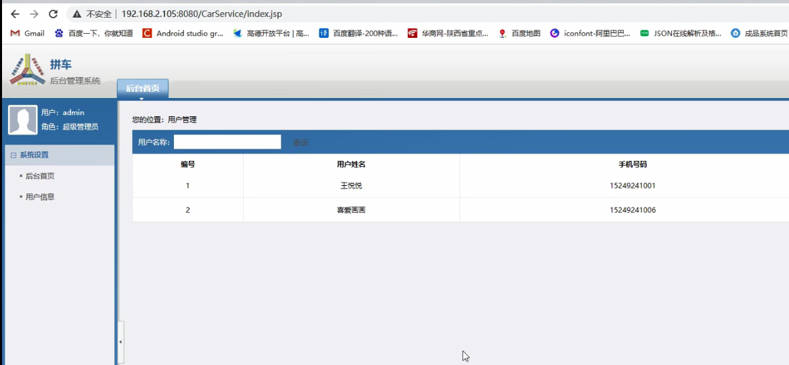
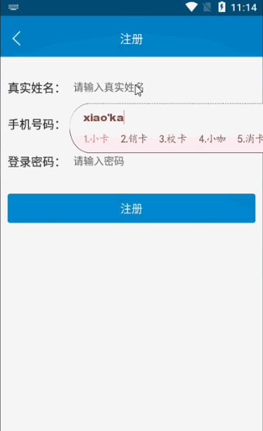
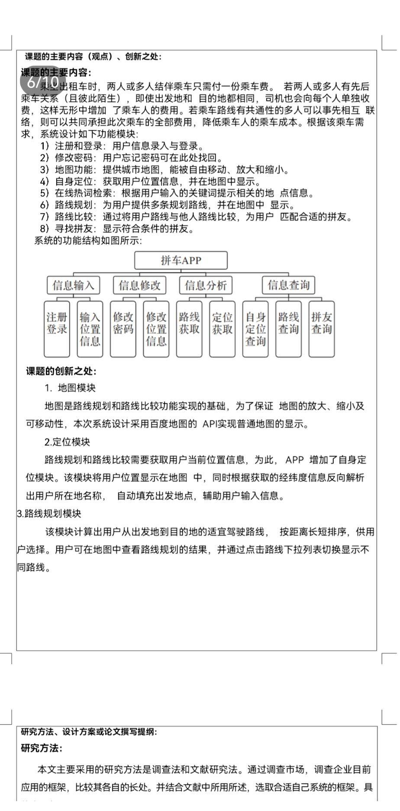

> **博主介绍：**
> 本人专注于Android/java/数据库/微信小程序技术领域的开发，以及有好几年的计算机毕业设计方面的实战开发经验和技术积累；尤其是在安卓（Android）的app的开发和微信小程序的开发，很是熟悉和了解；本人也是多年的Android开发人员；希望我发布的此篇文件可以帮助到您；
>
> 🍅 **文章末尾获取源码下载方式** 🍅

####  七、源码下载

> 大家 **点赞、收藏、关注、评论** 啦 、 **查看** 👇🏻👇🏻👇🏻 **获取联系方式** 👇🏻👇🏻👇🏻
>
> <https://download.csdn.net/download/u014388322/87473454>

#### 功能演示

**详情演示视频请文字末尾公众号咨询，我会发给您；**

#### 1：后台演示

#### 2：客户端演示

#### 一、项目介绍

> 需求信息：
>

>> 客户端：  
>  1：注册和登录:用户信息录入与登录。  
>  2：修改密码:用户忘记密码可在此处找回。  
>  3：地图功能:提供城市地图，能被自由移动、放大和缩小。  
>  4：自身定位:获取用户位置信息，并在地图中显示。  
>  5：在线热词检索:根据用户输入的关键词提示相关的地点信息。  
>  6：路线规划:为用户提供多条规划路线，并在地图中显示。  
>  7：路线比较:通过将用户路线与他人路线比较，为用户匹配合适的拼友。  
>  8：寻找拼友:显示符合条件的拼友。
>>

>> 后台服务端：  
>  1：用户管理：可以查看注册的用户信息
>
> 

#### 二、运行环境

> 1：客户端使用Android stuido进行开发；  
>  2：服务端后台使用Myeclipse2014进行开发；  
>  3：mysql数据库进行数据存储；  
>  4：需要jdk1.7以上  
>  5：使用雷电模拟器或者Androidstuio自带的模拟器进行运行

#### 三、使用技术

> **总体设计逻辑和思路：**  
>  1：先设计数据库表文件  
>  2：写服务端jsp页面以及写api接口给客户端提供数据  
>  3：完成后台服务端的数据交互，也就是jsp页面数据的存储和显示  
>  4：进行客户端页面的开发；  
>  5：进行客户端对api接口的调用，也就是获取数据库的数据以及在客户端进行显示
>
> **移动端：**  
>  1：使用android原生控件以及xml布局文件来完成界面的显示  
>  2：使用java代码完成功能的数据和逻辑交互  
>  3：使用http网络请求完成数据的请求；  
>  **4：使用json数据解析完成客户端数据的回调和显示**
>
> **服务端后台：**  
>  1：使用mysql完成数据的存储  
>  2：使用jdbc完成数据库和代码的逻辑交互  
>  3：使用jsp完成网页数据的显示  
>  4：使用java代码完成api接口的编写以及以及数据的回调

#### 四、数据库设计

    
    
    /*
    Navicat MySQL Data Transfer
    
    Source Server         : mydb
    Source Server Version : 50528
    Source Host           : localhost:3306
    Source Database       : carpoolingdb
    
    Target Server Type    : MYSQL
    Target Server Version : 50528
    File Encoding         : 65001
    
    Date: 2022-03-24 23:17:25
    */
    
    SET FOREIGN_KEY_CHECKS=0;
    
    -- ----------------------------
    -- Table structure for admintb
    -- ----------------------------
    DROP TABLE IF EXISTS `admintb`;
    CREATE TABLE `admintb` (
      `adminId` int(11) NOT NULL AUTO_INCREMENT,
      `adminLoginName` varchar(255) DEFAULT NULL,
      `adminLoginPassword` varchar(255) DEFAULT NULL,
      PRIMARY KEY (`adminId`)
    ) ENGINE=InnoDB AUTO_INCREMENT=2 DEFAULT CHARSET=utf8;
    
    -- ----------------------------
    -- Records of admintb
    -- ----------------------------
    INSERT INTO `admintb` VALUES ('1', 'admin', '123456');
    
    -- ----------------------------
    -- Table structure for ordermsg
    -- ----------------------------
    DROP TABLE IF EXISTS `ordermsg`;
    CREATE TABLE `ordermsg` (
      `orderId` int(50) NOT NULL AUTO_INCREMENT,
      `orderUserId` varchar(100) DEFAULT NULL,
      `orderUserName` varchar(255) DEFAULT NULL,
      `orderDriverId` int(100) DEFAULT NULL,
      `orderDriverName` varchar(255) DEFAULT NULL,
      `orderCarInfor` varchar(255) DEFAULT NULL,
      `orderPerson` varchar(255) DEFAULT NULL,
      `orderMoney` varchar(255) DEFAULT NULL,
      `orderTime` varchar(100) DEFAULT NULL,
      `orderStartLatLng` varchar(1000) DEFAULT NULL,
      `orderEndLatLng` varchar(255) DEFAULT NULL,
      `orderAddressStart` varchar(255) DEFAULT NULL,
      `orderAddressEnd` varchar(255) DEFAULT NULL,
      `orderState` varchar(255) DEFAULT NULL,
      `orderDistance` varchar(100) DEFAULT NULL,
      PRIMARY KEY (`orderId`)
    ) ENGINE=InnoDB AUTO_INCREMENT=23 DEFAULT CHARSET=utf8;
    
    -- ----------------------------
    -- Records of ordermsg
    -- ----------------------------
    INSERT INTO `ordermsg` VALUES ('19', '111', '王悦悦', '113', '王驾驶员', '陕A12345', '小胡胡-15249241001-2', '23.0', '2022-03-24 21:29', '34.24115912543403,108.96573052300347', '34.225539,108.852956', '友谊东路', '科技二路', '2', '10.5');
    INSERT INTO `ordermsg` VALUES ('20', '111', '王悦悦', '113', '王驾驶员', '陕A12345', '小莉莉-15249242001-5', '25', '2022-03-24 21:29', '34.28768147786458,108.96426649305556', '34.225539,108.852956', '火车站', '科技二路', '2', '10');
    INSERT INTO `ordermsg` VALUES ('21', '111', '王悦悦', null, null, null, '小花-15249240006-1', '8', '2022-03-24 21:29', '34.28585101497868,108.96269072255323', '34.278498,108.962723', '自强东路', '西安站', '1', '.8');
    INSERT INTO `ordermsg` VALUES ('22', '126', '小楷', null, null, null, '小卡爱-15249241002-1', '17.0', '2022-03-24 23:15', '34.28585057570281,108.96269111386832', '34.218229,108.964176', '自强东路', '大雁塔', '1', '7.5');
    
    -- ----------------------------
    -- Table structure for user
    -- ----------------------------
    DROP TABLE IF EXISTS `user`;
    CREATE TABLE `user` (
      `userId` int(255) NOT NULL AUTO_INCREMENT,
      `userName` varchar(200) CHARACTER SET utf8 NOT NULL,
      `userPhone` varchar(100) CHARACTER SET utf8 NOT NULL,
      `userPswd` varchar(200) CHARACTER SET utf8 NOT NULL,
      `userTime` varchar(300) CHARACTER SET utf8 NOT NULL,
      PRIMARY KEY (`userId`)
    ) ENGINE=InnoDB AUTO_INCREMENT=127 DEFAULT CHARSET=latin1;
    
    -- ----------------------------
    -- Records of user
    -- ----------------------------
    INSERT INTO `user` VALUES ('111', '王悦悦', '15249241001', '123456', '2022-03-24 00:38');
    INSERT INTO `user` VALUES ('125', '喜爱画画', '15249241006', '123456', '2022-03-24 23:11');
    INSERT INTO `user` VALUES ('126', '小楷', '15249241002', '123456', '2022-03-24 23:14');
    

#### 五、部分代码

#### 六、浏览更多Android毕业设计

[毕业设计-基于android的租房信息发布平台的APP_信息发布app源码_Android毕业设计源码的博客-
CSDN博客](https://blog.csdn.net/u014388322/article/details/100656450?spm=1001.2014.3001.5502
"毕业设计-基于android的租房信息发布平台的APP_信息发布app源码_Android毕业设计源码的博客-CSDN博客")

[毕业设计-基于android选课系统的设计与实现_android学生选课系统_Android毕业设计源码的博客-
CSDN博客](https://blog.csdn.net/u014388322/article/details/100656536?spm=1001.2014.3001.5502
"毕业设计-基于android选课系统的设计与实现_android学生选课系统_Android毕业设计源码的博客-CSDN博客")

[毕业设计之校园一卡通管理系统的设计与实现_一卡通管理系统实现_Android毕业设计源码的博客-
CSDN博客](https://blog.csdn.net/u014388322/article/details/126048550?spm=1001.2014.3001.5502
"毕业设计之校园一卡通管理系统的设计与实现_一卡通管理系统实现_Android毕业设计源码的博客-CSDN博客")

[基于Android的校园二手闲置物品交易系统设计与实现_基于android的二手交易平台_Android毕业设计源码的博客-
CSDN博客](https://blog.csdn.net/u014388322/article/details/128232475?spm=1001.2014.3001.5502
"基于Android的校园二手闲置物品交易系统设计与实现_基于android的二手交易平台_Android毕业设计源码的博客-CSDN博客")

[基于androidstudio校园快递APP系统的设计与实现_android studio论文_Android毕业设计源码的博客-
CSDN博客](https://blog.csdn.net/u014388322/article/details/128545390?spm=1001.2014.3001.5502
"基于androidstudio校园快递APP系统的设计与实现_android studio论文_Android毕业设计源码的博客-CSDN博客")

[基于android的商城购物定制APP_安卓开发购物app_Android毕业设计源码的博客-
CSDN博客](https://blog.csdn.net/u014388322/article/details/128746697?spm=1001.2014.3001.5502
"基于android的商城购物定制APP_安卓开发购物app_Android毕业设计源码的博客-CSDN博客")

> 更多毕业设计可以浏览我的个人主页哦！

####

>

