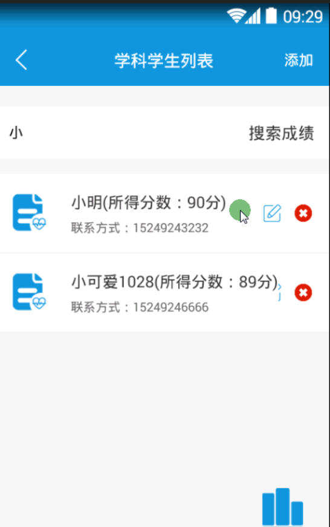
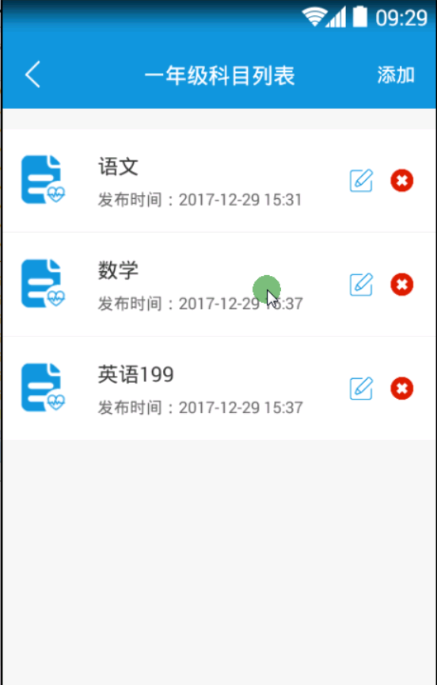

> **博主介绍：**
> 本人专注于Android/java/数据库/微信小程序技术领域的开发，以及有好几年的计算机毕业设计方面的实战开发经验和技术积累；尤其是在安卓（Android）的app的开发和微信小程序的开发，很是熟悉和了解；本人也是多年的Android开发人员；希望我发布的此篇文件可以帮助到您；
>
> 🍅 **文章末尾获取源码下载方式** 🍅

**目录**

一、项目功能介绍

二、运行环境

三、使用技术

四、软件截图

五、部分代码

1：添加班级信息

2：统计图表信息

六、浏览更多Android毕业设计

七、毕业设计部分免费源码分享下载

* * *

#### 一、项目功能介绍

> 1）登录注册；每个用户登陆之后有各自的数据，不是每个用户共享同一个数据。
>
> 2）个人信息：设置头像，姓名，性别，邮箱等信息，还可以设置手势解锁，设置之后每次进入个人信息都需要进行手势密码
>
> 3）我的班级：班级的增删改，我的班级里有所教科目的增删改；
>
>
> 4）我的学生：在新增我的班级后，接着新增我的班级里的科目，然后可以在新增的科目中进行学生相关信息的增删改查，学生的相关信息：名字、性别、家长号码、手机号码、学生成绩；可以根据学生姓名查询当前科目的成绩，模糊查询
>
>
> 5）成绩管理：通过“我的学生”里相应科目的成绩添加，在这个列表有已经新增的科目，点击进去是这门课程成绩的降序排序显示学生的名字和分数；还可以把每门课的及格率通过统计图来显示，老师能够更加宏观的了解班级学生的状态。
>
>
> 6）我的课程安排：课程安排可以进行增删改查；新增课程信息例如：科目，内容，地点，上课时间：年月日时分秒，下课时间：年月日时分秒，闹铃，录音；闹铃可以进行设置时间的提醒，闹铃的铃声也可以进行相应的选择；上课时间到提醒，下课时间到也进行提醒；每当上课时间一开始录音就自动开始，下课时间一到录音就停止结束，录音完可以进行听录音的内容，这样老师能够在课后进行整理归纳；可以进行课程内容的分享；可以根据年月日模糊查询出课程安排的科目
>
> 7）自动出题功能：可以自动新增小学的拼音题目，随机选出十道题目在列表中；根据拼音写汉字并可以将其题目导出成word，这样就可以打印出来给学生们做。

#### 二、运行环境

> 1：客户端使用Android stuido进行开发；  
>  2：服务端后台使用Myeclipse2014进行开发；  
>  3：mysql数据库进行数据存储；  
>  4：需要jdk1.7以上  
>  5：使用雷电模拟器或者Androidstuio自带的模拟器进行运行

#### 三、使用技术

> **总体设计逻辑和思路：**  
>  1：先设计数据库表文件  
>  2：写服务端jsp页面以及写api接口给客户端提供数据  
>  3：完成后台服务端的数据交互，也就是jsp页面数据的存储和显示  
>  4：进行客户端页面的开发；  
>  5：进行客户端对api接口的调用，也就是获取数据库的数据以及在客户端进行显示
>
> **移动端：**  
>  1：使用android原生控件以及xml布局文件来完成界面的显示  
>  2：使用java代码完成功能的数据和逻辑交互  
>  3：使用http网络请求完成数据的请求；  
>  **4：使用json数据解析完成客户端数据的回调和显示**
>
> **服务端后台：**  
>  1：使用mysql完成数据的存储  
>  2：使用jdbc完成数据库和代码的逻辑交互  
>  3：使用jsp完成网页数据的显示  
>  4：使用java代码完成api接口的编写以及以及数据的回调

#### 四、软件截图

#### 五、部分代码

##### 1：添加班级信息

> public class CreateClassActivity extends BaseActivity {
>
> // title  
>  private TextView mTvTitle;  
>  private ImageView mIvBack;  
>  private Button mbtnUpdate;  
>  private EditText metName;
>
> @Override  
>  protected void onCreate(Bundle savedInstanceState) {  
>  super.onCreate(savedInstanceState);  
>  setContentView(R.layout.activity_create_class);  
>  initWidget();  
>  }
>
> @Override  
>  public void initWidget() {  
>  metName = (EditText) findViewById(R.id.metName);  
>  mbtnUpdate = (Button) findViewById(R.id.mbtnUpdate);  
>  mIvBack = (ImageView) findViewById(R.id.mIvBack);  
>  mTvTitle = (TextView) findViewById(R.id.mTvTitle);  
>  mTvTitle.setText("添加班级");  
>  mIvBack.setVisibility(View.VISIBLE);  
>  mIvBack.setOnClickListener(this);  
>  mbtnUpdate.setOnClickListener(this);
>
> }
>
> @Override  
>  public void onClick(View v) {
>
> switch (v.getId()) {  
>  case R.id.mIvBack:  
>  CreateClassActivity.this.finish();  
>  break;  
>  case R.id.mbtnUpdate:
>
> if (TextUtils.isEmpty(metName.getText().toString())) {  
>  return;  
>  }  
>  
>  RegisterAction(true);  
>  break;  
>  }  
>  }
>
> @Override  
>  public void initData() {
>
> }
>
> private void RegisterAction(boolean isShow) {  
>  AjaxParams params = new AjaxParams();  
>  params.put("action_flag", "addClass");  
>  params.put("className", metName.getText().toString());  
>  params.put("classUserId", MemberUserUtils.getUid(this));  
>  httpPost(Consts.URL + Consts.APP.TeacherAction, params,
> Consts.actionId.resultFlag, isShow, "");  
>  }
>
> @Override  
>  protected void callBackSuccess(ResponseEntry entry, int actionId) {  
>  super.callBackSuccess(entry, actionId);  
>  ToastUtil.show(CreateClassActivity.this, entry.getRepMsg());
>
> new Handler().postDelayed(new Runnable() {  
>  @Override  
>  public void run() {  
>  CreateClassActivity.this.finish();  
>  }  
>  }, 1000);  
>  }
>
> @Override  
>  protected void callBackAllFailure(String strMsg, int actionId) {  
>  super.callBackAllFailure(strMsg, actionId);  
>  ToastUtil.show(CreateClassActivity.this, strMsg);
>
> }  
>  }  
>

##### 2：统计图表信息

> public class MyScoreActivity extends BaseActivity {  
>  // 标题  
>  private TextView mTvTitle;  
>  // 返回  
>  private ImageView mIvBack;  
>  private SubModel subModel;  
>  ColumnChartView chart;  
>  private ColumnChartData data;  
>  private boolean hasLabels = true;  
>  private boolean hasLabelForSelected = false;  
>  List<AxisValue> mAxisValues = new ArrayList<AxisValue>();  
>  private List<StudentModel> listMsg = new ArrayList<StudentModel>();
>
> @Override  
>  protected void onCreate(Bundle savedInstanceState) {  
>  super.onCreate(savedInstanceState);  
>  setContentView(R.layout.activity_myscore);  
>  initWidget();  
>  initData();  
>  }
>
> @Override  
>  public void onClick(View v) {  
>  switch (v.getId()) {  
>  case R.id.mIvBack:  
>  finish();  
>  break;  
>  }  
>  }
>
> @Override  
>  public void initWidget() {  
>  chart = (ColumnChartView) findViewById(R.id.chart);  
>  mIvBack = (ImageView) findViewById(R.id.mIvBack);  
>  mTvTitle = (TextView) findViewById(R.id.mTvTitle);  
>  mTvTitle.setText("学生成绩统计图显示");  
>  mIvBack.setVisibility(View.VISIBLE);  
>  mIvBack.setOnClickListener(this);  
>  }
>
> @Override  
>  public void initData() {
>
> subModel = (SubModel) this.getIntent().getSerializableExtra("msg");
>
> MessageAction(true);  
>  }
>
> private List<Column> generateDefaultData() {  
>  int numSubcolumns = 1;// 设置每个柱状图显示的颜色数量(每个柱状图显示多少块)  
>  // Column can have many subcolumns, here by default I use 1 subcolumn in  
>  // each of 8 columns.  
>  List<Column> columns = new ArrayList<Column>();  
>  List<SubcolumnValue> values;  
>  for (int i = 0; i < listMsg.size(); ++i) {  
>  values = new ArrayList<SubcolumnValue>();  
>  for (int j = 0; j < numSubcolumns; ++j) {  
>  SubcolumnValue value = new
> SubcolumnValue(Float.valueOf(listMsg.get(i).getStudentScore()),
> ChartUtils.pickColor());// 第一个值是数值(值>0  
>  values.add(value);  
>  }  
>  Column column = new Column(values);// 一个柱状图的实例  
>  column.setHasLabels(hasLabels);// 设置是否显示每个柱状图的高度，  
>  column.setHasLabelsOnlyForSelected(hasLabelForSelected);//
> 点击的时候是否显示柱状图的高度，和setHasLabels()和用的时候，setHasLabels()失效  
>  columns.add(column);  
>  }  
>  return columns;  
>  }
>
> private void MessageAction(boolean isShow) {  
>  AjaxParams params = new AjaxParams();  
>  params.put("action_flag", "listStudentMessage");  
>  params.put("studentSubId", subModel.getSubId());  
>  httpPost(Consts.URL + Consts.APP.TeacherAction, params,
> Consts.actionId.resultFlag, isShow, "正在加载...");  
>  }
>
>  
>  @Override  
>  protected void callBackSuccess(ResponseEntry entry, int actionId) {  
>  super.callBackSuccess(entry, actionId);
>
> switch (actionId) {  
>  case Consts.actionId.resultFlag:  
>  if (null != entry.getData() && !TextUtils.isEmpty(entry.getData())) {
>
> String jsonMsg = entry.getData().substring(1, entry.getData().length() - 1);  
>  if (null != jsonMsg && !TextUtils.isEmpty(jsonMsg)) {  
>  listMsg = mGson.fromJson(entry.getData(), new
> TypeToken<List<StudentModel>>() {  
>  }.getType());  
>  
>  for (int i = 0; i < listMsg.size(); i++) {  
>  mAxisValues.add(new AxisValue(i,
> listMsg.get(i).getStudentName().toCharArray()));  
>  }
>
> List<Column> columns = new ArrayList<Column>();  
>  Column column = new Column();  
>  column.setHasLabels(hasLabels);  
>  column.setHasLabelsOnlyForSelected(hasLabelForSelected);  
>  columns.add(column);  
>  data = new ColumnChartData(generateDefaultData());
>
> // 坐标轴  
>  Axis axisX = new Axis(); // X轴  
>  axisX.setName("学成成绩柱状图");  
>  axisX.setValues(mAxisValues);  
>  data.setAxisXBottom(axisX);
>
> Axis axisY = new Axis(); // Y轴  
>  axisY.setName("所的成绩");  
>  // axisY.setValues(mAxisValues);  
>  data.setAxisYLeft(axisY);
>
> chart.setColumnChartData(data);  
>
>
> }  
>  }  
>  break;
>
> default:  
>  break;  
>  }
>
> }
>
> }  
>

#### 六、浏览更多Android毕业设计

[毕业设计-基于android的租房信息发布平台的APP_信息发布app源码_Android毕业设计源码的博客-
CSDN博客](https://blog.csdn.net/u014388322/article/details/100656450?spm=1001.2014.3001.5502
"毕业设计-基于android的租房信息发布平台的APP_信息发布app源码_Android毕业设计源码的博客-CSDN博客")

[毕业设计-基于android选课系统的设计与实现_android学生选课系统_Android毕业设计源码的博客-
CSDN博客](https://blog.csdn.net/u014388322/article/details/100656536?spm=1001.2014.3001.5502
"毕业设计-基于android选课系统的设计与实现_android学生选课系统_Android毕业设计源码的博客-CSDN博客")

[毕业设计之校园一卡通管理系统的设计与实现_一卡通管理系统实现_Android毕业设计源码的博客-
CSDN博客](https://blog.csdn.net/u014388322/article/details/126048550?spm=1001.2014.3001.5502
"毕业设计之校园一卡通管理系统的设计与实现_一卡通管理系统实现_Android毕业设计源码的博客-CSDN博客")

[基于Android的校园二手闲置物品交易系统设计与实现_基于android的二手交易平台_Android毕业设计源码的博客-
CSDN博客](https://blog.csdn.net/u014388322/article/details/128232475?spm=1001.2014.3001.5502
"基于Android的校园二手闲置物品交易系统设计与实现_基于android的二手交易平台_Android毕业设计源码的博客-CSDN博客")

[基于androidstudio校园快递APP系统的设计与实现_android studio论文_Android毕业设计源码的博客-
CSDN博客](https://blog.csdn.net/u014388322/article/details/128545390?spm=1001.2014.3001.5502
"基于androidstudio校园快递APP系统的设计与实现_android studio论文_Android毕业设计源码的博客-CSDN博客")

[基于android的商城购物定制APP_安卓开发购物app_Android毕业设计源码的博客-
CSDN博客](https://blog.csdn.net/u014388322/article/details/128746697?spm=1001.2014.3001.5502
"基于android的商城购物定制APP_安卓开发购物app_Android毕业设计源码的博客-CSDN博客")

> 更多毕业设计可以浏览我的个人主页哦！

#### 七、源码下载

> <https://download.csdn.net/download/u014388322/88150859>

