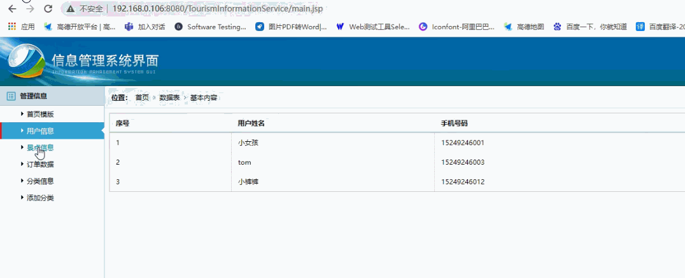

> **博主介绍：**
> 本人专注于Android/java/数据库/微信小程序技术领域的开发，以及有好几年的计算机毕业设计方面的实战开发经验和技术积累；尤其是在安卓（Android）的app的开发和微信小程序的开发，很是熟悉和了解；本人也是多年的Android开发人员；希望我发布的此篇文件可以帮助到您；
>
> 🍅 **文章末尾获取源码下载方式** 🍅

#### 功能演示

**详情演示视频请文字末尾公众号咨询，我会发给您；**

#### 1：后台演示

#### 2：客户端演示

#### 一、项目介绍

> 客户端：
>
> 1：用户注册登录：通过手机号码、用户名称以及密码完成用户的注册和登录
>
> 2：景点上报：用户可以上传对应景点的信息
>
> 3：景点浏览：用户可以浏览存在的景区信息，评论和购票以及和景点客服人员进行沟通；
>
> 4：景点推荐：根据用户对有些景点的浏览记录推荐对应的景点数据
>
> 5：我的订单：用户查看自己的购票订单信息
>
> 6：个人信息、密码进行修改：用户登录之后可以查看用户的基本资料以及对密码信息进行修改。
>
> 后台java管理员：
>
> 1：用户信息：可以查看注册的用户信息
>
> 2：景点信息：可以查看发布景点信息
>
> 3：订单信息：可以查看订单信息

#### 二、运行环境

> 1：客户端使用Android stuido进行开发；  
>  2：服务端后台使用Myeclipse2014进行开发；  
>  3：mysql数据库进行数据存储；  
>  4：需要jdk1.7以上  
>  5：使用雷电模拟器或者Androidstuio自带的模拟器进行运行

#### 三、使用技术

> **总体设计逻辑和思路：**  
>  1：先设计数据库表文件  
>  2：写服务端jsp页面以及写api接口给客户端提供数据  
>  3：完成后台服务端的数据交互，也就是jsp页面数据的存储和显示  
>  4：进行客户端页面的开发；  
>  5：进行客户端对api接口的调用，也就是获取数据库的数据以及在客户端进行显示
>
> **移动端：**  
>  1：使用android原生控件以及xml布局文件来完成界面的显示  
>  2：使用java代码完成功能的数据和逻辑交互  
>  3：使用http网络请求完成数据的请求；  
>  **4：使用json数据解析完成客户端数据的回调和显示**
>
> **服务端后台：**  
>  1：使用mysql完成数据的存储  
>  2：使用jdbc完成数据库和代码的逻辑交互  
>  3：使用jsp完成网页数据的显示  
>  4：使用java代码完成api接口的编写以及以及数据的回调

#### 四、数据库设计

    
    
    /*
    Navicat MySQL Data Transfer
    
    Source Server         : mydb
    Source Server Version : 50528
    Source Host           : localhost:3306
    Source Database       : tourismspotdb
    
    Target Server Type    : MYSQL
    Target Server Version : 50528
    File Encoding         : 65001
    
    Date: 2021-12-26 22:07:08
    */
    
    SET FOREIGN_KEY_CHECKS=0;
    
    -- ----------------------------
    -- Table structure for ordertb
    -- ----------------------------
    DROP TABLE IF EXISTS `ordertb`;
    CREATE TABLE `ordertb` (
      `orderId` int(11) NOT NULL AUTO_INCREMENT,
      `orderMessageId` varchar(100) DEFAULT NULL,
      `orderMessageMoney` varchar(255) DEFAULT NULL,
      `orderUserId` varchar(100) DEFAULT NULL,
      `orderUserName` varchar(255) DEFAULT NULL,
      `orderAddress` varchar(500) DEFAULT NULL,
      `orderCreatime` varchar(100) DEFAULT NULL,
      `orderNo` varchar(500) DEFAULT NULL,
      PRIMARY KEY (`orderId`)
    ) ENGINE=InnoDB AUTO_INCREMENT=40 DEFAULT CHARSET=utf8;
    
    -- ----------------------------
    -- Records of ordertb
    -- ----------------------------
    INSERT INTO `ordertb` VALUES ('38', '35', '5', '52', '小女孩', '', '2021-12-26 20:08', 'NO20211226200849');
    INSERT INTO `ordertb` VALUES ('39', '41', '500', '54', '小裤裤', '', '2021-12-26 21:57', 'NO20211226215756');
    
    -- ----------------------------
    -- Table structure for reviewmsg
    -- ----------------------------
    DROP TABLE IF EXISTS `reviewmsg`;
    CREATE TABLE `reviewmsg` (
      `reviewId` int(50) NOT NULL AUTO_INCREMENT,
      `reviewMessageId` varchar(255) DEFAULT NULL,
      `reviewContent` varchar(255) DEFAULT NULL,
      `reviewUserId` varchar(100) DEFAULT NULL,
      `reviewUserName` varchar(255) DEFAULT NULL,
      `reviewTime` varchar(255) DEFAULT NULL,
      `reviewOrderId` varchar(11) DEFAULT NULL,
      PRIMARY KEY (`reviewId`)
    ) ENGINE=InnoDB AUTO_INCREMENT=61 DEFAULT CHARSET=utf8;
    
    -- ----------------------------
    -- Records of reviewmsg
    -- ----------------------------
    INSERT INTO `reviewmsg` VALUES ('56', '22', '5555555555', '103', '小肚肚', '2021-12-20 22:32', null);
    INSERT INTO `reviewmsg` VALUES ('57', '39', '55555555', '52', '小女孩', '2021-12-26 21:50', null);
    INSERT INTO `reviewmsg` VALUES ('58', '39', '55555555啊大大', '52', '小女孩', '2021-12-26 21:51', null);
    INSERT INTO `reviewmsg` VALUES ('59', '42', '年号啊', '54', '小裤裤', '2021-12-26 21:57', null);
    INSERT INTO `reviewmsg` VALUES ('60', '42', '你好', '54', '小裤裤', '2021-12-26 21:57', null);
    
    -- ----------------------------
    -- Table structure for shoptb
    -- ----------------------------
    DROP TABLE IF EXISTS `shoptb`;
    CREATE TABLE `shoptb` (
      `shopId` int(50) NOT NULL AUTO_INCREMENT,
      `shopName` varchar(255) DEFAULT NULL,
      `shopAddress` varchar(255) DEFAULT NULL,
      `shopTypeId` varchar(100) DEFAULT NULL,
      `shopTypeName` varchar(255) DEFAULT NULL,
      `shopMoney` varchar(255) DEFAULT NULL,
      `shopMessage` varchar(2000) DEFAULT NULL,
      `shopImg` varchar(500) DEFAULT NULL,
      `shopUserId` varchar(100) DEFAULT NULL,
      `shopUserName` varchar(255) DEFAULT NULL,
      PRIMARY KEY (`shopId`)
    ) ENGINE=InnoDB AUTO_INCREMENT=44 DEFAULT CHARSET=utf8;
    
    -- ----------------------------
    -- Records of shoptb
    -- ----------------------------
    INSERT INTO `shoptb` VALUES ('34', '西安城墙', '陕西省西安市雁塔区大慈恩寺内', '47', '遗址', '15', '大明宫地处长安城北郭城外，北靠皇家禁苑、渭水之滨，南接长安城北郭，西接宫城的东北隅。一条象征龙脉的山原自长安西南部的樊川北走，横亘六十里，到了这里，恰为“龙首”，因地势高亢，人称龙首原。龙首原本为隋大兴城北的三九临射之地，内有观德殿，是举行射礼的地方，唐因袭这一功用。', 'fengjing2.jpg', null, null);
    INSERT INTO `shoptb` VALUES ('35', '大明宫', '陕西省西安市雁塔区大慈恩寺内', '47', '遗址', '5', '大明宫地处长安城北郭城外，北靠皇家禁苑、渭水之滨，南接长安城北郭，西接宫城的东北隅。一条象征龙脉的山原自长安西南部的樊川北走，横亘六十里，到了这里，恰为“龙首”，因地势高亢，人称龙首原。龙首原本为隋大兴城北的三九临射之地，内有观德殿，是举行射礼的地方，唐因袭这一功用。', 'fengjing3.jpg', null, null);
    INSERT INTO `shoptb` VALUES ('36', '汉城湖', '陕西省西安市雁塔区大慈恩寺内', '47', '遗址', '3', '大唐芙蓉园位于陕西省西安市城南的曲江开发区，大雁塔东南侧，它是在原唐代芙蓉园遗址以北，仿照唐代皇家园林式样重新建造的，是中国第一个全方位展示盛唐风貌的大型皇家园林式文化主题公园，占地面积一千亩，其中水域面积三百亩。', 'fengjing4.jpg', null, null);
    INSERT INTO `shoptb` VALUES ('39', '大雁塔', '陕西省西安市雁塔区大慈恩寺内', '44', '历史', '50', '大雁塔作为现存最早、规模最大的唐代四方楼阁式砖塔，是佛塔这种古印度佛寺的建筑形式随佛教传入中原地区，并融入华夏文化的典型物证，是凝聚了中国古代劳动人民智慧结晶的标志性建筑', 'qxlarge-dsc-FC5D6F9D96F27FB3FF0B2E2EEDD183AC.jpg', '52', '小女孩');
    INSERT INTO `shoptb` VALUES ('40', '大雁塔民俗', '陕西省西安市雁塔区大慈恩寺内', '44', '历史', '150', '大雁塔作为现存最早、规模最大的唐代四方楼阁式砖塔，是佛塔这种古印度佛寺的建筑形式随佛教传入中原地区，并融入华夏文化的典型物证，是凝聚了中国古代劳动人民智慧结晶的标志性建筑', '1501153406372.jpg', '52', '小女孩');
    INSERT INTO `shoptb` VALUES ('41', '大雁塔酒店', '陕西省西安市雁塔区大慈恩寺内', '44', '历史', '500', '大雁塔作为现存最早、规模最大的唐代四方楼阁式砖塔，是佛塔这种古印度佛寺的建筑形式随佛教传入中原地区，并融入华夏文化的典型物证，是凝聚了中国古代劳动人民智慧结晶的标志性建筑', '433a000058459bff9eaa.jpg', '52', '小女孩');
    INSERT INTO `shoptb` VALUES ('42', '大雁塔', '陕西省西安市雁塔区大慈恩寺内', '44', '历史', '50', '大雁塔作为现存最早、规模最大的唐代四方楼阁式砖塔，是佛塔这种古印度佛寺的建筑形式随佛教传入中原地区，并融入华夏文化的典型物证，是凝聚了中国古代劳动人民智慧结晶的标志性建筑', '1501153406372.jpg', '52', '小女孩');
    INSERT INTO `shoptb` VALUES ('43', '动物园景点', '陕西省西安市雁塔区大慈恩寺内', '46', '公园', '50', '大雁塔作为现存最早、规模最大的唐代四方楼阁式砖塔，是佛塔这种古印度佛寺的建筑形式随佛教传入中原地区，并融入华夏文化的典型物证，是凝聚了中国古代劳动人民智慧结晶的标志性建筑', '20170906162346.png', '54', '小裤裤');
    
    -- ----------------------------
    -- Table structure for token
    -- ----------------------------
    DROP TABLE IF EXISTS `token`;
    CREATE TABLE `token` (
      `tid` int(100) NOT NULL AUTO_INCREMENT,
      `uid` varchar(100) CHARACTER SET utf8 NOT NULL,
      `utoken` varchar(500) CHARACTER SET utf8 NOT NULL,
      PRIMARY KEY (`tid`)
    ) ENGINE=InnoDB AUTO_INCREMENT=135 DEFAULT CHARSET=latin1;
    
    -- ----------------------------
    -- Records of token
    -- ----------------------------
    INSERT INTO `token` VALUES ('127', '47', 'ZMDWXrZAdPnWQbhN6/qeCivwBvuqr97RjQi5uLqItZQHbQeOQtvD7oHPXIlhNpinRCNOFnLRTZP4qW5FoOzRkw==');
    INSERT INTO `token` VALUES ('128', '48', '5XpLFIAQfMrk+LIzkzvtCyfe2p3VNew29bDtQiHjV9V1/knlpuRLU1jOyR5M2+anAh3B8KlSPtw=');
    INSERT INTO `token` VALUES ('129', '49', 'NxJKFDMdV1a2G0lXGpZu5jD73K3+3uRZGpOSjlb+djy0b6PyVaX2Ep3+Zj9CtG5K+yxHs30yUfRBoI2bW00tFg==');
    INSERT INTO `token` VALUES ('130', '50', 'IBI8LgIteSKcmqqiW9E5hTD73K3+3uRZGpOSjlb+djy0b6PyVaX2EtEeJzkfYtSu/WkHvUd6TxVBoI2bW00tFg==');
    INSERT INTO `token` VALUES ('131', '51', 'NmOJ4KJwn0FkfFKYfwk0JX5qSSRsZmZS@zp0x.cn.rongnav.com;zp0x.cn.rongcfg.com');
    INSERT INTO `token` VALUES ('132', '52', 'pKejSMx2Xkvvo+7HIz//2rS+4+lFlATm@4ixh.cn.rongnav.com;4ixh.cn.rongcfg.com');
    INSERT INTO `token` VALUES ('133', '53', 'e9XID0Xia23vo+7HIz//2pS5ErI0raa6@4ixh.cn.rongnav.com;4ixh.cn.rongcfg.com');
    INSERT INTO `token` VALUES ('134', '54', 'REyfKdGNhmDvo+7HIz//2gBlj5bn34QQ@4ixh.cn.rongnav.com;4ixh.cn.rongcfg.com');
    
    -- ----------------------------
    -- Table structure for typemsg
    -- ----------------------------
    DROP TABLE IF EXISTS `typemsg`;
    CREATE TABLE `typemsg` (
      `typeId` int(50) NOT NULL AUTO_INCREMENT,
      `typeName` varchar(255) DEFAULT NULL,
      PRIMARY KEY (`typeId`)
    ) ENGINE=InnoDB AUTO_INCREMENT=49 DEFAULT CHARSET=utf8;
    
    -- ----------------------------
    -- Records of typemsg
    -- ----------------------------
    INSERT INTO `typemsg` VALUES ('44', '历史');
    INSERT INTO `typemsg` VALUES ('45', '现代');
    INSERT INTO `typemsg` VALUES ('46', '公园');
    INSERT INTO `typemsg` VALUES ('47', '遗址');
    INSERT INTO `typemsg` VALUES ('48', '纪念馆');
    
    -- ----------------------------
    -- Table structure for user
    -- ----------------------------
    DROP TABLE IF EXISTS `user`;
    CREATE TABLE `user` (
      `uid` int(50) NOT NULL AUTO_INCREMENT,
      `uname` varchar(100) NOT NULL,
      `uphone` varchar(100) NOT NULL,
      `upswd` varchar(100) NOT NULL,
      `utime` varchar(100) NOT NULL,
      `uImg` varchar(255) DEFAULT NULL,
      `userTag` varchar(255) DEFAULT NULL,
      PRIMARY KEY (`uid`)
    ) ENGINE=InnoDB AUTO_INCREMENT=55 DEFAULT CHARSET=utf8;
    
    -- ----------------------------
    -- Records of user
    -- ----------------------------
    INSERT INTO `user` VALUES ('52', '小女孩', '15249246001', '123456', '2021-12-20 19:55', '20211117230619.jpg', '历史');
    INSERT INTO `user` VALUES ('53', 'tom', '15249246003', '123456', '2021-12-20 21:04', 'icon_user_logo.png', null);
    INSERT INTO `user` VALUES ('54', '小裤裤', '15249246012', '123456', '2021-12-26 21:54', 'icon_user_logo.png', null);
    

#### 五、部分代码

#### 六、浏览更多Android毕业设计

[毕业设计-基于android的租房信息发布平台的APP_信息发布app源码_Android毕业设计源码的博客-
CSDN博客](https://blog.csdn.net/u014388322/article/details/100656450?spm=1001.2014.3001.5502
"毕业设计-基于android的租房信息发布平台的APP_信息发布app源码_Android毕业设计源码的博客-CSDN博客")

[毕业设计-基于android选课系统的设计与实现_android学生选课系统_Android毕业设计源码的博客-
CSDN博客](https://blog.csdn.net/u014388322/article/details/100656536?spm=1001.2014.3001.5502
"毕业设计-基于android选课系统的设计与实现_android学生选课系统_Android毕业设计源码的博客-CSDN博客")

[毕业设计之校园一卡通管理系统的设计与实现_一卡通管理系统实现_Android毕业设计源码的博客-
CSDN博客](https://blog.csdn.net/u014388322/article/details/126048550?spm=1001.2014.3001.5502
"毕业设计之校园一卡通管理系统的设计与实现_一卡通管理系统实现_Android毕业设计源码的博客-CSDN博客")

[基于Android的校园二手闲置物品交易系统设计与实现_基于android的二手交易平台_Android毕业设计源码的博客-
CSDN博客](https://blog.csdn.net/u014388322/article/details/128232475?spm=1001.2014.3001.5502
"基于Android的校园二手闲置物品交易系统设计与实现_基于android的二手交易平台_Android毕业设计源码的博客-CSDN博客")

[基于androidstudio校园快递APP系统的设计与实现_android studio论文_Android毕业设计源码的博客-
CSDN博客](https://blog.csdn.net/u014388322/article/details/128545390?spm=1001.2014.3001.5502
"基于androidstudio校园快递APP系统的设计与实现_android studio论文_Android毕业设计源码的博客-CSDN博客")

[基于android的商城购物定制APP_安卓开发购物app_Android毕业设计源码的博客-
CSDN博客](https://blog.csdn.net/u014388322/article/details/128746697?spm=1001.2014.3001.5502
"基于android的商城购物定制APP_安卓开发购物app_Android毕业设计源码的博客-CSDN博客")

> 更多毕业设计可以浏览我的个人主页哦！

#### 七、源码下载

> 大家 **点赞、收藏、关注、评论** 啦 、 **查看** 👇🏻👇🏻👇🏻 **获取联系方式** 👇🏻👇🏻👇🏻
>
> <https://download.csdn.net/download/u014388322/87473496>
>
> ​

