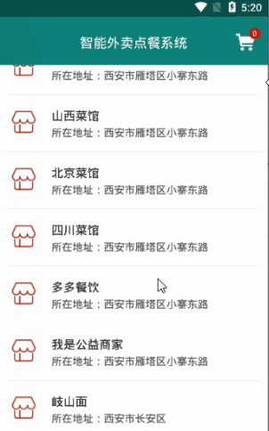
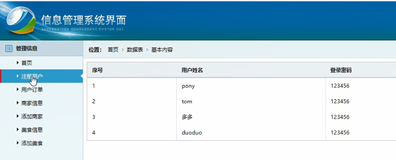

> **博主介绍：**
> 本人专注于Android/java/数据库/微信小程序技术领域的开发，以及有好几年的计算机毕业设计方面的实战开发经验和技术积累；尤其是在安卓（Android）的app的开发和微信小程序的开发，很是熟悉和了解；本人也是多年的Android开发人员；希望我发布的此篇文件可以帮助到您；

####  源码下载

> <https://download.csdn.net/download/u014388322/88153119>

#### 一、项目介绍

> 基于Android的智能外卖点餐系统设计与实现
>
>  
>  客户端：  
>  1：注册登录：用户可以通过自己的信息进行登录和注册  
>  2：美食信息：用户可以查看发布的美食信息，点击可以查看详情信息  
>  3：订单支付：用户选择选自己想要的美食信息之后可以进行模拟支付  
>  4：我的订单：用户可以查看自己的订单信息  
>  5：订单评价：用户对已经完成的订单可以进行信息的评价  
>  6：地址管理：用户可以添加和查看自己的地址信息  
>  7：个人信息：用户登录之后可以查看用户的基本资料以及对密码信息进行修改
>
>  
>  后台服务端：  
>  1：用户管理：查看用户的注册信息  
>  2：美食信息：添加和管理美食信息  
>  3：订单信息：查看用户的订单信息  
>  4：订单评价：查看用户对订单的评价信息

#### 二、运行环境

> 1：客户端使用Android stuido进行开发；  
>  2：服务端后台使用Myeclipse2014进行开发；  
>  3：mysql数据库进行数据存储；  
>  4：需要jdk1.7以上  
>  5：使用雷电模拟器或者Androidstuio自带的模拟器进行运行

#### 三、使用技术

> **总体设计逻辑和思路：**  
>  1：先设计数据库表文件  
>  2：写服务端jsp页面以及写api接口给客户端提供数据  
>  3：完成后台服务端的数据交互，也就是jsp页面数据的存储和显示  
>  4：进行客户端页面的开发；  
>  5：进行客户端对api接口的调用，也就是获取数据库的数据以及在客户端进行显示
>
> **移动端：**  
>  1：使用android原生控件以及xml布局文件来完成界面的显示  
>  2：使用java代码完成功能的数据和逻辑交互  
>  3：使用http网络请求完成数据的请求；  
>  **4：使用json数据解析完成客户端数据的回调和显示**
>
> **服务端后台：**  
>  1：使用mysql完成数据的存储  
>  2：使用jdbc完成数据库和代码的逻辑交互  
>  3：使用jsp完成网页数据的显示  
>  4：使用java代码完成api接口的编写以及以及数据的回调

#### 四、软件截图

##### 1：客户端功能演示

#####  2：后台演示

#### 五、部分代码

##### 1：购物车代码

>  
>  public class MyCarActivity extends BaseActivity implements
> FoodNumberListner {
>
> // 标题  
>  private TextView mTvTitle;  
>  // 返回  
>  private ImageView mIvBack;  
>  private TextView mIvStu;  
>  private ListView mListMessage;  
>  private List<OrderModel> list_result = new ArrayList<OrderModel>();  
>  private String state;  
>  private LinearLayout mllNomessage;  
>  CarListAdapter orderListAdapter;  
>  private TextView setting_text;  
>  private LinearLayout mllGoBuy;  
>  @Override  
>  protected void onCreate(Bundle savedInstanceState) {  
>  super.onCreate(savedInstanceState);  
>  setContentView(R.layout.activity_mycar);  
>  initWidget();  
>  initData();  
>  }
>
> @Override  
>  public void onClick(View v) {  
>  switch (v.getId()) {  
>  case R.id.mIvBack:  
>  finish();  
>  break;  
>  }  
>  }
>
> @Override  
>  public void initWidget() {  
>  
>  setting_text = (TextView) findViewById(R.id.setting_text);  
>  mIvStu = (TextView) findViewById(R.id.mIvStu);  
>  mIvStu.setText("添加");  
>  mIvStu.setVisibility(View.GONE);  
>  mllNomessage = (LinearLayout) findViewById(R.id.mllNomessage);  
>  mListMessage = (ListView) findViewById(R.id.mListMessage);  
>  mllGoBuy = (LinearLayout) findViewById(R.id.mllGoBuy);  
>  mIvBack = (ImageView) findViewById(R.id.mIvBack);  
>  mTvTitle = (TextView) findViewById(R.id.mTvTitle);  
>  state = this.getIntent().getStringExtra("state");  
>  mTvTitle.setText("我的购物车");  
>  mIvBack.setVisibility(View.VISIBLE);  
>  mIvBack.setOnClickListener(this);  
>  mIvStu.setOnClickListener(this);  
>  mllGoBuy.setOnClickListener(this);  
>  
>  }
>
> @Override  
>  public void initData() {  
>  MessageAction(true);  
>  mListMessage.setOnItemClickListener(new OnItemClickListener() {
>
> @Override  
>  public void onItemClick(AdapterView<?> arg0, View arg1, int pos, long arg3)
> {
>
> Intent intent = new Intent(MyCarActivity.this, OrderMessageActivity.class);  
>  intent.putExtra("msg", list_result.get(pos));  
>  MyCarActivity.this.startActivity(intent);  
>  }  
>  });  
>  
>  
>  
>  mllGoBuy.setOnClickListener(new View.OnClickListener() {  
>  @Override  
>  public void onClick(View view) {
>
> ArrayList<OrderModel> listFoodPay = new ArrayList<OrderModel>();
>
> for (int i = 0; i < list_result.size(); i++) {
>
> if(Integer.valueOf(list_result.get(i).getOrderNumber())!=0){  
>  listFoodPay.add(list_result.get(i));  
>  }
>
> }
>
> Intent intent = new Intent(MyCarActivity.this,PayMessageActivity.class);  
>  intent.putExtra("payShop",(Serializable) listFoodPay);  
>  intent.putExtra("payMoney",foodTotalMoney+"");  
>  MyCarActivity.this.startActivity(intent);  
>  MyCarActivity.this.finish();  
>  }  
>  });  
>  
>  }
>
> private void listOrderDeleteMessage(boolean isShow) {  
>  AjaxParams params = new AjaxParams();  
>  params.put("action_flag", "listOrderDeleteMessage");  
>  params.put("orderUserId", MemberUserUtils.getUid(this));  
>  params.put("orderFoodId", MemberUserUtils.getUid(this));  
>  httpPost(Consts.URL + Consts.APP.OrderAction, params,
> Consts.actionId.resultFlag, isShow, "正在加载...");  
>  }
>
> private void MessageAction(boolean isShow) {  
>  AjaxParams params = new AjaxParams();  
>  params.put("action_flag", "noPayOrder");  
>  params.put("orderUserId", MemberUserUtils.getUid(this));  
>  httpPost(Consts.URL + Consts.APP.OrderAction, params,
> Consts.actionId.resultFlag, isShow, "正在加载...");  
>  }
>
> private void updateAddState(boolean isShow, OrderModel orderModel) {
>
> int orderNumberMgs = Integer.valueOf(orderModel.getOrderNumber());  
>  orderNumberMgs++;  
>  AjaxParams params = new AjaxParams();  
>  params.put("action_flag", "updateAddState");  
>  params.put("orderUserId", MemberUserUtils.getUid(this));  
>  params.put("orderId", orderModel.getOrderId());  
>  params.put("orderNumber", orderNumberMgs + "");  
>  httpPost(Consts.URL + Consts.APP.OrderAction, params,
> Consts.actionId.resultCode, isShow, "正在加载...");  
>  }  
>  
>
>
> private void updateReduceState(boolean isShow, OrderModel orderModel) {
>
> int orderNumberMgs = Integer.valueOf(orderModel.getOrderNumber());  
>  orderNumberMgs--;  
>  AjaxParams params = new AjaxParams();  
>  params.put("action_flag", "updateReduceState");  
>  params.put("orderUserId", MemberUserUtils.getUid(this));  
>  params.put("orderId", orderModel.getOrderId());  
>  params.put("orderNumber", orderNumberMgs + "");  
>  httpPost(Consts.URL + Consts.APP.OrderAction, params,
> Consts.actionId.resultMsg, isShow, "正在加载...");  
>  }  
>
>
> @Override  
>  protected void callBackSuccess(ResponseEntry entry, int actionId) {  
>  super.callBackSuccess(entry, actionId);
>
> switch (actionId) {  
>  case Consts.actionId.resultFlag:  
>  if (null != entry.getData() && !TextUtils.isEmpty(entry.getData())) {
>
> String jsonMsg = entry.getData().substring(1, entry.getData().length() - 1);  
>  if (null != jsonMsg && !TextUtils.isEmpty(jsonMsg)) {  
>  list_result.clear();  
>  list_result = mGson.fromJson(entry.getData(), new
> TypeToken<List<OrderModel>>() {  
>  }.getType());  
>  TotalMoney();  
>  orderListAdapter = new CarListAdapter(MyCarActivity.this, list_result,
> MyCarActivity.this);  
>  mListMessage.setAdapter(orderListAdapter);  
>  } else {  
>  mllNomessage.setVisibility(View.VISIBLE);  
>  }  
>  }  
>  break;  
>  case Consts.actionId.resultCode:
>
> OrderModel checkOrderModel = list_result.get(posNum);  
>  int orderNumberMgs = Integer.valueOf(checkOrderModel.getOrderNumber());  
>  orderNumberMgs++;  
>  checkOrderModel.setOrderNumber(orderNumberMgs+"");  
>  list_result.set(posNum, checkOrderModel);  
>  orderListAdapter.notifyDataSetChanged();  
>  TotalMoney();  
>  break;  
>  
>  case Consts.actionId.resultMsg:
>
> OrderModel checkOrderModelReDuce = list_result.get(posNum);  
>  int orderNumberReDuce =
> Integer.valueOf(checkOrderModelReDuce.getOrderNumber());  
>  orderNumberReDuce--;  
>  
>  if(orderNumberReDuce==0){  
>  list_result.remove(posNum);  
>  }else{  
>  checkOrderModelReDuce.setOrderNumber(orderNumberReDuce+"");  
>  list_result.set(posNum, checkOrderModelReDuce);  
>  }  
>  orderListAdapter.notifyDataSetChanged();  
>  TotalMoney();  
>  break;  
>  
>  default:  
>  break;  
>  }
>
> }
>
> /**  
>  * 加的操作  
>  *  
>  * @param pos  
>  * @param shopModel  
>  */
>
> int posNum;
>
> @Override  
>  public void setAdd(int pos, OrderModel orderModel) {  
>  posNum = pos;  
>  updateAddState(false, orderModel);  
>  }
>
> /**  
>  * 减的操作  
>  *  
>  * @param pos  
>  * @param shopModel  
>  */
>
> @Override  
>  public void setReduce(int pos, OrderModel orderModel) {  
>  posNum = pos;  
>  updateReduceState(false, orderModel);  
>  }
>
>  
>  int foodTotalMoney ;  
>  /**  
>  * 计算总价格  
>  */  
>  private void TotalMoney() {
>
> int shopMoneyPrice = 0;  
>  int shopNumber = 0;  
>  for (int i = 0; i < list_result.size(); i++) {
>
> int shopmonyTotal = Integer.valueOf(list_result.get(i).getOrderNumber()) *
> Integer.valueOf(list_result.get(i).getOrderFoodMoney());  
>  shopMoneyPrice = shopMoneyPrice + shopmonyTotal;  
>  shopNumber = shopNumber +
> Integer.valueOf(list_result.get(i).getOrderNumber());  
>  }  
>  foodTotalMoney = shopMoneyPrice;  
>  setting_text.setText("总价格：" + shopMoneyPrice + "元");  
>  }
>
> }  
>

##### 2：添加地址信息代码

>  
>  public class CreatJiJianActivity extends BaseActivity {  
>  // 标题  
>  private TextView mTvTitle;  
>  // 返回  
>  private ImageView mIvBack;
>
> private Button mSubmit;
>
> private EditText sendJiJianName;  
>  private EditText sendJiJianAddress;  
>  private EditText sendJiJianPhone;
>
>  
>  @Override  
>  protected void onCreate(Bundle savedInstanceState) {  
>  super.onCreate(savedInstanceState);  
>  setContentView(R.layout.activity_create_jijian);  
>  initWidget();  
>  initData();  
>  }
>
> @Override  
>  public void onClick(View v) {  
>  switch (v.getId()) {  
>  case R.id.mIvBack:  
>  finish();  
>  break;  
>  case R.id.mSubmit:  
>  addJiJian(true);  
>  break;
>
> }  
>  }
>
> @Override  
>  public void initWidget() {
>
>  
>  sendJiJianName = (EditText) findViewById(R.id.sendJiJianName);  
>  sendJiJianAddress = (EditText) findViewById(R.id.sendJiJianAddress);  
>  sendJiJianPhone = (EditText) findViewById(R.id.sendJiJianPhone);
>
>  
>  mSubmit = (Button) findViewById(R.id.mSubmit);  
>  mIvBack = (ImageView) findViewById(R.id.mIvBack);  
>  mTvTitle = (TextView) findViewById(R.id.mTvTitle);  
>  mTvTitle.setText("添加地址信息");  
>  mIvBack.setVisibility(View.VISIBLE);  
>  mIvBack.setOnClickListener(this);  
>  mSubmit.setOnClickListener(this);
>
>  
>  }
>
> UserModel userModel;  
>  List<String> listData = new ArrayList<String>();
>
> @Override  
>  public void initData() {
>
>  
>  }
>
> private void addJiJian(boolean isShow) {
>
> AjaxParams params = new AjaxParams();  
>  params.put("action_flag", "addJiJian");  
>  params.put("jijianName", sendJiJianName.getText().toString());  
>  params.put("jijianAddresse", sendJiJianAddress.getText().toString());  
>  params.put("jijianPhone", sendJiJianPhone.getText().toString());  
>  params.put("jijianUserId", MemberUserUtils.getUid(this));  
>  httpPost(Consts.URL + Consts.APP.FoodAction, params,
> Consts.actionId.resultCode, isShow, "正在上传...");
>
> }
>
> @Override  
>  protected void callBackSuccess(ResponseEntry entry, int actionId) {  
>  super.callBackSuccess(entry, actionId);  
>  AddressObservable.getInstance().notifyStepChange("ok");  
>  ToastUtil.show(CreatJiJianActivity.this, entry.getRepMsg());  
>  new Handler().postDelayed(new Runnable() {  
>  //  
>  @Override  
>  public void run() {  
>  finish();  
>  }  
>  }, 2000);  
>  }
>
> @Override  
>  protected void callBackAllFailure(String strMsg, int actionId) {  
>  super.callBackAllFailure(strMsg, actionId);  
>  ToastUtil.show(CreatJiJianActivity.this, strMsg);
>
> }
>
> }  
>

#### 六、浏览更多Android毕业设计

[毕业设计-基于android的租房信息发布平台的APP_信息发布app源码_Android毕业设计源码的博客-
CSDN博客](https://blog.csdn.net/u014388322/article/details/100656450?spm=1001.2014.3001.5502
"毕业设计-基于android的租房信息发布平台的APP_信息发布app源码_Android毕业设计源码的博客-CSDN博客")

[毕业设计-基于android选课系统的设计与实现_android学生选课系统_Android毕业设计源码的博客-
CSDN博客](https://blog.csdn.net/u014388322/article/details/100656536?spm=1001.2014.3001.5502
"毕业设计-基于android选课系统的设计与实现_android学生选课系统_Android毕业设计源码的博客-CSDN博客")

[毕业设计之校园一卡通管理系统的设计与实现_一卡通管理系统实现_Android毕业设计源码的博客-
CSDN博客](https://blog.csdn.net/u014388322/article/details/126048550?spm=1001.2014.3001.5502
"毕业设计之校园一卡通管理系统的设计与实现_一卡通管理系统实现_Android毕业设计源码的博客-CSDN博客")

[基于Android的校园二手闲置物品交易系统设计与实现_基于android的二手交易平台_Android毕业设计源码的博客-
CSDN博客](https://blog.csdn.net/u014388322/article/details/128232475?spm=1001.2014.3001.5502
"基于Android的校园二手闲置物品交易系统设计与实现_基于android的二手交易平台_Android毕业设计源码的博客-CSDN博客")

[基于androidstudio校园快递APP系统的设计与实现_android studio论文_Android毕业设计源码的博客-
CSDN博客](https://blog.csdn.net/u014388322/article/details/128545390?spm=1001.2014.3001.5502
"基于androidstudio校园快递APP系统的设计与实现_android studio论文_Android毕业设计源码的博客-CSDN博客")

[基于android的商城购物定制APP_安卓开发购物app_Android毕业设计源码的博客-
CSDN博客](https://blog.csdn.net/u014388322/article/details/128746697?spm=1001.2014.3001.5502
"基于android的商城购物定制APP_安卓开发购物app_Android毕业设计源码的博客-CSDN博客")

> 更多毕业设计可以浏览我的个人主页哦！

#### ​

>

