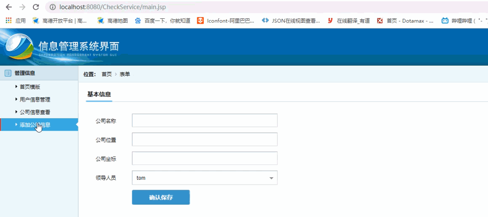
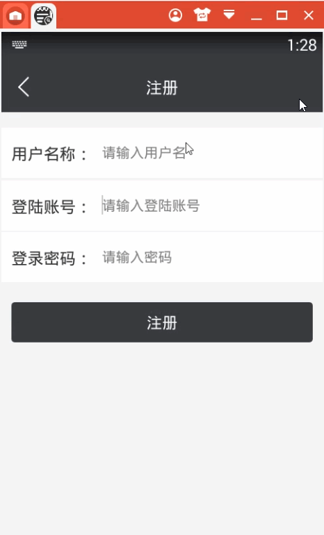

> **博主介绍：**
> 本人专注于Android/java/数据库/微信小程序技术领域的开发，以及有好几年的计算机毕业设计方面的实战开发经验和技术积累；尤其是在安卓（Android）的app的开发和微信小程序的开发，很是熟悉和了解；本人也是多年的Android开发人员；希望我发布的此篇文件可以帮助到您；
>
> 🍅 **文章末尾获取源码下载方式** 🍅

#### 后台功能演示：

#### 客户端功能演示：

#### 一、项目介绍

> **功能需求**
>
> **1** **，登录部分:用户名，密码，注册，忘记密码找回**
>
> **2，领导开启签到** **，签退，** **5分钟以内，职工** **签到有效，过了时间段为失败**
>
> **3** **，员工签到必须要在公司位置** **100** **米范围内为有效签到，可以借用百度地图**
>
> **5** **，考勤记录分为正常，旷工，早退，迟到四种情况**
>
> **6** **，领导管理权限更高，可以查看，修改考勤记录，职工权限低，只能查看考勤记录**
>
> **7** **，领导可以批假和不批假，职工可以请假**
>
> **8** **，天气预报功能预报第二天天气**
>
> **9** **，风格定义为淡蓝色，白色，简洁**

#### 二、运行环境

> 1：客户端使用Android stuido进行开发；  
>  2：服务端后台使用Myeclipse2014进行开发；  
>  3：mysql数据库进行数据存储；  
>  4：需要jdk1.7以上  
>  5：使用雷电模拟器或者Androidstuio自带的模拟器进行运行

#### 三、使用技术

> **总体设计逻辑和思路：**  
>  1：先设计数据库表文件  
>  2：写服务端jsp页面以及写api接口给客户端提供数据  
>  3：完成后台服务端的数据交互，也就是jsp页面数据的存储和显示  
>  4：进行客户端页面的开发；  
>  5：进行客户端对api接口的调用，也就是获取数据库的数据以及在客户端进行显示
>
> **移动端：**  
>  1：使用android原生控件以及xml布局文件来完成界面的显示  
>  2：使用java代码完成功能的数据和逻辑交互  
>  3：使用http网络请求完成数据的请求；  
>  **4：使用json数据解析完成客户端数据的回调和显示**
>
> **服务端后台：**  
>  1：使用mysql完成数据的存储  
>  2：使用jdbc完成数据库和代码的逻辑交互  
>  3：使用jsp完成网页数据的显示  
>  4：使用java代码完成api接口的编写以及以及数据的回调

#### 四、数据库设计

> /*  
>  Navicat MySQL Data Transfer
>
> Source Server : mydb  
>  Source Server Version : 50528  
>  Source Host : localhost:3306  
>  Source Database : checkdb
>
> Target Server Type : MYSQL  
>  Target Server Version : 50528  
>  File Encoding : 65001
>
> Date: 2019-03-13 01:32:51  
>  */
>
> SET FOREIGN_KEY_CHECKS=0;
>
> \-- ----------------------------  
>  \-- Table structure for companysigntb  
>  \-- ----------------------------  
>  DROP TABLE IF EXISTS `companysigntb`;  
>  CREATE TABLE `companysigntb` (  
>  `companysignId` int(50) NOT NULL AUTO_INCREMENT,  
>  `companysignStartTime` varchar(255) DEFAULT NULL,  
>  `companysignCoordinate` varchar(255) DEFAULT NULL,  
>  `companysignState` varchar(255) DEFAULT NULL,  
>  PRIMARY KEY (`companysignId`)  
>  ) ENGINE=InnoDB AUTO_INCREMENT=11 DEFAULT CHARSET=utf8;
>
> \-- ----------------------------  
>  \-- Records of companysigntb  
>  \-- ----------------------------  
>  INSERT INTO `companysigntb` VALUES ('6', '2019-03-13 00:15:21',
> '108.948367,34.251385', '签到');  
>  INSERT INTO `companysigntb` VALUES ('7', '2019-03-13 00:28:31',
> '108.948367,34.251385', '签到');  
>  INSERT INTO `companysigntb` VALUES ('8', '2019-03-13 00:31:26',
> '108.948367,34.251385', '签到');  
>  INSERT INTO `companysigntb` VALUES ('9', '2019-03-13 00:42:54',
> '108.948367,34.251385', '签到');  
>  INSERT INTO `companysigntb` VALUES ('10', '2019-03-13 01:28:28',
> '108.948367,34.251385', '签到');
>
> \-- ----------------------------  
>  \-- Table structure for companytb  
>  \-- ----------------------------  
>  DROP TABLE IF EXISTS `companytb`;  
>  CREATE TABLE `companytb` (  
>  `companyId` int(50) NOT NULL AUTO_INCREMENT,  
>  `companyName` varchar(255) DEFAULT NULL,  
>  `companyAddress` varchar(255) DEFAULT NULL,  
>  `companyCoordinate` varchar(255) DEFAULT NULL,  
>  `companyUserId` varchar(11) DEFAULT NULL,  
>  `companyUserName` varchar(255) DEFAULT NULL,  
>  `companyTime` varchar(100) DEFAULT NULL,  
>  PRIMARY KEY (`companyId`)  
>  ) ENGINE=InnoDB AUTO_INCREMENT=3 DEFAULT CHARSET=utf8;
>
> \-- ----------------------------  
>  \-- Records of companytb  
>  \-- ----------------------------  
>  INSERT INTO `companytb` VALUES ('2', '多多科技', '西安市雁塔区',
> '108.948367,34.251385', '108', 'tom', '2019-03-12 23:58');
>
> \-- ----------------------------  
>  \-- Table structure for leavetb  
>  \-- ----------------------------  
>  DROP TABLE IF EXISTS `leavetb`;  
>  CREATE TABLE `leavetb` (  
>  `leaveId` int(50) NOT NULL AUTO_INCREMENT,  
>  `leaveStartTime` varchar(100) DEFAULT NULL,  
>  `leaveEndTime` varchar(100) DEFAULT NULL,  
>  `leaveMessage` varchar(255) DEFAULT NULL,  
>  `leaveUserId` varchar(11) DEFAULT NULL,  
>  `leaveUserName` varchar(255) DEFAULT NULL,  
>  `leaveTime` varchar(100) DEFAULT NULL,  
>  `leaveState` varchar(255) DEFAULT NULL,  
>  PRIMARY KEY (`leaveId`)  
>  ) ENGINE=InnoDB AUTO_INCREMENT=5 DEFAULT CHARSET=utf8;
>
> \-- ----------------------------  
>  \-- Records of leavetb  
>  \-- ----------------------------  
>  INSERT INTO `leavetb` VALUES ('1', '2019-03-12 23:01', '2019-03-14 23:01',
> '有事情需要紧急处理，望批准！', '109', 'tom', '2019-03-12', '2');  
>  INSERT INTO `leavetb` VALUES ('2', '2019-04-12 22:25', '2019-05-12 23:25',
> '有事情需要紧急处理，望批准！', '109', 'pony', '2019-03-12', '3');  
>  INSERT INTO `leavetb` VALUES ('3', '2019-03-13 01:28', '2019-03-15 01:28',
> '有事情需要紧急处理，望批准！', '110', '小多读', '2019-03-13', '2');  
>  INSERT INTO `leavetb` VALUES ('4', '2019-03-15 01:28', '2019-04-13 01:28',
> '有事情需要紧急处理，望批准！', '110', '小多读', '2019-03-13', '3');
>
> \-- ----------------------------  
>  \-- Table structure for signtb  
>  \-- ----------------------------  
>  DROP TABLE IF EXISTS `signtb`;  
>  CREATE TABLE `signtb` (  
>  `signId` int(50) NOT NULL AUTO_INCREMENT,  
>  `signUserId` varchar(11) DEFAULT NULL,  
>  `signUserName` varchar(255) DEFAULT NULL,  
>  `signTime` varchar(100) DEFAULT NULL,  
>  `signType` varchar(255) DEFAULT NULL,  
>  PRIMARY KEY (`signId`)  
>  ) ENGINE=InnoDB AUTO_INCREMENT=3 DEFAULT CHARSET=utf8;
>
> \-- ----------------------------  
>  \-- Records of signtb  
>  \-- ----------------------------  
>  INSERT INTO `signtb` VALUES ('1', '109', 'pony', '2019-03-13', '正常');  
>  INSERT INTO `signtb` VALUES ('2', '110', '小多读', '2019-03-13', '正常');
>
> \-- ----------------------------  
>  \-- Table structure for user  
>  \-- ----------------------------  
>  DROP TABLE IF EXISTS `user`;  
>  CREATE TABLE `user` (  
>  `userId` int(255) NOT NULL AUTO_INCREMENT,  
>  `userName` varchar(200) CHARACTER SET utf8 NOT NULL,  
>  `userPhone` varchar(100) CHARACTER SET utf8 NOT NULL,  
>  `userPswd` varchar(200) CHARACTER SET utf8 NOT NULL,  
>  `userTime` varchar(300) CHARACTER SET utf8 NOT NULL,  
>  `userType` varchar(255) CHARACTER SET utf8 DEFAULT NULL,  
>  `companyCoordinate` varchar(255) CHARACTER SET utf8 DEFAULT NULL,  
>  PRIMARY KEY (`userId`)  
>  ) ENGINE=InnoDB AUTO_INCREMENT=112 DEFAULT CHARSET=latin1;
>
> \-- ----------------------------  
>  \-- Records of user  
>  \-- ----------------------------  
>  INSERT INTO `user` VALUES ('108', 'tom', '15249243002', '123456',
> '2019-03-12 16:38', '领导', '108.948367,34.251385');  
>  INSERT INTO `user` VALUES ('109', 'pony', '15249243001', '123456',
> '2019-03-12 16:39', '员工', null);  
>  INSERT INTO `user` VALUES ('110', '小多读', '15249243003', '123456',
> '2019-03-12 23:48', '员工', null);  
>  INSERT INTO `user` VALUES ('111', '小艾', '15249243004', '123456',
> '2019-03-12 23:49', '员工', null);  
>

#### 五、部分代码

##### 1：员工签到

>  
>  public class SignMessageActivity extends BaseActivity implements
> AMapLocationListener, LocationSource, AMap.OnMarkerClickListener {  
>  SceneryModel sceneryModel;  
>  float distance;  
>  // title  
>  private TextView mTvTitle;  
>  // 返回  
>  private ImageView mIvBack;  
>  private TextView mtvMessagetitle;  
>  private TextView mtvShopPriceTip;  
>  private Button mbtnPay;  
>  private TextView mIvStu;  
>  private AmapTTSController amapTTSController;  
>  private LocationSource.OnLocationChangedListener mListener;  
>  private AMapLocationClient mlocationClient;  
>  private AMapLocationClientOption mLocationOption;  
>  // 定位返回的数据信息  
>  private AMapLocation aMapLocationMessage;  
>  private AMap aMap;  
>  private MapView mapView;  
>  private MediaPlayer mediaPlayer;  
>  private SensorEventHelper mSensorHelper;
>
> private TextView mtvType;
>
> @Override  
>  protected void onCreate(Bundle savedInstanceState) {  
>  super.onCreate(savedInstanceState);  
>  setContentView(R.layout.activity_shop_message);  
>  mapView = (MapView) findViewById(R.id.mMapView);  
>  mapView.onCreate(savedInstanceState);// 此方法必须重写  
>  init();  
>  initWidget();  
>  initData();  
>  }
>
> /**  
>  * 初始化  
>  */  
>  private void init() {  
>  if (aMap == null) {  
>  aMap = mapView.getMap();
>
> setUpMap();  
>  }  
>  mSensorHelper = new SensorEventHelper(this);  
>  if (mSensorHelper != null) {  
>  mSensorHelper.registerSensorListener();  
>  }
>
> }
>
> @Override  
>  public void initWidget() {  
>  mtvType = (TextView) findViewById(R.id.mtvType);
>
> mtvShopPriceTip = (TextView) findViewById(R.id.mtvShopPriceTip);  
>  mIvStu = (TextView) findViewById(R.id.mIvStu);  
>  mbtnPay = (Button) findViewById(R.id.mbtnPay);  
>  mbtnPay.setOnClickListener(this);  
>  mtvMessagetitle = (TextView) findViewById(R.id.mtvMessagetitle);  
>  mIvBack = (ImageView) findViewById(R.id.mIvBack);  
>  mTvTitle = (TextView) findViewById(R.id.mTvTitle);  
>  mTvTitle.setText("员工签到详情");  
>  mIvBack.setVisibility(View.VISIBLE);  
>  mIvBack.setOnClickListener(this);  
>  mIvStu.setVisibility(View.GONE);  
>  mIvStu.setOnClickListener(this);  
>  listAllUser(false);  
>  }
>
>  
>  private void listAllUser(boolean isShow) {  
>  AjaxParams params = new AjaxParams();  
>  params.put("action_flag", "listSignMessagePhone");  
>  httpPost(Consts.URL + Consts.APP.MessageAction, params,
> Consts.actionId.resultState, isShow, "正在更新...");  
>  }
>
>  
>  private void addSign(boolean isShow) {  
>  SimpleDateFormat df = new SimpleDateFormat("yyyy-MM-dd");// 设置日期格式  
>  AjaxParams params = new AjaxParams();  
>  params.put("action_flag", "addSign");  
>  params.put("signUserId", MemberUserUtils.getUid(this));  
>  params.put("signUserName", MemberUserUtils.getName(this));  
>  params.put("signTime", df.format(new Date()));  
>  params.put("signType", "正常");  
>  httpPost(Consts.URL + Consts.APP.MessageAction, params,
> Consts.actionId.resultCode, isShow, "正在更新...");  
>  }
>
> private List<SignCompanyModel> list_result = new
> ArrayList<SignCompanyModel>();  
>  @Override  
>  protected void callBackSuccess(ResponseEntry entry, int actionId) {  
>  super.callBackSuccess(entry, actionId);
>
> switch (actionId) {
>
> case Consts.actionId.resultState:
>
> if (null != entry.getData() && !TextUtils.isEmpty(entry.getData())) {  
>  String jsonMsg = entry.getData().substring(1, entry.getData().length() -
> 1);
>
> if (null != jsonMsg && !TextUtils.isEmpty(jsonMsg)) {  
>  list_result.clear();  
>  list_result = mGson.fromJson(entry.getData(), new
> TypeToken<List<SignCompanyModel>>() {  
>  }.getType());
>
> SimpleDateFormat df = new SimpleDateFormat("yyyy-MM-dd HH:mm:ss");// 设置日期格式  
>  SimpleDateFormat simpleDateFormat = new SimpleDateFormat("yyyy-MM-dd
> HH:mm:ss");// 24小时制  
>  long timeChoice = 0;  
>  long nowChoice = 0;
>
> try {  
>  timeChoice =
> simpleDateFormat.parse(list_result.get(list_result.size()-1).getCompanysignStartTime()).getTime();  
>  nowChoice = simpleDateFormat.parse(df.format(new Date()) + "").getTime();
>
>  
>
> mtvType.setText("距离"+list_result.get(list_result.size()-1).getCompanysignState()+"结束还有");  
>  } catch (ParseException e) {  
>  // TODO Auto-generated catch block  
>  e.printStackTrace();  
>  }
>
>  
>  leftTime = 300-((nowChoice - timeChoice) / 1000);
>
> if(leftTime<300){  
>  handler.postDelayed(update_thread, 1000);  
>  }else{  
>  mtvType.setText("已结束");  
>  }
>
>  
>  } else {  
>  }  
>  }else{
>
> }  
>  break;  
>  case Consts.actionId.resultCode:  
>  CustomToast.showToast(this,entry.getRepMsg());  
>  break;  
>  }  
>  }
>
> /**  
>  * 设置一些amap的属性  
>  */  
>  private void setUpMap() {  
>  aMap.setLocationSource(this);// 设置定位监听  
>  aMap.getUiSettings().setMyLocationButtonEnabled(true);// 设置默认定位按钮是否显示  
>  aMap.setMyLocationEnabled(true);//
> 设置为true表示显示定位层并可触发定位，false表示隐藏定位层并不可触发定位，默认是false  
>  // 设置定位的类型为定位模式 ，可以由定位、跟随或地图根据面向方向旋转几种  
>  aMap.setMyLocationType(AMap.LOCATION_TYPE_LOCATE);
>
> }
>
> @Override  
>  public void onClick(View v) {
>
> switch (v.getId()) {  
>  case R.id.mIvBack:  
>  SignMessageActivity.this.finish();  
>  break;
>
> case R.id.mbtnPay:
>
> if (distance> 100) {  
>  CustomToast.showToast(this, "你不在打卡范围内！");  
>  return;  
>  }
>
> addSign(true);  
>  break;  
>  }  
>  }  
>  long leftTime ;  
>  @SuppressLint("SetTextI18n")  
>  @Override  
>  public void initData() {
>
>  
>  }
>
> boolean addDataFlag = true;  
>  @Override  
>  public void onLocationChanged(AMapLocation amapLocation) {  
>  if (amapLocation != null) {  
>  if (amapLocation.getErrorCode() == 0) {  
>  // 定位成功回调信息，设置相关消息  
>  amapLocation.getLocationType();// 获取当前定位结果来源，如网络定位结果，详见定位类型表  
>  amapLocation.getLatitude();// 获取纬度  
>  amapLocation.getLongitude();// 获取经度  
>  amapLocation.getAccuracy();// 获取精度信息
>
>  
>  if(list_result.size()>0){  
>  String coordinate
> =list_result.get(list_result.size()-1).getCompanysignCoordinate();  
>  LatLng my = new LatLng( amapLocation.getLatitude(),
> amapLocation.getLongitude());  
>  LatLng end = new LatLng(Double.valueOf(coordinate.split(",")[1]),
> Double.valueOf(coordinate.split(",")[0]));  
>  distance = AMapUtils.calculateLineDistance(my, end);  
>  // mtvShopPriceTip.setText("距离公司：" + formatDouble5(distance * 0.001) +
> "km");
>
> mtvShopPriceTip.setText("距离公司：" + formatDouble5(distance ) + "m");
>
>  
>  }
>
>  
>  Log.i("pony_log", "距离和位置：" + amapLocation.getAddress() + ",distance:" +
> distance);  
>  // Log.i("pony_log", "获取定位数据：" + amapLocation.getLatitude() + "," +
> amapLocation.getLongitude());  
>  } else {  
>  // 显示错误信息ErrCode是错误码，errInfo是错误信息，详见错误码表。  
>  Log.e("AmapError", "location Error, ErrCode:" + amapLocation.getErrorCode()
> + ", errInfo:" + amapLocation.getErrorInfo());  
>  }  
>  }  
>  }
>
> public static String formatDouble5(double d) {  
>  return String.format("%.2f", d);  
>  }
>
>  
>  /**  
>  * 方法必须重写  
>  */  
>  @Override  
>  public void onResume() {  
>  super.onResume();
>
> mapView.onResume();  
>  initWidget();  
>  initData();  
>  if (mSensorHelper != null) {  
>  mSensorHelper.registerSensorListener();  
>  } else {  
>  mSensorHelper = new SensorEventHelper(this);  
>  if (mSensorHelper != null) {  
>  mSensorHelper.registerSensorListener();
>
>  
>  }  
>  }  
>  }
>
> /**  
>  * 方法必须重写  
>  */  
>  @Override  
>  public void onPause() {  
>  super.onPause();  
>  if (mSensorHelper != null) {  
>  mSensorHelper.unRegisterSensorListener();  
>  mSensorHelper.setCurrentMarker(null);  
>  mSensorHelper = null;  
>  }  
>  mapView.onPause();  
>  deactivate();
>
> }
>
> /**  
>  * 方法必须重写  
>  */  
>  @Override  
>  public void onSaveInstanceState(Bundle outState) {  
>  super.onSaveInstanceState(outState);  
>  mapView.onSaveInstanceState(outState);  
>  }
>
> /**  
>  * 方法必须重写  
>  */  
>  @Override  
>  public void onDestroy() {  
>  super.onDestroy();  
>  mapView.onDestroy();  
>  if (null != mlocationClient) {  
>  mlocationClient.onDestroy();  
>  }
>
> }
>
> /**  
>  * 停止定位  
>  */  
>  @Override  
>  public void deactivate() {  
>  mListener = null;  
>  if (mlocationClient != null) {  
>  mlocationClient.stopLocation();  
>  mlocationClient.onDestroy();  
>  }  
>  mlocationClient = null;  
>  }
>
>  
>  /**  
>  * 激活定位  
>  */  
>  @Override  
>  public void activate(OnLocationChangedListener listener) {  
>  mListener = listener;  
>  if (mlocationClient == null) {  
>  mlocationClient = new AMapLocationClient(this);  
>  mLocationOption = new AMapLocationClientOption();  
>  // // 设置定位监听  
>  mlocationClient.setLocationListener(this);  
>  // // 设置为高精度定位模式  
>
> mLocationOption.setLocationMode(AMapLocationClientOption.AMapLocationMode.Hight_Accuracy);  
>  // 设置定位参数  
>  // mlocationClient.setLocationOption(mLocationOption);  
>  // 此方法为每隔固定时间会发起一次定位请求，为了减少电量消耗或网络流量消耗，  
>  // 注意设置合适的定位时间的间隔（最小间隔支持为2000ms），并且在合适时间调用stopLocation()方法来取消定位请求  
>  // 在定位结束后，在合适的生命周期调用onDestroy()方法  
>  // 在单次定位情况下，定位无论成功与否，都无需调用stopLocation()方法移除请求，定位sdk内部会移除
>
> //获取一次定位结果：  
>  //该方法默认为false。  
>  mLocationOption.setOnceLocation(true);  
>  //获取最近3s内精度最高的一次定位结果：  
>  //设置setOnceLocationLatest(boolean
> b)接口为true，启动定位时SDK会返回最近3s内精度最高的一次定位结果。如果设置其为true，setOnceLocation(boolean
> b)接口也会被设置为true，反之不会，默认为false。  
>  mLocationOption.setOnceLocationLatest(true);  
>  mlocationClient.startLocation();  
>  }  
>  }
>
> private void openAssetMusics() {
>
> try {  
>  // 播放 assets/a2.mp3 音乐文件  
>  AssetFileDescriptor fd = this.getAssets().openFd("tipmusic.mp3");  
>  mediaPlayer = new MediaPlayer();  
>  mediaPlayer.setDataSource(fd.getFileDescriptor(), fd.getStartOffset(),
> fd.getLength());  
>  mediaPlayer.prepare();  
>  mediaPlayer.start();  
>  } catch (IOException e) {  
>  e.printStackTrace();  
>  }  
>  }
>
> Handler handler = new Handler();  
>  Runnable update_thread = new Runnable() {  
>  @Override  
>  public void run() {  
>  leftTime--;  
>  if (leftTime > 0) {  
>  //倒计时效果展示  
>  String formatLongToTimeStr = formatLongToTimeStr(leftTime);  
>  mtvMessagetitle.setText(formatLongToTimeStr);  
>  //每一秒执行一次  
>  handler.postDelayed(this, 1000);  
>  } else {//倒计时结束  
>  //处理业务流程
>
> //发送消息，结束倒计时  
>  Message message = new Message();  
>  message.what = 1;  
>  handlerStop.sendMessage(message);  
>  }  
>  }  
>  };
>
> @SuppressLint("HandlerLeak")  
>  final Handler handlerStop = new Handler() {  
>  public void handleMessage(Message msg) {  
>  switch (msg.what) {  
>  case 1:  
>  leftTime = 0;  
>  handler.removeCallbacks(update_thread);  
>  break;  
>  }  
>  super.handleMessage(msg);  
>  }
>
> };
>
>  
>  public String formatLongToTimeStr(Long l) {  
>  int hour = 0;  
>  int minute = 0;  
>  int second = 0;  
>  second = l.intValue() ;  
>  if (second > 60) {  
>  minute = second / 60; //取整  
>  second = second % 60; //取余  
>  }  
>  if (minute > 60) {  
>  hour = minute / 60;  
>  minute = minute % 60;  
>  }
>
> String minutemsg ="";  
>  String secondmsg ="";  
>  if(minute<10){  
>  minutemsg="0"+minute;  
>  }else{  
>  minutemsg=minute+"";  
>  }
>
> if(second<10){  
>  secondmsg="0"+second;  
>  }else{  
>  secondmsg=""+second;  
>  }
>
> String strtime = minutemsg+"："+secondmsg;  
>  return strtime;  
>  }
>
> @Override  
>  public boolean onMarkerClick(Marker marker) {  
>  return false;  
>  }  
>  }  
>

##### 2：用户登录

>  
>  public class LoginActivity extends BaseActivity {  
>  // title  
>  private TextView mTvTitle;  
>  // 登录用户名称  
>  private EditText mLoginNumber;  
>  // 登录密码  
>  private EditText mLoginPswd;  
>  // 登录按钮  
>  private Button mLogin;  
>  private Button mEnterpriseQuery;  
>  private LinearLayout mllTop;  
>  private UserModel userModel;
>
>  
>  @Override  
>  protected void onCreate(Bundle savedInstanceState) {  
>  super.onCreate(savedInstanceState);  
>  setContentView(R.layout.activity_login);  
>  initWidget();  
>  }
>
> /**  
>  * 控件初始化  
>  */  
>  @Override  
>  public void initWidget() {
>
> mdialog = new LoadingDialog(this, "正在登录");  
>  mTvTitle = (TextView) findViewById(R.id.mTvTitle);  
>  mTvTitle.setText("登录");  
>  mLoginNumber = (EditText) findViewById(R.id.mLoginNumber);  
>  mLoginPswd = (EditText) findViewById(R.id.mLoginPswd);  
>  mLogin = (Button) findViewById(R.id.mLogin);  
>  mEnterpriseQuery = (Button) findViewById(R.id.mEnterpriseQuery);  
>  // mLoginNumber.setInputType(EditorInfo.TYPE_CLASS_PHONE);  
>  // 事件的监听  
>  mLogin.setOnClickListener(this);  
>  mEnterpriseQuery.setOnClickListener(this);  
>  // 给输入框设置默认的测试数据  
>  mLoginNumber.setSelection(mLoginNumber.getText().length());
>
> mLoginNumber.setText("15249243001");  
>  mLoginPswd.setText("123456");
>
> }
>
> @Override  
>  public void onClick(View v) {
>
> switch (v.getId()) {  
>  case R.id.mLogin:  
>  if (TextUtils.isEmpty(mLoginNumber.getText().toString())) {  
>  ToastUtil.ShowCentre(LoginActivity.this, "请输入登陆账号");  
>  return;  
>  }  
>  if (TextUtils.isEmpty(mLoginPswd.getText().toString())) {  
>  ToastUtil.ShowCentre(LoginActivity.this, "请输入登录密码");  
>  return;  
>  }  
>  LoginUserPost(true);  
>  break;
>
> case R.id.mEnterpriseQuery:  
>  Intent mEnterpriseQuery = new Intent(LoginActivity.this,
> RegisterActivity.class);  
>  startActivity(mEnterpriseQuery);  
>  default:  
>  break;  
>  }  
>  }
>
> @Override  
>  public void initData() {  
>  }
>
> /**  
>  * 用户的登录  
>  *  
>  * @param isShow  
>  */  
>  private void LoginUserPost(boolean isShow) {  
>  AjaxParams params = new AjaxParams();  
>  params.put("action_flag", "login");  
>  params.put("userPhone", mLoginNumber.getText().toString());  
>  params.put("userPswd", mLoginPswd.getText().toString());  
>  httpPost(Consts.URL + Consts.APP.RegisterAction, params,
> Consts.actionId.resultFlag, isShow, "正在登录...");  
>  }
>
> @Override  
>  protected void callBackSuccess(ResponseEntry entry, int actionId) {  
>  super.callBackSuccess(entry, actionId);
>
> switch (actionId) {  
>  case Consts.actionId.resultFlag:
>
> if (null != entry.getData() && !TextUtils.isEmpty(entry.getData())) {  
>  userModel = mGson.fromJson(entry.getData(), UserModel.class);  
>  MemberUserUtils.setUid(LoginActivity.this, userModel.getUserId());  
>  MemberUserUtils.setName(LoginActivity.this, userModel.getUserName());  
>  MemberUserUtils.setLoginFlag(LoginActivity.this, "food");  
>  MemberUserUtils.putBean(LoginActivity.this, "user_messgae", userModel);
>
> if(userModel.getUserType().equals("领导")){  
>  Intent intent = new Intent(LoginActivity.this, FrameworkActivity.class);  
>  startActivity(intent);  
>  finish();  
>  }else{  
>  Intent intent = new Intent(LoginActivity.this,
> FrameworUserkActivity.class);  
>  startActivity(intent);  
>  finish();  
>  }
>
> }  
>  break;  
>  }
>
> }
>
> @Override  
>  protected void callBackAllFailure(String strMsg, int actionId) {  
>  super.callBackAllFailure(strMsg, actionId);  
>  ToastUtil.show(LoginActivity.this, strMsg);
>
> }
>
> }

#### 六、浏览更多Android毕业设计

[毕业设计-基于android的租房信息发布平台的APP_信息发布app源码_Android毕业设计源码的博客-
CSDN博客](https://blog.csdn.net/u014388322/article/details/100656450?spm=1001.2014.3001.5502
"毕业设计-基于android的租房信息发布平台的APP_信息发布app源码_Android毕业设计源码的博客-CSDN博客")

[毕业设计-基于android选课系统的设计与实现_android学生选课系统_Android毕业设计源码的博客-
CSDN博客](https://blog.csdn.net/u014388322/article/details/100656536?spm=1001.2014.3001.5502
"毕业设计-基于android选课系统的设计与实现_android学生选课系统_Android毕业设计源码的博客-CSDN博客")

[毕业设计之校园一卡通管理系统的设计与实现_一卡通管理系统实现_Android毕业设计源码的博客-
CSDN博客](https://blog.csdn.net/u014388322/article/details/126048550?spm=1001.2014.3001.5502
"毕业设计之校园一卡通管理系统的设计与实现_一卡通管理系统实现_Android毕业设计源码的博客-CSDN博客")

[基于Android的校园二手闲置物品交易系统设计与实现_基于android的二手交易平台_Android毕业设计源码的博客-
CSDN博客](https://blog.csdn.net/u014388322/article/details/128232475?spm=1001.2014.3001.5502
"基于Android的校园二手闲置物品交易系统设计与实现_基于android的二手交易平台_Android毕业设计源码的博客-CSDN博客")

[基于androidstudio校园快递APP系统的设计与实现_android studio论文_Android毕业设计源码的博客-
CSDN博客](https://blog.csdn.net/u014388322/article/details/128545390?spm=1001.2014.3001.5502
"基于androidstudio校园快递APP系统的设计与实现_android studio论文_Android毕业设计源码的博客-CSDN博客")

[基于android的商城购物定制APP_安卓开发购物app_Android毕业设计源码的博客-
CSDN博客](https://blog.csdn.net/u014388322/article/details/128746697?spm=1001.2014.3001.5502
"基于android的商城购物定制APP_安卓开发购物app_Android毕业设计源码的博客-CSDN博客")

> 更多毕业设计可以浏览我的个人主页哦！

#### 七、源码下载

> ​<https://download.csdn.net/download/u014388322/88179100>

