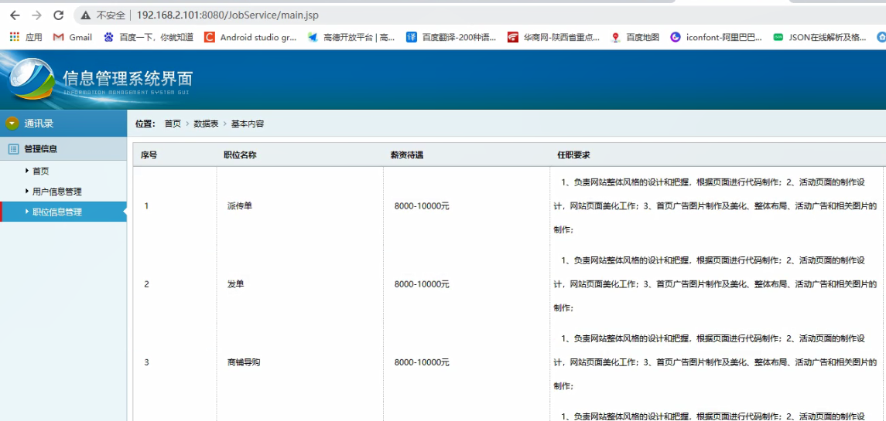
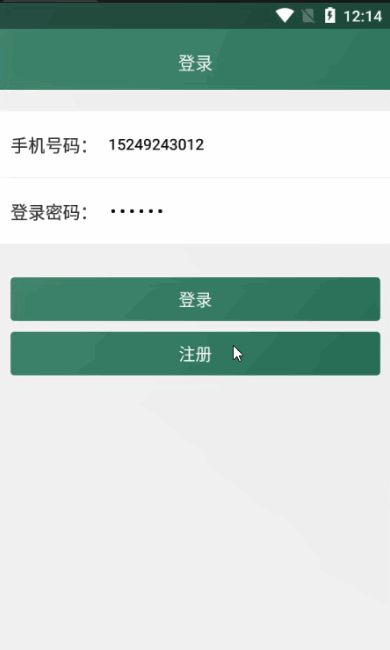

> **博主介绍：**
> 本人专注于Android/java/数据库/微信小程序技术领域的开发，以及有好几年的计算机毕业设计方面的实战开发经验和技术积累；尤其是在安卓（Android）的app的开发和微信小程序的开发，很是熟悉和了解；本人也是多年的Android开发人员；希望我发布的此篇文件可以帮助到您；
>
> 🍅 **文章末尾获取源码下载方式** 🍅

#### 功能演示

**详情演示视频请文字末尾公众号咨询，我会发给您；**

#### 1：后台演示

#### 2：客户端演示

#### 一、项目介绍

> 企业户端：
>
> 1：注册登录：企业通过自己的信息进行注册和登录；
>
> 2：发布兼职：企业用户可以发布兼职信息同时职位可以进行分类；
>
> 3：查看应聘者：查看对于职位的应聘者；
>
> 4：个人信息：查看自己的个人信息以及对密码进行修改
>
> 用户户端：
>
> 1：注册登录：通过自己的信息进行注册和登录；
>
> 2：兼职信息：用户可以查看发布的信息；
>
> 3：应聘兼职：用户可以对自己感兴趣的职位进行应聘；
>
> 4：个人信息：查看自己的个人信息以及对密码进行修改
>
> 后台管理员：
>
> 1：用户信息：可以查看注册的用户信息
>
> 2：求职信息：查看企业发布的兼职信息
>
> 3：应聘信息：查看兼职的应聘信息

#### 二、运行环境

> 1：客户端使用Android stuido进行开发；  
>  2：服务端后台使用Myeclipse2014进行开发；  
>  3：mysql数据库进行数据存储；  
>  4：需要jdk1.7以上  
>  5：使用雷电模拟器或者Androidstuio自带的模拟器进行运行

#### 三、使用技术

> **总体设计逻辑和思路：**  
>  1：先设计数据库表文件  
>  2：写服务端jsp页面以及写api接口给客户端提供数据  
>  3：完成后台服务端的数据交互，也就是jsp页面数据的存储和显示  
>  4：进行客户端页面的开发；  
>  5：进行客户端对api接口的调用，也就是获取数据库的数据以及在客户端进行显示
>
> **移动端：**  
>  1：使用android原生控件以及xml布局文件来完成界面的显示  
>  2：使用java代码完成功能的数据和逻辑交互  
>  3：使用http网络请求完成数据的请求；  
>  **4：使用json数据解析完成客户端数据的回调和显示**
>
> **服务端后台：**  
>  1：使用mysql完成数据的存储  
>  2：使用jdbc完成数据库和代码的逻辑交互  
>  3：使用jsp完成网页数据的显示  
>  4：使用java代码完成api接口的编写以及以及数据的回调

#### 四、数据库设计

    
    
    /*
    Navicat MySQL Data Transfer
    
    Source Server         : mydb
    Source Server Version : 50528
    Source Host           : localhost:3306
    Source Database       : jobdb
    
    Target Server Type    : MYSQL
    Target Server Version : 50528
    File Encoding         : 65001
    
    Date: 2022-03-03 00:17:23
    */
    
    SET FOREIGN_KEY_CHECKS=0;
    
    -- ----------------------------
    -- Table structure for collecttb
    -- ----------------------------
    DROP TABLE IF EXISTS `collecttb`;
    CREATE TABLE `collecttb` (
      `collectId` int(11) NOT NULL AUTO_INCREMENT,
      `collectUserId` int(11) DEFAULT NULL,
      `collectMessageId` int(11) DEFAULT NULL,
      `collectTime` varchar(500) DEFAULT NULL,
      PRIMARY KEY (`collectId`)
    ) ENGINE=InnoDB AUTO_INCREMENT=18 DEFAULT CHARSET=utf8;
    
    -- ----------------------------
    -- Records of collecttb
    -- ----------------------------
    
    -- ----------------------------
    -- Table structure for companytb
    -- ----------------------------
    DROP TABLE IF EXISTS `companytb`;
    CREATE TABLE `companytb` (
      `companyId` int(255) NOT NULL AUTO_INCREMENT,
      `companyName` varchar(255) DEFAULT NULL,
      `companyContent` varchar(255) DEFAULT NULL,
      `companyTime` varchar(255) DEFAULT NULL,
      `userId` int(11) DEFAULT NULL,
      `userName` varchar(255) DEFAULT NULL,
      PRIMARY KEY (`companyId`)
    ) ENGINE=InnoDB AUTO_INCREMENT=3 DEFAULT CHARSET=utf8;
    
    -- ----------------------------
    -- Records of companytb
    -- ----------------------------
    
    -- ----------------------------
    -- Table structure for deliverynumbertb
    -- ----------------------------
    DROP TABLE IF EXISTS `deliverynumbertb`;
    CREATE TABLE `deliverynumbertb` (
      `deliveryNumberId` int(11) NOT NULL AUTO_INCREMENT,
      `deliveryNumberJobId` int(11) DEFAULT NULL,
      `deliveryNumberMsg` int(11) DEFAULT NULL,
      PRIMARY KEY (`deliveryNumberId`)
    ) ENGINE=InnoDB AUTO_INCREMENT=8 DEFAULT CHARSET=utf8;
    
    -- ----------------------------
    -- Records of deliverynumbertb
    -- ----------------------------
    INSERT INTO `deliverynumbertb` VALUES ('1', '3', '1');
    INSERT INTO `deliverynumbertb` VALUES ('2', '7', '2');
    INSERT INTO `deliverynumbertb` VALUES ('3', '8', '1');
    INSERT INTO `deliverynumbertb` VALUES ('4', '9', '1');
    INSERT INTO `deliverynumbertb` VALUES ('5', '11', '3');
    INSERT INTO `deliverynumbertb` VALUES ('6', '10', '1');
    INSERT INTO `deliverynumbertb` VALUES ('7', '12', '1');
    
    -- ----------------------------
    -- Table structure for deliverytb
    -- ----------------------------
    DROP TABLE IF EXISTS `deliverytb`;
    CREATE TABLE `deliverytb` (
      `deliveryId` int(11) NOT NULL AUTO_INCREMENT,
      `deliveryUserId` int(11) DEFAULT NULL,
      `deliveryUserName` varchar(255) DEFAULT NULL,
      `deliveryJobId` int(11) DEFAULT NULL,
      `deliveryResumeId` int(11) DEFAULT NULL,
      `deliveryState` varchar(255) DEFAULT NULL,
      `deliveryCompanyUserId` int(11) DEFAULT NULL,
      `deliveryTime` varchar(255) DEFAULT NULL,
      PRIMARY KEY (`deliveryId`)
    ) ENGINE=InnoDB AUTO_INCREMENT=11 DEFAULT CHARSET=utf8;
    
    -- ----------------------------
    -- Records of deliverytb
    -- ----------------------------
    INSERT INTO `deliverytb` VALUES ('10', '12', '求职人嘻嘻', '12', '-1', '1', '11', '2022-03-03');
    
    -- ----------------------------
    -- Table structure for jobtb
    -- ----------------------------
    DROP TABLE IF EXISTS `jobtb`;
    CREATE TABLE `jobtb` (
      `jobId` int(11) NOT NULL AUTO_INCREMENT,
      `jobName` varchar(255) DEFAULT NULL,
      `jobMoney` varchar(255) DEFAULT NULL,
      `jobAddress` varchar(255) DEFAULT NULL,
      `jobPosition` varchar(255) DEFAULT NULL,
      `jobSkill` varchar(255) DEFAULT NULL,
      `jobTime` varchar(255) DEFAULT NULL,
      `companyUserId` int(11) DEFAULT NULL,
      `companyUserName` varchar(255) DEFAULT NULL,
      `jobTypeId` int(11) DEFAULT NULL,
      `jobTypeName` varchar(255) DEFAULT NULL,
      PRIMARY KEY (`jobId`)
    ) ENGINE=InnoDB AUTO_INCREMENT=13 DEFAULT CHARSET=utf8;
    
    -- ----------------------------
    -- Records of jobtb
    -- ----------------------------
    INSERT INTO `jobtb` VALUES ('1', '派传单', '8000-10000', '西安市莲湖区', '1、负责网站整体风格的设计和把握，根据页面进行代码制作；2、活动页面的制作设计，网站页面美化工作；3、首页广告图片制作及美化、整体布局、活动广告和相关图片的制作；', '1、大专以上学历；美术、设计、计算机相关专业优先考虑；2、对网页设计有独到的理解和创新能力，善于接受新思路，大胆创新；', '2022-03-03 00:01', '2', '企业', '22', '派发传单');
    INSERT INTO `jobtb` VALUES ('2', '发单', '8000-10000', '西安市雁塔区', '1、负责网站整体风格的设计和把握，根据页面进行代码制作；2、活动页面的制作设计，网站页面美化工作；3、首页广告图片制作及美化、整体布局、活动广告和相关图片的制作；', '1、大专以上学历；美术、设计、计算机相关专业优先考虑；2、对网页设计有独到的理解和创新能力，善于接受新思路，大胆创新；', '2022-03-03 00:01', '2', '企业', '22', '派发传单');
    INSERT INTO `jobtb` VALUES ('3', '商铺导购', '8000-10000', '北京市', '1、负责网站整体风格的设计和把握，根据页面进行代码制作；2、活动页面的制作设计，网站页面美化工作；3、首页广告图片制作及美化、整体布局、活动广告和相关图片的制作；', '1、大专以上学历；美术、设计、计算机相关专业优先考虑；2、对网页设计有独到的理解和创新能力，善于接受新思路，大胆创新；', '2022-03-03 00:01', '2', '企业', '21', '超市导购');
    INSERT INTO `jobtb` VALUES ('5', '超市导购', '8000-10000', '上海市', '1、负责网站整体风格的设计和把握，根据页面进行代码制作；2、活动页面的制作设计，网站页面美化工作；3、首页广告图片制作及美化、整体布局、活动广告和相关图片的制作；', '1、大专以上学历；美术、设计、计算机相关专业优先考虑；2、对网页设计有独到的理解和创新能力，善于接受新思路，大胆创新；', '2022-03-03 00:01', '1', '多多', '21', '超市导购');
    INSERT INTO `jobtb` VALUES ('7', '家教', '100', '西安市长安区', '1、负责网站整体风格的设计和把握，根据页面进行代码制作；2、活动页面的制作设计，网站页面美化工作；3、首页广告图片制作及美化、整体布局、活动广告和相关图片的制作；', '1、大专以上学历；美术、设计、计算机相关专业优先考虑；2、对网页设计有独到的理解和创新能力，善于接受新思路，大胆创新；', '2022-03-03 00:01', '4', '企业数据', '24', '家教');
    INSERT INTO `jobtb` VALUES ('12', '送外卖', '8000-10000', '西安市', '1、负责网站整体风格的设计和把握，根据页面进行代码制作；2、活动页面的制作设计，网站页面美化工作；3、首页广告图片制作及美化、整体布局、活动广告和相关图片的制作；', '1、大专以上学历；美术、设计、计算机相关专业优先考虑；2、对网页设计有独到的理解和创新能力，善于接受新思路，大胆创新；', '2022-03-03 00:14', '11', '企业用户招聘', null, null);
    
    -- ----------------------------
    -- Table structure for looktb
    -- ----------------------------
    DROP TABLE IF EXISTS `looktb`;
    CREATE TABLE `looktb` (
      `lookId` int(11) NOT NULL AUTO_INCREMENT,
      `lookJobId` int(11) DEFAULT NULL,
      `lookNumber` int(11) DEFAULT NULL,
      PRIMARY KEY (`lookId`)
    ) ENGINE=InnoDB AUTO_INCREMENT=13 DEFAULT CHARSET=utf8;
    
    -- ----------------------------
    -- Records of looktb
    -- ----------------------------
    INSERT INTO `looktb` VALUES ('1', '1', '2');
    INSERT INTO `looktb` VALUES ('2', '3', '4');
    INSERT INTO `looktb` VALUES ('3', '4', '2');
    INSERT INTO `looktb` VALUES ('4', '2', '1');
    INSERT INTO `looktb` VALUES ('5', '7', '5');
    INSERT INTO `looktb` VALUES ('6', '8', '7');
    INSERT INTO `looktb` VALUES ('7', '5', '1');
    INSERT INTO `looktb` VALUES ('8', '9', '2');
    INSERT INTO `looktb` VALUES ('9', '8', '1');
    INSERT INTO `looktb` VALUES ('10', '10', '5');
    INSERT INTO `looktb` VALUES ('11', '11', '10');
    INSERT INTO `looktb` VALUES ('12', '12', '2');
    
    -- ----------------------------
    -- Table structure for resumetb
    -- ----------------------------
    DROP TABLE IF EXISTS `resumetb`;
    CREATE TABLE `resumetb` (
      `resumeId` int(255) NOT NULL AUTO_INCREMENT,
      `resumeName` varchar(255) DEFAULT NULL,
      `resumeMoney` varchar(255) DEFAULT NULL,
      `resumeUserMsg` varchar(255) DEFAULT NULL,
      `resumeAbilityMsg` varchar(255) DEFAULT NULL,
      `resumeJobMsg` varchar(255) DEFAULT NULL,
      `resumeUserId` int(11) DEFAULT NULL,
      `resumeUserName` varchar(255) DEFAULT NULL,
      `resumeTime` varchar(100) DEFAULT NULL,
      PRIMARY KEY (`resumeId`)
    ) ENGINE=InnoDB AUTO_INCREMENT=6 DEFAULT CHARSET=utf8;
    
    -- ----------------------------
    -- Records of resumetb
    -- ----------------------------
    INSERT INTO `resumetb` VALUES ('1', 'android手机软件开发', '100', '注意方法进行自我介绍前，可以先向对方点头示意，得到对方回应后再做介绍。如 果你想认识某人，最好预先获得一些他的资料，这样在自我介绍以后能比较融洽地交谈。', '1、大专以上学历；美术、设计、计算机相关专业优先考虑；2、对网页设计有独到的理解和创新能力，善于接受新思路，大胆创新；', '本人具有两年电话销售经验，具有较强的销售能力，业绩突出，深受领导和销售团队同仁好评。乐于并善于学习，性格乐观开朗，适应能力强。普通话清晰流利，善于沟通和协调，口才出色。给我一个机会；', '1', '多多', '2020-02-23 17:52');
    INSERT INTO `resumetb` VALUES ('2', 'java开发', '10000', '注意方法进行自我介绍前，可以先向对方点头示意，得到对方回应后再做介绍。如 果你想认识某人，最好预先获得一些他的资料，这样在自我介绍以后能比较融洽地交谈。', '1、本科以上学历；美术、设计、计算机相关专业优先考虑；2、对网页设计有独到的理解和创新能力，善于接受新思路，大胆创新；', '本人具有两年电话销售经验，具有较强的销售能力，业绩突出，深受领导和销售团队同仁好评。乐于并善于学习，性格乐观开朗，适应能力强。普通话清晰流利，善于沟通和协调，口才出色。给我一个机会；', '1', '多多', '2020-02-23 17:52');
    INSERT INTO `resumetb` VALUES ('3', '家教应聘', '500', '注意方法进行自我介绍前，可以先向对方点头示意，得到对方回应后再做介绍。如 果你想认识某人，最好预先获得一些他的资料，这样在自我介绍以后能比较融洽地交谈。', '1、美术、设计、计算机相关专业优先考虑；2、对网页设计有独到的理解和创新能力，善于接受新思路，大胆创新；', '本人具有两年电话销售经验，具有较强的销售能力，业绩突出，深受领导和销售团队同仁好评。乐于并善于学习，性格乐观开朗，适应能力强。普通话清晰流利，善于沟通和协调，口才出色。给我一个机会；', '5', '小裤裤', '2020-02-24 15:04');
    INSERT INTO `resumetb` VALUES ('4', 'android手机软件开发', '100', '注意方法进行自我介绍前，可以先向对方点头示意，得到对方回应后再做介绍。如 果你想认识某人，最好预先获得一些他的资料，这样在自我介绍以后能比较融洽地交谈。', '1、大专以上学历；美术、设计、计算机相关专业优先考虑；2、对网页设计有独到的理解和创新能力，善于接受新思路，大胆创新；', '本人具有两年电话销售经验，具有较强的销售能力，业绩突出，深受领导和销售团队同仁好评。乐于并善于学习，性格乐观开朗，适应能力强。普通话清晰流利，善于沟通和协调，口才出色。给我一个机会；', '3', '多多明天', '2021-03-09 23:25');
    INSERT INTO `resumetb` VALUES ('5', '软件开发', '10000', '注意方法进行自我介绍前，可以先向对方点头示意，得到对方回应后再做介绍。如 果你想认识某人，最好预先获得一些他的资料，这样在自我介绍以后能比较融洽地交谈。', '1、大专以上学历；美术、设计、计算机相关专业优先考虑；2、对网页设计有独到的理解和创新能力，善于接受新思路，大胆创新；', '本人具有两年电话销售经验，具有较强的销售能力，业绩突出，深受领导和销售团队同仁好评。乐于并善于学习，性格乐观开朗，适应能力强。普通话清晰流利，善于沟通和协调，口才出色。给我一个机会；', '7', '求职者小明', '2021-03-10 00:26');
    
    -- ----------------------------
    -- Table structure for sendtb
    -- ----------------------------
    DROP TABLE IF EXISTS `sendtb`;
    CREATE TABLE `sendtb` (
      `sendId` int(11) NOT NULL AUTO_INCREMENT,
      `sendUserId` int(11) DEFAULT NULL,
      `sendJobId` int(11) DEFAULT NULL,
      `sendResumeId` int(11) DEFAULT NULL,
      `sendCompanyId` int(11) DEFAULT NULL,
      `sendDeliveryId` int(11) DEFAULT NULL,
      `sendTime` varchar(255) DEFAULT NULL,
      PRIMARY KEY (`sendId`)
    ) ENGINE=InnoDB AUTO_INCREMENT=6 DEFAULT CHARSET=utf8;
    
    -- ----------------------------
    -- Records of sendtb
    -- ----------------------------
    INSERT INTO `sendtb` VALUES ('4', '9', '11', '-1', '8', '8', '2022-03-02');
    INSERT INTO `sendtb` VALUES ('5', '12', '12', '-1', '11', '10', '2022-03-03');
    
    -- ----------------------------
    -- Table structure for typetb
    -- ----------------------------
    DROP TABLE IF EXISTS `typetb`;
    CREATE TABLE `typetb` (
      `typeId` int(50) NOT NULL AUTO_INCREMENT,
      `typeName` varchar(255) DEFAULT NULL,
      `typeTime` varchar(100) DEFAULT NULL,
      PRIMARY KEY (`typeId`)
    ) ENGINE=InnoDB AUTO_INCREMENT=27 DEFAULT CHARSET=utf8;
    
    -- ----------------------------
    -- Records of typetb
    -- ----------------------------
    
    -- ----------------------------
    -- Table structure for usertb
    -- ----------------------------
    DROP TABLE IF EXISTS `usertb`;
    CREATE TABLE `usertb` (
      `uid` int(11) NOT NULL AUTO_INCREMENT,
      `uname` varchar(255) DEFAULT NULL,
      `uphone` varchar(255) DEFAULT NULL,
      `upswd` varchar(255) DEFAULT NULL,
      `utype` varchar(255) DEFAULT NULL,
      `utime` varchar(100) DEFAULT NULL,
      `umsg` varchar(1000) DEFAULT NULL,
      PRIMARY KEY (`uid`)
    ) ENGINE=InnoDB AUTO_INCREMENT=13 DEFAULT CHARSET=utf8;
    
    -- ----------------------------
    -- Records of usertb
    -- ----------------------------
    INSERT INTO `usertb` VALUES ('8', 'FS企业', '15249243012', '123456', '1', '2022-03-02 23:18', '本人热情随和，活波开朗，具有进取精神和团队精神，有较强的动手能力。良好协调沟通能力，适应力强，反应快、积极、灵活，爱创新！提高自己，适应工作的需要。');
    INSERT INTO `usertb` VALUES ('9', '求职者', '15249243013', '123456', '2', '2022-03-02 23:19', '本人热情随和，活波开朗，具有进取精神和团队精神，有较强的动手能力。良好协调沟通能力，适应力强，反应快、积极、灵活，爱创新！提高自己，适应工作的需要。');
    INSERT INTO `usertb` VALUES ('10', '小欧欧', '15249243019', '123456', '2', '2022-03-03 00:01', '本人热情随和，活波开朗，具有进取精神和团队精神，有较强的动手能力。良好协调沟通能力，适应力强，反应快、积极、灵活，爱创新！提高自己，适应工作的需要。');
    INSERT INTO `usertb` VALUES ('11', '企业用户招聘', '15249243021', '123456', '1', '2022-03-03 00:14', '本人热情随和，活波开朗，具有进取精神和团队精神，有较强的动手能力。良好协调沟通能力，适应力强，反应快、积极、灵活，爱创新！提高自己，适应工作的需要。');
    INSERT INTO `usertb` VALUES ('12', '求职人嘻嘻', '15249243022', '123456', '2', '2022-03-03 00:15', '本人热情随和，活波开朗，具有进取精神和团队精神，有较强的动手能力。良好协调沟通能力，适应力强，反应快、积极、灵活，爱创新！提高自己，适应工作的需要。');
    

#### 五、部分代码

#### 六、浏览更多Android毕业设计

[毕业设计-基于android的租房信息发布平台的APP_信息发布app源码_Android毕业设计源码的博客-
CSDN博客](https://blog.csdn.net/u014388322/article/details/100656450?spm=1001.2014.3001.5502
"毕业设计-基于android的租房信息发布平台的APP_信息发布app源码_Android毕业设计源码的博客-CSDN博客")

[毕业设计-基于android选课系统的设计与实现_android学生选课系统_Android毕业设计源码的博客-
CSDN博客](https://blog.csdn.net/u014388322/article/details/100656536?spm=1001.2014.3001.5502
"毕业设计-基于android选课系统的设计与实现_android学生选课系统_Android毕业设计源码的博客-CSDN博客")

[毕业设计之校园一卡通管理系统的设计与实现_一卡通管理系统实现_Android毕业设计源码的博客-
CSDN博客](https://blog.csdn.net/u014388322/article/details/126048550?spm=1001.2014.3001.5502
"毕业设计之校园一卡通管理系统的设计与实现_一卡通管理系统实现_Android毕业设计源码的博客-CSDN博客")

[基于Android的校园二手闲置物品交易系统设计与实现_基于android的二手交易平台_Android毕业设计源码的博客-
CSDN博客](https://blog.csdn.net/u014388322/article/details/128232475?spm=1001.2014.3001.5502
"基于Android的校园二手闲置物品交易系统设计与实现_基于android的二手交易平台_Android毕业设计源码的博客-CSDN博客")

[基于androidstudio校园快递APP系统的设计与实现_android studio论文_Android毕业设计源码的博客-
CSDN博客](https://blog.csdn.net/u014388322/article/details/128545390?spm=1001.2014.3001.5502
"基于androidstudio校园快递APP系统的设计与实现_android studio论文_Android毕业设计源码的博客-CSDN博客")

[基于android的商城购物定制APP_安卓开发购物app_Android毕业设计源码的博客-
CSDN博客](https://blog.csdn.net/u014388322/article/details/128746697?spm=1001.2014.3001.5502
"基于android的商城购物定制APP_安卓开发购物app_Android毕业设计源码的博客-CSDN博客")

> 更多毕业设计可以浏览我的个人主页哦！

#### 七、源码下载

> 大家 **点赞、收藏、关注、评论** 啦 、 **查看** 👇🏻👇🏻👇🏻 **获取联系方式** 👇🏻👇🏻👇🏻
>
> <https://download.csdn.net/download/u014388322/87473473>
>
> ​

