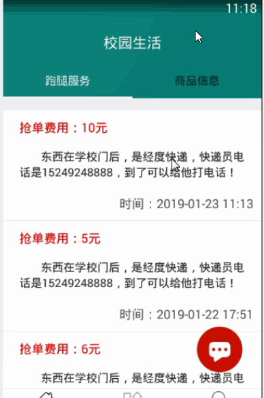

> **博主介绍：**
> 本人专注于Android/java/数据库/微信小程序技术领域的开发，以及有好几年的计算机毕业设计方面的实战开发经验和技术积累；尤其是在安卓（Android）的app的开发和微信小程序的开发，很是熟悉和了解；本人也是多年的Android开发人员；希望我发布的此篇文件可以帮助到您；
>
> 🍅 **文章末尾获取源码下载方式** 🍅

#### 功能演示

#### 一、项目介绍

> 管理员身份功能介绍：
>
> 1：用户登录：对用户的信息进行管理
>
> 用户功能介绍：  
>  1：注册模块，用户在使用软件前需要进行用户信息的注册  
>  2：用户登录：用户通过自己的注册信息进行软件的登录  
>  3：发布商品：用户可以发布自己的二手物品信息  
>  4：购物车：用户可以对自己喜欢的二手物品进行添加到购物车进行支付的功能，添加的商品信息可以删除  
>  5：跑腿服务：用户可以发布跑腿的信息，其他人可以进行抢单的操作  
>  6：学习笔记：用户可以上传自己的学习笔记信息  
>  7：个人信息：用户可以浏览个人信息，以及对密码进行修改；

#### 二、运行环境

> 1：客户端使用Android stuido进行开发；  
>  2：服务端后台使用Myeclipse2014进行开发；  
>  3：mysql数据库进行数据存储；  
>  4：需要jdk1.7以上  
>  5：使用雷电模拟器或者Androidstuio自带的模拟器进行运行

#### 三、使用技术

> **总体设计逻辑和思路：**  
>  1：先设计数据库表文件  
>  2：写服务端jsp页面以及写api接口给客户端提供数据  
>  3：完成后台服务端的数据交互，也就是jsp页面数据的存储和显示  
>  4：进行客户端页面的开发；  
>  5：进行客户端对api接口的调用，也就是获取数据库的数据以及在客户端进行显示
>
> **移动端：**  
>  1：使用android原生控件以及xml布局文件来完成界面的显示  
>  2：使用java代码完成功能的数据和逻辑交互  
>  3：使用http网络请求完成数据的请求；  
>  **4：使用json数据解析完成客户端数据的回调和显示**
>
> **服务端后台：**  
>  1：使用mysql完成数据的存储  
>  2：使用jdbc完成数据库和代码的逻辑交互  
>  3：使用jsp完成网页数据的显示  
>  4：使用java代码完成api接口的编写以及以及数据的回调

#### 四、数据库设计

> /*  
>  Navicat MySQL Data Transfer
>
> Source Server : mydb  
>  Source Server Version : 50528  
>  Source Host : localhost:3306  
>  Source Database : campuslifedb
>
> Target Server Type : MYSQL  
>  Target Server Version : 50528  
>  File Encoding : 65001
>
> Date: 2023-05-04 23:08:44  
>  */
>
> SET FOREIGN_KEY_CHECKS=0;
>
> \-- ----------------------------  
>  \-- Table structure for admintb  
>  \-- ----------------------------  
>  DROP TABLE IF EXISTS `admintb`;  
>  CREATE TABLE `admintb` (  
>  `adminId` int(50) NOT NULL AUTO_INCREMENT,  
>  `adminName` varchar(255) DEFAULT NULL,  
>  `adminMoney` varchar(255) DEFAULT NULL,  
>  `adminMessage` varchar(1000) DEFAULT NULL,  
>  `adminUserId` varchar(100) DEFAULT NULL,  
>  `adminUserName` varchar(255) DEFAULT NULL,  
>  `adminUserPhone` varchar(255) DEFAULT NULL,  
>  `adminType` varchar(255) DEFAULT NULL,  
>  `adminCreatime` varchar(100) DEFAULT NULL,  
>  `adminPhone` varchar(255) DEFAULT NULL,  
>  `adminDate` varchar(100) DEFAULT NULL,  
>  PRIMARY KEY (`adminId`)  
>  ) ENGINE=InnoDB AUTO_INCREMENT=30 DEFAULT CHARSET=utf8;
>
> \-- ----------------------------  
>  \-- Records of admintb  
>  \-- ----------------------------  
>  INSERT INTO `admintb` VALUES ('10', '帮我取个快递', '10',
> '东西在学校门后，是经度快递，快递员电话是15249248888，到了可以给他打电话！', '106', '小丸子', '15249249696',
> '1', '2019-01-22 11:39', null, null);  
>  INSERT INTO `admintb` VALUES ('12', '计算机基础', null,
> '通常是按计算机中硬件所采用的电子逻辑器件划分成电子管、晶体管、中小规模集成电路、大规模超大规模集成电路四个阶段；', '106', '小丸子',
> null, '2', '2019-01-22 11:39', null, null);  
>  INSERT INTO `admintb` VALUES ('13', 'java', null, '我的课程 笔记信息', '106',
> '小丸子', null, '2', '2019-01-22 11:39', null, null);  
>  INSERT INTO `admintb` VALUES ('16', '帮我取个快递', '6',
> '东西在学校门后，是经度快递，快递员电话是15249248888，到了可以给他打电话！', '106', '小丸子', '15249249696',
> '1', '2019-01-22 17:44', null, null);  
>  INSERT INTO `admintb` VALUES ('17', '帮我取个快递', '5',
> '东西在学校门后，是经度快递，快递员电话是15249248888，到了可以给他打电话！', '106', '小丸子', '15249249696',
> '1', '2019-01-22 17:51', null, null);  
>  INSERT INTO `admintb` VALUES ('18', '英语学习班', '6',
> '计算机是一种能够输入信息，存储信息，并按照人们意志（这些意志就是顺序）对信息进行加工处理，最后输出人们所需要信息的自动执行的电子装置。',
> '106', '小丸子', '15249249696', '3', '2019-01-23 09:58', null, null);  
>  INSERT INTO `admintb` VALUES ('19', '计算机基础', null,
> '通常是按计算机中硬件所采用的电子逻辑器件划分成电子管、晶体管、中小规模集成电路、大规模超大规模集成电路四个阶段；', '99', '小明',
> null, '2', '2019-01-23 10:26', null, null);  
>  INSERT INTO `admintb` VALUES ('20', '送东西', '10',
> '东西在学校门后，是经度快递，快递员电话是15249248888，到了可以给他打电话！', '106', '小丸子', '15249249696',
> '1', '2019-01-23 11:13', null, null);  
>  INSERT INTO `admintb` VALUES ('22', '买东西', '50',
> '帮我买一个东西东西在学校门后，是经度快递，快递员电话是15249248888，到了可以给他打电话！', '106', '小丸子',
> '15249249696', '1', '2019-01-23 11:18', null, null);  
>  INSERT INTO `admintb` VALUES ('23', '计算机基础android', null,
> '通常是按计算机中硬件所采用的电子逻辑器件划分成电子管、晶体管、中小规模集成电路、大规模超大规模集成电路四个阶段；', '106', '小丸子',
> null, '2', '2019-01-23 11:19', null, null);  
>  INSERT INTO `admintb` VALUES ('24', '数学学习班', '10',
> '计算机是一种能够输入信息，存储信息，并按照人们意志（这些意志就是顺序）对信息进行加工处理，最后输出人们所需要信息的自动执行的电子装置。',
> '106', '小丸子', '15249249696', '3', '2019-01-23 11:19', null, null);  
>  INSERT INTO `admintb` VALUES ('25', '英语学习班2323', '60',
> '计算机是一种能够输入信息，存储信息，并按照人们意志（这些意志就是顺序）对信息进行加工处理，最后输出人们所需要信息的自动执行的电子装置。',
> '106', '小丸子', '15249249696', '3', '2023-05-04 22:19', null, '2023-05-04
> 23:00');  
>  INSERT INTO `admintb` VALUES ('26', '数学竞赛', '60',
> '计算机是一种能够输入信息，存储信息，并按照人们意志（这些意志就是顺序）对信息进行加工处理，最后输出人们所需要信息的自动执行的电子装置。',
> '106', '小丸子', '15288889999', '4', '2023-05-04 22:35', null, '2023-05-04
> 23:00');  
>  INSERT INTO `admintb` VALUES ('27', '英语竞赛', '6',
> '数学竞赛是发现数学人才的有效手段之一。现代意义上的数学竞赛是从匈牙利开始的。一些重大数学竞赛的优胜者，大多在他们后来的事业中卓有建树', '106',
> '小丸子', '15288889999', '4', '2023-05-04 22:36', null, '2023-05-04 23:00');  
>  INSERT INTO `admintb` VALUES ('28', '数学竞赛000', '69',
> '数学竞赛是发现数学人才的有效手段之一。现代意义上的数学竞赛是从匈牙利开始的。一些重大数学竞赛的优胜者，大多在他们后来的事业中卓有建树', '106',
> '小丸子', '15288889999', '4', '2023-05-04 23:00', null, '2023-05-04 23:00');  
>  INSERT INTO `admintb` VALUES ('29', '物理竞赛', '10',
> '数学竞赛是发现数学人才的有效手段之一。现代意义上的数学竞赛是从匈牙利开始的。一些重大数学竞赛的优胜者，大多在他们后来的事业中卓有建树', '106',
> '小丸子', '15288889999', '4', '2023-05-04 23:06', null, '2023-05-05 13:00');
>
> \-- ----------------------------  
>  \-- Table structure for ordermsg  
>  \-- ----------------------------  
>  DROP TABLE IF EXISTS `ordermsg`;  
>  CREATE TABLE `ordermsg` (  
>  `orderId` int(50) NOT NULL AUTO_INCREMENT,  
>  `orderMessageId` varchar(50) DEFAULT NULL,  
>  `orderMessageName` varchar(255) DEFAULT NULL,  
>  `orderMessageMoney` varchar(255) DEFAULT NULL,  
>  `orderUserId` varchar(100) DEFAULT NULL,  
>  `orderUserName` varchar(255) DEFAULT NULL,  
>  `orderTime` varchar(100) DEFAULT NULL,  
>  PRIMARY KEY (`orderId`)  
>  ) ENGINE=InnoDB AUTO_INCREMENT=7 DEFAULT CHARSET=utf8;
>
> \-- ----------------------------  
>  \-- Records of ordermsg  
>  \-- ----------------------------  
>  INSERT INTO `ordermsg` VALUES ('4', '6', 'NIKE球鞋', '500', '106', '小丸子',
> '2019-01-22 17:09');  
>  INSERT INTO `ordermsg` VALUES ('5', '5', 'NIKE球鞋', '500', '99', '小明',
> '2019-01-23 10:26');  
>  INSERT INTO `ordermsg` VALUES ('6', '7', 'NI球鞋', '500', '99', '小明',
> '2019-01-23 11:20');
>
> \-- ----------------------------  
>  \-- Table structure for qiangdantb  
>  \-- ----------------------------  
>  DROP TABLE IF EXISTS `qiangdantb`;  
>  CREATE TABLE `qiangdantb` (  
>  `qiangdanId` int(50) NOT NULL AUTO_INCREMENT,  
>  `qiangdanUserId` varchar(100) DEFAULT NULL,  
>  `qiangdanMessgaeId` varchar(100) DEFAULT NULL,  
>  `qiangdanTime` varchar(100) DEFAULT NULL,  
>  PRIMARY KEY (`qiangdanId`)  
>  ) ENGINE=InnoDB AUTO_INCREMENT=5 DEFAULT CHARSET=utf8;
>
> \-- ----------------------------  
>  \-- Records of qiangdantb  
>  \-- ----------------------------  
>  INSERT INTO `qiangdantb` VALUES ('1', '106', '10', '2019-01-22 17:41');  
>  INSERT INTO `qiangdantb` VALUES ('2', '106', '16', '2019-01-22 17:45');  
>  INSERT INTO `qiangdantb` VALUES ('3', '106', '10', '2019-01-22 17:46');  
>  INSERT INTO `qiangdantb` VALUES ('4', '99', '22', '2019-01-23 11:20');
>
> \-- ----------------------------  
>  \-- Table structure for shoptb  
>  \-- ----------------------------  
>  DROP TABLE IF EXISTS `shoptb`;  
>  CREATE TABLE `shoptb` (  
>  `shopId` int(50) NOT NULL AUTO_INCREMENT,  
>  `shopName` varchar(255) DEFAULT NULL,  
>  `shopMoney` varchar(255) DEFAULT NULL,  
>  `shopType` varchar(255) DEFAULT NULL,  
>  `shopMessage` varchar(1500) DEFAULT NULL,  
>  `shopImg` varchar(1500) DEFAULT NULL,  
>  `shopUserId` varchar(100) DEFAULT NULL,  
>  `shopUserName` varchar(255) DEFAULT NULL,  
>  `shopTime` varchar(100) DEFAULT NULL,  
>  PRIMARY KEY (`shopId`)  
>  ) ENGINE=InnoDB AUTO_INCREMENT=8 DEFAULT CHARSET=utf8;
>
> \-- ----------------------------  
>  \-- Records of shoptb  
>  \-- ----------------------------  
>  INSERT INTO `shoptb` VALUES ('5', 'NIKE球鞋', '500', '球鞋',
> '篮球鞋即SNEAKER，同时也将球鞋爱好者融入到SNEAKER一词中，使得SNEAKER有更宽泛的定义。', 'timg-10.jpeg',
> '106', '小丸子', '2019-01-22 11:35');  
>  INSERT INTO `shoptb` VALUES ('6', 'NIKE球鞋', '500', '球鞋',
> '篮球鞋即SNEAKER，同时也将球鞋爱好者融入到SNEAKER一词中，使得SNEAKER有更宽泛的定义。
> 篮球是一项剧烈运动，为了能应付激烈的运动，对于一双篮球鞋来讲，就需要有很好的耐久性，支撑性、稳定性，舒适性和良好的减震作用；',
> 'timg-2.jpeg', '106', '小丸子', '2019-01-22 11:39');  
>  INSERT INTO `shoptb` VALUES ('7', 'NI球鞋', '500', '球鞋',
> '篮球鞋即SNEAKER，同时也将球鞋爱好者融入到SNEAKER一词中，使得SNEAKER有更宽泛的定义。',
> '20180313172108.jpg', '106', '小丸子', '2019-01-23 11:19');
>
> \-- ----------------------------  
>  \-- Table structure for studypersontb  
>  \-- ----------------------------  
>  DROP TABLE IF EXISTS `studypersontb`;  
>  CREATE TABLE `studypersontb` (  
>  `studypersonId` int(50) NOT NULL AUTO_INCREMENT,  
>  `studypersonUserId` varchar(11) DEFAULT NULL,  
>  `studypersonMessageId` varchar(11) DEFAULT NULL,  
>  `studypersonTime` varchar(100) DEFAULT NULL,  
>  PRIMARY KEY (`studypersonId`)  
>  ) ENGINE=InnoDB AUTO_INCREMENT=13 DEFAULT CHARSET=utf8;
>
> \-- ----------------------------  
>  \-- Records of studypersontb  
>  \-- ----------------------------  
>  INSERT INTO `studypersontb` VALUES ('10', '106', '27', '2023-05-04 22:44');  
>  INSERT INTO `studypersontb` VALUES ('11', '106', '28', '2023-05-04 23:00');  
>  INSERT INTO `studypersontb` VALUES ('12', '106', '29', '2023-05-04 23:06');
>
> \-- ----------------------------  
>  \-- Table structure for user  
>  \-- ----------------------------  
>  DROP TABLE IF EXISTS `user`;  
>  CREATE TABLE `user` (  
>  `userId` int(255) NOT NULL AUTO_INCREMENT,  
>  `userName` varchar(200) CHARACTER SET utf8 NOT NULL,  
>  `userPhone` varchar(100) CHARACTER SET utf8 NOT NULL,  
>  `userPswd` varchar(200) CHARACTER SET utf8 NOT NULL,  
>  `userTime` varchar(300) CHARACTER SET utf8 NOT NULL,  
>  PRIMARY KEY (`userId`)  
>  ) ENGINE=InnoDB AUTO_INCREMENT=110 DEFAULT CHARSET=latin1;
>
> \-- ----------------------------  
>  \-- Records of user  
>  \-- ----------------------------  
>  INSERT INTO `user` VALUES ('99', '小明', '15249241234', '123456', '2019-01-22
> 16:15');  
>  INSERT INTO `user` VALUES ('106', '小丸子', '15249249696', '123456',
> '2019-01-22 17:03');  
>  INSERT INTO `user` VALUES ('108', 'pony', '15249243002', '123456',
> '2019-01-22 16:31');  
>  INSERT INTO `user` VALUES ('109', '小花', '15249247878', '123456',
> '2019-01-22 16:42');  
>

#### 五、部分代码

##### 1：二手物品信息

>  
>  public class ShopMessageActivity extends BaseActivity {  
>  ShopBean intersetModel;  
>  // title  
>  private TextView mTvTitle;  
>  // 返回  
>  private ImageView mIvBack;
>
> private TextView mtvMessagetitle;  
>  private TextView mtvShopPrice;  
>  private TextView mtvType;  
>  private TextView mtvcontent;  
>  private ImageView guide_image;  
>  private TextView mtvShopPriceTip;  
>  private Button mbtnPay;
>
>  
>  private ScrollView mslView;  
>  private TextView mIvStu;
>
> @Override  
>  protected void onCreate(Bundle savedInstanceState) {  
>  super.onCreate(savedInstanceState);  
>  setContentView(R.layout.activity_shopmessage);  
>  initWidget();  
>  initData();  
>  }
>
> @Override  
>  public void initWidget() {
>
> mtvShopPriceTip = (TextView)findViewById(R.id.mtvShopPriceTip);  
>  mIvStu = (TextView)findViewById(R.id.mIvStu);  
>  mslView = (ScrollView) findViewById(R.id.mslView);  
>  mbtnPay = (Button) findViewById(R.id.mbtnPay);  
>  mbtnPay.setOnClickListener(this);  
>  mtvShopPrice = (TextView) findViewById(R.id.mtvShopPrice);
>
> mtvShopPrice.setOnClickListener(this);  
>  guide_image = (ImageView) findViewById(R.id.guide_image);
>
>  
>  mtvType = (TextView) findViewById(R.id.mtvType);
>
> mtvMessagetitle = (TextView) findViewById(R.id.mtvMessagetitle);  
>  mtvcontent = (TextView) findViewById(R.id.mtvcontent);
>
> mIvBack = (ImageView) findViewById(R.id.mIvBack);  
>  mTvTitle = (TextView) findViewById(R.id.mTvTitle);  
>  mTvTitle.setText("商品详情");  
>  mIvBack.setVisibility(View.VISIBLE);  
>  mIvBack.setOnClickListener(this);
>
> mIvStu.setVisibility(View.GONE);  
>  mIvStu.setOnClickListener(this);
>
> }
>
> @Override  
>  public void onClick(View v) {
>
> switch (v.getId()) {  
>  case R.id.mIvBack:  
>  ShopMessageActivity.this.finish();  
>  break;
>
> case R.id.mbtnPay:  
>  Intent intent = new Intent(this, PayMessageActivity.class);  
>  intent.putExtra("msg",intersetModel);  
>  startActivity(intent);  
>  break;
>
> }  
>  }
>
> @SuppressLint("SetTextI18n")  
>  @Override  
>  public void initData() {
>
> intersetModel = (ShopBean) this.getIntent().getSerializableExtra("msg");  
>  mtvMessagetitle.setText(intersetModel.getShopName());  
>  mtvShopPrice.setText("价位：" + intersetModel.getShopMoney()+"元");  
>  mtvType.setText("类型：" + intersetModel.getShopType());  
>  mtvcontent.setText(" "+intersetModel.getShopMessage());  
>  mtvShopPriceTip.setText("价位：" + intersetModel.getShopMoney()+"元/件");
>
> if (!TextUtils.isEmpty(intersetModel.getShopImg())) {  
>  Picasso.with(this).load(Consts.URL_IMAGE +
> intersetModel.getShopImg()).placeholder(R.drawable.default_drawable_show_pictrue)  
>  .into(guide_image);  
>  }
>
> mbtnPay.setText("确定购买");
>
> }
>
> }  
>

##### 2：添加抢单信息

> public class CreateQiangDanActivity extends BaseActivity {
>
> // title  
>  private TextView mTvTitle;  
>  // 返回  
>  private ImageView mIvBack;  
>  // 查询按钮  
>  private Button mbtnAdd;  
>  private EditText metName;  
>  private EditText metMoney;  
>  private EditText metMessage;
>
>  
>  @Override  
>  protected void onCreate(Bundle savedInstanceState) {  
>  super.onCreate(savedInstanceState);  
>  setContentView(R.layout.activity_creat_qingdan);  
>  initWidget();  
>  initData();  
>  }
>
> @Override  
>  public void initWidget() {  
>  metName = (EditText) findViewById(R.id.metName);  
>  metMoney = (EditText) findViewById(R.id.metMoney);  
>  metMessage = (EditText) findViewById(R.id.metMessage);
>
> mbtnAdd = (Button) findViewById(R.id.mbtnAdd);  
>  mIvBack = (ImageView) findViewById(R.id.mIvBack);  
>  mTvTitle = (TextView) findViewById(R.id.mTvTitle);  
>  mTvTitle.setText("添加抢单信息");  
>  mIvBack.setVisibility(View.VISIBLE);  
>  mIvBack.setOnClickListener(this);  
>  mbtnAdd.setOnClickListener(this);  
>  metName.setText("帮我取个快递");  
>  metMessage.setText("东西在学校门后，是经度快递，快递员电话是15249248888，到了可以给他打电话！");
>
>  
>  }
>
> @Override  
>  public void onClick(View v) {
>
> switch (v.getId()) {  
>  case R.id.mIvBack:  
>  CreateQiangDanActivity.this.finish();  
>  break;  
>  case R.id.mbtnAdd:  
>  addAdmin(true);  
>  break;
>
> }  
>  }
>
> @Override  
>  public void initData() {
>
> }
>
> private void addAdmin(boolean isShow) {  
>  UserModel userModel = (UserModel) MemberUserUtils.getBean(this,
> "user_messgae");  
>  AjaxParams params = new AjaxParams();  
>  params.put("action_flag", "addAdmin");  
>  params.put("adminName",metName.getText().toString());  
>  params.put("adminMoney",metMoney.getText().toString());  
>  params.put("adminMessage", metMessage.getText().toString());  
>  params.put("adminUserId", MemberUserUtils.getUid(this));  
>  params.put("adminUserPhone",userModel.getUserPhone());  
>  params.put("adminUserName", MemberUserUtils.getName(this));  
>  params.put("adminType", "1");  
>  httpPost(Consts.URL + Consts.APP.MessageAction, params,
> Consts.actionId.resultFlag, isShow, "正在提交...");  
>  }
>
> @Override  
>  protected void callBackSuccess(ResponseEntry entry, int actionId) {  
>  super.callBackSuccess(entry, actionId);  
>  QiangDanObservable.getInstance().notifyStepChange("updateOK");  
>  CustomToast.showToast(CreateQiangDanActivity.this, entry.getRepMsg());  
>  new Handler().postDelayed(new Runnable() {  
>  @Override  
>  public void run() {  
>  CreateQiangDanActivity.this.finish();  
>  }  
>  }, 1000);  
>  }
>
> @Override  
>  protected void callBackAllFailure(String strMsg, int actionId) {  
>  super.callBackAllFailure(strMsg, actionId);  
>  ToastUtil.show(CreateQiangDanActivity.this, strMsg);
>
> }
>
>  
>  }  
>

#### 六、浏览更多Android毕业设计

[毕业设计-基于android的租房信息发布平台的APP_信息发布app源码_Android毕业设计源码的博客-
CSDN博客](https://blog.csdn.net/u014388322/article/details/100656450?spm=1001.2014.3001.5502
"毕业设计-基于android的租房信息发布平台的APP_信息发布app源码_Android毕业设计源码的博客-CSDN博客")

[毕业设计-基于android选课系统的设计与实现_android学生选课系统_Android毕业设计源码的博客-
CSDN博客](https://blog.csdn.net/u014388322/article/details/100656536?spm=1001.2014.3001.5502
"毕业设计-基于android选课系统的设计与实现_android学生选课系统_Android毕业设计源码的博客-CSDN博客")

[毕业设计之校园一卡通管理系统的设计与实现_一卡通管理系统实现_Android毕业设计源码的博客-
CSDN博客](https://blog.csdn.net/u014388322/article/details/126048550?spm=1001.2014.3001.5502
"毕业设计之校园一卡通管理系统的设计与实现_一卡通管理系统实现_Android毕业设计源码的博客-CSDN博客")

[基于Android的校园二手闲置物品交易系统设计与实现_基于android的二手交易平台_Android毕业设计源码的博客-
CSDN博客](https://blog.csdn.net/u014388322/article/details/128232475?spm=1001.2014.3001.5502
"基于Android的校园二手闲置物品交易系统设计与实现_基于android的二手交易平台_Android毕业设计源码的博客-CSDN博客")

[基于androidstudio校园快递APP系统的设计与实现_android studio论文_Android毕业设计源码的博客-
CSDN博客](https://blog.csdn.net/u014388322/article/details/128545390?spm=1001.2014.3001.5502
"基于androidstudio校园快递APP系统的设计与实现_android studio论文_Android毕业设计源码的博客-CSDN博客")

[基于android的商城购物定制APP_安卓开发购物app_Android毕业设计源码的博客-
CSDN博客](https://blog.csdn.net/u014388322/article/details/128746697?spm=1001.2014.3001.5502
"基于android的商城购物定制APP_安卓开发购物app_Android毕业设计源码的博客-CSDN博客")

> 更多毕业设计可以浏览我的个人主页哦！

#### 七、源码下载

> ​

