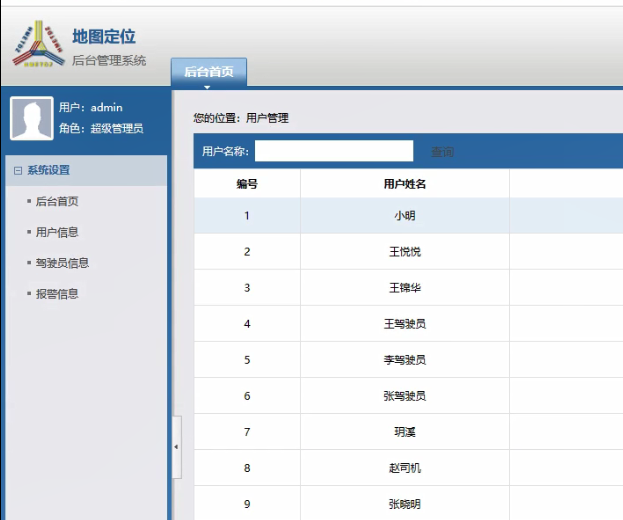

> **博主介绍：**
> 本人专注于Android/java/数据库/微信小程序技术领域的开发，以及有好几年的计算机毕业设计方面的实战开发经验和技术积累；尤其是在安卓（Android）的app的开发和微信小程序的开发，很是熟悉和了解；本人也是多年的Android开发人员；希望我发布的此篇文件可以帮助到您；
>
> 🍅 **文章末尾获取源码下载方式** 🍅

#### 功能演示

**详情演示视频请文字末尾公众号咨询，我会发给您；**

#### 1：后台演示

#### 2：客户端演示

#### 一、项目介绍

> 前端模块：
>
> 1.模块名称：用户注册
>
> 所属模块：注册登录模块
>
> 模块功能：注册功能（输入用户名，密码进行注册）注册后才能开启打车系统，进行下单，否则无法下单，注册有二次密码确认功能
>
> 2.模块名称：用户登录
>
> 所属模块：注册登录模块
>
> 模块功能：输入用户名，密码如果后台注册以后可登录，一次只能等一个账户，登录后可进行对该平台的使用
>
> 3.模块名称：找回密码
>
> 所属模块：找回密码模块
>
> 模块功能：忘记密码后可通过邮箱号的方法找回密码
>
> 4.模块名称：修改密码
>
> 所属模块：修改密码模块
>
> 模块功能：通过用户名和密码可以修改密码，（通过两次密码确认）成功后会跳转登录页面
>
> 5.模块名称：调节字体大小
>
> 所属模块：调节字体大小模块
>
> 模块功能：有三种字体大小：正常，大，极大
>
> 6.模块名称：亲属绑定
>
> 所属模块：亲属绑定模块
>
> 模块功能：为了老年用户的安全问题，可以进行绑定亲属信息，实时位置和订单信息会发送到绑定人的账户上，同时绑定的亲属可以为用户进行订单处理即完成付款
>
> 7.模块名称：打车系统
>
> 所属模块：打车系统模块
>
> 模块功能：类似于滴滴出行的打车界面
>
> 8.模块名称：紧急报警
>
> 所属模块：紧急报警模块
>
>
> 模块功能：为了老年用户的安全问题，设置一键报警功能，按下按钮的同时会将用户信息，路程信息发送到紧急联系人的账户中，用户信息，路程信息以及司机车辆的基本信息发送到110安全系统中，同时进行备份以防未来的安全问题
>
> 9.模块名称：实时录音
>
> 所属模块：及时录音模块
>
> 模块功能：点击此模块可进行录音功能
>
> 后端模块：
>
> 1.模块名称：管理员登录
>
> 所属模块：管理员登录模块
>
> 模块功能：输入管理员账号，密码登录后进入系统管理界面，管理所有子功能
>
> 2.模块名称：用户登录管理
>
> 所属模块：用户登录管理模块
>
> 模块功能：通过后台可以查询用户信息
>
> 3.模块名称：车辆信息
>
> 所属模块：车辆管理模块
>
> 模块功能：管理车辆基本信息，出行路程，接单情况，车辆所属，驾驶证照片
>
> 4.模块名称：订单管理
>
> 所属模块：订单管理模块
>
> 模块功能：订单生成后显示订单信息包括
>
> （1）发起人信息
>
> （2）接单人信息
>
> （3）车辆信息
>
> （4）紧急联系人信息
>
> （5）订单金额
>
> （6）生成时间

#### 二、运行环境

> 1：客户端使用Android stuido进行开发；  
>  2：服务端后台使用Myeclipse2014进行开发；  
>  3：mysql数据库进行数据存储；  
>  4：需要jdk1.7以上  
>  5：使用雷电模拟器或者Androidstuio自带的模拟器进行运行

#### 三、使用技术

> **总体设计逻辑和思路：**  
>  1：先设计数据库表文件  
>  2：写服务端jsp页面以及写api接口给客户端提供数据  
>  3：完成后台服务端的数据交互，也就是jsp页面数据的存储和显示  
>  4：进行客户端页面的开发；  
>  5：进行客户端对api接口的调用，也就是获取数据库的数据以及在客户端进行显示
>
> **移动端：**  
>  1：使用android原生控件以及xml布局文件来完成界面的显示  
>  2：使用java代码完成功能的数据和逻辑交互  
>  3：使用http网络请求完成数据的请求；  
>  **4：使用json数据解析完成客户端数据的回调和显示**
>
> **服务端后台：**  
>  1：使用mysql完成数据的存储  
>  2：使用jdbc完成数据库和代码的逻辑交互  
>  3：使用jsp完成网页数据的显示  
>  4：使用java代码完成api接口的编写以及以及数据的回调

#### 四、数据库设计

    
    
    /*
    Navicat MySQL Data Transfer
    
    Source Server         : mydata
    Source Server Version : 50528
    Source Host           : localhost:3306
    Source Database       : traveldb
    
    Target Server Type    : MYSQL
    Target Server Version : 50528
    File Encoding         : 65001
    
    Date: 2023-01-17 10:16:18
    */
    
    SET FOREIGN_KEY_CHECKS=0;
    
    -- ----------------------------
    -- Table structure for admintb
    -- ----------------------------
    DROP TABLE IF EXISTS `admintb`;
    CREATE TABLE `admintb` (
      `adminId` int(11) NOT NULL AUTO_INCREMENT,
      `adminLoginName` varchar(255) DEFAULT NULL,
      `adminLoginPassword` varchar(255) DEFAULT NULL,
      PRIMARY KEY (`adminId`)
    ) ENGINE=InnoDB AUTO_INCREMENT=2 DEFAULT CHARSET=utf8;
    
    -- ----------------------------
    -- Records of admintb
    -- ----------------------------
    INSERT INTO `admintb` VALUES ('1', 'admin', '123456');
    
    -- ----------------------------
    -- Table structure for coordinatestb
    -- ----------------------------
    DROP TABLE IF EXISTS `coordinatestb`;
    CREATE TABLE `coordinatestb` (
      `coordinatesId` int(11) NOT NULL AUTO_INCREMENT,
      `coordinatesInfor` varchar(255) DEFAULT NULL,
      `coordinatesUserId` int(11) DEFAULT NULL,
      `coordinatesOrderInfor` varchar(255) DEFAULT NULL,
      `coordinatesTime` varchar(100) DEFAULT NULL,
      PRIMARY KEY (`coordinatesId`)
    ) ENGINE=InnoDB AUTO_INCREMENT=364 DEFAULT CHARSET=utf8;
    
    -- ----------------------------
    -- Records of coordinatestb
    -- ----------------------------
    INSERT INTO `coordinatestb` VALUES ('360', '34.29508951822917,108.96874294704861', '120', '13', '2023-01-17 10:08');
    INSERT INTO `coordinatestb` VALUES ('361', '34.29508951822917,108.96874321831598', '120', '13', '2023-01-17 10:08');
    INSERT INTO `coordinatestb` VALUES ('362', '34.29508951822917,108.96874321831598', '120', '13', '2023-01-17 10:08');
    INSERT INTO `coordinatestb` VALUES ('363', '34.29508897569445,108.96874294704861', '120', '13', '2023-01-17 10:08');
    
    -- ----------------------------
    -- Table structure for ordermsg
    -- ----------------------------
    DROP TABLE IF EXISTS `ordermsg`;
    CREATE TABLE `ordermsg` (
      `orderId` int(50) NOT NULL AUTO_INCREMENT,
      `orderUserId` varchar(100) DEFAULT NULL,
      `orderUserName` varchar(255) DEFAULT NULL,
      `orderDriverId` int(100) DEFAULT NULL,
      `orderDriverName` varchar(255) DEFAULT NULL,
      `orderCarInfor` varchar(255) DEFAULT NULL,
      `orderPerson` varchar(255) DEFAULT NULL,
      `orderMoney` varchar(255) DEFAULT NULL,
      `orderTime` varchar(100) DEFAULT NULL,
      `orderStartLatLng` varchar(1000) DEFAULT NULL,
      `orderEndLatLng` varchar(255) DEFAULT NULL,
      `orderAddressStart` varchar(255) DEFAULT NULL,
      `orderAddressEnd` varchar(255) DEFAULT NULL,
      `orderState` varchar(255) DEFAULT NULL,
      `orderDistance` varchar(100) DEFAULT NULL,
      PRIMARY KEY (`orderId`)
    ) ENGINE=InnoDB AUTO_INCREMENT=14 DEFAULT CHARSET=utf8;
    
    -- ----------------------------
    -- Records of ordermsg
    -- ----------------------------
    INSERT INTO `ordermsg` VALUES ('9', '111', '王悦悦', '113', '王驾驶员', '陕A12345', '小明-15249246001', '20.5', '2023-01-16 16:19', '34.29508951822917,108.96874294704861', '34.23126,108.904211', '太华南路', '科技路(地铁站)', '2', '6.88');
    INSERT INTO `ordermsg` VALUES ('10', '111', '王悦悦', null, null, null, '小明-15249248888', '19.1', '2023-01-17 08:58', '34.29508870442708,108.96874321831598', '34.218229,108.964176', '太华南路', '大雁塔', '1', '5.23');
    INSERT INTO `ordermsg` VALUES ('11', '111', '王悦悦', null, null, null, '小红-15249248877', '19.1', '2023-01-17 09:23', '34.29508924696181,108.96874240451389', '34.218229,108.964176', '太华南路', '大雁塔', '1', '8.55');
    INSERT INTO `ordermsg` VALUES ('12', '111', '王悦悦', null, null, null, '小花-15249246666', '18.6', '2023-01-17 09:26', '34.29508897569445,108.96874321831598', '34.222838,108.946767', '太华南路', '小寨(地铁站)', '1', '8.28');
    INSERT INTO `ordermsg` VALUES ('13', '120', '小花花', '113', '王驾驶员', '陕A12345', '小花花-15249245001', '8', '2023-01-17 10:07', '34.29508924696181,108.96874240451389', '34.278498,108.962723', '太华南路', '西安站', '2', '1.93');
    
    -- ----------------------------
    -- Table structure for policetb
    -- ----------------------------
    DROP TABLE IF EXISTS `policetb`;
    CREATE TABLE `policetb` (
      `policeId` int(11) NOT NULL AUTO_INCREMENT,
      `policeUserId` int(11) DEFAULT NULL,
      `policeUserName` varchar(255) DEFAULT NULL,
      `policeDriverInfor` varchar(255) DEFAULT NULL,
      `policeRoadInfor` varchar(255) DEFAULT NULL,
      `policeTime` datetime DEFAULT NULL,
      PRIMARY KEY (`policeId`)
    ) ENGINE=InnoDB AUTO_INCREMENT=5 DEFAULT CHARSET=utf8;
    
    -- ----------------------------
    -- Records of policetb
    -- ----------------------------
    INSERT INTO `policetb` VALUES ('1', '106', '小明', '王驾驶员-陕A12345', '长安南路-科技路(地铁站)', '2023-01-16 16:31:00');
    INSERT INTO `policetb` VALUES ('2', '119', '张晓明', '赵司机-陕A55555', '长安南路-西安软件园(科技二路)', '2023-01-16 16:31:00');
    INSERT INTO `policetb` VALUES ('3', '111', '王悦悦', '王驾驶员-陕A12345', '太华南路-科技路(地铁站)', '2023-01-16 16:31:00');
    INSERT INTO `policetb` VALUES ('4', '120', '小花花', '王驾驶员-陕A12345', '太华南路-西安站', '2023-01-17 10:08:00');
    
    -- ----------------------------
    -- Table structure for relativestb
    -- ----------------------------
    DROP TABLE IF EXISTS `relativestb`;
    CREATE TABLE `relativestb` (
      `relativesId` int(11) NOT NULL AUTO_INCREMENT,
      `relativesAddUserId` int(11) DEFAULT NULL,
      `relativesAddUserName` varchar(255) DEFAULT NULL,
      `relativesInfor` varchar(255) DEFAULT NULL,
      `relativesUserId` int(11) DEFAULT NULL,
      `relativesUserName` varchar(255) DEFAULT NULL,
      PRIMARY KEY (`relativesId`)
    ) ENGINE=InnoDB AUTO_INCREMENT=8 DEFAULT CHARSET=utf8;
    
    -- ----------------------------
    -- Records of relativestb
    -- ----------------------------
    INSERT INTO `relativestb` VALUES ('1', '111', '王悦悦', '女儿', '106', '小丸子');
    INSERT INTO `relativestb` VALUES ('2', '112', '王锦华', '儿子', '106', '小丸子');
    INSERT INTO `relativestb` VALUES ('3', '106', '小明', '父亲', '111', '王悦悦');
    INSERT INTO `relativestb` VALUES ('4', '111', '王悦悦', '女儿', '119', '张晓明');
    INSERT INTO `relativestb` VALUES ('5', '119', '张晓明', '亲人', '111', '王悦悦');
    INSERT INTO `relativestb` VALUES ('6', '112', '王锦华', '朋友', '111', '王悦悦');
    INSERT INTO `relativestb` VALUES ('7', '111', '王悦悦', '朋友', '120', '小花花');
    
    -- ----------------------------
    -- Table structure for soundtb
    -- ----------------------------
    DROP TABLE IF EXISTS `soundtb`;
    CREATE TABLE `soundtb` (
      `soundId` int(11) NOT NULL AUTO_INCREMENT,
      `soundOrderId` int(11) DEFAULT NULL,
      `soundUserId` int(11) DEFAULT NULL,
      `soundFile` varchar(255) DEFAULT NULL,
      `soundTime` varchar(100) DEFAULT NULL,
      PRIMARY KEY (`soundId`)
    ) ENGINE=InnoDB AUTO_INCREMENT=8 DEFAULT CHARSET=utf8;
    
    -- ----------------------------
    -- Records of soundtb
    -- ----------------------------
    INSERT INTO `soundtb` VALUES ('5', '9', '111', 'disanji.mp3', '2023-01-16 17:22');
    INSERT INTO `soundtb` VALUES ('6', '9', '111', '太华南路-科技路(地铁站).amr', '2023-01-16 17:24');
    INSERT INTO `soundtb` VALUES ('7', '13', '120', '太华南路-西安站.amr', '2023-01-17 10:08');
    
    -- ----------------------------
    -- Table structure for user
    -- ----------------------------
    DROP TABLE IF EXISTS `user`;
    CREATE TABLE `user` (
      `userId` int(255) NOT NULL AUTO_INCREMENT,
      `userName` varchar(200) CHARACTER SET utf8 NOT NULL,
      `userPhone` varchar(100) CHARACTER SET utf8 NOT NULL,
      `userPswd` varchar(200) CHARACTER SET utf8 NOT NULL,
      `userTime` varchar(300) CHARACTER SET utf8 NOT NULL,
      `userMail` varchar(255) CHARACTER SET utf8 DEFAULT NULL,
      `userFlag` varchar(255) DEFAULT NULL,
      `userAddress` varchar(255) CHARACTER SET utf8 DEFAULT NULL,
      `userCar` varchar(255) CHARACTER SET utf8 DEFAULT NULL,
      PRIMARY KEY (`userId`)
    ) ENGINE=InnoDB AUTO_INCREMENT=121 DEFAULT CHARSET=latin1;
    
    -- ----------------------------
    -- Records of user
    -- ----------------------------
    INSERT INTO `user` VALUES ('106', '小明', '15249249696', '123456', '2023-01-16 16:31', '958426929@qq.com', '1', null, null);
    INSERT INTO `user` VALUES ('111', '王悦悦', '15249241001', '123456', '2023-01-16 16:31', null, '1', null, null);
    INSERT INTO `user` VALUES ('112', '王锦华', '15249241002', '123456', '2023-01-16 16:31', null, '1', null, null);
    INSERT INTO `user` VALUES ('113', '王驾驶员', '15249246001', '123456', '2023-01-16 16:31', '', '2', '108.946698,34.221491', '陕A12345');
    INSERT INTO `user` VALUES ('114', '李驾驶员', '15249246002', '123456', '2023-01-16 16:31', '', '2', '108.948951,34.22275', '陕A54321');
    INSERT INTO `user` VALUES ('115', '张驾驶员', '15249246003', '123456', '2023-01-16 16:31', '', '2', '108.946737,34.224743', '陕A66688');
    INSERT INTO `user` VALUES ('116', '玥溪', '15249249001', '532462', '2023-01-16 16:31', '664021138@qq.com', '1', null, null);
    INSERT INTO `user` VALUES ('118', '赵司机', '15249246004', '123456', '2023-01-16 16:31', '', '2', '108.941715,34.222845', '陕A55555');
    INSERT INTO `user` VALUES ('119', '张晓明', '15249248001', '123456', '2023-01-16 16:31', '958426929@qq.com', '1', null, null);
    INSERT INTO `user` VALUES ('120', '小花花', '15249245001', '532462', '2023-01-17 10:06', '664021138@qq.com', '1', null, null);
    

#### 五、部分代码

#### 六、浏览更多Android毕业设计

[毕业设计-基于android的租房信息发布平台的APP_信息发布app源码_Android毕业设计源码的博客-
CSDN博客](https://blog.csdn.net/u014388322/article/details/100656450?spm=1001.2014.3001.5502
"毕业设计-基于android的租房信息发布平台的APP_信息发布app源码_Android毕业设计源码的博客-CSDN博客")

[毕业设计-基于android选课系统的设计与实现_android学生选课系统_Android毕业设计源码的博客-
CSDN博客](https://blog.csdn.net/u014388322/article/details/100656536?spm=1001.2014.3001.5502
"毕业设计-基于android选课系统的设计与实现_android学生选课系统_Android毕业设计源码的博客-CSDN博客")

[毕业设计之校园一卡通管理系统的设计与实现_一卡通管理系统实现_Android毕业设计源码的博客-
CSDN博客](https://blog.csdn.net/u014388322/article/details/126048550?spm=1001.2014.3001.5502
"毕业设计之校园一卡通管理系统的设计与实现_一卡通管理系统实现_Android毕业设计源码的博客-CSDN博客")

[基于Android的校园二手闲置物品交易系统设计与实现_基于android的二手交易平台_Android毕业设计源码的博客-
CSDN博客](https://blog.csdn.net/u014388322/article/details/128232475?spm=1001.2014.3001.5502
"基于Android的校园二手闲置物品交易系统设计与实现_基于android的二手交易平台_Android毕业设计源码的博客-CSDN博客")

[基于androidstudio校园快递APP系统的设计与实现_android studio论文_Android毕业设计源码的博客-
CSDN博客](https://blog.csdn.net/u014388322/article/details/128545390?spm=1001.2014.3001.5502
"基于androidstudio校园快递APP系统的设计与实现_android studio论文_Android毕业设计源码的博客-CSDN博客")

[基于android的商城购物定制APP_安卓开发购物app_Android毕业设计源码的博客-
CSDN博客](https://blog.csdn.net/u014388322/article/details/128746697?spm=1001.2014.3001.5502
"基于android的商城购物定制APP_安卓开发购物app_Android毕业设计源码的博客-CSDN博客")

> 更多毕业设计可以浏览我的个人主页哦！

#### 七、源码下载

> 大家 **点赞、收藏、关注、评论** 啦 、 **查看** 👇🏻👇🏻👇🏻 **获取联系方式** 👇🏻👇🏻👇🏻
>
> <https://download.csdn.net/download/u014388322/88199150>

