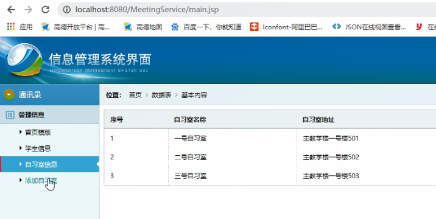
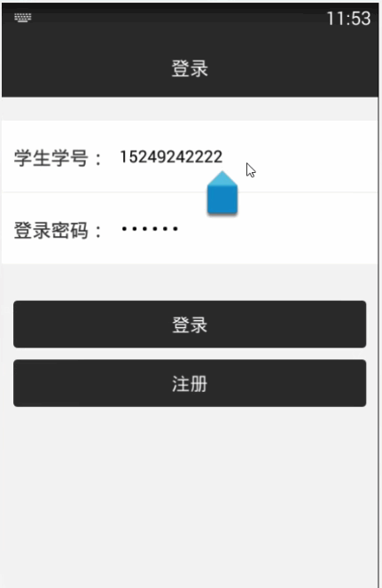

> **博主介绍：**
> 本人专注于Android/java/数据库/微信小程序技术领域的开发，以及有好几年的计算机毕业设计方面的实战开发经验和技术积累；尤其是在安卓（Android）的app的开发和微信小程序的开发，很是熟悉和了解；本人也是多年的Android开发人员；希望我发布的此篇文件可以帮助到您；
>
> 🍅 **文章末尾获取源码下载方式** 🍅

#### 功能演示

**详情演示视频请文字末尾公众号咨询，我会发给您；**

#### 1：后台演示

#### 2：客户端演示

#### 一、项目介绍

> 主要功能：学生通过系统实现网上选座功能，预约晚自习期间计算机教室座位进行自主学习
>
> 具体功能
>
> 一、预约功能：
>
>
> 1.学生通过网页进入自主选座系统预约自习室，不可通过网站直接预订具体座位，确定选座后后台会收到预约并减少教室内的可预约座位数量，教室预约人数满该教室则不可再次进行预约（一个教室内的可预约数量为40，共20个教室）
>
> 2.预约系统的开放预约时间为早7点到下午6点，预约期限仅限当日的晚自习时间（18.30-20.30）
>
> 二、签到功能：
>
>
> 1.学生到达教室后要通过网页进行签到，并记录自己的机器号（为了出现机器故障等问题找到对应学生进行处理），后台存储记录学生的预约过往记录，学生个人主页也可看到
>
> 2.如果预约教室后的学生未到达教室进行自习，则对该学生进行违规处罚，一周内不可预约自习室
>
> 3。如果学生在自习期间破坏了计算机设备由管理员备注记录，则该学生不可再次预约计算机教室
>
> 三、网站开放人员
>
> 1.学生（登录帐号为学号，密码最低限制6位），教室管理员
>
> 四、主页内容
>
> (1)、学生
>
> 1.预约自习室
>
> 2.进行签到界面（签到时间，签到机器）
>
> 3.修改个人信息（专业 、入学时间、姓名、学号、班级、辅导员）
>
> 4.查看历史预约记录
>
> (2)、管理人员
>
> 1.修改个人信息（密码）
>
> 2.查看学生信息
>
> 3.查看学生历史预约记录
>
> 4.修改学生违规栏信息并选择处罚措施（未签到、破坏教学设施）

#### 二、运行环境

> 1：客户端使用Android stuido进行开发；  
>  2：服务端后台使用Myeclipse2014进行开发；  
>  3：mysql数据库进行数据存储；  
>  4：需要jdk1.7以上  
>  5：使用雷电模拟器或者Androidstuio自带的模拟器进行运行

#### 三、使用技术

> **总体设计逻辑和思路：**  
>  1：先设计数据库表文件  
>  2：写服务端jsp页面以及写api接口给客户端提供数据  
>  3：完成后台服务端的数据交互，也就是jsp页面数据的存储和显示  
>  4：进行客户端页面的开发；  
>  5：进行客户端对api接口的调用，也就是获取数据库的数据以及在客户端进行显示
>
> **移动端：**  
>  1：使用android原生控件以及xml布局文件来完成界面的显示  
>  2：使用java代码完成功能的数据和逻辑交互  
>  3：使用http网络请求完成数据的请求；  
>  **4：使用json数据解析完成客户端数据的回调和显示**
>
> **服务端后台：**  
>  1：使用mysql完成数据的存储  
>  2：使用jdbc完成数据库和代码的逻辑交互  
>  3：使用jsp完成网页数据的显示  
>  4：使用java代码完成api接口的编写以及以及数据的回调

#### 四、数据库设计

    
    
    /*
    Navicat MySQL Data Transfer
    
    Source Server         : mydata
    Source Server Version : 50528
    Source Host           : localhost:3306
    Source Database       : meetingmsgdb
    
    Target Server Type    : MYSQL
    Target Server Version : 50528
    File Encoding         : 65001
    
    Date: 2022-05-07 17:57:04
    */
    
    SET FOREIGN_KEY_CHECKS=0;
    
    -- ----------------------------
    -- Table structure for applytb
    -- ----------------------------
    DROP TABLE IF EXISTS `applytb`;
    CREATE TABLE `applytb` (
      `applyId` int(11) NOT NULL AUTO_INCREMENT,
      `applyMessageId` varchar(11) DEFAULT NULL,
      `applyMessageName` varchar(255) DEFAULT NULL,
      `applyStartTime` datetime DEFAULT NULL,
      `applyUserId` varchar(100) DEFAULT NULL,
      `applyUserName` varchar(255) DEFAULT NULL,
      `applyTime` varchar(100) DEFAULT NULL,
      `applyState` varchar(255) DEFAULT '1',
      `applyStartMsg` varchar(255) DEFAULT NULL,
      `applyNumber` varchar(11) DEFAULT NULL,
      PRIMARY KEY (`applyId`)
    ) ENGINE=InnoDB AUTO_INCREMENT=18 DEFAULT CHARSET=utf8;
    
    -- ----------------------------
    -- Records of applytb
    -- ----------------------------
    INSERT INTO `applytb` VALUES ('15', '3', '二号自习室', '2019-04-29 19:55:00', '115', 'pony', '2019-04-29 23:55', '4', '2019-04-29 19:55', '15');
    INSERT INTO `applytb` VALUES ('16', '4', '三号自习室', '2022-05-07 19:04:00', '112', 'jack', '2022-05-07 17:04', '2', '2022-05-07 19:04', '-1');
    INSERT INTO `applytb` VALUES ('17', '3', '二号自习室', '2022-05-07 19:12:00', '112', 'jack', '2022-05-07 17:12', '2', '2022-05-07 19:12', '-1');
    
    -- ----------------------------
    -- Table structure for coursetb
    -- ----------------------------
    DROP TABLE IF EXISTS `coursetb`;
    CREATE TABLE `coursetb` (
      `courseId` int(11) NOT NULL AUTO_INCREMENT,
      `courseName` varchar(255) DEFAULT NULL,
      `courseType` varchar(255) DEFAULT NULL,
      `courseInfor` varchar(1000) DEFAULT NULL,
      PRIMARY KEY (`courseId`)
    ) ENGINE=InnoDB AUTO_INCREMENT=32 DEFAULT CHARSET=utf8;
    
    -- ----------------------------
    -- Records of coursetb
    -- ----------------------------
    INSERT INTO `coursetb` VALUES ('20', '语文', '1001教室', '2022-05-03 19:36至21:36');
    INSERT INTO `coursetb` VALUES ('21', '商学院', '1001教室', '2022-05-03 19:36至21:36');
    INSERT INTO `coursetb` VALUES ('22', '计算机基础', '1001教室', '2022-05-03 19:36至21:36');
    INSERT INTO `coursetb` VALUES ('23', 'java', '1001教室', '2022-05-03 19:36至21:36');
    INSERT INTO `coursetb` VALUES ('24', 'jsp', '1001教室', '2022-05-03 19:36至21:36');
    INSERT INTO `coursetb` VALUES ('31', '语文', '1001室', '2022-05-10 20:03至21:03');
    
    -- ----------------------------
    -- Table structure for newsmessage
    -- ----------------------------
    DROP TABLE IF EXISTS `newsmessage`;
    CREATE TABLE `newsmessage` (
      `newsId` int(11) NOT NULL AUTO_INCREMENT,
      `newsTitle` varchar(255) DEFAULT NULL,
      `newsContent` varchar(2000) DEFAULT NULL,
      `newsTime` varchar(100) DEFAULT NULL,
      PRIMARY KEY (`newsId`)
    ) ENGINE=InnoDB AUTO_INCREMENT=41 DEFAULT CHARSET=utf8;
    
    -- ----------------------------
    -- Records of newsmessage
    -- ----------------------------
    INSERT INTO `newsmessage` VALUES ('13', '通知', '谭德塞在日内瓦举行的例行记者会上说，疫情的传播程度和严重性令人深感担忧，“因此我们评估认为新冠肺炎疫情已具有大流行特征”。\r\n他说：“我们以前从未见过冠状病毒引发的大流行。我们以前也从未见过得到控制的大流行。”\r\n他强调，将新冠肺炎疫情描述为“大流行”不会改变世卫组织对其威胁的评估，“它不会改变世卫组织正在做的事情，也不会改变各国应该做的事情”', '2022-05-06 23:51');
    INSERT INTO `newsmessage` VALUES ('15', '传播途径', '据央视新闻消息，上海疫情防控工作发布会介绍：卫生防疫专家强调，可以确定的新冠肺炎传播途径主要为直接传播、气溶胶传播和接触传播。直接传播是指患者喷嚏、咳嗽、说话的飞沫，呼出的气体近距离直接吸入导致的感染；气溶胶传播是指飞沫混合在空气中，形成气溶胶，吸入后导致感染；接触传播是指飞沫沉积在物品表面，接触污染手后，再接触口腔、鼻腔、眼睛等粘膜，导致感染。', '2022-05-06 23:51');
    INSERT INTO `newsmessage` VALUES ('40', '111111111111', '11111111111111111111111111', '2022-05-07 16:02');
    
    -- ----------------------------
    -- Table structure for roomtb
    -- ----------------------------
    DROP TABLE IF EXISTS `roomtb`;
    CREATE TABLE `roomtb` (
      `roomId` int(11) NOT NULL AUTO_INCREMENT,
      `roomName` varchar(255) DEFAULT NULL,
      `roomAddress` varchar(255) DEFAULT NULL,
      `roomNumber` varchar(11) DEFAULT NULL,
      `roomTime` varchar(100) DEFAULT NULL,
      PRIMARY KEY (`roomId`)
    ) ENGINE=InnoDB AUTO_INCREMENT=6 DEFAULT CHARSET=utf8;
    
    -- ----------------------------
    -- Records of roomtb
    -- ----------------------------
    INSERT INTO `roomtb` VALUES ('2', '一号自习室', '主教学楼一号楼501', '3', '2019-04-29 14:45');
    INSERT INTO `roomtb` VALUES ('3', '二号自习室', '主教学楼一号楼502', '40', '2019-04-29 14:46');
    INSERT INTO `roomtb` VALUES ('4', '三号自习室', '主教学楼一号楼503', '40', '2019-04-29 14:46');
    
    -- ----------------------------
    -- Table structure for user
    -- ----------------------------
    DROP TABLE IF EXISTS `user`;
    CREATE TABLE `user` (
      `userId` int(255) NOT NULL AUTO_INCREMENT,
      `userName` varchar(200) CHARACTER SET utf8 NOT NULL,
      `userPhone` varchar(100) CHARACTER SET utf8 NOT NULL,
      `userPswd` varchar(200) CHARACTER SET utf8 NOT NULL,
      `userTime` varchar(300) CHARACTER SET utf8 NOT NULL,
      `userType` varchar(255) CHARACTER SET utf8 DEFAULT NULL,
      `userMajor` varchar(255) CHARACTER SET utf8 DEFAULT NULL,
      `userStartTime` varchar(100) CHARACTER SET utf8 DEFAULT NULL,
      `userClass` varchar(255) CHARACTER SET utf8 DEFAULT NULL,
      `userTeacher` varchar(255) CHARACTER SET utf8 DEFAULT NULL,
      PRIMARY KEY (`userId`)
    ) ENGINE=InnoDB AUTO_INCREMENT=116 DEFAULT CHARSET=latin1;
    
    -- ----------------------------
    -- Records of user
    -- ----------------------------
    INSERT INTO `user` VALUES ('112', 'jack', '15249242222', '123456', '2019-04-29 09:59', '1', '计算机专业', '2018-09-01', '计算机系一班', '王辅导员');
    INSERT INTO `user` VALUES ('114', 'tom', '15249241111', '123456', '2019-04-29 10:00', '3', '计算机', '2018-09-01', '计算机系一班', '郦道元');
    INSERT INTO `user` VALUES ('115', 'pony', '15249243333', '123456', '2019-04-29 23:51', '4', '计算机专业', '2018-09-01', '计算机系一班', '王辅导员');
    

#### 五、部分代码

#### 六、浏览更多Android毕业设计

[毕业设计-基于android的租房信息发布平台的APP_信息发布app源码_Android毕业设计源码的博客-
CSDN博客](https://blog.csdn.net/u014388322/article/details/100656450?spm=1001.2014.3001.5502
"毕业设计-基于android的租房信息发布平台的APP_信息发布app源码_Android毕业设计源码的博客-CSDN博客")

[毕业设计-基于android选课系统的设计与实现_android学生选课系统_Android毕业设计源码的博客-
CSDN博客](https://blog.csdn.net/u014388322/article/details/100656536?spm=1001.2014.3001.5502
"毕业设计-基于android选课系统的设计与实现_android学生选课系统_Android毕业设计源码的博客-CSDN博客")

[毕业设计之校园一卡通管理系统的设计与实现_一卡通管理系统实现_Android毕业设计源码的博客-
CSDN博客](https://blog.csdn.net/u014388322/article/details/126048550?spm=1001.2014.3001.5502
"毕业设计之校园一卡通管理系统的设计与实现_一卡通管理系统实现_Android毕业设计源码的博客-CSDN博客")

[基于Android的校园二手闲置物品交易系统设计与实现_基于android的二手交易平台_Android毕业设计源码的博客-
CSDN博客](https://blog.csdn.net/u014388322/article/details/128232475?spm=1001.2014.3001.5502
"基于Android的校园二手闲置物品交易系统设计与实现_基于android的二手交易平台_Android毕业设计源码的博客-CSDN博客")

[基于androidstudio校园快递APP系统的设计与实现_android studio论文_Android毕业设计源码的博客-
CSDN博客](https://blog.csdn.net/u014388322/article/details/128545390?spm=1001.2014.3001.5502
"基于androidstudio校园快递APP系统的设计与实现_android studio论文_Android毕业设计源码的博客-CSDN博客")

[基于android的商城购物定制APP_安卓开发购物app_Android毕业设计源码的博客-
CSDN博客](https://blog.csdn.net/u014388322/article/details/128746697?spm=1001.2014.3001.5502
"基于android的商城购物定制APP_安卓开发购物app_Android毕业设计源码的博客-CSDN博客")

> 更多毕业设计可以浏览我的个人主页哦！

#### 七、源码下载

> 大家 **点赞、收藏、关注、评论** 啦 、 **查看** 👇🏻👇🏻👇🏻 **获取联系方式** 👇🏻👇🏻👇🏻
>
> <https://download.csdn.net/download/u014388322/87440237>

