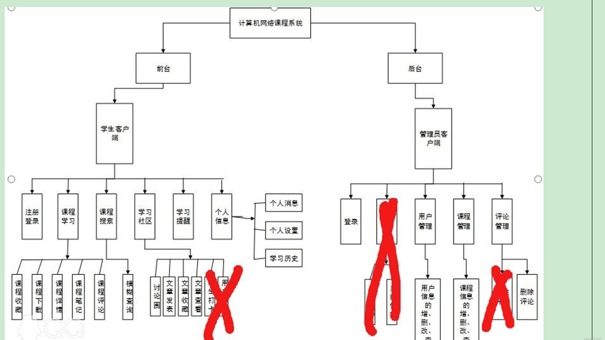

> **博主介绍：**
> 本人专注于Android/java/数据库/微信小程序技术领域的开发，以及有好几年的计算机毕业设计方面的实战开发经验和技术积累；尤其是在安卓（Android）的app的开发和微信小程序的开发，很是熟悉和了解；本人也是多年的Android开发人员；希望我发布的此篇文件可以帮助到您；
>
> 🍅 **文章末尾获取源码下载方式** 🍅

**目录**

功能演示

1：后台演示

一、项目介绍

二、运行环境

三、使用技术

四、数据库设计

五、部分代码

六、浏览更多Android毕业设计

七、源码下载

* * *

#### 功能演示

##### 1：后台演示

##### 2：客户端演示

#### 一、项目介绍

> 

#### 二、运行环境

> 1：客户端使用Android stuido进行开发；  
>  2：服务端后台使用Myeclipse2014进行开发；  
>  3：mysql数据库进行数据存储；  
>  4：需要jdk1.7以上  
>  5：使用雷电模拟器或者Androidstuio自带的模拟器进行运行

#### 三、使用技术

> **总体设计逻辑和思路：**  
>  1：先设计数据库表文件  
>  2：写服务端jsp页面以及写api接口给客户端提供数据  
>  3：完成后台服务端的数据交互，也就是jsp页面数据的存储和显示  
>  4：进行客户端页面的开发；  
>  5：进行客户端对api接口的调用，也就是获取数据库的数据以及在客户端进行显示
>
> **移动端：**  
>  1：使用android原生控件以及xml布局文件来完成界面的显示  
>  2：使用java代码完成功能的数据和逻辑交互  
>  3：使用http网络请求完成数据的请求；  
>  **4：使用json数据解析完成客户端数据的回调和显示**
>
> **服务端后台：**  
>  1：使用mysql完成数据的存储  
>  2：使用jdbc完成数据库和代码的逻辑交互  
>  3：使用jsp完成网页数据的显示  
>  4：使用java代码完成api接口的编写以及以及数据的回调

#### 四、数据库设计

    
    
    /*
    Navicat MySQL Data Transfer
    
    Source Server         : mydb
    Source Server Version : 50528
    Source Host           : localhost:3306
    Source Database       : compucoursedb
    
    Target Server Type    : MYSQL
    Target Server Version : 50528
    File Encoding         : 65001
    
    Date: 2019-04-16 23:22:38
    */
    
    SET FOREIGN_KEY_CHECKS=0;
    
    -- ----------------------------
    -- Table structure for collectmsg
    -- ----------------------------
    DROP TABLE IF EXISTS `collectmsg`;
    CREATE TABLE `collectmsg` (
      `collectId` int(50) NOT NULL AUTO_INCREMENT,
      `collectUserId` varchar(100) DEFAULT NULL,
      `collectUserName` varchar(255) DEFAULT NULL,
      `collectVideoId` varchar(100) DEFAULT NULL,
      `collectVideoName` varchar(255) DEFAULT NULL,
      `collectTime` varchar(100) DEFAULT NULL,
      PRIMARY KEY (`collectId`)
    ) ENGINE=InnoDB AUTO_INCREMENT=19 DEFAULT CHARSET=utf8;
    
    -- ----------------------------
    -- Records of collectmsg
    -- ----------------------------
    INSERT INTO `collectmsg` VALUES ('17', '15', '999', '85', '那一年在西藏', '2019-04-16 23:03');
    INSERT INTO `collectmsg` VALUES ('18', '15', '999', '87', '可爱的动物', '2019-04-16 23:18');
    
    -- ----------------------------
    -- Table structure for review
    -- ----------------------------
    DROP TABLE IF EXISTS `review`;
    CREATE TABLE `review` (
      `rid` int(50) NOT NULL AUTO_INCREMENT,
      `rUserId` varchar(50) NOT NULL,
      `rUserName` varchar(100) NOT NULL,
      `rVideoId` varchar(100) NOT NULL,
      `rReviewContent` varchar(300) NOT NULL,
      `rReplyContent` varchar(300) DEFAULT NULL,
      `rCreatime` varchar(100) NOT NULL,
      PRIMARY KEY (`rid`)
    ) ENGINE=InnoDB AUTO_INCREMENT=70 DEFAULT CHARSET=utf8;
    
    -- ----------------------------
    -- Records of review
    -- ----------------------------
    INSERT INTO `review` VALUES ('61', '15', '999', '21', '999', '', '2019-04-16 23:12');
    INSERT INTO `review` VALUES ('62', '15', '999', '21', '666', '', '2019-04-16 23:12');
    INSERT INTO `review` VALUES ('63', '15', '999', '85', '6666666', '', '2019-04-16 23:15');
    INSERT INTO `review` VALUES ('66', '15', '999', '87', 'wo de pinglun', '', '2019-04-16 23:19');
    INSERT INTO `review` VALUES ('68', '15', '999', '22', 'tom999', '', '2019-04-16 23:20');
    INSERT INTO `review` VALUES ('69', '15', '999', '22', '11111111', '', '2019-04-16 23:20');
    
    -- ----------------------------
    -- Table structure for topictb
    -- ----------------------------
    DROP TABLE IF EXISTS `topictb`;
    CREATE TABLE `topictb` (
      `topicId` int(50) NOT NULL AUTO_INCREMENT,
      `topicMessage` varchar(255) DEFAULT NULL,
      `topicUserId` varchar(100) DEFAULT NULL,
      `topicUserName` varchar(255) DEFAULT NULL,
      `topicTime` varchar(100) DEFAULT NULL,
      `topicState` varchar(255) DEFAULT NULL,
      PRIMARY KEY (`topicId`)
    ) ENGINE=InnoDB AUTO_INCREMENT=23 DEFAULT CHARSET=utf8;
    
    -- ----------------------------
    -- Records of topictb
    -- ----------------------------
    INSERT INTO `topictb` VALUES ('21', '应该怎么正确的记忆单词呢？大家有好的意见吗？', '15', '999', '2019-04-16 23:12', '1');
    INSERT INTO `topictb` VALUES ('22', '应该怎么正确的记忆单词呢？教教吧！', '15', '999', '2019-04-16 23:20', '1');
    
    -- ----------------------------
    -- Table structure for user
    -- ----------------------------
    DROP TABLE IF EXISTS `user`;
    CREATE TABLE `user` (
      `uid` int(50) NOT NULL AUTO_INCREMENT,
      `uname` varchar(100) NOT NULL,
      `uphone` varchar(100) NOT NULL,
      `upswd` varchar(100) NOT NULL,
      `utime` varchar(100) NOT NULL,
      PRIMARY KEY (`uid`)
    ) ENGINE=InnoDB AUTO_INCREMENT=16 DEFAULT CHARSET=utf8;
    
    -- ----------------------------
    -- Records of user
    -- ----------------------------
    INSERT INTO `user` VALUES ('10', 'pony', '15249243002', '123456', '2019-04-16 11:40');
    INSERT INTO `user` VALUES ('15', '999', '15249243002', '123456', '2019-04-16 22:10');
    
    -- ----------------------------
    -- Table structure for videomsg
    -- ----------------------------
    DROP TABLE IF EXISTS `videomsg`;
    CREATE TABLE `videomsg` (
      `videoId` int(50) NOT NULL AUTO_INCREMENT,
      `videoTitle` varchar(100) NOT NULL,
      `videoSize` varchar(255) DEFAULT NULL,
      `videoMessage` varchar(500) DEFAULT NULL,
      `videoCreatTime` varchar(100) NOT NULL,
      `videoHotFlag` varchar(255) DEFAULT NULL,
      `videoNumber` int(100) DEFAULT '0',
      `videoImage` varchar(500) NOT NULL,
      `videoFile` varchar(500) DEFAULT NULL,
      PRIMARY KEY (`videoId`)
    ) ENGINE=InnoDB AUTO_INCREMENT=88 DEFAULT CHARSET=utf8;
    
    -- ----------------------------
    -- Records of videomsg
    -- ----------------------------
    INSERT INTO `videomsg` VALUES ('85', '那一年在西藏', '人文历史', '也许你也曾想过有那么个地方，可以让心灵安静下来，可以听见天空的声响，可以放荡自己的灵魂，可以穿梭在传说里不想自拔。也许那就是西藏。也许你也曾想过有那么个地方，可以让心灵安静下来，可以听见天空的声响，可以放荡自己的灵魂，可以穿梭在传说里不想自拔。也许那就是西藏。', '2019-04-16 23:01:53', '1', '4', 'shiheyuanfang.jpg', 'city_disanji.mp4');
    INSERT INTO `videomsg` VALUES ('86', '人与自然之小猫', '科学历史', '很多年之后，我忽然想起那年的色拉寺，那年的八廊街头，那年的鲁朗林海，那年的南迦巴瓦峰，还有那年的那些人，以及那个那年的我。很多年之后，我忽然想起那年的色拉寺，那年的八廊街头，那年的鲁朗林海，那年的南迦巴瓦峰，还有那年的那些人，以及那个那年的我。', '2019-04-16 23:02:19', '1', '1', 'disanji.jpg', 'xian_duanshipin_01.mp4');
    INSERT INTO `videomsg` VALUES ('87', '可爱的动物', '动物学', '可爱的动物可爱的动物可爱的动物可爱的动物可爱的动物可爱的动物可爱的动物可爱的动物可爱的动物可爱的动物可爱的动物可爱的动物可爱的动物可爱的动物可爱的动物可爱的动物可爱的动物', '2019-04-16 23:18:21', '1', '0', '433a000058459bff9eaa.jpg', 'xian_duanshipin_01.mp4');
    

#### 五、部分代码

#### 六、浏览更多Android毕业设计

[毕业设计-基于android的租房信息发布平台的APP_信息发布app源码_Android毕业设计源码的博客-
CSDN博客](https://blog.csdn.net/u014388322/article/details/100656450?spm=1001.2014.3001.5502
"毕业设计-基于android的租房信息发布平台的APP_信息发布app源码_Android毕业设计源码的博客-CSDN博客")

[毕业设计-基于android选课系统的设计与实现_android学生选课系统_Android毕业设计源码的博客-
CSDN博客](https://blog.csdn.net/u014388322/article/details/100656536?spm=1001.2014.3001.5502
"毕业设计-基于android选课系统的设计与实现_android学生选课系统_Android毕业设计源码的博客-CSDN博客")

[毕业设计之校园一卡通管理系统的设计与实现_一卡通管理系统实现_Android毕业设计源码的博客-
CSDN博客](https://blog.csdn.net/u014388322/article/details/126048550?spm=1001.2014.3001.5502
"毕业设计之校园一卡通管理系统的设计与实现_一卡通管理系统实现_Android毕业设计源码的博客-CSDN博客")

[基于Android的校园二手闲置物品交易系统设计与实现_基于android的二手交易平台_Android毕业设计源码的博客-
CSDN博客](https://blog.csdn.net/u014388322/article/details/128232475?spm=1001.2014.3001.5502
"基于Android的校园二手闲置物品交易系统设计与实现_基于android的二手交易平台_Android毕业设计源码的博客-CSDN博客")

[基于androidstudio校园快递APP系统的设计与实现_android studio论文_Android毕业设计源码的博客-
CSDN博客](https://blog.csdn.net/u014388322/article/details/128545390?spm=1001.2014.3001.5502
"基于androidstudio校园快递APP系统的设计与实现_android studio论文_Android毕业设计源码的博客-CSDN博客")

[基于android的商城购物定制APP_安卓开发购物app_Android毕业设计源码的博客-
CSDN博客](https://blog.csdn.net/u014388322/article/details/128746697?spm=1001.2014.3001.5502
"基于android的商城购物定制APP_安卓开发购物app_Android毕业设计源码的博客-CSDN博客")

> 更多毕业设计可以浏览我的个人主页哦！

#### 七、源码下载

> 大家 **点赞、收藏、关注、评论** 啦 、 **查看** 👇🏻👇🏻👇🏻 **获取联系方式** 👇🏻👇🏻👇🏻
>
> <https://download.csdn.net/download/u014388322/88189469>
>
> ​

