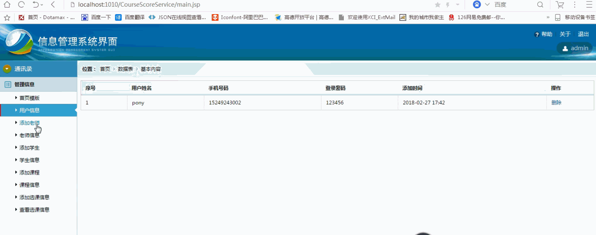
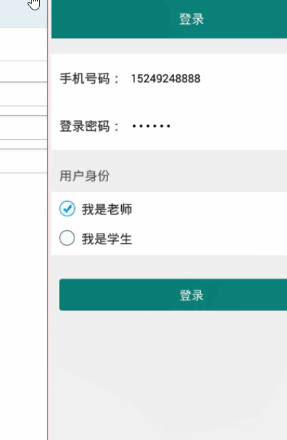

> **博主介绍：**
> 本人专注于Android/java/数据库/微信小程序技术领域的开发，以及有好几年的计算机毕业设计方面的实战开发经验和技术积累；尤其是在安卓（Android）的app的开发和微信小程序的开发，很是熟悉和了解；本人也是多年的Android开发人员；希望我发布的此篇文件可以帮助到您；
>
> 🍅 **文章末尾获取源码下载方式** 🍅

**目录**

功能演示

1：后台演示

2：客户端演示

一、项目介绍

二、运行环境

三、使用技术

四、数据库设计

五、部分代码

六、浏览更多Android毕业设计

七、源码下载

* * *

#### 功能演示

##### 1：后台演示

#####  2：客户端演示

#####

#### 一、项目介绍

> **管理员**
>
> 1：登录
>
> 2：学生教师课程管理，可以增加
>
> **教师**
>
> 1：登录
>
> 2：选择要上课的学生，设置该课程成绩比例
>
> 3：出勤管理 请假-2，旷课-3，迟到早退-1
>
> 4：分组管理 指定组长，组名
>
> 5：成绩导入 可单个导入也可excel批量导入
>
> 6：总成绩计算
>
> 7：统计分数，按某个选项 科目，班级，最高分等
>
> 8：上传课件，布置作业
>
> 9：查看消息，如请假（是否批准），批量导入成功等
>
> **学生**
>
> 1：登录
>
> 2：查看成绩，作业，课件
>
> 3：组长添加学生为组员
>
> 4：请假，等待批准
>
> 5：消息 如你成为某组成员，你的请假通过等

#### 二、运行环境

> 1：客户端使用Android stuido进行开发；  
>  2：服务端后台使用Myeclipse2014进行开发；  
>  3：mysql数据库进行数据存储；  
>  4：需要jdk1.7以上  
>  5：使用雷电模拟器或者Androidstuio自带的模拟器进行运行

#### 三、使用技术

> **总体设计逻辑和思路：**  
>  1：先设计数据库表文件  
>  2：写服务端jsp页面以及写api接口给客户端提供数据  
>  3：完成后台服务端的数据交互，也就是jsp页面数据的存储和显示  
>  4：进行客户端页面的开发；  
>  5：进行客户端对api接口的调用，也就是获取数据库的数据以及在客户端进行显示
>
> **移动端：**  
>  1：使用android原生控件以及xml布局文件来完成界面的显示  
>  2：使用java代码完成功能的数据和逻辑交互  
>  3：使用http网络请求完成数据的请求；  
>  **4：使用json数据解析完成客户端数据的回调和显示**
>
> **服务端后台：**  
>  1：使用mysql完成数据的存储  
>  2：使用jdbc完成数据库和代码的逻辑交互  
>  3：使用jsp完成网页数据的显示  
>  4：使用java代码完成api接口的编写以及以及数据的回调

#### 四、数据库设计

    
    
    /*
    Navicat MySQL Data Transfer
    
    Source Server         : mydata
    Source Server Version : 50537
    Source Host           : localhost:3306
    Source Database       : integraldb
    
    Target Server Type    : MYSQL
    Target Server Version : 50537
    File Encoding         : 65001
    
    Date: 2019-02-18 11:39:56
    */
    
    SET FOREIGN_KEY_CHECKS=0;
    
    -- ----------------------------
    -- Table structure for attendancetb
    -- ----------------------------
    DROP TABLE IF EXISTS `attendancetb`;
    CREATE TABLE `attendancetb` (
      `AttendanceId` int(11) NOT NULL AUTO_INCREMENT,
      `AttendanceCourseId` varchar(255) DEFAULT NULL,
      `AttendanceCourseName` varchar(255) DEFAULT NULL,
      `AttendanceStuId` int(11) DEFAULT NULL,
      `AttendanceStuName` varchar(255) DEFAULT NULL,
      `AttendanceType` varchar(255) DEFAULT NULL,
      `AttendanceScore` varchar(255) DEFAULT NULL,
      `AttendanceMessage` varchar(255) DEFAULT NULL,
      `AttendanceState` varchar(255) DEFAULT NULL,
      `AttendanceTime` varchar(100) DEFAULT NULL,
      PRIMARY KEY (`AttendanceId`)
    ) ENGINE=InnoDB AUTO_INCREMENT=8 DEFAULT CHARSET=utf8;
    
    -- ----------------------------
    -- Records of attendancetb
    -- ----------------------------
    INSERT INTO `attendancetb` VALUES ('1', '21', '计算机基础', '3', 'pony', '旷课', '3', '', '1', '2019-02-18 10:03');
    INSERT INTO `attendancetb` VALUES ('2', '21', '计算机基础', '5', 'daidai', '迟到早退', '1', '', '1', '2019-02-18 10:15');
    INSERT INTO `attendancetb` VALUES ('3', '21', '计算机基础', '3', 'pony', '请假', '2', '我有事需求请假一周', '2', '2019-02-18 10:28');
    INSERT INTO `attendancetb` VALUES ('4', '21', '计算机基础', '3', 'pony', '请假', '2', '我要去玩', '1', '2019-02-18 11:19');
    INSERT INTO `attendancetb` VALUES ('5', '21', '计算机基础', '6', 'duoduo', '旷课', '3', '', '1', '2019-02-18 11:29');
    INSERT INTO `attendancetb` VALUES ('6', '21', '计算机基础', '4', 'ynbaobao', '迟到早退', '1', '', '1', '2019-02-18 11:29');
    INSERT INTO `attendancetb` VALUES ('7', '21', '计算机基础', '3', 'pony', '请假', '2', '我需要请假', '3', '2019-02-18 11:31');
    
    -- ----------------------------
    -- Table structure for choicecoursetb
    -- ----------------------------
    DROP TABLE IF EXISTS `choicecoursetb`;
    CREATE TABLE `choicecoursetb` (
      `choiceCourseId` int(11) NOT NULL AUTO_INCREMENT,
      `choiceCourseTeaId` varchar(11) DEFAULT NULL,
      `choiceCourseTeaName` varchar(255) DEFAULT NULL,
      `choiceCourseCourseId` varchar(11) DEFAULT NULL,
      `choiceCourseCourseName` varchar(255) DEFAULT NULL,
      `choiceCourseStuId` varchar(11) DEFAULT NULL,
      `choiceCourseStuName` varchar(255) DEFAULT NULL,
      `choiceCourseTime` varchar(100) DEFAULT NULL,
      PRIMARY KEY (`choiceCourseId`)
    ) ENGINE=InnoDB AUTO_INCREMENT=9 DEFAULT CHARSET=utf8;
    
    -- ----------------------------
    -- Records of choicecoursetb
    -- ----------------------------
    INSERT INTO `choicecoursetb` VALUES ('2', '2', '王老师', '21', '计算机基础', '3', 'pony', '2019-02-14 14:30');
    INSERT INTO `choicecoursetb` VALUES ('3', '2', '王老师', '21', '计算机基础', '4', 'ynbaobao', '2019-02-14 14:31');
    INSERT INTO `choicecoursetb` VALUES ('4', '2', '王老师', '21', '计算机基础', '5', 'daidai', '2019-02-14 14:31');
    INSERT INTO `choicecoursetb` VALUES ('5', '2', '王老师', '21', '计算机基础', '6', 'duoduo', '2019-02-14 14:31');
    INSERT INTO `choicecoursetb` VALUES ('6', '2', '王老师', '21', '计算机基础', '7', 'Tom', '2019-02-14 14:31');
    INSERT INTO `choicecoursetb` VALUES ('7', '2', '王老师', '22', 'java基础', '6', 'duoduo', '2019-02-14 15:36');
    INSERT INTO `choicecoursetb` VALUES ('8', '2', '王老师', '22', 'java基础', '3', 'pony', '2019-02-17 17:28');
    
    -- ----------------------------
    -- Table structure for coursemsg
    -- ----------------------------
    DROP TABLE IF EXISTS `coursemsg`;
    CREATE TABLE `coursemsg` (
      `courseId` int(50) NOT NULL AUTO_INCREMENT,
      `courseName` varchar(255) DEFAULT NULL,
      `courseTime` varchar(100) DEFAULT NULL,
      PRIMARY KEY (`courseId`)
    ) ENGINE=InnoDB AUTO_INCREMENT=27 DEFAULT CHARSET=utf8;
    
    -- ----------------------------
    -- Records of coursemsg
    -- ----------------------------
    INSERT INTO `coursemsg` VALUES ('21', '计算机基础', '2019-02-14 11:00');
    INSERT INTO `coursemsg` VALUES ('22', 'java基础', '2019-02-14 11:00');
    INSERT INTO `coursemsg` VALUES ('23', 'jsp基础', '2019-02-14 11:00');
    INSERT INTO `coursemsg` VALUES ('24', 'mysql基础', '2019-02-14 11:00');
    INSERT INTO `coursemsg` VALUES ('25', 'serclet基础', '2019-02-14 11:00');
    
    -- ----------------------------
    -- Table structure for grouptb
    -- ----------------------------
    DROP TABLE IF EXISTS `grouptb`;
    CREATE TABLE `grouptb` (
      `groupId` int(50) NOT NULL AUTO_INCREMENT,
      `groupName` varchar(255) DEFAULT NULL,
      `groupStuMessage` varchar(255) DEFAULT NULL,
      `groupCourserId` varchar(11) DEFAULT NULL,
      `groupTeacherId` varchar(11) DEFAULT NULL,
      `groupTime` varchar(100) DEFAULT NULL,
      PRIMARY KEY (`groupId`)
    ) ENGINE=InnoDB AUTO_INCREMENT=7 DEFAULT CHARSET=utf8;
    
    -- ----------------------------
    -- Records of grouptb
    -- ----------------------------
    INSERT INTO `grouptb` VALUES ('4', '呆呆组', '3,4', '21', '2', '2019-02-17 13:44');
    INSERT INTO `grouptb` VALUES ('6', '大家好好学习', '5,6,7', '21', '2', '2019-02-18 11:30');
    
    -- ----------------------------
    -- Table structure for homeworktb
    -- ----------------------------
    DROP TABLE IF EXISTS `homeworktb`;
    CREATE TABLE `homeworktb` (
      `homeworkId` int(50) NOT NULL AUTO_INCREMENT,
      `homeworkTeacherId` int(11) DEFAULT NULL,
      `homeworkTeacherName` varchar(255) DEFAULT NULL,
      `homeworkCourseId` varchar(11) DEFAULT NULL,
      `homeworkCourseName` varchar(255) DEFAULT NULL,
      `homeworkName` varchar(255) DEFAULT NULL,
      `homeworkMessage` varchar(255) DEFAULT NULL,
      `homeworkTime` varchar(100) DEFAULT NULL,
      PRIMARY KEY (`homeworkId`)
    ) ENGINE=InnoDB AUTO_INCREMENT=5 DEFAULT CHARSET=utf8;
    
    -- ----------------------------
    -- Records of homeworktb
    -- ----------------------------
    INSERT INTO `homeworktb` VALUES ('1', '2', '王老师', '21', '计算机基础', '编程题', '在明白逻辑的情况下，完成问题的编码工作！', '2019-02-17 16:49');
    INSERT INTO `homeworktb` VALUES ('2', '2', '王老师', '21', '计算机基础', 'java基础学习', '好好学习基础知识，做好对应的笔记内容！', '2019-02-17 16:49');
    INSERT INTO `homeworktb` VALUES ('3', '2', '王老师', '21', '计算机基础', '英语笔记', '学习笔记的内容信息', '2019-02-17 17:13');
    INSERT INTO `homeworktb` VALUES ('4', '2', '王老师', '21', '计算机基础', '今天的作业', '记得好好完成哦', '2019-02-18 11:30');
    
    -- ----------------------------
    -- Table structure for scoretb
    -- ----------------------------
    DROP TABLE IF EXISTS `scoretb`;
    CREATE TABLE `scoretb` (
      `scoreId` int(11) NOT NULL AUTO_INCREMENT,
      `scoreCourseId` varchar(11) DEFAULT NULL,
      `scoreCourseTime` varchar(100) DEFAULT NULL,
      `scoreStudentId` varchar(11) DEFAULT NULL,
      `scoreStudnetName` varchar(255) DEFAULT NULL,
      `scoreMessage` int(255) DEFAULT '0',
      PRIMARY KEY (`scoreId`)
    ) ENGINE=InnoDB AUTO_INCREMENT=42 DEFAULT CHARSET=utf8;
    
    -- ----------------------------
    -- Records of scoretb
    -- ----------------------------
    INSERT INTO `scoretb` VALUES ('6', '21', '期中成绩', '3', 'pony', '89');
    INSERT INTO `scoretb` VALUES ('7', '21', '期中成绩', '4', 'ynbaobao', '96');
    INSERT INTO `scoretb` VALUES ('8', '21', '期中成绩', '5', 'daidai', '95');
    INSERT INTO `scoretb` VALUES ('9', '21', '期中成绩', '6', 'duoduo', '90');
    INSERT INTO `scoretb` VALUES ('10', '21', '期中成绩', '7', 'Tom', '85');
    INSERT INTO `scoretb` VALUES ('37', '21', '期末成绩', '3', 'pony', '96');
    INSERT INTO `scoretb` VALUES ('38', '21', '期末成绩', '4', 'ynbaobao', '98');
    INSERT INTO `scoretb` VALUES ('39', '21', '期末成绩', '5', 'daidai', '97');
    INSERT INTO `scoretb` VALUES ('40', '21', '期末成绩', '6', 'duoduo', '92');
    INSERT INTO `scoretb` VALUES ('41', '21', '期末成绩', '7', 'Tom', '91');
    
    -- ----------------------------
    -- Table structure for studenttb
    -- ----------------------------
    DROP TABLE IF EXISTS `studenttb`;
    CREATE TABLE `studenttb` (
      `studentId` int(50) NOT NULL AUTO_INCREMENT,
      `studentName` varchar(255) DEFAULT NULL,
      `studentPhone` varchar(255) DEFAULT NULL,
      `studentPswd` varchar(255) DEFAULT NULL,
      `studentTime` varchar(100) DEFAULT NULL,
      PRIMARY KEY (`studentId`)
    ) ENGINE=InnoDB AUTO_INCREMENT=8 DEFAULT CHARSET=utf8;
    
    -- ----------------------------
    -- Records of studenttb
    -- ----------------------------
    INSERT INTO `studenttb` VALUES ('3', 'pony', '15249248888', '123456', '2019-02-14 11:00');
    INSERT INTO `studenttb` VALUES ('4', 'ynbaobao', '15249242323', '123456', '2019-02-14 11:00');
    INSERT INTO `studenttb` VALUES ('5', 'daidai', '15249244545', '123456', '2019-02-14 11:00');
    INSERT INTO `studenttb` VALUES ('6', 'duoduo', '15249247878', '123456', '2019-02-14 11:00');
    INSERT INTO `studenttb` VALUES ('7', 'Tom', '15249249898', '123456', '2019-02-14 11:00');
    
    -- ----------------------------
    -- Table structure for teachertb
    -- ----------------------------
    DROP TABLE IF EXISTS `teachertb`;
    CREATE TABLE `teachertb` (
      `teacherId` int(11) NOT NULL AUTO_INCREMENT,
      `teacherName` varchar(255) DEFAULT NULL,
      `teacherPhone` varchar(255) DEFAULT NULL,
      `teacherPswd` varchar(255) DEFAULT NULL,
      `teacherTime` varchar(100) DEFAULT NULL,
      PRIMARY KEY (`teacherId`)
    ) ENGINE=InnoDB AUTO_INCREMENT=5 DEFAULT CHARSET=utf8;
    
    -- ----------------------------
    -- Records of teachertb
    -- ----------------------------
    INSERT INTO `teachertb` VALUES ('2', '王老师', '15249241234', '123456', '2019-02-14 10:43');
    INSERT INTO `teachertb` VALUES ('3', '李老师', '15249244567', '123456', '2019-02-14 10:43');
    INSERT INTO `teachertb` VALUES ('4', '张老师', '15249245656', '123456', '2019-02-14 10:43');
    
    -- ----------------------------
    -- Table structure for user
    -- ----------------------------
    DROP TABLE IF EXISTS `user`;
    CREATE TABLE `user` (
      `uid` int(50) NOT NULL AUTO_INCREMENT,
      `uname` varchar(100) NOT NULL,
      `uphone` varchar(100) NOT NULL,
      `upswd` varchar(100) NOT NULL,
      `utime` varchar(100) NOT NULL,
      PRIMARY KEY (`uid`)
    ) ENGINE=InnoDB AUTO_INCREMENT=20 DEFAULT CHARSET=utf8;
    
    -- ----------------------------
    -- Records of user
    -- ----------------------------
    INSERT INTO `user` VALUES ('19', 'pony', '15249243002', '123456', '2018-02-27 17:42');
    

#### 五、部分代码

#### 六、浏览更多Android毕业设计

[毕业设计-基于android的租房信息发布平台的APP_信息发布app源码_Android毕业设计源码的博客-
CSDN博客](https://blog.csdn.net/u014388322/article/details/100656450?spm=1001.2014.3001.5502
"毕业设计-基于android的租房信息发布平台的APP_信息发布app源码_Android毕业设计源码的博客-CSDN博客")

[毕业设计-基于android选课系统的设计与实现_android学生选课系统_Android毕业设计源码的博客-
CSDN博客](https://blog.csdn.net/u014388322/article/details/100656536?spm=1001.2014.3001.5502
"毕业设计-基于android选课系统的设计与实现_android学生选课系统_Android毕业设计源码的博客-CSDN博客")

[毕业设计之校园一卡通管理系统的设计与实现_一卡通管理系统实现_Android毕业设计源码的博客-
CSDN博客](https://blog.csdn.net/u014388322/article/details/126048550?spm=1001.2014.3001.5502
"毕业设计之校园一卡通管理系统的设计与实现_一卡通管理系统实现_Android毕业设计源码的博客-CSDN博客")

[基于Android的校园二手闲置物品交易系统设计与实现_基于android的二手交易平台_Android毕业设计源码的博客-
CSDN博客](https://blog.csdn.net/u014388322/article/details/128232475?spm=1001.2014.3001.5502
"基于Android的校园二手闲置物品交易系统设计与实现_基于android的二手交易平台_Android毕业设计源码的博客-CSDN博客")

[基于androidstudio校园快递APP系统的设计与实现_android studio论文_Android毕业设计源码的博客-
CSDN博客](https://blog.csdn.net/u014388322/article/details/128545390?spm=1001.2014.3001.5502
"基于androidstudio校园快递APP系统的设计与实现_android studio论文_Android毕业设计源码的博客-CSDN博客")

[基于android的商城购物定制APP_安卓开发购物app_Android毕业设计源码的博客-
CSDN博客](https://blog.csdn.net/u014388322/article/details/128746697?spm=1001.2014.3001.5502
"基于android的商城购物定制APP_安卓开发购物app_Android毕业设计源码的博客-CSDN博客")

> 更多毕业设计可以浏览我的个人主页哦！

#### 七、源码下载

> 大家 **点赞、收藏、关注、评论** 啦 、 **查看** 👇🏻👇🏻👇🏻 **获取联系方式** 👇🏻👇🏻👇🏻
>
> <https://download.csdn.net/download/u014388322/87473512>​

