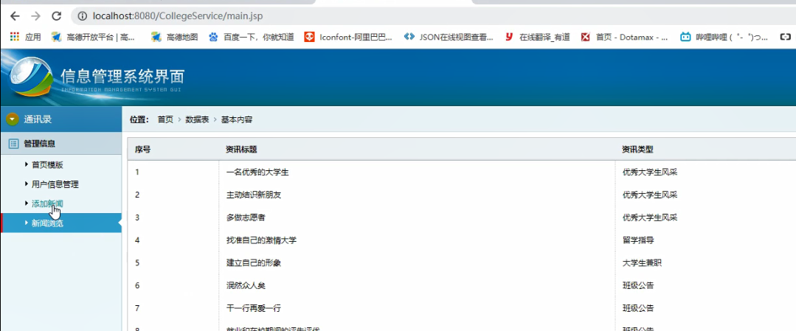
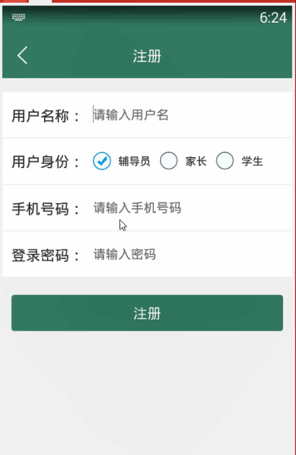

> **博主介绍：**
> 本人专注于Android/java/数据库/微信小程序技术领域的开发，以及有好几年的计算机毕业设计方面的实战开发经验和技术积累；尤其是在安卓（Android）的app的开发和微信小程序的开发，很是熟悉和了解；本人也是多年的Android开发人员；希望我发布的此篇文件可以帮助到您；
>
> 🍅 **文章末尾获取源码下载方式** 🍅

#### 功能演示

**详情演示视频请文字末尾公众号咨询，我会发给您；**

#### 1：后台演示

#### 2：客户端演示

#### 一、项目介绍

> 系统主要可以分为四个模块：学习资源模块、新闻公告模块、班级圈模块、留言互动模块
>
> 1.学习资源模块
>
> A.注册/登陆
>
> 用户可选择各自的角色进行注册并登陆。
>
> B.学习信息展示
>
> 用户可根据要查询的相关信息进入相应的信息板块进行查询。
>
> C.我的学习记录
>
> 用户进行学习或信息浏览后，可以保存相应的学习记录，方便进行下次的学习。
>
> D.我的消息盒子
>
> 2.新闻公告模块
>
> 通过多个板块展示的形式，实时的推送最新信息如：优秀大学生风采专栏、大学生兼职专栏、留学指导专栏、学校大事件专栏、最新时事专栏。
>
> 3.班级圈模块
>
> A.班级公告
>
> 在公告栏处，用户可随时查看班级公告、奖助学金发放、班级活动等信息。
>
> B.信息交流区
>
> 用户、家长、辅导员都可以在此板块进行留言互通，提高交互性。
>
> C.班级风采展示
>
> 4.留言互动模块
>
> A.学习信息区
>
> 在此板块可以和全国各地的老师、同学等进行学习问题探讨。
>
> B.交友信息区
>
> C.我的金币
>
> 根据合理回答他人学习、生活问题的条数和提问者的满意度，进行金币奖励，增强用户之间的信息交流。
>
> D.系统消息提示
>
> 即时的消息提醒，就像QQ、微信消息提醒一样，方便用户在后台登录APP的情况下也可以收到重要信息。

#### 二、运行环境

> 1：客户端使用Android stuido进行开发；  
>  2：服务端后台使用Myeclipse2014进行开发；  
>  3：mysql数据库进行数据存储；  
>  4：需要jdk1.7以上  
>  5：使用雷电模拟器或者Androidstuio自带的模拟器进行运行

#### 三、使用技术

> **总体设计逻辑和思路：**  
>  1：先设计数据库表文件  
>  2：写服务端jsp页面以及写api接口给客户端提供数据  
>  3：完成后台服务端的数据交互，也就是jsp页面数据的存储和显示  
>  4：进行客户端页面的开发；  
>  5：进行客户端对api接口的调用，也就是获取数据库的数据以及在客户端进行显示
>
> **移动端：**  
>  1：使用android原生控件以及xml布局文件来完成界面的显示  
>  2：使用java代码完成功能的数据和逻辑交互  
>  3：使用http网络请求完成数据的请求；  
>  **4：使用json数据解析完成客户端数据的回调和显示**
>
> **服务端后台：**  
>  1：使用mysql完成数据的存储  
>  2：使用jdbc完成数据库和代码的逻辑交互  
>  3：使用jsp完成网页数据的显示  
>  4：使用java代码完成api接口的编写以及以及数据
>  
>  
>     /*
>     Navicat MySQL Data Transfer
>  
>     Source Server         : mydb
>     Source Server Version : 50528
>     Source Host           : localhost:3306
>     Source Database       : collegedb
>  
>     Target Server Type    : MYSQL
>     Target Server Version : 50528
>     File Encoding         : 65001
>  
>     Date: 2019-03-10 20:01:01
>     */
>  
>     SET FOREIGN_KEY_CHECKS=0;
>  
>     -- ----------------------------
>     -- Table structure for classshowtb
>     -- ----------------------------
>     DROP TABLE IF EXISTS `classshowtb`;
>     CREATE TABLE `classshowtb` (
>       `classShowId` int(11) NOT NULL AUTO_INCREMENT,
>       `classShowMessage` varchar(255) DEFAULT NULL,
>       `classShowImg` varchar(255) DEFAULT NULL,
>       `classShowUserId` varchar(11) DEFAULT NULL,
>       `classShowUserName` varchar(255) DEFAULT NULL,
>       `classShowTime` varchar(100) DEFAULT NULL,
>       PRIMARY KEY (`classShowId`)
>     ) ENGINE=InnoDB AUTO_INCREMENT=5 DEFAULT CHARSET=utf8;
>  
>     -- ----------------------------
>     -- Records of classshowtb
>     -- ----------------------------
>     INSERT INTO `classshowtb` VALUES ('2', '一路走来，太累了，停下来歇歇吧，多休息一会，是为了走更远的路',
> 'timg-13.jpeg', '118', '小花', '2019-03-10 14:02');
>     INSERT INTO `classshowtb` VALUES ('3', '一路走来，太累了，停下来歇歇吧，多休息一会，是为了走更远的路',
> 'timg-16.jpeg', '118', '小花', '2019-03-10 14:06');
>     INSERT INTO `classshowtb` VALUES ('4', '一路走来，太累了，停下来歇歇吧，多休息一会，是为了走更远的路',
> 'timg-6.jpeg', '118', '小花', '2019-03-10 18:25');
>  
>     -- ----------------------------
>     -- Table structure for collectmsg
>     -- ----------------------------
>     DROP TABLE IF EXISTS `collectmsg`;
>     CREATE TABLE `collectmsg` (
>       `collectId` int(50) NOT NULL AUTO_INCREMENT,
>       `collectUserId` varchar(100) DEFAULT NULL,
>       `collectMessageId` varchar(100) DEFAULT NULL,
>       `collectTime` varchar(100) DEFAULT NULL,
>       `collectType` varchar(255) DEFAULT NULL,
>       PRIMARY KEY (`collectId`)
>     ) ENGINE=InnoDB AUTO_INCREMENT=63 DEFAULT CHARSET=utf8;
>  
>     -- ----------------------------
>     -- Records of collectmsg
>     -- ----------------------------
>     INSERT INTO `collectmsg` VALUES ('62', '118', '73', '2019-03-05 16:08',
> '1');
>  
>     -- ----------------------------
>     -- Table structure for friendtb
>     -- ----------------------------
>     DROP TABLE IF EXISTS `friendtb`;
>     CREATE TABLE `friendtb` (
>       `friendId` int(11) NOT NULL AUTO_INCREMENT,
>       `friendUserId` varchar(11) DEFAULT NULL,
>       `friendUserName` varchar(255) DEFAULT NULL,
>       `friendMyId` varchar(11) DEFAULT NULL,
>       `friendMyName` varchar(255) DEFAULT NULL,
>       `friendTime` varchar(100) DEFAULT NULL,
>       PRIMARY KEY (`friendId`)
>     ) ENGINE=InnoDB AUTO_INCREMENT=10 DEFAULT CHARSET=utf8;
>  
>     -- ----------------------------
>     -- Records of friendtb
>     -- ----------------------------
>     INSERT INTO `friendtb` VALUES ('8', '123', 'duoduo', '118', '多多',
> '2019-02-27 16:07');
>     INSERT INTO `friendtb` VALUES ('9', '124', 'daidai', '118', '多多',
> '2019-02-27 17:04');
>  
>     -- ----------------------------
>     -- Table structure for newsmessage
>     -- ----------------------------
>     DROP TABLE IF EXISTS `newsmessage`;
>     CREATE TABLE `newsmessage` (
>       `newsId` int(100) NOT NULL AUTO_INCREMENT,
>       `newsTitle` varchar(255) DEFAULT NULL,
>       `newsType` varchar(255) DEFAULT NULL,
>       `newsContent` varchar(5000) DEFAULT NULL,
>       `newsUserId` varchar(11) DEFAULT NULL,
>       `newsUserName` varchar(255) DEFAULT NULL,
>       `newsTime` varchar(100) DEFAULT NULL,
>       PRIMARY KEY (`newsId`)
>     ) ENGINE=InnoDB AUTO_INCREMENT=84 DEFAULT CHARSET=utf8;
>  
>     -- ----------------------------
>     -- Records of newsmessage
>     -- ----------------------------
>     INSERT INTO `newsmessage` VALUES ('76', '一名优秀的大学生', '优秀大学生风采',
> '如果你是大一的新生，想过上有趣而又有意义的大学生活，让别人更多的关注你，那你需要获得比较高的学分、绩点，特别是一些获得一些奖学金。因此，你就要学会如何在你的社会生活和学术成就上做好平衡。到底如何才能成为一名优秀的大学生，以下是小编给的一些建议，希望对您有帮助',
> null, null, '2019-03-07 23:25');
>     INSERT INTO `newsmessage` VALUES ('77', '主动结识新朋友', '优秀大学生风采',
> '主动结识新朋友这也许会感觉有点困难，特别是对于刚入学的新生来说，但是千万不要让这种感觉所阻挡，大学是一个你可以见到各式各样的人的地方，甚至一些个性非常独特的人，不要害羞也不要紧张，也许在结交的过程中，说不定对方也很紧张呢，所以，你在担心什么呢？',
> null, null, '2019-03-07 23:25');
>     INSERT INTO `newsmessage` VALUES ('78', '多做志愿者', '优秀大学生风采',
> '多做志愿者工作多去参加一些志愿者工作，一方面因为志愿者工作不仅可以让你接解更多的东西，丰富自己的经历，另一方面，你可以结识很多热爱志愿的朋友，一般来说，他们都是比较热心、充满朝气与活力的青年。',
> null, null, '2019-03-07 23:26');
>     INSERT INTO `newsmessage` VALUES ('79', '找准自己的激情大学', '留学指导',
> '找准自己的激情大学是一个可以尝试新鲜事物的地方，你可以尝试着去接触任何你好奇的事情。想没想运去学一段拉丁舞？或一套酷炫的街舞动作？等等，这些你都可以通过一些兴趣班来实现，在那里你会遇到很多志同道合的朋友，他们会一直保持着这份激情。',
> null, null, '2019-03-07 23:27');
>     INSERT INTO `newsmessage` VALUES ('80', '建立自己的形象', '大学生兼职',
> '建立自己的形象在学校学会建立自己的形象，比如会弹吉他，如果别人一说到吉他两字就会想起你，“那谁谁谁会啊”，那么你就成功的把自己和吉他联系起来了。类似的，每人都有学习的地方，当你把自己的某一处优势推广到这种程度的时候，你就成功了，说白了，给自己贴上适当的标签。',
> null, null, '2019-03-07 23:27');
>     INSERT INTO `newsmessage` VALUES ('81', '泯然众人矣', '班级公告',
> '每一个刚进大学校园的新同学，相信更多的是对大学生活有着美好憧憬。但久而久之，不少同学在大学的状态和表现，远未达到他们心中的预期，“泯然众人矣”。今天，小编给大家分享十条优秀大学生标准，大家也可以理解成大学生该努力的方向，赶紧来看看你及格了吗？',
> null, null, '2019-03-07 23:36');
>     INSERT INTO `newsmessage` VALUES ('82', '干一行再爱一行', '班级公告',
> '爱上自己的专业面临专业问题时，总是遇到“干一行再爱一行”还是“爱一行再干一行”的问题，这些都不要担心，也不要纠结。如果选好了自己的专业，就努力扎实自己的专业知识，只有当你真正学进去了，取得了一定的成就你才会渐渐喜欢。相信我，现在你所讨厌的专业，是因为你学不好，不要拿不感兴趣来说事。',
> null, null, '2019-03-07 23:37');
>     INSERT INTO `newsmessage` VALUES ('83', '就业和在校期间的评先评优', '班级公告',
> '作为大学生，学业必须摆在首位，但学习成绩又不应该成为衡量大学生优秀与否的唯一指标，所以中上等左右成绩即可，但挂科是不允许的，毕竟考试不及格基本上是“学渣”的专属，且挂科会影响保研、就业和在校期间的评先评优。',
> null, null, '2019-03-07 23:37');
>  
>     -- ----------------------------
>     -- Table structure for reviewmsg
>     -- ----------------------------
>     DROP TABLE IF EXISTS `reviewmsg`;
>     CREATE TABLE `reviewmsg` (
>       `reviewId` int(50) NOT NULL AUTO_INCREMENT,
>       `reviewMessageId` varchar(100) DEFAULT NULL,
>       `reviewContent` varchar(500) DEFAULT NULL,
>       `reviewUserId` varchar(100) DEFAULT NULL,
>       `reviewUserName` varchar(255) DEFAULT NULL,
>       `reviewTime` varchar(100) DEFAULT NULL,
>       PRIMARY KEY (`reviewId`)
>     ) ENGINE=InnoDB AUTO_INCREMENT=26 DEFAULT CHARSET=utf8;
>  
>     -- ----------------------------
>     -- Records of reviewmsg
>     -- ----------------------------
>     INSERT INTO `reviewmsg` VALUES ('11', '11', '9898989', '106', '小丸子',
> '2019-03-04 23:20');
>     INSERT INTO `reviewmsg` VALUES ('12', '11', '1111', '106', '小丸子',
> '2019-03-04 23:20');
>     INSERT INTO `reviewmsg` VALUES ('13', '13', 'hello', '106', '小丸子',
> '2019-03-05 00:35');
>     INSERT INTO `reviewmsg` VALUES ('14', '13', '9999', '106', '小丸子',
> '2019-03-05 00:35');
>     INSERT INTO `reviewmsg` VALUES ('15', '17', '111', '118', '多多',
> '2019-03-05 11:57');
>     INSERT INTO `reviewmsg` VALUES ('16', '18', '0000', '118', '99',
> '2019-03-07 23:32');
>     INSERT INTO `reviewmsg` VALUES ('17', '18', '0000', '118', '99',
> '2019-03-10 13:27');
>     INSERT INTO `reviewmsg` VALUES ('18', '18', '1111111', '118', '99',
> '2019-03-10 13:29');
>     INSERT INTO `reviewmsg` VALUES ('19', '18', '111111111', '118', '99',
> '2019-03-10 13:29');
>     INSERT INTO `reviewmsg` VALUES ('20', '18', '111111111', '118', '99',
> '2019-03-10 13:30');
>     INSERT INTO `reviewmsg` VALUES ('21', '18', 'dada ', '118', '99',
> '2019-03-10 13:30');
>     INSERT INTO `reviewmsg` VALUES ('22', '20', '3444444444444444', '118',
> '小花', '2019-03-10 15:11');
>     INSERT INTO `reviewmsg` VALUES ('23', '20', 'wo de huida', '118', '小花',
> '2019-03-10 15:11');
>     INSERT INTO `reviewmsg` VALUES ('24', '21', '9999999999999', '118',
> '小花', '2019-03-10 18:24');
>     INSERT INTO `reviewmsg` VALUES ('25', '19', '96969696969696969696',
> '118', '小花', '2019-03-10 18:24');
>  
>     -- ----------------------------
>     -- Table structure for topictb
>     -- ----------------------------
>     DROP TABLE IF EXISTS `topictb`;
>     CREATE TABLE `topictb` (
>       `topicId` int(50) NOT NULL AUTO_INCREMENT,
>       `topicMessage` varchar(255) DEFAULT NULL,
>       `topicUserId` varchar(100) DEFAULT NULL,
>       `topicUserName` varchar(255) DEFAULT NULL,
>       `topicTime` varchar(100) DEFAULT NULL,
>       `topicType` varchar(255) DEFAULT NULL,
>       `topicScore` varchar(255) DEFAULT NULL,
>       PRIMARY KEY (`topicId`)
>     ) ENGINE=InnoDB AUTO_INCREMENT=23 DEFAULT CHARSET=utf8;
>  
>     -- ----------------------------
>     -- Records of topictb
>     -- ----------------------------
>     INSERT INTO `topictb` VALUES ('17', '大家都看过流浪地球了吗？看后感觉怎么样呢！', '118',
> '多多', '2019-03-05 11:48', '1', null);
>     INSERT INTO `topictb` VALUES ('18', '大家都看过流浪地球了吗？看后感觉怎么样呢！', '118',
> '小花', '2019-03-07 23:23', '1', null);
>     INSERT INTO `topictb` VALUES ('19', '大家都看过流浪地球了吗？看后感觉怎么样呢！', '125',
> '王辅导员', '2019-03-10 13:38', '1', null);
>     INSERT INTO `topictb` VALUES ('20', '大家都看过流浪地球了吗？看后感觉怎么样呢！', '118',
> '小花', '2019-03-10 15:03', '2', '1分');
>     INSERT INTO `topictb` VALUES ('21', '大家都看过流浪地球了吗？看后感觉怎么样呢！', '118',
> '小花', '2019-03-10 18:24', '1', '0');
>     INSERT INTO `topictb` VALUES ('22', '大家都看过流浪地球了吗？看后感觉怎么样呢！', '118',
> '小花', '2019-03-10 18:25', '2', '1分');
>  
>     -- ----------------------------
>     -- Table structure for user
>     -- ----------------------------
>     DROP TABLE IF EXISTS `user`;
>     CREATE TABLE `user` (
>       `userId` int(255) NOT NULL AUTO_INCREMENT,
>       `userName` varchar(200) CHARACTER SET utf8 NOT NULL,
>       `userPhone` varchar(100) CHARACTER SET utf8 NOT NULL,
>       `userPswd` varchar(200) CHARACTER SET utf8 NOT NULL,
>       `userTime` varchar(300) CHARACTER SET utf8 NOT NULL,
>       `userType` varchar(255) CHARACTER SET utf8 DEFAULT '0',
>       `userScore` int(255) DEFAULT '0',
>       PRIMARY KEY (`userId`)
>     ) ENGINE=InnoDB AUTO_INCREMENT=126 DEFAULT CHARSET=latin1;
>  
>     -- ----------------------------
>     -- Records of user
>     -- ----------------------------
>     INSERT INTO `user` VALUES ('118', '小花', '15249241116', '123456',
> '2019-03-05 14:17', '学生', '0');
>     INSERT INTO `user` VALUES ('123', 'duoduo', '15249248989', '123456',
> '2019-03-05 15:57', '学生', '0');
>     INSERT INTO `user` VALUES ('124', 'daidai', '15249246666', '123456',
> '2019-03-05 16:00', '家长', '0');
>     INSERT INTO `user` VALUES ('125', '王辅导员', '15249241111', '123456',
> '2019-03-10 13:17', '辅导员', '0');
>  
>
> 的回调

#### 四、数据库设计

#### 五、部分代码

#### 六、浏览更多Android毕业设计

[毕业设计-基于android的租房信息发布平台的APP_信息发布app源码_Android毕业设计源码的博客-
CSDN博客](https://blog.csdn.net/u014388322/article/details/100656450?spm=1001.2014.3001.5502
"毕业设计-基于android的租房信息发布平台的APP_信息发布app源码_Android毕业设计源码的博客-CSDN博客")

[毕业设计-基于android选课系统的设计与实现_android学生选课系统_Android毕业设计源码的博客-
CSDN博客](https://blog.csdn.net/u014388322/article/details/100656536?spm=1001.2014.3001.5502
"毕业设计-基于android选课系统的设计与实现_android学生选课系统_Android毕业设计源码的博客-CSDN博客")

[毕业设计之校园一卡通管理系统的设计与实现_一卡通管理系统实现_Android毕业设计源码的博客-
CSDN博客](https://blog.csdn.net/u014388322/article/details/126048550?spm=1001.2014.3001.5502
"毕业设计之校园一卡通管理系统的设计与实现_一卡通管理系统实现_Android毕业设计源码的博客-CSDN博客")

[基于Android的校园二手闲置物品交易系统设计与实现_基于android的二手交易平台_Android毕业设计源码的博客-
CSDN博客](https://blog.csdn.net/u014388322/article/details/128232475?spm=1001.2014.3001.5502
"基于Android的校园二手闲置物品交易系统设计与实现_基于android的二手交易平台_Android毕业设计源码的博客-CSDN博客")

[基于androidstudio校园快递APP系统的设计与实现_android studio论文_Android毕业设计源码的博客-
CSDN博客](https://blog.csdn.net/u014388322/article/details/128545390?spm=1001.2014.3001.5502
"基于androidstudio校园快递APP系统的设计与实现_android studio论文_Android毕业设计源码的博客-CSDN博客")

[基于android的商城购物定制APP_安卓开发购物app_Android毕业设计源码的博客-
CSDN博客](https://blog.csdn.net/u014388322/article/details/128746697?spm=1001.2014.3001.5502
"基于android的商城购物定制APP_安卓开发购物app_Android毕业设计源码的博客-CSDN博客")

> 更多毕业设计可以浏览我的个人主页哦！

#### 七、源码下载

> 大家 **点赞、收藏、关注、评论** 啦 、 **查看** 👇🏻👇🏻👇🏻 **获取联系方式** 👇🏻👇🏻👇🏻
>
> <https://download.csdn.net/download/u014388322/88199222>

