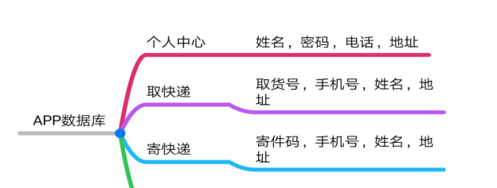

#### 源码下载：

<https://download.csdn.net/download/u014388322/87473523>

##

#### 1.课题背景及研究的目的和意义

1.1 课题背景

在其发展速度可谓一日千里的电子商务时代，大学生群体已成为网络购物群体中不可或缺的一部分。因此，高校师生对网购的需求也愈来愈强烈，校园快递的问题也成为了焦点，其中校园快递代理点以及加盟店因其方便了师生收发快件而倍受欢迎。但是，因为每天代收包裹数量较多，所以校园快递不同于一般家用快递，快递员并不会主动送到学生指定宿舍门口，主要是大学生群体每天接到快递到达通知，主动去校园快递代收点领取。

与此同时，最不能让高校师生满意的是寒暑假来临之时，有较高行李托运需求的师生却找不到一家能够进入到校园的物流供应商为他们托运行李，提供优质、安全、快捷的物流服务。因此，本文首先对高校校园快递进行分析，在此基础上构建校园配送模式，进而提出建立高校校园内部物流网，最终形成具有竞争优势的校园快递APP配送系统。

1.2 研究的目的和意义

1.2.1 研究的目的

在我国“物流”的研究起源于上个世纪的八十年代，虽然起步较晚但在近几十年的发展中，可谓是发展迅速，其发展势头不可小觑，伴随着互联网的普及以及电商务的兴起，物流的发展得到了前所未有的繁荣，现已成为促进国民经济发展的动力。但是我国物流行业的发展水平与发达国家相比，还存在有一些问题，有一定的差距。因此，在各领域充分认识到物流重要性的基础上，要加强对物流行业的研究，完善其中存在的问题，尤其是在近几年网络经济的快速发展的基础上，电子商务对物流行业的要求更加迫切。在电子商务的而影响下，网购现已经成为了都市生活的必备，这不仅符合都市生活的快节奏，而且也满足了现代化生活的要求，人们更加注重时效性以及节约性。而且在网购的群体中，高校的师生成为了网购的主力军，这也是各大物流企业还未重视的一个特殊群体，一个具有巨大潜力的市场。因此，在分析校园快递业现状的基础上，对高校校园配送的模式进行探讨，优化校园物流配送模式，提出优质的校园物流营销模式，最后对高校配送运营模式的难点进行梳理并提出对策。系统的研究校园快递运营模式，形成对高校特定的物流快递运营模式必将为物流企业带来巨大的收益。

1.2.2 研究的意义

互联网和电子商务的飞速发展对今天的物流行业提出可更高的要求，而在处于网购主力军阵营中的高校师生则更是对校园物流运营系统更加期待，这样既可以省去了他们在茫茫的快递中寻找自己快递的时间，也进而避免了校园门口的无序化，影响校园环境而对于快递企业来说，建立系统的、完善的校园快递运营模式，一方面能够为企业赢得校园快递市场，规范高校校园配送物流市场，另一方面高校物流业务巨大的市场潜力能够为在校同学提供更多的工作机会。因此，本文对校园快递APP运营模式进行研究具有重要的现实意义。

#### 2．研究现状及分析

2.1 国外现状及分析

1.FedEx

FedEx ** **，**** 中文名叫联邦快递 ** **，****
如果你常看电视一定会熟练的接上一句：使命必答！FedEx家的每条广告创意都非常棒，绝对让你过目不忘。成立于1971年，拥有700多架飞机和4万多部车，总部在美国。

2.DHL

DHL，是德国邮政集团所辖的快递公司，在中国国内是由中外运和DHL合资的一家公司，叫中外运敦豪。DHL总部在比利时，成立于1969年，拥有300多架飞机和2万部车。

3.UPS

UPS，中文名叫联合包裹，成立于1907年，拥有300多架飞机和9万部车，总部在美国，优势绝对是运送速度快，尤其适合马上到申请截止时间时使用，可根据情况选择特快或速快两种，特快可精确到具体将货品送达美国的具体时间。

4.TNT

TNT ** **,****
好像没有中文名称，是荷兰邮政公司自己的快递品牌，在西欧地区的通关速度和效率不错，但是在美国的实力不是很强。成立于1946年，拥有差不多50架飞机和2万部车。

FedEx公司实力和运送质量绝对是一顶一的，就是邮寄费用太贵，尤其是寄往美国西部。DHL这家快递公司的优势就是价格便宜，邮寄速度一般，都是从国内的代理发到香港，由香港代发到美国，性价比较高。UPS在速度方面是最快的但费用也是最贵的。TNT相对于美国起家的UPS和FedEx要稍微慢一点。

2.2 国内现状及分析

1.菜鸟驿站

菜鸟驿站，作为菜鸟网络五大战略方向之一，是由菜鸟网络牵头，建立面向社区和校园的物流服务平台，为网购用户提供包裹代收服务，致力于为消费者提供多元化的最后一公里服务。驿站工作人员扫描快递单号，按货架编号和单号生成短信发送到收件人手机上，收件人凭短信取货码取件。

2.宅急送

申通、圆通、宅急送主要以受理环节以发件人电话预约，业务员取件为主要方式；而中国邮政EMS的快递受理主要是发件客户自行到学校收发室办理。收件客户签收环节，中国邮政EMS、申通、圆通、宅急送派送员通过电话联系收件人约定好取件地址。

3.校园快递超市

校园快递超市以收件人的身份签收快件，校园快递超市的工作人员对快递进行揽件，将快递信息输入到电脑中，形成快件信息发送到收件人手机上，凭短信提货码取件。

菜鸟驿站可以很方便的解决快件的存放问题，但高校快递的直投模式主要依靠师生自己到指定地点取件，没有实现门到门的服务，不能满足师生的个性化需求。这不仅影响着快递配送的质量也缩短了师生的空闲时间，没有达到师生理想化的配送需求。宅急送虽然是快递员上门收发快件但是在快递员精力和体力限制下，使得每天堆积如上的快件不仅降低了配送的效率，另外由于物流配送的信息得不到及时的更新，运营上易存在着中间环节的疏漏，丢件和问题件的产生概率也较大。校园快递超市虽然方便了购物的同时也解决了快件的存放问题，但是由于配送时间相对缩短了，也使得快递员为了充分利用时间而出现不核实取件人信息，丢件、错拿时间吋有发生。为解决广大师生群体快递存放和派送问题，校园快递APP可以提供一系列的解决方法，用户提供取货码，手机号以及姓名，地址等信息提交订单，派送员可根据提交的信息根据约好的时间进行派送和上门收发寄件物品。

#### 3．研究内容解决的关键问题

3.1 研究内容

随着移动时代的到来，互联网技术的快速发展，网络购物的方便快捷，使网络购物已成为当代青年人生活中不可或缺的一部分，
随之而来的便是一些因大学生课程繁忙等诸多原因而无法及时取快递，寄快递等问题进行分析解决。该APP便是立足于大学校园，为大学生提供各种快递服务，如代取代寄等。寄件时当快递员帮忙寄出后会给手机也发送寄件信息：寄件成功，寄件码。同时也会在你APP上显示。

根据需求分析与软件功能设计目标，结合实际情况本软件功能模块主要分为如下几个模块：

1.APP前端页面：如图3-1所示。

图3-1 APP前端模块图

2.后台页面

在数据库设计中，数据库的设计应该规范合理，应合理规划每一个数据表，各个表中的属性设计应该详细齐全，命名要规范。

系统数据库结构设计如下：如图3-2所示。

图3-2数据库模块图

3.前后端功能流程图如图3-3所示。

图3-3功能流程图

3.2 拟解决的关键问题

本APP以快递代送，代寄业务为主要功能进行展开，为在校师生提供快递代送，代寄服务，为注册为快递员的大学生提供兼职工作。在此主要功能的基础上避免APP略显单一，再根据快递业务中的其他服务，提供快递查询物流跟踪，以及发件快递员上门取件功能。

#### 4\. 拟采取的研究方法

4.1 拟采取的研究方法和技术路线

首先对软件需求进行可行性分析，该软件主要使用Java语言和Android技术，使用 UI编写APP前端，使用 Java语言利用Android Studio
IDE开发平台编写程序代码,使用SQLite数据库对后台用户输入数据进行管理，在使用Android技术在用户手机移动端进行使用。

技术流程图：如图4-1所示。

图4-1技术流程图

4.2 进度安排

本设计目标是通过开发校园快递APP软件，检验自己在大学期间的学习所得，为就业打下基础。

工作进度安排：如表4-1所示

表4-1工作进度安排表

2019年11月25日-2019年11月27日

|

根据自己的所学知识选择毕业论文的题目并确定论文题目的研究方向  
  
---|---  
  
2019年12月2日-2019年12月10日

|

完成软件系统规划，编写任务书  
  
2019年12月11日-2019年12月24日

|

查阅文献资料，进行软件功能细分，撰写开题报告，做开题报告PPT，准备开题答辩  
  
2019年12月25日-2019年12月27日

|

修改开题报告并最终确认  
  
2019年12月30日-2019年12月31日

|

开题答辩  
  
2020年2月24日-2020年3月13日

|

设计并编写软件前端页面  
  
2020年3月16日-2020年3月20日

|

编写软件系统后端  
  
2020年3月21日-2020年3月25日

|

对出现的问题集中处理并完善网站  
  
2020年3月26日-2020年3月29日

|

撰写论文并准备中期检查  
  
2020年3月30日-2020年5月1日

|  |

结束毕业论文的撰写，将初稿交于导师审核并根据导师提出的问题和意见来修改论文内容  
  
---  
  
2020年5月2日-2020年5月10日

|

对内容修正，自我查验，交于导师审核订正，再次提出细节性问题与漏洞，认真修改论文内容，进行自我查验  
  
2020年5月11日-2020年5月30日

|

准备毕业答辩  
  
2020年5月31日-2020年6月1日

|

毕业答辩  
  
4.3 预期达到的目标

本APP的目的在于解决当下大学校园快递无人取，没时间取等问题，运用Java语言，Android开发，SQLite数据库等技术借助Android Studio
IDE平台编写系统页面，以此来实现快递代取，快递代寄，查快递等功能。

#### 5．课题已具备和所需的条件

现有的校园环境以及菜鸟驿站校园快递代理站点，整合校园在校大学生等资源。软件系统开发过程中需要用到的Java语言以及Android开发技术。

1.Java编程语言

Java是一门面向对象的编程语言，不仅吸收了C++语言的各种优点，还摒弃了C++里难以理解的多继承、指针等概念，因此Java语言具有功能强大和简单易用两个特征。Java具有简单性、面向对象、分布式、健壮性、安全性、平台独立与可移植性、多线程、动态性等特点。Java可以编写桌面应用程序、Web应用程序、分布式系统和嵌入式系统应用程序等。

2.Android开发技术

Android是一种以Linux为基础的开放源代码操作系统，主要用于便携设备。Android支持使用Java作为编程语言来开发应用程序。

3\. SQLite数据库

SQLite 数据类型是一个用来指定任何对象的数据类型的属性。SQLite
中的每一列，每个变量和表达式都有相关的数据类型。可以在创建表的同时使用这些数据类型。SQLite 使用一个更普遍的动态类型系统。在SQLite
中，值的数据类型与值本身是相关的，而不是与它的容器相关。

  1. 研究过程中可能遇到的困难和问题，解决的措施

可能会遇到的问题：

1.数据库与前端页面跳转出现问题，用户进不去程序；

2.SQLite数据库连接问题；

3.Android系统兼容问题；

解决措施：

1.上网查阅相关资料，多做练习多测试；

2.询问擅长这方面的同学，多和导师交流沟通；

3.多观看有关方面的视频和书籍，寻找解决方法；

由于是第一次做软件开发这一块，APP开发涉及到很多方面的技术，现在所学和接触到的技术肯定是不够的，不过，遇到问题我会积极主动去查阅资料，和导师一起探讨，我相信办法总比困难多的。

#### 7．参考文献

[1]汪慧兴,黄有飞.校园快递代送APP开发项目[J].电子世界,2019(07):73-74.
[2]兰浩原.我国高校快递服务发展的路径[J].现代企业文化(上旬),2018(01):115.

[3]周海霞,李尚文,王清慧,李春雨.校园快递配送创新模式研究[J].合作经济与科技,2018(18):84-87.

[4]刘楠,董晓玮,金雪蓝,柳叶凡.基于校园快递自助的APP设计[J].科技视界,2016(18):55.

[5]王莹.电子商务背景下校园快递运营模式分析[J].合作经济与科技.2019.04.29

[6] 李爽. 校园快递服务系统统计分析及优化[D].燕山大学,2017.

[7] 范威威. 校园快递站点综合管理系统的设计与实现[D].北京工业大学,2016.

[8] 冯妍. 服务于高校的快递运营模式研究[D].大连交通大学,2016.

[9] 王明珠，史桂红.移动应用开发任务式驱动教程[M].北京理工大学出版社.

[10]刘晞楠，董晓伟，金雪蓝，柳叶凡.基于校园快递自助的APP设计[J].科技视界.

[11]Biotechnology - Plant Biotechnology; Investigators at University of Delhi
South Campus Describe Findings in Plant Biotechnology [Identification and
Characterization of the Promoter of a Gene Expressing Mainly In the Tapetum
Tissue of Cotton (Gossypium Hirsutum L.)][J]. Biotech Week,2019.

[12]Erika Taylor,Erika Taylor. Brent Hull's History of the Future[J].
Professional Remodeler,2016.

[13]Anonymous. Denny's expands Express to campus[J]. English,2010,44(6).
[14]Peng Kang,Guanghan Song,Dongjie Chen,Huabo Duan,Ruoyu Zhong.
Characterizing the generation and spatial patterns of carbon emissions from
urban express delivery service in China[J]. Environmental Impact Assessment
Review,2020,80.

[15]Denti Michela,Eilers Wouter,Parker Graham. Call for Special Issue Papers:
Delivery of Antisense RNA Therapeutics: Turning Negative Results into a
Positive Development.[J]. Nucleic acid therapeutics,2019,29(6).

