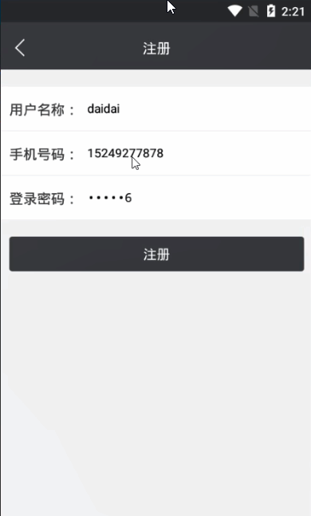

> **博主介绍：**
> 本人专注于Android/java/数据库/微信小程序技术领域的开发，以及有好几年的计算机毕业设计方面的实战开发经验和技术积累；尤其是在安卓（Android）的app的开发和微信小程序的开发，很是熟悉和了解；本人也是多年的Android开发人员；希望我发布的此篇文件可以帮助到您；
>
> 🍅 **文章末尾获取源码下载方式** 🍅

**目录**

功能演示

1：后台演示

2：客户端演示

一、项目介绍

二、运行环境

三、使用技术

四、数据库设计

五、部分代码

1：添加车位

2：查看车位

六、浏览更多Android毕业设计

七、源码下载

* * *

#### 功能演示

##### 1：后台演示

##### 2：客户端演示

#### 一、项目介绍

>
> 1.业主发布车位，软件获取GPS坐标，和业主填写的车位信息一起发送到管理员后台中的车位数据表；同时软件获取的GPS坐标传送到预订车位的地图页面中，在地图页面上留下标记
>
> 2.车主输入目的地，寻找目的地附近的成车位进行预约，预约成功后，将预约订单发送到管理员平台的订单数据表
>
> 3.车主点击订单，调用外部应用(百度，高德)进行导航，来到小区门口由管理员记录进入和离开时间
>
> 4.车主完成订单后，系统自动生成缴费二维码，让车主进行缴费

#### 二、运行环境

> 1：客户端使用Android stuido进行开发；  
>  2：服务端后台使用Myeclipse2014进行开发；  
>  3：mysql数据库进行数据存储；  
>  4：需要jdk1.7以上  
>  5：使用雷电模拟器或者Androidstuio自带的模拟器进行运行

#### 三、使用技术

> **总体设计逻辑和思路：**  
>  1：先设计数据库表文件  
>  2：写服务端jsp页面以及写api接口给客户端提供数据  
>  3：完成后台服务端的数据交互，也就是jsp页面数据的存储和显示  
>  4：进行客户端页面的开发；  
>  5：进行客户端对api接口的调用，也就是获取数据库的数据以及在客户端进行显示
>
> **移动端：**  
>  1：使用android原生控件以及xml布局文件来完成界面的显示  
>  2：使用java代码完成功能的数据和逻辑交互  
>  3：使用http网络请求完成数据的请求；  
>  **4：使用json数据解析完成客户端数据的回调和显示**
>
> **服务端后台：**  
>  1：使用mysql完成数据的存储  
>  2：使用jdbc完成数据库和代码的逻辑交互  
>  3：使用jsp完成网页数据的显示  
>  4：使用java代码完成api接口的编写以及以及数据的回调

#### 四、数据库设计

    
    
    /*
    Navicat MySQL Data Transfer
    
    Source Server         : mydb
    Source Server Version : 50528
    Source Host           : localhost:3306
    Source Database       : carsharedb
    
    Target Server Type    : MYSQL
    Target Server Version : 50528
    File Encoding         : 65001
    
    Date: 2020-02-12 17:17:15
    */
    
    SET FOREIGN_KEY_CHECKS=0;
    
    -- ----------------------------
    -- Table structure for borrowmsg
    -- ----------------------------
    DROP TABLE IF EXISTS `borrowmsg`;
    CREATE TABLE `borrowmsg` (
      `borrowId` int(50) NOT NULL AUTO_INCREMENT,
      `borrowUserId` varchar(100) COLLATE utf8_unicode_ci DEFAULT NULL,
      `borrowUserName` varchar(255) COLLATE utf8_unicode_ci DEFAULT NULL,
      `borrowStartTime` varchar(100) COLLATE utf8_unicode_ci DEFAULT NULL,
      `borrowEndTime` varchar(100) COLLATE utf8_unicode_ci DEFAULT NULL,
      `borrowMessageId` varchar(100) COLLATE utf8_unicode_ci DEFAULT NULL,
      `borrowMessageName` varchar(255) COLLATE utf8_unicode_ci DEFAULT NULL,
      `borrowState` varchar(255) COLLATE utf8_unicode_ci DEFAULT NULL,
      `borrowTime` varchar(100) COLLATE utf8_unicode_ci DEFAULT NULL,
      `borrowMoney` varchar(255) COLLATE utf8_unicode_ci DEFAULT NULL,
      PRIMARY KEY (`borrowId`)
    ) ENGINE=InnoDB AUTO_INCREMENT=25 DEFAULT CHARSET=utf8 COLLATE=utf8_unicode_ci;
    
    -- ----------------------------
    -- Records of borrowmsg
    -- ----------------------------
    INSERT INTO `borrowmsg` VALUES ('23', '1', 'pony', '2020-02-12 13:32', '2020-02-12 15:32', '27', 'DAIDAI国际B3-501', null, '2020-02-12 13:32', '4');
    INSERT INTO `borrowmsg` VALUES ('24', '12', 'daidai', '2020-02-13 14:23', '2020-02-13 18:23', '27', 'DAIDAI国际B3-501', null, '2020-02-12 14:23', '8');
    
    -- ----------------------------
    -- Table structure for lost
    -- ----------------------------
    DROP TABLE IF EXISTS `lost`;
    CREATE TABLE `lost` (
      `lId` int(50) NOT NULL AUTO_INCREMENT,
      `lName` varchar(100) NOT NULL,
      `lMoney` varchar(100) NOT NULL,
      `address` varchar(500) DEFAULT NULL,
      `lMessage` varchar(1500) NOT NULL,
      `lUserId` varchar(100) NOT NULL,
      `lUserName` varchar(100) NOT NULL,
      `lCreateTime` varchar(100) NOT NULL,
      `lState` varchar(255) DEFAULT NULL,
      `lShare` varchar(255) DEFAULT NULL,
      PRIMARY KEY (`lId`)
    ) ENGINE=InnoDB AUTO_INCREMENT=29 DEFAULT CHARSET=utf8;
    
    -- ----------------------------
    -- Records of lost
    -- ----------------------------
    INSERT INTO `lost` VALUES ('26', '多多小区', '6元/小时', 'B1-101', '15249246666', '1', 'pony', '2020-02-12 11:48', '2', '2');
    INSERT INTO `lost` VALUES ('27', 'DAIDAI国际', '2元/小时', 'B3-501', '15249246666', '1', 'pony', '2020-02-12 11:55', '2', '2');
    INSERT INTO `lost` VALUES ('28', 'duoduo小区', '3元/小时', 'B1-603', '15249247878', '12', 'daidai', '2020-02-12 14:22', '2', '1');
    
    -- ----------------------------
    -- Table structure for user
    -- ----------------------------
    DROP TABLE IF EXISTS `user`;
    CREATE TABLE `user` (
      `uid` int(50) NOT NULL AUTO_INCREMENT,
      `uname` varchar(100) NOT NULL,
      `upswd` varchar(100) NOT NULL,
      `uphone` varchar(100) DEFAULT NULL,
      `utime` varchar(100) NOT NULL,
      PRIMARY KEY (`uid`)
    ) ENGINE=InnoDB AUTO_INCREMENT=13 DEFAULT CHARSET=utf8;
    
    -- ----------------------------
    -- Records of user
    -- ----------------------------
    INSERT INTO `user` VALUES ('1', 'pony', '123456', '15249246666', '2020-02-12 11:55');
    INSERT INTO `user` VALUES ('6', '多多', '123456', '15249248888', '2020-02-12 11:55');
    INSERT INTO `user` VALUES ('12', 'daidai', '123456', '15249247878', '2020-02-12 14:21');
    

#### 五、部分代码

##### 1：添加车位

    
    
    public class CreateCarMessageActivity extends BaseActivity {
    	// title
    	private TextView mTvTitle;
    	// 返回
    	private ImageView mIvBack;
    	// 查询按钮
    	private Button mbtnAdd;
    
    	private EditText metname;
    	private EditText metMessage;
    	private EditText metAddress;
    	private int choiceType = 1;
    	private int addressType = 1;
    
    	private EditText metMoney;
    
    	@Override
    	protected void onCreate(Bundle savedInstanceState) {
    		super.onCreate(savedInstanceState);
    		setContentView(R.layout.activity_create_person);
    		initWidget();
    		initData();
    	}
    
    	@Override
    	public void initWidget() {
    
    		metMoney = (EditText) findViewById(R.id.metMoney);
    
    		metAddress = (EditText) findViewById(R.id.metAddress);
    		metMessage = (EditText) findViewById(R.id.metMessage);
    		metname = (EditText) findViewById(R.id.metname);
    		mbtnAdd = (Button) findViewById(R.id.mbtnAdd);
    		mIvBack = (ImageView) findViewById(R.id.mIvBack);
    		mTvTitle = (TextView) findViewById(R.id.mTvTitle);
    		mTvTitle.setText("添加车位信息");
    		mIvBack.setVisibility(View.VISIBLE);
    		mIvBack.setOnClickListener(this);
    		mbtnAdd.setOnClickListener(this);
    
    		metMoney.setText("3元/小时");
    
    	}
    
    	@Override
    	public void onClick(View v) {
    
    		switch (v.getId()) {
    		case R.id.mIvBack:
    			CreateCarMessageActivity.this.finish();
    			break;
    		case R.id.mbtnAdd:
    			LeaveAction(true);
    			break;
    		}
    	}
    
    	@Override
    	public void initData() {
    
    
    
    	}
    
    
    
    	/**
    	 * 用户的登录
    	 * 
    	 * @param isShow
    	 */
    	private void LeaveAction(boolean isShow) {
    
    		UserModel userModel = (UserModel) MemberUserUtils.getBean(this, "user_messgae");
    
    		AjaxParams params = new AjaxParams();
    		params.put("action_flag", "addMessage");
    		params.put("lName", metname.getText().toString());
    		params.put("lMoney", metMoney.getText().toString() + "");
    		params.put("address", metAddress.getText().toString() + "");
    		params.put("lMessage", userModel.getUphone());
    		params.put("lUserId", MemberUserUtils.getUid(this));
    		params.put("lUserName", MemberUserUtils.getName(this));
    		httpPost(Consts.URL + Consts.APP.LostAction, params, Consts.actionId.resultFlag, isShow, "正在提交...");
    	}
    
    	@Override
    	protected void callBackSuccess(ResponseEntry entry, int actionId) {
    		super.callBackSuccess(entry, actionId);
    
    		ToastUtil.show(CreateCarMessageActivity.this, entry.getRepMsg());
    		new Handler().postDelayed(new Runnable() {
    			@Override
    			public void run() {
    				CreateCarMessageActivity.this.finish();
    			}
    		}, 1000);
    	}
    
    	@Override
    	protected void callBackAllFailure(String strMsg, int actionId) {
    		super.callBackAllFailure(strMsg, actionId);
    
    		ToastUtil.show(CreateCarMessageActivity.this, strMsg);
    
    	}
    
    
    
    }
    

##### 2：查看车位

    
    
    public class CarMessageActivity extends BaseActivity implements TimeUtilDialog.TimePickerDialogInterface{
    	private TextView mTvTitle;
    	// 返回
    	private ImageView mIvBack;
    	// 查询按钮
    	private TextView mtvtitle;
    	LostModel noticeModel;
    
    	private TextView courseTeacherName;
    	private TextView courseTime;
    	private TextView courseLength;
    
    	private Button mbtnPay;
    	private TextView mtvShopPrice;
    
    	private Button mbtnStartDate;
    	private Button mbtnEndDate;
    	private int choiceTime = 1;
    	
    	private TextView mIvStu;
    
    	TimeUtilDialog mTimePickerDialog;
    
    
    	@Override
    	protected void onCreate(Bundle savedInstanceState) {
    		super.onCreate(savedInstanceState);
    		setContentView(R.layout.activity_newsmsg);
    		initWidget();
    		initData();
    	}
    
    	@Override
    	public void initWidget() {
    
    		mTimePickerDialog = new TimeUtilDialog(this);
    
    		mIvStu = (TextView) findViewById(R.id.mIvStu);
    		mbtnPay = (Button) findViewById(R.id.mbtnPay);
    		mbtnPay.setOnClickListener(this);
    		mtvShopPrice = (TextView) findViewById(R.id.mtvShopPrice);
    		courseTeacherName = (TextView) findViewById(R.id.courseTeacherName);
    		courseTime = (TextView) findViewById(R.id.courseTime);
    		courseLength = (TextView) findViewById(R.id.courseLength);
    
    		mtvtitle = (TextView) findViewById(R.id.mtvtitle);
    
    		mIvBack = (ImageView) findViewById(R.id.mIvBack);
    		mTvTitle = (TextView) findViewById(R.id.mTvTitle);
    		mTvTitle.setText("车位详情");
    		mIvBack.setVisibility(View.VISIBLE);
    		mIvBack.setOnClickListener(this);
    
    		mbtnStartDate = (Button) findViewById(R.id.mbtnStartDate);
    		mbtnEndDate = (Button) findViewById(R.id.mbtnEndDate);
    
    		mbtnStartDate.setOnClickListener(this);
    		mbtnEndDate.setOnClickListener(this);
    		courseLength.setOnClickListener(this);
    		mIvStu.setOnClickListener(this);
    	}
    
    	@Override
    	public void onClick(View v) {
    
    		switch (v.getId()) {
    		case R.id.mIvBack:
    			CarMessageActivity.this.finish();
    			break;
    			
    		case R.id.mIvStu:
    			break;
    
    
    
    		case R.id.mbtnPay:
    			checkTime(true);
    
    			break;
    
    		case R.id.mbtnStartDate:
    
    			flag = true;
    			choiceTime = 1;
    			mTimePickerDialog.showDatePickerDialog();
    			break;
    
    		case R.id.mbtnEndDate:
    
    			if (mbtnStartDate.getText().toString().equals("请选择开始时间")) {
    				ToastUtil.ShowCentre(this, "请选择开始时间");
    				return;
    			}
    
    			flag = true;
    			choiceTime = 2;
    			mTimePickerDialog.showDatePickerDialog();
    			break;
    		}
    	}
    
    	@Override
    	public void initData() {
    
    		noticeModel = (LostModel) this.getIntent().getSerializableExtra("msg");
    
    		mtvtitle.setText(noticeModel.getlName());
    		// 书名，出版社，种类
    		courseTeacherName.setText("价格：" + noticeModel.getlMoney());
    		courseTime.setText("联系方式：" + noticeModel.getlMessage());
    		courseLength.setText("车位地址：" +noticeModel.getlName()+ noticeModel.getAddress());
    
    	}
    
    	@Override
    	public void positiveListener() {
    		String year = mTimePickerDialog.getYear() + "";
    		String hour = mTimePickerDialog.getHour() + "";
    		String minute = mTimePickerDialog.getMinute() + "";
    		String month;
    		String day;
    
    		if (mTimePickerDialog.getMonth() < 9) {
    			month = "0" + (mTimePickerDialog.getMonth());
    		} else {
    			month = "" + (mTimePickerDialog.getMonth());
    		}
    		if (mTimePickerDialog.getDay() < 9) {
    			day = "0" + (mTimePickerDialog.getDay());
    		} else {
    			day = "" + (mTimePickerDialog.getDay());
    		}
    		if (mTimePickerDialog.getMinute() < 9) {
    			minute = "0" + (mTimePickerDialog.getMinute());
    		} else {
    			minute = "" + (mTimePickerDialog.getMinute());
    		}
    
    		if (mTimePickerDialog.getHour() < 9) {
    			hour = "0" + (mTimePickerDialog.getHour());
    		} else {
    			hour = "" + (mTimePickerDialog.getHour());
    		}
    		if (flag) {
    
    			mTimePickerDialog.showTimePickerDialog();
    			if(choiceTime==1){
    				mbtnStartDate.setText(year + "-" + month + "-" + day);
    			}else{
    				mbtnEndDate.setText(year + "-" + month + "-" + day);
    			}
    
    		} else {
    
    			if(choiceTime==1){
    				mbtnStartDate.setText(year + "-" + month + "-" + day + " " + hour + ":" + minute);
    			}else{
    				mbtnEndDate.setText(year + "-" + month + "-" + day + " " + hour + ":" + minute);
    			}
    			TotalMoney(mbtnStartDate.getText().toString(),mbtnEndDate.getText().toString());
    		}
    
    		flag = false;
    
    
    
    	}
    
    	private boolean flag = true;
    
    	@Override
    	public void negativeListener() {
    
    	}
    	private int dayTotal;
    
    	private void TotalMoney(String dateStart, String dateEnd) {
    		{
    			SimpleDateFormat formatStart = new SimpleDateFormat("yyyy-MM-dd HH:mm");
    			SimpleDateFormat formatEnd = new SimpleDateFormat("yyyy-MM-dd HH:mm");
    			try {
    				Date dateStartMessage = formatStart.parse(dateStart);
    				Date dateEndMessage = formatEnd.parse(dateEnd);
    
    				System.out.println("两个日期的差距：" + differentDaysByMillisecond(dateStartMessage, dateEndMessage));
    
    				Log.i("pony_log", differentDaysByMillisecond(dateStartMessage, dateEndMessage)+"");
    //				if (differentDaysByMillisecond(dateStartMessage, dateEndMessage) == 0) {
    //					ToastUtil.ShowCentre(this, "开始时间和结束时间不能相同");
    //					return;
    //				}
    				todayMessage = differentDaysByMillisecond(dateStartMessage, dateEndMessage);
    				mtvShopPrice.setText(differentDaysByMillisecond(dateStartMessage, dateEndMessage) + "小时");
    
    			} catch (ParseException e) {
    				e.printStackTrace();
    			}
    		}
    	}
    
    	private int todayMessage;
    
    	public static int differentDaysByMillisecond(Date date1, Date date2) {
    		int days = (int) ((date2.getTime() - date1.getTime()) / (1000 * 60 * 60));
    		return days;
    	}
    
    
    	private void checkTime(boolean isShow) {
    		AjaxParams params = new AjaxParams();
    		params.put("action_flag", "checkTime");
    		params.put("borrowStartTime",  mbtnStartDate.getText().toString());
    		params.put("borrowEndTime", mbtnEndDate.getText().toString());
    		params.put("borrowMessageId", noticeModel.getlId());
    		httpPost(Consts.URL + Consts.APP.LostAction, params, Consts.actionId.resultCode, isShow, "正在更新...");
    	}
    
    
    	@Override
    	protected void callBackSuccess(ResponseEntry entry, int actionId) {
    		super.callBackSuccess(entry, actionId);
    		Intent mbtnPay = new Intent(this, PayMessageActivity.class);
    		mbtnPay.putExtra("msg", noticeModel);
    		mbtnPay.putExtra("borrowStartTime", mbtnStartDate.getText().toString());
    		mbtnPay.putExtra("borrowEndTime", mbtnEndDate.getText().toString());
    		mbtnPay.putExtra("msgMoney", (todayMessage * Integer.valueOf(noticeModel.getlMoney().substring(0,noticeModel.getlMoney().indexOf("元")))) + "");
    		startActivity(mbtnPay);
    
    	}
    
    
    	@Override
    	protected void callBackAllFailure(String strMsg, int actionId) {
    		super.callBackAllFailure(strMsg, actionId);
    		ToastUtil.show(this, strMsg);
    
    	}
    }
    

#### 六、浏览更多Android毕业设计

[毕业设计-基于android的租房信息发布平台的APP_信息发布app源码_Android毕业设计源码的博客-
CSDN博客](https://blog.csdn.net/u014388322/article/details/100656450?spm=1001.2014.3001.5502
"毕业设计-基于android的租房信息发布平台的APP_信息发布app源码_Android毕业设计源码的博客-CSDN博客")

[毕业设计-基于android选课系统的设计与实现_android学生选课系统_Android毕业设计源码的博客-
CSDN博客](https://blog.csdn.net/u014388322/article/details/100656536?spm=1001.2014.3001.5502
"毕业设计-基于android选课系统的设计与实现_android学生选课系统_Android毕业设计源码的博客-CSDN博客")

[毕业设计之校园一卡通管理系统的设计与实现_一卡通管理系统实现_Android毕业设计源码的博客-
CSDN博客](https://blog.csdn.net/u014388322/article/details/126048550?spm=1001.2014.3001.5502
"毕业设计之校园一卡通管理系统的设计与实现_一卡通管理系统实现_Android毕业设计源码的博客-CSDN博客")

[基于Android的校园二手闲置物品交易系统设计与实现_基于android的二手交易平台_Android毕业设计源码的博客-
CSDN博客](https://blog.csdn.net/u014388322/article/details/128232475?spm=1001.2014.3001.5502
"基于Android的校园二手闲置物品交易系统设计与实现_基于android的二手交易平台_Android毕业设计源码的博客-CSDN博客")

[基于androidstudio校园快递APP系统的设计与实现_android studio论文_Android毕业设计源码的博客-
CSDN博客](https://blog.csdn.net/u014388322/article/details/128545390?spm=1001.2014.3001.5502
"基于androidstudio校园快递APP系统的设计与实现_android studio论文_Android毕业设计源码的博客-CSDN博客")

[基于android的商城购物定制APP_安卓开发购物app_Android毕业设计源码的博客-
CSDN博客](https://blog.csdn.net/u014388322/article/details/128746697?spm=1001.2014.3001.5502
"基于android的商城购物定制APP_安卓开发购物app_Android毕业设计源码的博客-CSDN博客")

> 更多毕业设计可以浏览我的个人主页哦！

#### 七、源码下载

> 大家 **点赞、收藏、关注、评论** 啦 、 **查看** 👇🏻👇🏻👇🏻 **获取联系方式** 👇🏻👇🏻👇🏻
>
> <https://download.csdn.net/download/u014388322/88188400>
>
> ​

