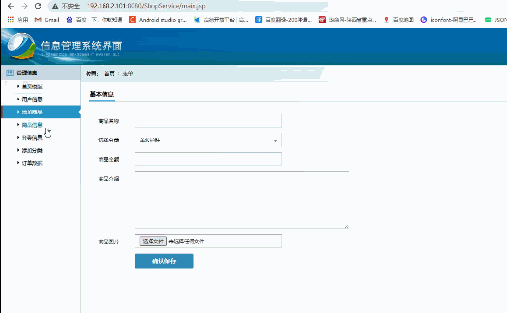
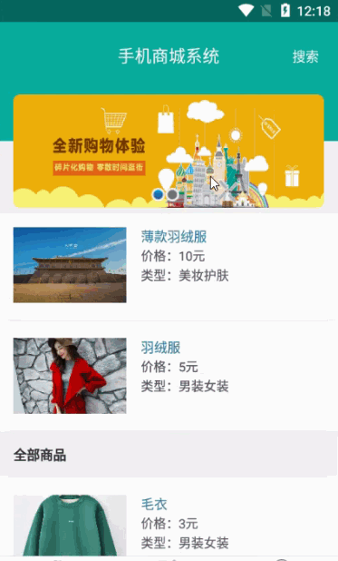

> **博主介绍：**
> 本人专注于Android/java/数据库/微信小程序技术领域的开发，以及有好几年的计算机毕业设计方面的实战开发经验和技术积累；尤其是在安卓（Android）的app的开发和微信小程序的开发，很是熟悉和了解；本人也是多年的Android开发人员；希望我发布的此篇文件可以帮助到您；
>
> 🍅 **文章末尾获取源码下载方式** 🍅

#### 功能演示

##### 1：后台演示

#####  2：客户端演示

#### 一、项目介绍

> 1\. 前台功能  
>
> （1）用户注册登录：用户通过登录账号和密码来登录，登录密码与用户要与数据库的一致，否则登录失败；当用户不存在时可采取注册来添加用户；只有用户登录成功才能进行母婴用品的浏览与购买功能。  
>  （2）母婴用品详细信息功能：用户登录成功后显示母婴用品页面，点击母婴用品跳转至母婴用品详细信息页面，通过该页面可以浏览母婴用品的具体信息。  
>
> （3）母婴用品查找功能：用户登录成功后可以在首页可以通过母婴用品关键字查询母婴用品信息，为用户的需求提供便利。在首页可以设置热销产品和最新上市产品的展示栏。  
>
> （4）购物车功能：实现用户在浏览母婴用品时可以把喜欢的产品暂时放到购物车中，也要提供计算总价的功能，方便用户一次性支付订单；购物车还要提供删除和清空操作，方便用户删除和清空不需要购买的购物车产品；  
>  （5）个人信息操作功能：用户通过登录成功后，点击个人信息页面可在此页面查看用户的个人信息，也可通过修改页面进行个人信息的修改，并保存修改后的信息。  
>  （6）订单管理员功能：用户登录成功后，点击个人订单页面，可以查看自己购物物品的订单信息，包括订单的时间，金额，状态以及所购买母婴用品的内容。  
>  （7）母婴健康咨询：用户进入系统客户端可以在线咨询关于母婴健康问题。  
>  （8）游客登录：用户浏览我们的产品信息不需要登录，通过点击页面的游客登录即可进入，但是如果用户想购买我们的产品还是需要进行注册登录信息。  
>  2\. 后台功能  
>  （1）管理员登录功能：管理员可通过管理员账号和密码登录，登录用户和密码与数据库中一致显示登录成功跳转后台管理首页，不一致提示登录失败。  
>  （2）母婴用品种类的增加、删除、修改功能：后台管理员可以增加新的母婴用品种类，也可对以及存在的母婴用品种类进行删除、修改功能。  
>  （3）订单的查看功能：管理员可以通过后台查看用户的订单状况以及订单信息，并可对未发货的订单进行发货操作。  
>  （4）用户的基本信息管理功能：管理员可查看用户的基本信息，并可对已经存在的用户进行删除和修改操作。

#### 二、运行环境

> 1：客户端使用Android stuido进行开发；  
>  2：服务端后台使用Myeclipse2014进行开发；  
>  3：mysql数据库进行数据存储；  
>  4：需要jdk1.7以上  
>  5：使用雷电模拟器或者Androidstuio自带的模拟器进行运行

#### 三、使用技术

> **总体设计逻辑和思路：**  
>  1：先设计数据库表文件  
>  2：写服务端jsp页面以及写api接口给客户端提供数据  
>  3：完成后台服务端的数据交互，也就是jsp页面数据的存储和显示  
>  4：进行客户端页面的开发；  
>  5：进行客户端对api接口的调用，也就是获取数据库的数据以及在客户端进行显示
>
> **移动端：**  
>  1：使用android原生控件以及xml布局文件来完成界面的显示  
>  2：使用java代码完成功能的数据和逻辑交互  
>  3：使用http网络请求完成数据的请求；  
>  **4：使用json数据解析完成客户端数据的回调和显示**
>
> **服务端后台：**  
>  1：使用mysql完成数据的存储  
>  2：使用jdbc完成数据库和代码的逻辑交互  
>  3：使用jsp完成网页数据的显示  
>  4：使用java代码完成api接口的编写以及以及数据的回调

#### 四、数据库设计

    
    
    /*
    Navicat MySQL Data Transfer
    
    Source Server         : mydb
    Source Server Version : 50528
    Source Host           : localhost:3306
    Source Database       : phoneshopdb
    
    Target Server Type    : MYSQL
    Target Server Version : 50528
    File Encoding         : 65001
    
    Date: 2022-03-04 00:21:56
    */
    
    SET FOREIGN_KEY_CHECKS=0;
    
    -- ----------------------------
    -- Table structure for cartb
    -- ----------------------------
    DROP TABLE IF EXISTS `cartb`;
    CREATE TABLE `cartb` (
      `carId` int(11) NOT NULL AUTO_INCREMENT,
      `carShopId` int(11) DEFAULT NULL,
      `carUserId` int(11) DEFAULT NULL,
      PRIMARY KEY (`carId`)
    ) ENGINE=InnoDB AUTO_INCREMENT=5 DEFAULT CHARSET=utf8;
    
    -- ----------------------------
    -- Records of cartb
    -- ----------------------------
    
    -- ----------------------------
    -- Table structure for jijiantb
    -- ----------------------------
    DROP TABLE IF EXISTS `jijiantb`;
    CREATE TABLE `jijiantb` (
      `jijianId` int(11) NOT NULL AUTO_INCREMENT,
      `jijianName` varchar(255) DEFAULT NULL,
      `jijianAddresse` varchar(255) DEFAULT NULL,
      `jijianPhone` varchar(255) DEFAULT NULL,
      `jijianUserId` int(11) DEFAULT NULL,
      PRIMARY KEY (`jijianId`)
    ) ENGINE=InnoDB AUTO_INCREMENT=12 DEFAULT CHARSET=utf8;
    
    -- ----------------------------
    -- Records of jijiantb
    -- ----------------------------
    INSERT INTO `jijiantb` VALUES ('1', '小明', '西安市雁塔区', '15249248888', '17');
    INSERT INTO `jijiantb` VALUES ('2', '小花', '西安市', '15249249999', '17');
    INSERT INTO `jijiantb` VALUES ('3', '小萝莉', '上海市', '15249246969', '17');
    INSERT INTO `jijiantb` VALUES ('4', '小品', '西安市', '15249248888', '17');
    INSERT INTO `jijiantb` VALUES ('5', '小明', '西安市莲湖区', '15249249988', '26');
    INSERT INTO `jijiantb` VALUES ('6', '小米', '西安市雁塔区', '15249243002', '92');
    INSERT INTO `jijiantb` VALUES ('7', '小虎虎', '西安市雁塔区', '15249243002', '92');
    INSERT INTO `jijiantb` VALUES ('8', '小花', '西安市雁塔区', '15249248877', '92');
    INSERT INTO `jijiantb` VALUES ('9', 'like', '西安市', '15249248989', '92');
    INSERT INTO `jijiantb` VALUES ('10', '画画', '西安市雁塔区', '15249240022', '93');
    INSERT INTO `jijiantb` VALUES ('11', '小花', '西安市雁塔区西路', '15249241003', '94');
    
    -- ----------------------------
    -- Table structure for ordertb
    -- ----------------------------
    DROP TABLE IF EXISTS `ordertb`;
    CREATE TABLE `ordertb` (
      `orderId` int(11) NOT NULL AUTO_INCREMENT,
      `orderMessageId` varchar(100) DEFAULT NULL,
      `orderMessageMoney` varchar(255) DEFAULT NULL,
      `orderUserId` varchar(100) DEFAULT NULL,
      `orderUserName` varchar(255) DEFAULT NULL,
      `orderAddress` varchar(500) DEFAULT NULL,
      `orderCreatime` varchar(100) DEFAULT NULL,
      `orderNo` varchar(500) DEFAULT NULL,
      PRIMARY KEY (`orderId`)
    ) ENGINE=InnoDB AUTO_INCREMENT=39 DEFAULT CHARSET=utf8;
    
    -- ----------------------------
    -- Records of ordertb
    -- ----------------------------
    INSERT INTO `ordertb` VALUES ('34', '34', '15', '92', '玥溪', '小花,15249248877,西安市雁塔区', '2022-03-03 23:52', 'NO20211201210407');
    INSERT INTO `ordertb` VALUES ('35', '36,34', '36', '94', 'xiaohua ', '小花,15249241003,西安市雁塔区西路', '2022-03-03 23:52', 'NO20211201210909');
    INSERT INTO `ordertb` VALUES ('36', '36', '3', '92', '玥溪', '小花,15249248877,西安市雁塔区', '2022-03-03 23:52', 'NO20220303235244');
    INSERT INTO `ordertb` VALUES ('37', '36', '3', '92', '玥溪', 'like,15249248989,西安市', '2022-03-04 00:14', 'NO20220304001410');
    INSERT INTO `ordertb` VALUES ('38', '36,35', '8', '92', '玥溪', '小花,15249248877,西安市雁塔区', '2022-03-04 00:19', 'NO20220304001925');
    
    -- ----------------------------
    -- Table structure for reviewtb
    -- ----------------------------
    DROP TABLE IF EXISTS `reviewtb`;
    CREATE TABLE `reviewtb` (
      `reviewId` int(11) NOT NULL AUTO_INCREMENT,
      `reviewMessageId` int(11) DEFAULT NULL,
      `reviewContent` varchar(255) DEFAULT NULL,
      `reviewUserId` int(11) DEFAULT NULL,
      `reviewUserName` varchar(255) DEFAULT NULL,
      `reviewTime` varchar(100) DEFAULT NULL,
      `reviewSendUserId` varchar(255) DEFAULT NULL,
      `reviewMessageName` varchar(255) DEFAULT NULL,
      PRIMARY KEY (`reviewId`)
    ) ENGINE=InnoDB AUTO_INCREMENT=62 DEFAULT CHARSET=utf8;
    
    -- ----------------------------
    -- Records of reviewtb
    -- ----------------------------
    INSERT INTO `reviewtb` VALUES ('53', '34', '和女不粗要', '92', '玥溪', '2022-03-04 00:03', null, null);
    INSERT INTO `reviewtb` VALUES ('54', '34', '和女不粗要大大', '92', '玥溪', '2022-03-04 00:03', null, null);
    INSERT INTO `reviewtb` VALUES ('55', '34', '和女不粗要大大大大', '92', '玥溪', '2022-03-04 00:03', null, null);
    INSERT INTO `reviewtb` VALUES ('56', '34', '大大', '92', '玥溪', '2022-03-04 00:05', null, null);
    INSERT INTO `reviewtb` VALUES ('57', '34', '问答', '92', '玥溪', '2022-03-04 00:07', null, null);
    INSERT INTO `reviewtb` VALUES ('58', '34', '问答大大', '92', '玥溪', '2022-03-04 00:07', null, null);
    INSERT INTO `reviewtb` VALUES ('59', '36', '8888888888888', '92', '玥溪', '2022-03-04 00:14', null, null);
    INSERT INTO `reviewtb` VALUES ('60', '36', '很舒服', '92', '玥溪', '2022-03-04 00:19', null, null);
    INSERT INTO `reviewtb` VALUES ('61', '35', '很好看', '92', '玥溪', '2022-03-04 00:19', null, null);
    
    -- ----------------------------
    -- Table structure for shoptb
    -- ----------------------------
    DROP TABLE IF EXISTS `shoptb`;
    CREATE TABLE `shoptb` (
      `shopId` int(50) NOT NULL AUTO_INCREMENT,
      `shopName` varchar(255) DEFAULT NULL,
      `shopTypeId` int(11) DEFAULT NULL,
      `shopTypeName` varchar(255) DEFAULT NULL,
      `shopMoney` varchar(255) DEFAULT NULL,
      `shopMessage` varchar(2000) DEFAULT NULL,
      `shopCreatime` varchar(100) DEFAULT NULL,
      `shopImg` varchar(500) DEFAULT NULL,
      PRIMARY KEY (`shopId`)
    ) ENGINE=InnoDB AUTO_INCREMENT=37 DEFAULT CHARSET=utf8;
    
    -- ----------------------------
    -- Records of shoptb
    -- ----------------------------
    INSERT INTO `shoptb` VALUES ('33', '薄款羽绒服', '21', '美妆护肤', '10', 'value=\"杀菌机理是释放出新生态原子氧、氧化菌体中的活性基团；杀菌特点是作用快而强，能杀死所有微生物，包括细菌芽孢、病毒。以表面消毒为主，如二氧化氯、双氧水、臭氧、次氯酸钠等，该类消毒剂为灭菌剂。\r\n醛类\"\"\"\"\"\"', '2022-03-03 23:52', '1501153408392.jpg');
    INSERT INTO `shoptb` VALUES ('34', '打底衫', '24', '男装女装', '15', '杀菌机理是使蛋白变性或烷基化；杀菌特点是对细菌、芽孢、真菌、病毒均有效。但温度影响较大。如甲醛、戊二醛等。该类消毒剂可做灭菌剂使用。\"', '2022-03-03 23:52', 'yf1.jpg');
    INSERT INTO `shoptb` VALUES ('35', '羽绒服', '24', '男装女装', '5', '口罩是一种卫生用品，一般指戴在口鼻部位用于过滤进入口鼻的空气，以达到阻挡有害的气体、气味、飞沫、病毒等物质的作用，以纱布或纸等材料做成。', '2022-03-03 23:52', 'yf3.jpg');
    INSERT INTO `shoptb` VALUES ('36', '毛衣', '24', '男装女装', '3', '口罩分为医用口罩和非医用口罩、（及最新确定的）民用卫生口罩。口罩分为医用口罩和非医用口罩、（及最新确定的）民用卫生口罩。', '2022-03-03 23:52', 'yf2.jpg');
    
    -- ----------------------------
    -- Table structure for typetb
    -- ----------------------------
    DROP TABLE IF EXISTS `typetb`;
    CREATE TABLE `typetb` (
      `typeId` int(50) NOT NULL AUTO_INCREMENT,
      `typeName` varchar(255) DEFAULT NULL,
      PRIMARY KEY (`typeId`)
    ) ENGINE=InnoDB AUTO_INCREMENT=25 DEFAULT CHARSET=utf8;
    
    -- ----------------------------
    -- Records of typetb
    -- ----------------------------
    INSERT INTO `typetb` VALUES ('21', '美妆护肤');
    INSERT INTO `typetb` VALUES ('22', '玩具饰品');
    INSERT INTO `typetb` VALUES ('23', '图书文娱');
    INSERT INTO `typetb` VALUES ('24', '男装女装');
    
    -- ----------------------------
    -- Table structure for user
    -- ----------------------------
    DROP TABLE IF EXISTS `user`;
    CREATE TABLE `user` (
      `uid` int(255) NOT NULL AUTO_INCREMENT,
      `uname` varchar(200) CHARACTER SET utf8 NOT NULL,
      `uphone` varchar(100) NOT NULL,
      `upswd` varchar(200) NOT NULL,
      `utime` varchar(255) CHARACTER SET utf8 DEFAULT NULL,
      `usearch` varchar(255) CHARACTER SET utf8 DEFAULT NULL,
      PRIMARY KEY (`uid`)
    ) ENGINE=InnoDB AUTO_INCREMENT=95 DEFAULT CHARSET=latin1;
    
    -- ----------------------------
    -- Records of user
    -- ----------------------------
    INSERT INTO `user` VALUES ('92', '玥溪', '15249241001', '123456', '2022-03-03 23:52', '');
    INSERT INTO `user` VALUES ('93', '小花', '15249241002', '123456', '2022-03-03 23:52', '');
    INSERT INTO `user` VALUES ('94', 'xiaohua ', '15249241003', '123456', '2022-03-03 23:52', null);
    

#### 五、部分代码

##### 1：首页代码

    
    
    public class ShopFragment extends BaseFragment implements Observer {
    
    
        // 获取view
        private View rootView;
        // 获取控件
        private Button mviTongJi;
        private List<TypeModel> listType = new ArrayList<TypeModel>();
        private List<ShopModel> list_resultsearch = new ArrayList<ShopModel>();
        private List<ShopModel> list_resultShop = new ArrayList<ShopModel>();
        private TextView metName;
        private GridviewForScrollView mBookType;
        MainModel mainModel;
        private ListviewForScrollView mNewsListMessage;
        private ListviewForScrollView mrecommendListMessage;
        private ListView msearchListMessage;
        // 预加载标志
        private boolean isPrepared;
        private JellyRefreshLayout mJellyLayout;
    
    
        private CycleViewPager cycleViewPager;
        private List<ImageView> views = new ArrayList<ImageView>();
        private List<SelectImageItem> infos = new ArrayList<SelectImageItem>();
        private int[] imgArray = new int[]{R.drawable.banner1, R.drawable.banner2};
    
    
        @Override
        public View onCreateView(LayoutInflater inflater, ViewGroup container, Bundle savedInstanceState) {
            rootView = LayoutInflater.from(getActivity()).inflate(R.layout.fragment_message_shop, null);
    //        isPrepared = true;
    //        setlazyLoad();
    
            initWidget();
            initData();
            return rootView;
        }
    
    
        /**
         * 加载数据的方法，只要保证isPrepared和isVisible都为true的时候才往下执行开始加载数据
         */
        @Override
        protected void setlazyLoad() {
            super.setlazyLoad();
    
            if (!isPrepared || !isVisible) {
                return;
            }
            if (list_resultShop.size() == 0) {
                initWidget();
                initData();
            }
        }
    
        @Override
        public void initWidget() {
    
            cycleViewPager = (CycleViewPager) getActivity().getFragmentManager().findFragmentById(R.id.fragment_soft_image);
    
    
            mJellyLayout = (JellyRefreshLayout) rootView.findViewById(R.id.jelly_refresh);
            mJellyLayout.setPullToRefreshListener(new PullToRefreshLayout.PullToRefreshListener() {
                @Override
                public void onRefresh(PullToRefreshLayout pullToRefreshLayout) {
                    pullToRefreshLayout.postDelayed(new Runnable() {
                        @Override
                        public void run() {
                            mJellyLayout.setRefreshing(false);
                            listShopPhoneMessage(false);
    
                        }
                    }, 1000);
                }
            });
            View loadingView = LayoutInflater.from(getActivity()).inflate(R.layout.view_loading, null);
            mJellyLayout.setLoadingView(loadingView);
    
    
            mrecommendListMessage = (ListviewForScrollView) rootView.findViewById(R.id.mrecommendListMessage);
            msearchListMessage = (ListView) rootView.findViewById(R.id.msearchListMessage);
            mNewsListMessage = (ListviewForScrollView) rootView.findViewById(R.id.mNewsListMessage);
    
    
            mviTongJi = (Button) rootView.findViewById(R.id.mviTongJi);
            mviTongJi.setOnClickListener(this);
            metName = (TextView) rootView.findViewById(R.id.metName);
            mBookType = (GridviewForScrollView) rootView.findViewById(R.id.mBookType);
    
            mviTongJi.setVisibility(View.GONE);
    
    
            msearchListMessage.setOnItemClickListener(new AdapterView.OnItemClickListener() {
                @Override
                public void onItemClick(AdapterView<?> parent, View view, int position, long id) {
                    Intent intent = new Intent(getActivity(), ShopMessageActivity.class);
                    intent.putExtra("msg", list_resultsearch.get(position));
                    startActivity(intent);
    
                }
            });
    
            mrecommendListMessage.setOnItemClickListener(new AdapterView.OnItemClickListener() {
                @Override
                public void onItemClick(AdapterView<?> parent, View view, int position, long id) {
                    Intent intent = new Intent(getActivity(), ShopMessageActivity.class);
                    intent.putExtra("msg", list_resulttuijian.get(position));
                    startActivity(intent);
    
                }
            });
    
    
            mNewsListMessage.setOnItemClickListener(new AdapterView.OnItemClickListener() {
                @Override
                public void onItemClick(AdapterView<?> parent, View view, int position, long id) {
                    Intent intent = new Intent(getActivity(), ShopMessageActivity.class);
                    intent.putExtra("msg", list_resultShop.get(position));
                    startActivity(intent);
    
                }
            });
    
            mviTongJi.setOnClickListener(new View.OnClickListener() {
                @Override
                public void onClick(View v) {
    
                    Intent intent = new Intent(getActivity(), CreatActivity.class);
                    startActivity(intent);
    
    
                }
            });
    
            mBookType.setOnItemClickListener(new AdapterView.OnItemClickListener() {
                @Override
                public void onItemClick(AdapterView<?> adapterView, View view, int i, long l) {
                    Intent intent = new Intent(getActivity(), MyShopTypeListActivity.class);
                    intent.putExtra("msg", listType.get(i));
                    startActivity(intent);
                }
            });
    
    
            metName.setOnClickListener(new View.OnClickListener() {
                @Override
                public void onClick(View view) {
                    Intent intent = new Intent(getActivity(), SearchActivity.class);
                    startActivity(intent);
                }
            });
        }
    
        @Override
        public void onClick(View v) {
    
        }
    
        @Override
        public void initData() {
    
    
            infos.clear();
            views.clear();
            for (int i = 0; i < imgArray.length; i++) {
                SelectImageItem info = new SelectImageItem();
                info.setUrlDrawable(imgArray[i]);
                info.setSid(i);
                infos.add(info);
            }
    
            // 将最后一个ImageView添加进来
            views.add(ViewFactory.getImageView(getActivity(), infos.get(infos.size() - 1).getUrlDrawable()));
            for (int i = 0; i < infos.size(); i++) {
                views.add(ViewFactory.getImageView(getActivity(), infos.get(i).getUrlDrawable()));
            }
            // 将第一个ImageView添加进来
            views.add(ViewFactory.getImageView(getActivity(), infos.get(0).getUrlDrawable()));
    
            // 设置循环，在调用setData方法前调用
            cycleViewPager.setCycle(true);
    
            // 在加载数据前设置是否循环
            cycleViewPager.setData(views, infos, mAdCycleViewListener);
            // 设置轮播
            cycleViewPager.setWheel(true);
    
            // 设置轮播时间，默认5000ms
            cycleViewPager.setTime(2000);
            // 设置圆点指示图标组居中显示，默认靠右
            cycleViewPager.setIndicatorCenter();
    
    
    
            listShopPhoneMessage(false);
    
    
            metName.addTextChangedListener(new TextWatcher() {
                @Override
                public void beforeTextChanged(CharSequence charSequence, int i, int i1, int i2) {
    
                }
    
                @Override
                public void onTextChanged(CharSequence charSequence, int i, int i1, int i2) {
    
                }
    
                @Override
                public void afterTextChanged(Editable editable) {
    
                    if (editable.toString().length() > 0) {
                        listSearchBookMessage(false, editable.toString());
                        msearchListMessage.setVisibility(View.VISIBLE);
                    } else {
                        msearchListMessage.setVisibility(View.GONE);
                    }
                }
            });
    
    
        }
    
    
        private void listSearchBookMessage(boolean isShow, String searchMsg) {
            AjaxParams params = new AjaxParams();
            params.put("action_flag", "listSearchMessage");
            params.put("searchMsg", searchMsg);
            httpPost(Consts.URL + Consts.APP.MessageAction, params, Consts.actionId.resultCode, isShow, "正在加载...");
        }
    
    
    
        private void listShopPhoneMessage(boolean isShow) {
            AjaxParams params = new AjaxParams();
            params.put("action_flag", "listShopPhoneMessage");
            params.put("shopCity", MemberUserUtils.getCity(getActivity()));
            httpPost(Consts.URL + Consts.APP.MessageAction, params, Consts.actionId.resultFlag, isShow, "正在加载...");
        }
    
        ShopListAdapter listAdapter;
        private List<ShopModel> list_resulttuijian = new ArrayList<ShopModel>();
        @Override
        protected void callBackSuccess(ResponseEntry entry, int actionId) {
            super.callBackSuccess(entry, actionId);
    
            switch (actionId) {
    
                case Consts.actionId.resultCode:
    
    
                    if (null != entry.getData() && !TextUtils.isEmpty(entry.getData())) {
    
                        String jsonMsg = entry.getData().substring(1, entry.getData().length() - 1);
    
    
                        if (null != jsonMsg && !TextUtils.isEmpty(jsonMsg)) {
                            list_resultsearch = mGson.fromJson(entry.getData(), new TypeToken<List<ShopModel>>() {
                            }.getType());
                            ShopListAdapter lookListAdapter = new ShopListAdapter(getActivity(), list_resultsearch);
                            msearchListMessage.setAdapter(lookListAdapter);
    
                        }
    
                    }
    
                    break;
    
                case Consts.actionId.resultFlag:
    
                    mJellyLayout.setRefreshing(false);
                    if (null != entry.getData() && !TextUtils.isEmpty(entry.getData())) {
    
                        String jsonMsg = entry.getData().substring(1, entry.getData().length() - 1);
                        if (null != jsonMsg && !TextUtils.isEmpty(jsonMsg)) {
                            list_resultShop.clear();
    
                            mainModel = mGson.fromJson(entry.getData(),MainModel.class);
    
                            list_resultShop = mainModel.getListShop();
                            list_resulttuijian = mainModel.getListTuIjian();
                            listAdapter = new ShopListAdapter(getActivity(), list_resultShop);
                            mNewsListMessage.setAdapter(listAdapter);
    
    
                            ShopListAdapter    tuijianlistAdapter = new ShopListAdapter(getActivity(), list_resulttuijian);
                            mrecommendListMessage.setAdapter(tuijianlistAdapter);
    
    
    
    
                            TypeHotAdapter lookListAdapter = new TypeHotAdapter(getActivity(), listType);
                            mBookType.setAdapter(lookListAdapter);
    
                        }
                    }
                    break;
    
    
            }
    
        }
    
        @Override
        public void onResume() {
            super.onResume();
            ShopObservable.getInstance().addObserver(ShopFragment.this);
        }
    
        @Override
        public void onDestroy() {
            super.onDestroy();
            ShopObservable.getInstance().addObserver(ShopFragment.this);
        }
    
        @Override
        public void update(Observable observable, Object data) {
            listShopPhoneMessage(false);
        }
    
        private CycleViewPager.ImageCycleViewListener mAdCycleViewListener = new CycleViewPager.ImageCycleViewListener() {
    
            @Override
            public void onImageClick(SelectImageItem info, int position, View imageView) {
                if (cycleViewPager.isCycle()) {
                    position = position - 1;
    //                Intent intent = new Intent(getActivity(), MessageActivity.class);
    //                intent.putExtra("msg",list_banner.get(position));
    //                startActivity(intent);
                }
            }
    
        };
    
    }
    
    

##### 2：商品详情代码

    
    
    public class ShopMessageActivity extends BaseActivity {
        // title
        private TextView mTvTitle;
        // 返回
        private ImageView mIvBack;
        // 查询按钮
        private TextView mtvtitle;
        private TextView mtvcontent;
        ShopModel noticeModel;
    
        private TextView Name;
        private TextView phone;
    
        private Button mbtnPay, mbtnChat;
        private TextView mtvShopPrice;
    
        private int choiceTime = 1;
        private TextView mIvStu;
    
        private ImageView guide_image;
    
        private List<ShopModel> mlistData = new ArrayList<ShopModel>();
        private ChoiceShopAdapter listaAdapter;
    
    
    
        @Override
        protected void onCreate(Bundle savedInstanceState) {
            super.onCreate(savedInstanceState);
            setContentView(R.layout.activity_shopmsg);
            initWidget();
            initData();
        }
    
        @Override
        public void initWidget() {
            listaAdapter = new ChoiceShopAdapter(this);
    
            guide_image = (ImageView) findViewById(R.id.guide_image);
    
            mIvStu = (TextView) findViewById(R.id.mIvStu);
            mIvStu.setOnClickListener(this);
            mIvStu.setText("评价");
            mIvStu.setVisibility(View.VISIBLE);
    
    
            mbtnChat = (Button) findViewById(R.id.mbtnChat);
            mbtnChat.setOnClickListener(this);
    
            mbtnPay = (Button) findViewById(R.id.mbtnPay);
            mbtnPay.setOnClickListener(this);
            mtvShopPrice = (TextView) findViewById(R.id.mtvShopPrice);
    
            Name = (TextView) findViewById(R.id.Name);
            phone = (TextView) findViewById(R.id.phone);
    
            mtvtitle = (TextView) findViewById(R.id.mtvtitle);
            mtvcontent = (TextView) findViewById(R.id.mtvcontent);
    
            mIvBack = (ImageView) findViewById(R.id.mIvBack);
            mTvTitle = (TextView) findViewById(R.id.mTvTitle);
            mTvTitle.setText("商品详情");
            mIvBack.setVisibility(View.VISIBLE);
            mIvBack.setOnClickListener(this);
    
    
        }
    
        @Override
        public void onClick(View v) {
    
            switch (v.getId()) {
                case R.id.mIvBack:
                    ShopMessageActivity.this.finish();
                    break;
                case R.id.mbtnChat:
                    addCar(false);
                    break;
    
                case R.id.mbtnPay:
                    list_result_choice.add(noticeModel);
    
    
                    Intent mbtnPay = new Intent(ShopMessageActivity.this, PayShopMessageActivity.class);
                    mbtnPay.putExtra("msg", (Serializable) list_result_choice);
                    mbtnPay.putExtra("payMoney", noticeModel.getShopMoney() + "");
                    startActivity(mbtnPay);
                    break;
    
    
                case R.id.mIvStu:
                    Intent mIvStu = new Intent(this, ShopReviewActivity.class);
                    mIvStu.putExtra("msg", noticeModel);
                    startActivity(mIvStu);
    
                    break;
                case R.id.guide_image:
    
                    Intent intent = new Intent(this, ShowPictureActivity.class);
                    intent.putExtra("piction_path", Consts.URL_IMAGE + noticeModel.getShopImg());
                    startActivity(intent);
    
                    break;
    
            }
        }
        private List<ShopModel> list_result_choice = new ArrayList<ShopModel>();
        @Override
        public void initData() {
    
            noticeModel = (ShopModel) this.getIntent().getSerializableExtra("msg");
    
    
            mtvtitle.setText(noticeModel.getShopName());
            Name.setText("发布商家：" + noticeModel.getShopUserName());
            phone.setText("类型：" + noticeModel.getShopTypeName());
            mtvcontent.setText("        " + noticeModel.getShopMessage());
    
            mtvShopPrice.setText(noticeModel.getShopMoney() + "元");
    
    //
            if (!TextUtils.isEmpty(noticeModel.getShopImg())) {
                Picasso.with(this).load(Consts.URL_IMAGE + noticeModel.getShopImg()).placeholder(R.drawable.default_drawable_show_pictrue)
                        .into(guide_image);
            }
    
    
    //        try {
    //            for (int i = 0; i < noticeModel.getShopImg().split(",").length; i++) {
    //                SelectImageItem info = new SelectImageItem();
    //                info.setUrl(Consts.URL_IMAGE + noticeModel.getShopImg().split(",")[i]);
    //                info.setSid(i);
    //                infos.add(info);
    //            }
    //
    //            views.add(ViewFactory.getImageView(this, infos.get(infos.size() - 1).getUrl()));
    //            for (int i = 0; i < infos.size(); i++) {
    //                views.add(ViewFactory.getImageView(this, infos.get(i).getUrl()));
    //            }
    //            views.add(ViewFactory.getImageView(this, infos.get(0).getUrl()));
    //            cycleViewPager.setCycle(true);
    //            cycleViewPager.setData(views, infos, mAdCycleViewListener);
    //            cycleViewPager.setWheel(true);
    //            cycleViewPager.setTime(2000);
    //            cycleViewPager.setIndicatorCenter();
    //        } catch (Exception e) {
    //            e.printStackTrace();
    //        }
    
    
            listShopPhoneUserMessage(false);
    
        }
    
        private int posIndex = 0;
    
    
        private void listShopPhoneUserMessage(boolean isShow) {
            AjaxParams params = new AjaxParams();
            params.put("action_flag", "listShopPhoneUserMessage");
            params.put("shopUserId", MemberUserUtils.getUid(this));
            httpPost(Consts.URL + Consts.APP.MessageAction, params, Consts.actionId.resultFlag, isShow, "正在加载...");
        }
    
        private void updateShopStateMessage(boolean isShow) {
            AjaxParams params = new AjaxParams();
            params.put("action_flag", "updateShopStateMessage");
            params.put("shopRecycling","2");
            params.put("shopId",noticeModel.getShopId());
            httpPost(Consts.URL + Consts.APP.MessageAction, params, Consts.actionId.resultCode, isShow, "正在加载...");
        }
    
    
        private void addCar(boolean isShow) {
            AjaxParams params = new AjaxParams();
            params.put("action_flag", "addCar");
            params.put("carShopId", noticeModel.getShopId());
            params.put("carUserId", MemberUserUtils.getUid(this)+"");
            httpPost(Consts.URL + Consts.APP.MessageAction, params, Consts.actionId.resultState, isShow, "正在加载...");
        }
    
    
        @Override
        protected void callBackSuccess(ResponseEntry entry, int actionId) {
            super.callBackSuccess(entry, actionId);
    
            switch (actionId) {
    
                case Consts.actionId.resultState:
                    CarObservable.getInstance().notifyStepChange("ok");
                    CustomToast.showToast(this, entry.getRepMsg());
                    break;
                case Consts.actionId.resultCode:
    
                    CustomToast.showToast(this, entry.getRepMsg());
                    ShopObservable.getInstance().notifyStepChange("ok");
                    new Handler().postDelayed(new Runnable() {
                        @Override
                        public void run() {
                            finish();
                        }
                    }, 2000);
                    break;
    
            }
    
        }
    
    
    
    }
    

#### 六、浏览更多Android毕业设计

[毕业设计-基于android的租房信息发布平台的APP_信息发布app源码_Android毕业设计源码的博客-
CSDN博客](https://blog.csdn.net/u014388322/article/details/100656450?spm=1001.2014.3001.5502
"毕业设计-基于android的租房信息发布平台的APP_信息发布app源码_Android毕业设计源码的博客-CSDN博客")

[毕业设计-基于android选课系统的设计与实现_android学生选课系统_Android毕业设计源码的博客-
CSDN博客](https://blog.csdn.net/u014388322/article/details/100656536?spm=1001.2014.3001.5502
"毕业设计-基于android选课系统的设计与实现_android学生选课系统_Android毕业设计源码的博客-CSDN博客")

[毕业设计之校园一卡通管理系统的设计与实现_一卡通管理系统实现_Android毕业设计源码的博客-
CSDN博客](https://blog.csdn.net/u014388322/article/details/126048550?spm=1001.2014.3001.5502
"毕业设计之校园一卡通管理系统的设计与实现_一卡通管理系统实现_Android毕业设计源码的博客-CSDN博客")

[基于Android的校园二手闲置物品交易系统设计与实现_基于android的二手交易平台_Android毕业设计源码的博客-
CSDN博客](https://blog.csdn.net/u014388322/article/details/128232475?spm=1001.2014.3001.5502
"基于Android的校园二手闲置物品交易系统设计与实现_基于android的二手交易平台_Android毕业设计源码的博客-CSDN博客")

[基于androidstudio校园快递APP系统的设计与实现_android studio论文_Android毕业设计源码的博客-
CSDN博客](https://blog.csdn.net/u014388322/article/details/128545390?spm=1001.2014.3001.5502
"基于androidstudio校园快递APP系统的设计与实现_android studio论文_Android毕业设计源码的博客-CSDN博客")

[基于android的商城购物定制APP_安卓开发购物app_Android毕业设计源码的博客-
CSDN博客](https://blog.csdn.net/u014388322/article/details/128746697?spm=1001.2014.3001.5502
"基于android的商城购物定制APP_安卓开发购物app_Android毕业设计源码的博客-CSDN博客")

> 更多毕业设计可以浏览我的个人主页哦！

#### 七、源码下载

> 大家 **点赞、收藏、关注、评论** 啦 、 **查看** 👇🏻👇🏻👇🏻 **获取联系方式** 👇🏻👇🏻👇🏻
>
> <https://download.csdn.net/download/u014388322/88188442>

