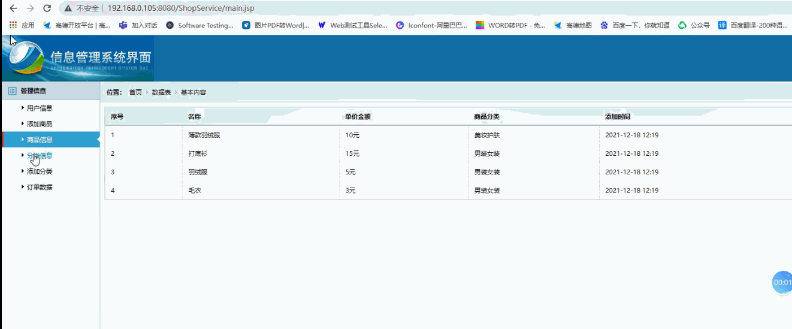
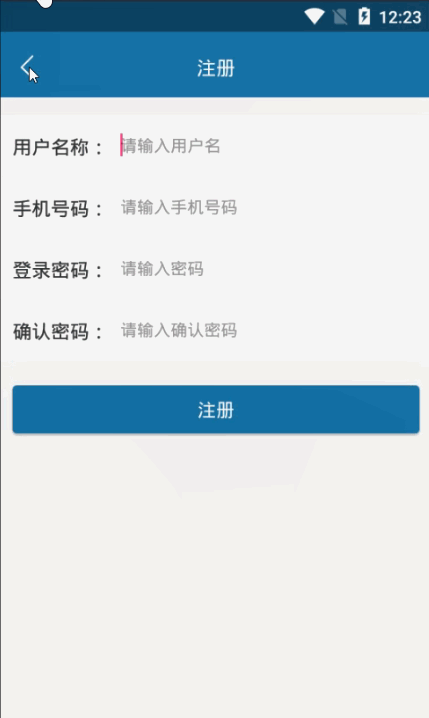

> **博主介绍：**
> 本人专注于Android/java/数据库/微信小程序技术领域的开发，以及有好几年的计算机毕业设计方面的实战开发经验和技术积累；尤其是在安卓（Android）的app的开发和微信小程序的开发，很是熟悉和了解；本人也是多年的Android开发人员；希望我发布的此篇文件可以帮助到您；
>
> 🍅 **文章末尾获取源码下载方式** 🍅

#### 功能演示

**详情演示视频请文字末尾公众号咨询，我会发给您；**

#### 1：后台演示

#### 2：客户端演示

#### 一、项目介绍

> 系统主要功能分为两大模块：App 平台基本功能，Web 端后台管理功能。
>
> App 平台功能：
>
> 注册：注册界面按要求填写资料即可完成注册。
>
> 登陆：在登录界面输入正确用户名、密码，即可登陆成功。
>
> 商品查找：在查找界面输入欲查询商品，显示相应的商品。
>
> 商品分类：用户可根据商品的分类查找商品。
>
> 管理购物车：可选择欲购商品加入购物车，最后结算用。
>
> 管理订单：该功能须登录方可使用，用于用户查询过往订单及详情。
>
> Web 端后台管理功能：
>
> Web 端后台用于管理员使用，具备的功能有：管理员登陆、商品信息管理、
>
> 订单信息管理等，主要用于平常商城维护及商品统计功能。
>
> 1) 管理员登陆：登陆界面输入正确的管理员帐号密码即可登录成功。
>
> 2) 商品信息管理：对商品的基本信息进行增、删、改、查等功能，以及对
>
> 存库中的商品作出对应的调整。
>
> 3)订单管理：对订单的信息，比如订单内的商品进行增、删、改、查。

#### 二、运行环境

> 1：客户端使用Android stuido进行开发；  
>  2：服务端后台使用Myeclipse2014进行开发；  
>  3：mysql数据库进行数据存储；  
>  4：需要jdk1.7以上  
>  5：使用雷电模拟器或者Androidstuio自带的模拟器进行运行

#### 三、使用技术

> **总体设计逻辑和思路：**  
>  1：先设计数据库表文件  
>  2：写服务端jsp页面以及写api接口给客户端提供数据  
>  3：完成后台服务端的数据交互，也就是jsp页面数据的存储和显示  
>  4：进行客户端页面的开发；  
>  5：进行客户端对api接口的调用，也就是获取数据库的数据以及在客户端进行显示
>
> **移动端：**  
>  1：使用android原生控件以及xml布局文件来完成界面的显示  
>  2：使用java代码完成功能的数据和逻辑交互  
>  3：使用http网络请求完成数据的请求；  
>  **4：使用json数据解析完成客户端数据的回调和显示**
>
> **服务端后台：**  
>  1：使用mysql完成数据的存储  
>  2：使用jdbc完成数据库和代码的逻辑交互  
>  3：使用jsp完成网页数据的显示  
>  4：使用java代码完成api接口的编写以及以及数据的回调

#### 四、数据库设计

    
    
    /*
    Navicat MySQL Data Transfer
    
    Source Server         : mydata
    Source Server Version : 50528
    Source Host           : localhost:3306
    Source Database       : phoneshopdb
    
    Target Server Type    : MYSQL
    Target Server Version : 50528
    File Encoding         : 65001
    
    Date: 2021-12-09 15:22:57
    */
    
    SET FOREIGN_KEY_CHECKS=0;
    
    -- ----------------------------
    -- Table structure for cartb
    -- ----------------------------
    DROP TABLE IF EXISTS `cartb`;
    CREATE TABLE `cartb` (
      `carId` int(11) NOT NULL AUTO_INCREMENT,
      `carShopId` int(11) DEFAULT NULL,
      `carUserId` int(11) DEFAULT NULL,
      PRIMARY KEY (`carId`)
    ) ENGINE=InnoDB AUTO_INCREMENT=5 DEFAULT CHARSET=utf8;
    
    -- ----------------------------
    -- Records of cartb
    -- ----------------------------
    INSERT INTO `cartb` VALUES ('4', '36', '92');
    
    -- ----------------------------
    -- Table structure for jijiantb
    -- ----------------------------
    DROP TABLE IF EXISTS `jijiantb`;
    CREATE TABLE `jijiantb` (
      `jijianId` int(11) NOT NULL AUTO_INCREMENT,
      `jijianName` varchar(255) DEFAULT NULL,
      `jijianAddresse` varchar(255) DEFAULT NULL,
      `jijianPhone` varchar(255) DEFAULT NULL,
      `jijianUserId` int(11) DEFAULT NULL,
      PRIMARY KEY (`jijianId`)
    ) ENGINE=InnoDB AUTO_INCREMENT=11 DEFAULT CHARSET=utf8;
    
    -- ----------------------------
    -- Records of jijiantb
    -- ----------------------------
    INSERT INTO `jijiantb` VALUES ('6', '小米', '西安市雁塔区', '15249243002', '92');
    INSERT INTO `jijiantb` VALUES ('7', '小虎虎', '西安市雁塔区', '15249243002', '92');
    INSERT INTO `jijiantb` VALUES ('8', '小花', '西安市雁塔区', '15249248877', '92');
    
    -- ----------------------------
    -- Table structure for ordertb
    -- ----------------------------
    DROP TABLE IF EXISTS `ordertb`;
    CREATE TABLE `ordertb` (
      `orderId` int(11) NOT NULL AUTO_INCREMENT,
      `orderMessageId` varchar(100) DEFAULT NULL,
      `orderMessageMoney` varchar(255) DEFAULT NULL,
      `orderUserId` varchar(100) DEFAULT NULL,
      `orderUserName` varchar(255) DEFAULT NULL,
      `orderAddress` varchar(500) DEFAULT NULL,
      `orderCreatime` varchar(100) DEFAULT NULL,
      `orderNo` varchar(500) DEFAULT NULL,
      PRIMARY KEY (`orderId`)
    ) ENGINE=InnoDB AUTO_INCREMENT=35 DEFAULT CHARSET=utf8;
    
    -- ----------------------------
    -- Records of ordertb
    -- ----------------------------
    
    -- ----------------------------
    -- Table structure for shoptb
    -- ----------------------------
    DROP TABLE IF EXISTS `shoptb`;
    CREATE TABLE `shoptb` (
      `shopId` int(50) NOT NULL AUTO_INCREMENT,
      `shopName` varchar(255) DEFAULT NULL,
      `shopTypeId` int(11) DEFAULT NULL,
      `shopTypeName` varchar(255) DEFAULT NULL,
      `shopMoney` varchar(255) DEFAULT NULL,
      `shopMessage` varchar(2000) DEFAULT NULL,
      `shopCreatime` varchar(100) DEFAULT NULL,
      `shopImg` varchar(500) DEFAULT NULL,
      PRIMARY KEY (`shopId`)
    ) ENGINE=InnoDB AUTO_INCREMENT=37 DEFAULT CHARSET=utf8;
    
    -- ----------------------------
    -- Records of shoptb
    -- ----------------------------
    INSERT INTO `shoptb` VALUES ('33', '薄款羽绒服', '21', '美妆护肤', '10', 'value=\"杀菌机理是释放出新生态原子氧、氧化菌体中的活性基团；杀菌特点是作用快而强，能杀死所有微生物，包括细菌芽孢、病毒。以表面消毒为主，如二氧化氯、双氧水、臭氧、次氯酸钠等，该类消毒剂为灭菌剂。\r\n醛类\"\"\"\"\"\"', '2021-12-08 17:06', '1501153408392.jpg');
    INSERT INTO `shoptb` VALUES ('34', '打底衫', '24', '男装女装', '15', '杀菌机理是使蛋白变性或烷基化；杀菌特点是对细菌、芽孢、真菌、病毒均有效。但温度影响较大。如甲醛、戊二醛等。该类消毒剂可做灭菌剂使用。\"', '2021-12-08 17:06', 'yf1.jpg');
    INSERT INTO `shoptb` VALUES ('35', '羽绒服', '24', '男装女装', '5', '口罩是一种卫生用品，一般指戴在口鼻部位用于过滤进入口鼻的空气，以达到阻挡有害的气体、气味、飞沫、病毒等物质的作用，以纱布或纸等材料做成。', '2021-12-08 17:06', 'yf3.jpg');
    INSERT INTO `shoptb` VALUES ('36', '毛衣', '24', '男装女装', '3', '口罩分为医用口罩和非医用口罩、（及最新确定的）民用卫生口罩。口罩分为医用口罩和非医用口罩、（及最新确定的）民用卫生口罩。', '2021-12-08 17:06', 'yf2.jpg');
    
    -- ----------------------------
    -- Table structure for typetb
    -- ----------------------------
    DROP TABLE IF EXISTS `typetb`;
    CREATE TABLE `typetb` (
      `typeId` int(50) NOT NULL AUTO_INCREMENT,
      `typeName` varchar(255) DEFAULT NULL,
      PRIMARY KEY (`typeId`)
    ) ENGINE=InnoDB AUTO_INCREMENT=25 DEFAULT CHARSET=utf8;
    
    -- ----------------------------
    -- Records of typetb
    -- ----------------------------
    INSERT INTO `typetb` VALUES ('21', '美妆护肤');
    INSERT INTO `typetb` VALUES ('22', '玩具饰品');
    INSERT INTO `typetb` VALUES ('23', '图书文娱');
    INSERT INTO `typetb` VALUES ('24', '男装女装');
    
    -- ----------------------------
    -- Table structure for user
    -- ----------------------------
    DROP TABLE IF EXISTS `user`;
    CREATE TABLE `user` (
      `uid` int(255) NOT NULL AUTO_INCREMENT,
      `uname` varchar(200) CHARACTER SET utf8 NOT NULL,
      `uphone` varchar(100) NOT NULL,
      `ucity` varchar(255) CHARACTER SET utf8 DEFAULT NULL,
      `upswd` varchar(200) NOT NULL,
      `utime` varchar(255) CHARACTER SET utf8 DEFAULT NULL,
      `uImg` varchar(255) CHARACTER SET utf8 DEFAULT NULL,
      PRIMARY KEY (`uid`)
    ) ENGINE=InnoDB AUTO_INCREMENT=94 DEFAULT CHARSET=latin1;
    
    -- ----------------------------
    -- Records of user
    -- ----------------------------
    INSERT INTO `user` VALUES ('92', '玥溪', '15249241001', null, '123456', '2021-12-08 17:06', 'hua1.jpg');
    INSERT INTO `user` VALUES ('93', '小花', '15249241002', null, '123456', '2021-12-08 17:06', '');
    

#### 五、部分代码

#### 六、浏览更多Android毕业设计

[毕业设计-基于android的租房信息发布平台的APP_信息发布app源码_Android毕业设计源码的博客-
CSDN博客](https://blog.csdn.net/u014388322/article/details/100656450?spm=1001.2014.3001.5502
"毕业设计-基于android的租房信息发布平台的APP_信息发布app源码_Android毕业设计源码的博客-CSDN博客")

[毕业设计-基于android选课系统的设计与实现_android学生选课系统_Android毕业设计源码的博客-
CSDN博客](https://blog.csdn.net/u014388322/article/details/100656536?spm=1001.2014.3001.5502
"毕业设计-基于android选课系统的设计与实现_android学生选课系统_Android毕业设计源码的博客-CSDN博客")

[毕业设计之校园一卡通管理系统的设计与实现_一卡通管理系统实现_Android毕业设计源码的博客-
CSDN博客](https://blog.csdn.net/u014388322/article/details/126048550?spm=1001.2014.3001.5502
"毕业设计之校园一卡通管理系统的设计与实现_一卡通管理系统实现_Android毕业设计源码的博客-CSDN博客")

[基于Android的校园二手闲置物品交易系统设计与实现_基于android的二手交易平台_Android毕业设计源码的博客-
CSDN博客](https://blog.csdn.net/u014388322/article/details/128232475?spm=1001.2014.3001.5502
"基于Android的校园二手闲置物品交易系统设计与实现_基于android的二手交易平台_Android毕业设计源码的博客-CSDN博客")

[基于androidstudio校园快递APP系统的设计与实现_android studio论文_Android毕业设计源码的博客-
CSDN博客](https://blog.csdn.net/u014388322/article/details/128545390?spm=1001.2014.3001.5502
"基于androidstudio校园快递APP系统的设计与实现_android studio论文_Android毕业设计源码的博客-CSDN博客")

[基于android的商城购物定制APP_安卓开发购物app_Android毕业设计源码的博客-
CSDN博客](https://blog.csdn.net/u014388322/article/details/128746697?spm=1001.2014.3001.5502
"基于android的商城购物定制APP_安卓开发购物app_Android毕业设计源码的博客-CSDN博客")

> 更多毕业设计可以浏览我的个人主页哦！

#### 七、源码下载

> 大家 **点赞、收藏、关注、评论** 啦 、 **查看** 👇🏻👇🏻👇🏻 **获取联系方式** 👇🏻👇🏻👇🏻
>
> <https://download.csdn.net/download/u014388322/87473463>

