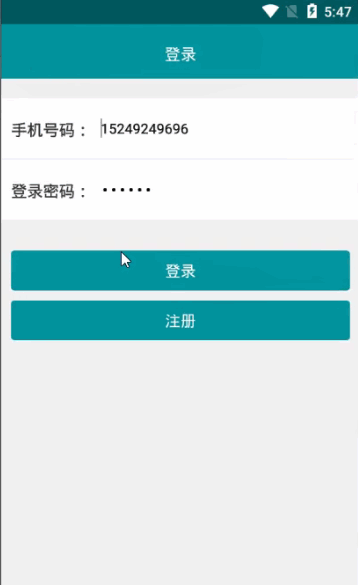

> **博主介绍：**
> 本人专注于Android/java/数据库/微信小程序技术领域的开发，以及有好几年的计算机毕业设计方面的实战开发经验和技术积累；尤其是在安卓（Android）的app的开发和微信小程序的开发，很是熟悉和了解；本人也是多年的Android开发人员；希望我发布的此篇文件可以帮助到您；
>
> 🍅 **文章末尾获取源码下载方式** 🍅

#### 功能演示：

#### 一、项目介绍

> 客户端：
>
> 1：注册登录：通过手机号码和密码完成注册和登录；
>
> 2：查看公告：用户查看公告信息；
>
> 3：车位信息：用户可以查看车位信息以及对车位信息进行预定，同时可以实时查看车位当前的状态；
>
> 4：收费信息：车辆结束停车时会显示需要的费用信息
>
> 5：停车记录：自己可以查看自己的停车记录
>
> 6：个人信息：查看自己的个人信息以及对密码进行修改，查看收藏信息
>
> 后台管理员：
>
> 1：用户信息：可以查看注册的用户信息
>
> 2：公告信息：添加和查看公告信息
>
> 3：车位信息：添加和查看车位信息
>
> 3：停车记录：查看停车记录信息

#### 二、运行环境

> 1：客户端使用Android stuido进行开发；  
>  2：服务端后台使用Myeclipse2014进行开发；  
>  3：mysql数据库进行数据存储；  
>  4：需要jdk1.7以上  
>  5：使用雷电模拟器或者Androidstuio自带的模拟器进行运行

#### 三、使用技术

> **总体设计逻辑和思路：**  
>  1：先设计数据库表文件  
>  2：写服务端jsp页面以及写api接口给客户端提供数据  
>  3：完成后台服务端的数据交互，也就是jsp页面数据的存储和显示  
>  4：进行客户端页面的开发；  
>  5：进行客户端对api接口的调用，也就是获取数据库的数据以及在客户端进行显示
>
> **移动端：**  
>  1：使用android原生控件以及xml布局文件来完成界面的显示  
>  2：使用java代码完成功能的数据和逻辑交互  
>  3：使用http网络请求完成数据的请求；  
>  **4：使用json数据解析完成客户端数据的回调和显示**
>
> **服务端后台：**  
>  1：使用mysql完成数据的存储  
>  2：使用jdbc完成数据库和代码的逻辑交互  
>  3：使用jsp完成网页数据的显示  
>  4：使用java代码完成api接口的编写以及以及数据的回调

#### 四、数据库设计

    
    
    /*
    Navicat MySQL Data Transfer
    
    Source Server         : mydata
    Source Server Version : 50528
    Source Host           : localhost:3306
    Source Database       : carmsgdb
    
    Target Server Type    : MYSQL
    Target Server Version : 50528
    File Encoding         : 65001
    
    Date: 2022-04-07 17:50:32
    */
    
    SET FOREIGN_KEY_CHECKS=0;
    
    -- ----------------------------
    -- Table structure for applytb
    -- ----------------------------
    DROP TABLE IF EXISTS `applytb`;
    CREATE TABLE `applytb` (
      `applyId` int(11) NOT NULL AUTO_INCREMENT,
      `applyStationId` int(11) DEFAULT NULL,
      `applyUserId` int(11) DEFAULT NULL,
      `applyTime` varchar(100) DEFAULT NULL,
      `applyState` varchar(255) DEFAULT NULL,
      PRIMARY KEY (`applyId`)
    ) ENGINE=InnoDB AUTO_INCREMENT=14 DEFAULT CHARSET=utf8;
    
    -- ----------------------------
    -- Records of applytb
    -- ----------------------------
    INSERT INTO `applytb` VALUES ('10', '4', '106', '2022-04-07 10:38:00', '2');
    INSERT INTO `applytb` VALUES ('11', '5', '106', '2022-04-07 11:48:00', '2');
    INSERT INTO `applytb` VALUES ('12', '2', '106', '2022-04-07 11:23:00', '2');
    INSERT INTO `applytb` VALUES ('13', '2', '106', '2022-04-07 19:47:00', '2');
    
    -- ----------------------------
    -- Table structure for newstb
    -- ----------------------------
    DROP TABLE IF EXISTS `newstb`;
    CREATE TABLE `newstb` (
      `newsId` int(11) NOT NULL AUTO_INCREMENT,
      `newsTitle` varchar(255) DEFAULT NULL,
      `newsMessage` varchar(255) DEFAULT NULL,
      `newsTime` varchar(100) DEFAULT NULL,
      PRIMARY KEY (`newsId`)
    ) ENGINE=InnoDB AUTO_INCREMENT=12 DEFAULT CHARSET=utf8;
    
    -- ----------------------------
    -- Records of newstb
    -- ----------------------------
    INSERT INTO `newstb` VALUES ('7', '高速免费', '1月27日，交通部明确，2022年春节假期，全国收费公路继续对7座以下(含7座)小型客车以及允许在普通收费公路行驶的摩托车免收通行费。具体免费时段从节假日第一天(1月31日)零时开始，节假日最后一天(2月6日)24时结束。普通公路仍以车辆通过收费站收费车道的时间为准，高速公路仍以车辆驶离出口收费车道的时间为准。', '2022-04-07 11:23');
    INSERT INTO `newstb` VALUES ('8', '小客车春节假期', '节日期间路网流量高峰预计出现在2月6日(初六)，当天全省高速收费站出口流量预计达到115万辆，是平日(节后)出口流量的1.1倍。从时段分布来看，长假每日10时-12时、16时-18时为流量高峰时段，重要城市收费站容易出现排队现象', '2022-04-07 11:23');
    INSERT INTO `newstb` VALUES ('9', '高速公路收费站', '为切实做好服务区疫情防控工作，我省为国内中高风险地区途经高速公路的车辆人员指定19个专用服务区，提供加油、如厕、开水、餐饮打包外带等服务，服务区严格查验通行码、健康码、量测体温、查验48小时核酸证明。为减少因人员流动带来的疫情传播风险，陕西高速设立若干核酸检测点，为司乘人员提供便利。', '2022-04-07 11:23');
    
    -- ----------------------------
    -- Table structure for ordermsg
    -- ----------------------------
    DROP TABLE IF EXISTS `ordermsg`;
    CREATE TABLE `ordermsg` (
      `orderId` int(50) NOT NULL AUTO_INCREMENT,
      `orderMessageId` varchar(100) DEFAULT NULL,
      `orderMessageName` varchar(255) DEFAULT NULL,
      `orderMoney` varchar(255) DEFAULT NULL,
      `orderUserId` varchar(100) DEFAULT NULL,
      `orderUserName` varchar(255) DEFAULT NULL,
      `orderTime` varchar(100) DEFAULT NULL,
      `orderTimeStart` varchar(100) DEFAULT NULL,
      `orderTimeEnd` varchar(100) DEFAULT NULL,
      PRIMARY KEY (`orderId`)
    ) ENGINE=InnoDB AUTO_INCREMENT=29 DEFAULT CHARSET=utf8;
    
    -- ----------------------------
    -- Records of ordermsg
    -- ----------------------------
    INSERT INTO `ordermsg` VALUES ('27', '5', '城墙停车位', '2', '106', '小丸子', '2022-04-07 11:23', '', '');
    INSERT INTO `ordermsg` VALUES ('28', '2', '临潼区停车位', '1', '106', '小丸子', '2022-04-07 17:48', '', '');
    
    -- ----------------------------
    -- Table structure for rechargetb
    -- ----------------------------
    DROP TABLE IF EXISTS `rechargetb`;
    CREATE TABLE `rechargetb` (
      `rechargeId` int(50) NOT NULL AUTO_INCREMENT,
      `rechargeMessageId` int(11) DEFAULT NULL,
      `rechargeUserId` int(11) DEFAULT NULL,
      `rechargeUserName` varchar(255) DEFAULT NULL,
      `rechargeTimeLong` varchar(255) DEFAULT NULL,
      `rechargeState` varchar(255) DEFAULT NULL,
      `rechargeTime` varchar(255) DEFAULT NULL,
      PRIMARY KEY (`rechargeId`)
    ) ENGINE=InnoDB AUTO_INCREMENT=36 DEFAULT CHARSET=utf8;
    
    -- ----------------------------
    -- Records of rechargetb
    -- ----------------------------
    INSERT INTO `rechargetb` VALUES ('34', '5', '106', '小丸子', '6', '2', '2022-04-07 11:23');
    INSERT INTO `rechargetb` VALUES ('35', '2', '106', '小丸子', '7', '2', '2022-04-07 17:48');
    
    -- ----------------------------
    -- Table structure for stationtb
    -- ----------------------------
    DROP TABLE IF EXISTS `stationtb`;
    CREATE TABLE `stationtb` (
      `stationId` int(50) NOT NULL AUTO_INCREMENT,
      `stationTitle` varchar(255) DEFAULT NULL,
      `stationMoney` varchar(255) DEFAULT NULL,
      `stationCoordinate` varchar(255) DEFAULT NULL,
      `stationAddress` varchar(255) DEFAULT NULL,
      `stationImage` varchar(255) DEFAULT NULL,
      `stationState` varchar(255) DEFAULT NULL,
      PRIMARY KEY (`stationId`)
    ) ENGINE=InnoDB AUTO_INCREMENT=8 DEFAULT CHARSET=utf8;
    
    -- ----------------------------
    -- Records of stationtb
    -- ----------------------------
    INSERT INTO `stationtb` VALUES ('2', '临潼区停车位', '1', '108.92279,34.241026', '西安市临潼区', '1505283939521.jpg', null);
    INSERT INTO `stationtb` VALUES ('3', '大明宫停车位', '2', '108.964332,34.282028', '西安市新城区', '1501153409556.jpg', null);
    INSERT INTO `stationtb` VALUES ('4', '大雁塔停车位', '3', '108.964045,34.221334', '西安市曲江新区', '1505283939114.jpg', null);
    INSERT INTO `stationtb` VALUES ('5', '城墙停车位', '2', '108.946307,34.248831', '西安市碑林区', '3c6d55fbb2fb4316b6ba1cb429a4462308f7d353.jpg', null);
    INSERT INTO `stationtb` VALUES ('6', '芙蓉园停车位', '3', '108.975203,34.212888', '西安市雁塔区', '47020002a9cdee957096.jpg', null);
    INSERT INTO `stationtb` VALUES ('7', '莲湖区停车场', '30', '108.909448,34.247311', '西安大唐西市', 'icon_kecheng_logo.png', null);
    
    -- ----------------------------
    -- Table structure for user
    -- ----------------------------
    DROP TABLE IF EXISTS `user`;
    CREATE TABLE `user` (
      `userId` int(255) NOT NULL AUTO_INCREMENT,
      `userName` varchar(200) CHARACTER SET utf8 NOT NULL,
      `userPhone` varchar(100) CHARACTER SET utf8 NOT NULL,
      `userPswd` varchar(200) CHARACTER SET utf8 NOT NULL,
      `userMoney` varchar(255) CHARACTER SET utf8 DEFAULT NULL,
      `userTime` varchar(300) CHARACTER SET utf8 NOT NULL,
      PRIMARY KEY (`userId`)
    ) ENGINE=InnoDB AUTO_INCREMENT=112 DEFAULT CHARSET=latin1;
    
    -- ----------------------------
    -- Records of user
    -- ----------------------------
    INSERT INTO `user` VALUES ('106', '小丸子', '15249249696', '123456', '123456', '2022-04-07 11:23');
    INSERT INTO `user` VALUES ('111', 'xaiohua', '15249249697', '123456', '1000', '2022-04-07 11:23');
    

#### 五、部分代码

#### 六、浏览更多Android毕业设计

[毕业设计-基于android的租房信息发布平台的APP_信息发布app源码_Android毕业设计源码的博客-
CSDN博客](https://blog.csdn.net/u014388322/article/details/100656450?spm=1001.2014.3001.5502
"毕业设计-基于android的租房信息发布平台的APP_信息发布app源码_Android毕业设计源码的博客-CSDN博客")

[毕业设计-基于android选课系统的设计与实现_android学生选课系统_Android毕业设计源码的博客-
CSDN博客](https://blog.csdn.net/u014388322/article/details/100656536?spm=1001.2014.3001.5502
"毕业设计-基于android选课系统的设计与实现_android学生选课系统_Android毕业设计源码的博客-CSDN博客")

[毕业设计之校园一卡通管理系统的设计与实现_一卡通管理系统实现_Android毕业设计源码的博客-
CSDN博客](https://blog.csdn.net/u014388322/article/details/126048550?spm=1001.2014.3001.5502
"毕业设计之校园一卡通管理系统的设计与实现_一卡通管理系统实现_Android毕业设计源码的博客-CSDN博客")

[基于Android的校园二手闲置物品交易系统设计与实现_基于android的二手交易平台_Android毕业设计源码的博客-
CSDN博客](https://blog.csdn.net/u014388322/article/details/128232475?spm=1001.2014.3001.5502
"基于Android的校园二手闲置物品交易系统设计与实现_基于android的二手交易平台_Android毕业设计源码的博客-CSDN博客")

[基于androidstudio校园快递APP系统的设计与实现_android studio论文_Android毕业设计源码的博客-
CSDN博客](https://blog.csdn.net/u014388322/article/details/128545390?spm=1001.2014.3001.5502
"基于androidstudio校园快递APP系统的设计与实现_android studio论文_Android毕业设计源码的博客-CSDN博客")

[基于android的商城购物定制APP_安卓开发购物app_Android毕业设计源码的博客-
CSDN博客](https://blog.csdn.net/u014388322/article/details/128746697?spm=1001.2014.3001.5502
"基于android的商城购物定制APP_安卓开发购物app_Android毕业设计源码的博客-CSDN博客")

> 更多毕业设计可以浏览我的个人主页哦！

#### 七、源码下载

> 大家 **点赞、收藏、关注、评论** 啦 、 **查看** 👇🏻👇🏻👇🏻 **获取联系方式** 👇🏻👇🏻👇🏻
>
> <https://download.csdn.net/download/u014388322/88188284>
>
> ​

