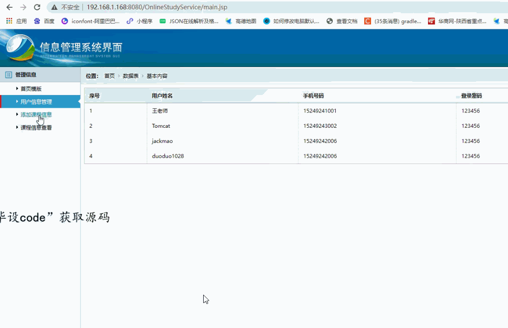

> **博主介绍：**
> 本人专注于Android/java/数据库/微信小程序技术领域的开发，以及有好几年的计算机毕业设计方面的实战开发经验和技术积累；尤其是在安卓（Android）的app的开发和微信小程序的开发，很是熟悉和了解；本人也是多年的Android开发人员；希望我发布的此篇文件可以帮助到您；
>
> 🍅 **文章末尾获取源码下载方式** 🍅

**目录**

功能演示

1：后台演示

2：客户端演示

一、项目介绍

二、运行环境

三、使用技术

四、数据库设计

五、部分代码

1：我的打卡信息

2：我的课程信息

六、浏览更多Android毕业设计

七、源码下载

* * *

#### 功能演示

##### 1：后台演示

#####  2：客户端演示

#### 一、项目介绍

> 1、用户个人信息管理:
>
> 该模块实现对用户登录app账号及密码的管理设置，展现用户头像、昵称、ID等资料，用户的消息列表及其用户所学课程的基本信息展现功能。
>
> 2、在线名师课程展示:
>
> 该模块实现对课程列表的展示，可以通过搜索框根据课程名称、将师名字查询课程、点击相应的课程可以查看课程的具体内容介绍、讲师的个人信息及其课程计划等功能。
>
> 3、线上课程学习:
>
>
> 该模块实现学生在该app上进行线上课程视频学习、对已学课程的列表展示、课程学习进度的展示、课后试题测试、课程动态的更新推送提醒等功能。4、课程交流分享:设置一个学习交流区，学生可以在交流区对课程内容的评价，分享自己的学习心得等。
>
> 5、用户学习时长打卡统计:
>
> 该模块实现统计学生在线学习的时长，设置学习打卡功能。
>
> 6、个人成绩分析模块:
>
> 该模块实现对学生成绩的统计、课后测试成绩分析、学习目标
>
> 的展现功能。

#### 二、运行环境

> 1：客户端使用Android stuido进行开发；  
>  2：服务端后台使用Myeclipse2014进行开发；  
>  3：mysql数据库进行数据存储；  
>  4：需要jdk1.7以上  
>  5：使用雷电模拟器或者Androidstuio自带的模拟器进行运行

#### 三、使用技术

> **总体设计逻辑和思路：**  
>  1：先设计数据库表文件  
>  2：写服务端jsp页面以及写api接口给客户端提供数据  
>  3：完成后台服务端的数据交互，也就是jsp页面数据的存储和显示  
>  4：进行客户端页面的开发；  
>  5：进行客户端对api接口的调用，也就是获取数据库的数据以及在客户端进行显示
>
> **移动端：**  
>  1：使用android原生控件以及xml布局文件来完成界面的显示  
>  2：使用java代码完成功能的数据和逻辑交互  
>  3：使用http网络请求完成数据的请求；  
>  **4：使用json数据解析完成客户端数据的回调和显示**
>
> **服务端后台：**  
>  1：使用mysql完成数据的存储  
>  2：使用jdbc完成数据库和代码的逻辑交互  
>  3：使用jsp完成网页数据的显示  
>  4：使用java代码完成api接口的编写以及以及数据的回调

#### 四、数据库设计

    
    
    /*
    Navicat MySQL Data Transfer
    
    Source Server         : mydata
    Source Server Version : 50528
    Source Host           : localhost:3306
    Source Database       : onlinecoursedb
    
    Target Server Type    : MYSQL
    Target Server Version : 50528
    File Encoding         : 65001
    
    Date: 2022-03-25 18:36:47
    */
    
    SET FOREIGN_KEY_CHECKS=0;
    
    -- ----------------------------
    -- Table structure for coursetb
    -- ----------------------------
    DROP TABLE IF EXISTS `coursetb`;
    CREATE TABLE `coursetb` (
      `courseId` int(11) NOT NULL AUTO_INCREMENT,
      `courseUserId` varchar(11) DEFAULT NULL,
      `courseUserName` varchar(255) DEFAULT NULL,
      `courseName` varchar(255) DEFAULT NULL,
      `courseType` varchar(255) DEFAULT NULL,
      `courseInfor` varchar(1000) DEFAULT NULL,
      `courseVideo` varchar(100) DEFAULT NULL,
      PRIMARY KEY (`courseId`)
    ) ENGINE=InnoDB AUTO_INCREMENT=21 DEFAULT CHARSET=utf8;
    
    -- ----------------------------
    -- Records of coursetb
    -- ----------------------------
    INSERT INTO `coursetb` VALUES ('11', '101', '王老师', '计算机基础', '代码 编程', '如果你想简单的开发APP，快速的上手可以关注一下apicloud，一门APP，安卓益这些混合开发的APP制作平台。这些混合开发平台不需要你会太专业的工具，只需要会H5技术就可以开始开发APP了，一样的实现各种原生APP才会有的效果，大大提高APP开发成本和时间周期', 'xian_duanshipin_01.mp4');
    INSERT INTO `coursetb` VALUES ('12', '101', '王老师', 'android', '代码 编程', '如果你想简单的开发APP，快速的上手可以关注一下apicloud，一门APP，安卓益这些混合开发的APP制作平台。这些混合开发平台不需要你会太专业的工具，只需要会H5技术就可以开始开发APP了，一样的实现各种原生APP才会有的效果，大大提高APP开发成本和时间周期', 'xian_duanshipin_01.mp4');
    INSERT INTO `coursetb` VALUES ('13', '101', '王老师', 'mysql', '代码 编程', '如果你想简单的开发APP，快速的上手可以关注一下apicloud，一门APP，安卓益这些混合开发的APP制作平台。这些混合开发平台不需要你会太专业的工具，只需要会H5技术就可以开始开发APP了，一样的实现各种原生APP才会有的效果，大大提高APP开发成本和时间周期', 'xian_duanshipin_01.mp4');
    INSERT INTO `coursetb` VALUES ('14', '102', '李老师', 'mysql基础', '代码 编程', '如果你想简单的开发APP，快速的上手可以关注一下apicloud，一门APP，安卓益这些混合开发的APP制作平台。这些混合开发平台不需要你会太专业的工具，只需要会H5技术就可以开始开发APP了，一样的实现各种原生APP才会有的效果，大大提高APP开发成本和时间周期', 'xian_duanshipin_01.mp4');
    INSERT INTO `coursetb` VALUES ('20', '101', '王老师', '888', '计算机', '计算机计算机计算机计算机计算机计算机计算机计算机计算机计算机计算机计算机计算机计算机计算机计算机计算机计算机计算机计算机计算机计算机计算机计算机计算机计算机计算机计算机计算机计算机', '1505283939521.jpg');
    
    -- ----------------------------
    -- Table structure for exametb
    -- ----------------------------
    DROP TABLE IF EXISTS `exametb`;
    CREATE TABLE `exametb` (
      `exameId` int(11) NOT NULL AUTO_INCREMENT,
      `exameCourseId` int(11) DEFAULT NULL,
      `exameCourseName` varchar(255) DEFAULT NULL,
      `exameTitle` varchar(255) NOT NULL,
      `exameType` varchar(255) DEFAULT NULL,
      `exameA` varchar(255) DEFAULT NULL,
      `exameB` varchar(255) DEFAULT NULL,
      `exameC` varchar(255) DEFAULT NULL,
      `exameD` varchar(255) DEFAULT NULL,
      `exameOk` varchar(255) DEFAULT NULL,
      `exameInfor` varchar(500) DEFAULT NULL,
      PRIMARY KEY (`exameId`)
    ) ENGINE=InnoDB AUTO_INCREMENT=8 DEFAULT CHARSET=utf8;
    
    -- ----------------------------
    -- Records of exametb
    -- ----------------------------
    INSERT INTO `exametb` VALUES ('1', '10', '英语', '某市正在创建卫生城市，致力形成干净整洁的城市环境', '单选题', '但在此过程中', '依然存在一些问题', '如环城严重', '河道污水', 'A', '但在此过程中,依然存在一些问题,如环城严重,河道污水');
    INSERT INTO `exametb` VALUES ('2', '10', '英语', '某市正在创建卫生城市', '单选题', 'book1', 'book2', 'book3', 'book4', 'C', 'book1,book2,book3,book4');
    INSERT INTO `exametb` VALUES ('3', '10', '英语', '致力形成干净整洁的城市环境', '单选题', '但在此过程中', '某市', '正在', '创建', 'D', '但在此过程中,此过程中,但在中,但在此');
    INSERT INTO `exametb` VALUES ('6', '10', null, '单词', '单选题', '单词1', '单词2', '单词3', '单词4', 'A', '单词1,单词2,单词3,单词4');
    INSERT INTO `exametb` VALUES ('7', '10', null, '单词', '单选题', '但在此过程中', 'java基础', '在此过程中', '基础', 'C', '但在此过程中,java基础,在此过程中,基础');
    
    -- ----------------------------
    -- Table structure for homeworktb
    -- ----------------------------
    DROP TABLE IF EXISTS `homeworktb`;
    CREATE TABLE `homeworktb` (
      `homeworkId` int(11) NOT NULL AUTO_INCREMENT,
      `homeworkCourseId` int(11) DEFAULT NULL,
      `homeworkUserId` varchar(255) DEFAULT NULL,
      `homeworkUserName` varchar(255) DEFAULT NULL,
      `homeworkFile` varchar(500) DEFAULT NULL,
      `homeworkTime` varchar(100) DEFAULT NULL,
      PRIMARY KEY (`homeworkId`)
    ) ENGINE=InnoDB AUTO_INCREMENT=4 DEFAULT CHARSET=utf8;
    
    -- ----------------------------
    -- Records of homeworktb
    -- ----------------------------
    INSERT INTO `homeworktb` VALUES ('1', '10', '90', 'Tomcat', '20200309172807.jpg', '2020-10-22 16:07');
    INSERT INTO `homeworktb` VALUES ('2', '10', '90', 'Tomcat', 'shuju.txt', '2020-10-22 16:11');
    INSERT INTO `homeworktb` VALUES ('3', '10', '90', 'Tomcat', 'book1.txt', '2020-10-22 16:36');
    
    -- ----------------------------
    -- Table structure for remarkstb
    -- ----------------------------
    DROP TABLE IF EXISTS `remarkstb`;
    CREATE TABLE `remarkstb` (
      `remarksId` int(11) NOT NULL AUTO_INCREMENT,
      `remarksName` varchar(255) DEFAULT NULL,
      `remarksInfor` varchar(255) DEFAULT NULL,
      `remarksUserId` int(11) DEFAULT NULL,
      `remarksTime` varchar(100) DEFAULT NULL,
      `remarksType` varchar(255) DEFAULT NULL,
      PRIMARY KEY (`remarksId`)
    ) ENGINE=InnoDB AUTO_INCREMENT=12 DEFAULT CHARSET=utf8;
    
    -- ----------------------------
    -- Records of remarkstb
    -- ----------------------------
    INSERT INTO `remarkstb` VALUES ('9', 'mysql', '80', '90', '2022-03-23 15:07', null);
    INSERT INTO `remarkstb` VALUES ('10', 'java', '90', '90', '2022-03-23 15:07', null);
    INSERT INTO `remarkstb` VALUES ('11', '77', '8888', '90', '2022-03-23 15:21', null);
    
    -- ----------------------------
    -- Table structure for reviewtb
    -- ----------------------------
    DROP TABLE IF EXISTS `reviewtb`;
    CREATE TABLE `reviewtb` (
      `reviewId` int(11) NOT NULL AUTO_INCREMENT,
      `reviewMessageId` int(11) DEFAULT NULL,
      `reviewContent` varchar(255) DEFAULT NULL,
      `reviewUserId` int(11) DEFAULT NULL,
      `reviewUserName` varchar(255) DEFAULT NULL,
      `reviewTime` varchar(100) DEFAULT NULL,
      PRIMARY KEY (`reviewId`)
    ) ENGINE=InnoDB AUTO_INCREMENT=22 DEFAULT CHARSET=utf8;
    
    -- ----------------------------
    -- Records of reviewtb
    -- ----------------------------
    INSERT INTO `reviewtb` VALUES ('13', '4', '你好啊', '90', 'Tomcat', '2020-08-27 17:28');
    INSERT INTO `reviewtb` VALUES ('14', '4', '我的数据信息', '90', 'Tomcat', '2020-08-27 17:28');
    INSERT INTO `reviewtb` VALUES ('15', '9', '你好啊', '98', '在线学习学生', '2020-09-01 14:51');
    INSERT INTO `reviewtb` VALUES ('16', '9', '我的评论信息', '98', '在线学习学生', '2020-09-01 14:52');
    INSERT INTO `reviewtb` VALUES ('17', '10', 'dadad', '90', 'Tomcat', '2022-02-28 12:04');
    INSERT INTO `reviewtb` VALUES ('18', '11', 'dad ', '90', 'Tomcat', '2022-02-28 12:47');
    INSERT INTO `reviewtb` VALUES ('19', '11', 'dad dadadada', '90', 'Tomcat', '2022-02-28 12:47');
    INSERT INTO `reviewtb` VALUES ('20', '11', '1111', '90', 'Tomcat', '2022-03-23 11:16');
    INSERT INTO `reviewtb` VALUES ('21', '11', '1111333', '90', 'Tomcat', '2022-03-23 11:16');
    
    -- ----------------------------
    -- Table structure for scoretb
    -- ----------------------------
    DROP TABLE IF EXISTS `scoretb`;
    CREATE TABLE `scoretb` (
      `scoreId` int(50) NOT NULL AUTO_INCREMENT,
      `scoreCourseId` varchar(255) DEFAULT NULL,
      `scoreChoiceInfor` varchar(255) DEFAULT NULL,
      `scoreChoiceScore` varchar(255) DEFAULT NULL,
      `scoreUserId` varchar(11) DEFAULT NULL,
      `scoreUserName` varchar(255) DEFAULT NULL,
      `scoreCreatime` varchar(100) DEFAULT NULL,
      PRIMARY KEY (`scoreId`)
    ) ENGINE=InnoDB AUTO_INCREMENT=21 DEFAULT CHARSET=utf8;
    
    -- ----------------------------
    -- Records of scoretb
    -- ----------------------------
    
    -- ----------------------------
    -- Table structure for signtb
    -- ----------------------------
    DROP TABLE IF EXISTS `signtb`;
    CREATE TABLE `signtb` (
      `signId` int(11) NOT NULL AUTO_INCREMENT,
      `signUserId` int(11) DEFAULT NULL,
      `signUserName` varchar(100) DEFAULT NULL,
      `signTime` varchar(100) DEFAULT NULL,
      PRIMARY KEY (`signId`)
    ) ENGINE=InnoDB AUTO_INCREMENT=5 DEFAULT CHARSET=utf8;
    
    -- ----------------------------
    -- Records of signtb
    -- ----------------------------
    INSERT INTO `signtb` VALUES ('4', '90', 'Tomcat', '2022-02-28 11:55:26');
    
    -- ----------------------------
    -- Table structure for topictb
    -- ----------------------------
    DROP TABLE IF EXISTS `topictb`;
    CREATE TABLE `topictb` (
      `topicId` int(11) NOT NULL AUTO_INCREMENT,
      `topicInfor` varchar(255) DEFAULT NULL,
      `topicImg` varchar(255) DEFAULT NULL,
      `topicUserId` varchar(255) DEFAULT NULL,
      `topicUserName` varchar(255) DEFAULT NULL,
      `topicTime` varchar(100) DEFAULT NULL,
      PRIMARY KEY (`topicId`)
    ) ENGINE=InnoDB AUTO_INCREMENT=12 DEFAULT CHARSET=utf8;
    
    -- ----------------------------
    -- Records of topictb
    -- ----------------------------
    INSERT INTO `topictb` VALUES ('10', 'dadada', 'QQ截图20220209115502.jpg', '90', 'Tomcat', '2022-02-28 12:04');
    INSERT INTO `topictb` VALUES ('11', '99999999999999999999999', '微信图片_20220209115344.png,QQ截图20220209115404.jpg,QQ截图20220209115433.jpg', '90', 'Tomcat', '2022-02-28 12:46');
    
    -- ----------------------------
    -- Table structure for user
    -- ----------------------------
    DROP TABLE IF EXISTS `user`;
    CREATE TABLE `user` (
      `uid` int(255) NOT NULL AUTO_INCREMENT,
      `uname` varchar(200) CHARACTER SET utf8 DEFAULT NULL,
      `uphone` varchar(100) CHARACTER SET utf8 DEFAULT NULL,
      `upswd` varchar(200) CHARACTER SET utf8 DEFAULT NULL,
      `utime` varchar(300) CHARACTER SET utf8 DEFAULT NULL,
      `uno` varchar(255) CHARACTER SET utf8 DEFAULT NULL,
      `usex` varchar(255) CHARACTER SET utf8 DEFAULT NULL,
      `udate` varchar(100) CHARACTER SET utf8 DEFAULT NULL,
      `umajor` varchar(255) CHARACTER SET utf8 DEFAULT NULL,
      `uImg` varchar(255) CHARACTER SET utf8 DEFAULT NULL,
      `utype` varchar(255) CHARACTER SET utf8 DEFAULT NULL,
      `uinfor` varchar(500) CHARACTER SET utf8 DEFAULT NULL,
      PRIMARY KEY (`uid`)
    ) ENGINE=InnoDB AUTO_INCREMENT=104 DEFAULT CHARSET=latin1;
    
    -- ----------------------------
    -- Records of user
    -- ----------------------------
    INSERT INTO `user` VALUES ('88', '王老师', '15249241001', '123456', '2022-02-28 12:34', null, null, null, null, null, null, null);
    INSERT INTO `user` VALUES ('90', 'Tomcat', '15249243002', '123456', '2022-02-28 12:34', '20221001', '男', '2019', '计算机', '微信图片_20220209115344.png', null, null);
    INSERT INTO `user` VALUES ('91', 'jackmao', '15249242006', '123456', '2022-02-28 12:34', null, null, null, null, null, null, null);
    INSERT INTO `user` VALUES ('92', 'duoduo1028', '15249242006', '123456', '2022-02-28 12:34', '英语', null, null, null, null, null, null);
    INSERT INTO `user` VALUES ('101', '王老师', '15249246611', null, null, null, null, null, null, '1501153408974.jpg', '2', '王老师王老师王老师王老师王老师王老师王老师王老师王老师王老师王老师王老师王老师王老师王老师王老师王老师王老师王老师王老师王老师王老师王老师王老师王老师王老师王老师王老师王老师王老师');
    INSERT INTO `user` VALUES ('102', '李老师', '15249241111', null, null, null, null, null, null, 'nvsheng9.jpg', '2', '李老师李老师李老师李老师李老师李老师李老师李老师李老师李老师李老师李老师李老师李老师李老师李老师李老师李老师李老师李老师李老师李老师李老师李老师李老师李老师李老师李老师v');
    
    -- ----------------------------
    -- Table structure for worktb
    -- ----------------------------
    DROP TABLE IF EXISTS `worktb`;
    CREATE TABLE `worktb` (
      `workId` int(11) NOT NULL AUTO_INCREMENT,
      `workCourseId` int(11) DEFAULT NULL,
      `workCourseName` varchar(255) DEFAULT NULL,
      `workTitle` varchar(255) DEFAULT NULL,
      `workInfor` varchar(255) DEFAULT NULL,
      `workTime` varchar(100) DEFAULT NULL,
      `workFile` varchar(255) DEFAULT NULL,
      PRIMARY KEY (`workId`)
    ) ENGINE=InnoDB AUTO_INCREMENT=5 DEFAULT CHARSET=utf8;
    
    -- ----------------------------
    -- Records of worktb
    -- ----------------------------
    INSERT INTO `worktb` VALUES ('1', '10', '英语', '课前预习文件信息', '由乡村到城市的转移过程在任何国家都不可能是直线式的，而是充满了矛盾和曲折。其中，最为复杂的问题当推从“农民”到“市民”转化过程的长期性。', '2020-08-26 17:18', 'qidongtomcat.docx');
    INSERT INTO `worktb` VALUES ('2', '10', '英语', '给定资料', '因此，农业转移人口能否实现在地化，便成为其能否完成市民化的前提和关键', '2020-08-26 17:20', 'weixinxiaochengxu.docx');
    INSERT INTO `worktb` VALUES ('3', '10', '英语', '文件信息', '用JDK自带的keytool工具生成证书，可以用任意一台安装jdk的主机生成证书，无需申请，坏处是生成的证书没有通过认证，浏览器访问时，会出现不可信证书提醒，生成过程参考', '2020-08-31 09:43', '');
    INSERT INTO `worktb` VALUES ('4', '10', '英语', '多多', '的点点滴滴多多多多多多多的点点滴滴多多多多多多多的点点滴滴多多多多多多多的点点滴滴多多多多多多多的点点滴滴多多多多多多多的点点滴滴多多多多多多多的点点滴滴多多多多多多多的点点滴滴多多多多多多多的点点滴滴多多多多多多多的点点滴滴多多多多多多多的点点滴滴多多多多多多多的点点滴滴多多多多多多多的点点滴滴多多多多多多多的点点滴滴多多多多多多多的点点滴滴多多多多多多多', '2022-02-28 12:45', '');
    

#### 五、部分代码

##### 1：我的打卡信息

    
    
    
    public class MySignActivity extends BaseActivity  {
    
    	// 标题
    	private TextView mTvTitle;
    	// 返回
    	private ImageView mIvBack;
    	private TextView mIvStu;
    	private ListView mListMessage;
    	private LinearLayout mllNomessage;
    
    	@Override
    	protected void onCreate(Bundle savedInstanceState) {
    		super.onCreate(savedInstanceState);
    		setContentView(R.layout.activity_im);
    		initWidget();
    		initData();
    	}
    
    	@Override
    	public void onClick(View v) {
    		switch (v.getId()) {
    		case R.id.mIvBack:
    			finish();
    			break;
    		}
    	}
    
    	@Override
    	public void initWidget() {
    		mIvStu = (TextView) findViewById(R.id.mIvStu);
    		mIvStu.setText("添加");
    		mIvStu.setVisibility(View.GONE);
    		mllNomessage = (LinearLayout) findViewById(R.id.mllNomessage);
    		mListMessage = (ListView) findViewById(R.id.mListMessage);
    
    		mIvBack = (ImageView) findViewById(R.id.mIvBack);
    		mTvTitle = (TextView) findViewById(R.id.mTvTitle);
    		mTvTitle.setText("打卡记录");
    		mIvBack.setVisibility(View.VISIBLE);
    		mIvBack.setOnClickListener(this);
    		mIvStu.setOnClickListener(this);
    	}
    
    	@Override
    	public void initData() {
    		MessageAction(true);
    		
    		mListMessage.setOnItemClickListener(new OnItemClickListener() {
    
    			@Override
    			public void onItemClick(AdapterView<?> arg0, View arg1, int pos, long arg3) {
    
    				Intent intent = new Intent(MySignActivity.this, CollectNoticeMessageActivity.class);
    				intent.putExtra("msg", list_result.get(pos));
    				MySignActivity.this.startActivity(intent);
    			}
    		});
    		
    	}
    
    
    	private void MessageAction(boolean isShow) {
    		AjaxParams params = new AjaxParams();
    		params.put("action_flag", "listSignStuPhone");
    		params.put("signUserId", MemberUserUtils.getUid(this));
    		httpPost(Consts.URL + Consts.APP.MessageAction, params, Consts.actionId.resultFlag, isShow, "正在加载...");
    	}
    	SignAdapter memAdapter;
    	private List<SignModel> list_result = new ArrayList<SignModel>();
    	@Override
    	protected void callBackSuccess(ResponseEntry entry, int actionId) {
    		super.callBackSuccess(entry, actionId);
    
    		switch (actionId) {
    			case Consts.actionId.resultFlag:
    				if (null != entry.getData() && !TextUtils.isEmpty(entry.getData())) {
    
    					String jsonMsg = entry.getData().substring(1, entry.getData().length() - 1);
    					if (null != jsonMsg && !TextUtils.isEmpty(jsonMsg)) {
    						list_result = mGson.fromJson(entry.getData(), new TypeToken<List<SignModel>>() {
    						}.getType());
    						memAdapter = new SignAdapter(MySignActivity.this, list_result);
    						mListMessage.setAdapter(memAdapter);
    						mllNomessage.setVisibility(View.GONE);
    					} else {
    						mllNomessage.setVisibility(View.VISIBLE);
    					}
    				}
    				break;
    
    		}
    
    	}
    
    
    }
    

##### 2：我的课程信息

    
    
    
    public class MyCourselyActivity extends BaseActivity {
    
    	// 标题
    	private TextView mTvTitle;
    	// 返回
    	private ImageView mIvBack;
    	private TextView mIvStu;
    	private ListView mListMessage;
    	private LinearLayout mllNomessage;
    	private List<ApplyCourseModel> list_result = new ArrayList<ApplyCourseModel>();
    	@Override
    	protected void onCreate(Bundle savedInstanceState) {
    		super.onCreate(savedInstanceState);
    		setContentView(R.layout.activity_im);
    
    	}
    
    	@Override
    	protected void onResume() {
    		super.onResume();
    		initWidget();
    		initData();
    	}
    
    
    	@Override
    	public void onClick(View v) {
    		switch (v.getId()) {
    			case R.id.mIvBack:
    				finish();
    				break;
    		}
    	}
    
    	@Override
    	public void initWidget() {
    		mIvStu = (TextView) findViewById(R.id.mIvStu);
    		mIvStu.setText("添加");
    		mIvStu.setVisibility(View.GONE);
    		mllNomessage = (LinearLayout) findViewById(R.id.mllNomessage);
    		mListMessage = (ListView) findViewById(R.id.mListMessage);
    
    		mIvBack = (ImageView) findViewById(R.id.mIvBack);
    		mTvTitle = (TextView) findViewById(R.id.mTvTitle);
    		mTvTitle.setText("我的课程");
    		mIvBack.setVisibility(View.VISIBLE);
    		mIvBack.setOnClickListener(this);
    		mIvStu.setOnClickListener(this);
    	}
    
    	@Override
    	public void initData() {
    		MessageAction(true);
    		mListMessage.setOnItemClickListener(new OnItemClickListener() {
    
    			@Override
    			public void onItemClick(AdapterView<?> arg0, View arg1, int pos, long arg3) {
    				Intent intent = new Intent(MyCourselyActivity.this, ApplyCourseMessageActivity.class);
    				intent.putExtra("msg", list_result.get(pos));
    				startActivity(intent);
    			}
    		});
    	}
    
    	private void MessageAction(boolean isShow) {
    		AjaxParams params = new AjaxParams();
    		params.put("action_flag", "listMyCourseMessage");
    		params.put("userId", MemberUserUtils.getUid(this));
    		httpPost(Consts.URL + Consts.APP.MessageAction, params, Consts.actionId.resultFlag, isShow, "正在加载...");
    	}
    
    
    
    
    	@Override
    	protected void callBackSuccess(ResponseEntry entry, int actionId) {
    		super.callBackSuccess(entry, actionId);
    
    		switch (actionId) {
    			case Consts.actionId.resultFlag:
    				if (null != entry.getData() && !TextUtils.isEmpty(entry.getData())) {
    
    					String jsonMsg = entry.getData().substring(1, entry.getData().length() - 1);
    					if (null != jsonMsg && !TextUtils.isEmpty(jsonMsg)) {
    						list_result = mGson.fromJson(entry.getData(), new TypeToken<List<ApplyCourseModel>>() {
    						}.getType());
    						ApplyCourseAdapter	noticeAdapter = new ApplyCourseAdapter(this, list_result);
    						mListMessage.setAdapter(noticeAdapter);
    					} else {
    						mllNomessage.setVisibility(View.VISIBLE);
    					}
    				}
    				break;
    
    
    		}
    
    	}
    
    
    
    }
    

#### 六、浏览更多Android毕业设计

[毕业设计-基于android的租房信息发布平台的APP_信息发布app源码_Android毕业设计源码的博客-
CSDN博客](https://blog.csdn.net/u014388322/article/details/100656450?spm=1001.2014.3001.5502
"毕业设计-基于android的租房信息发布平台的APP_信息发布app源码_Android毕业设计源码的博客-CSDN博客")

[毕业设计-基于android选课系统的设计与实现_android学生选课系统_Android毕业设计源码的博客-
CSDN博客](https://blog.csdn.net/u014388322/article/details/100656536?spm=1001.2014.3001.5502
"毕业设计-基于android选课系统的设计与实现_android学生选课系统_Android毕业设计源码的博客-CSDN博客")

[毕业设计之校园一卡通管理系统的设计与实现_一卡通管理系统实现_Android毕业设计源码的博客-
CSDN博客](https://blog.csdn.net/u014388322/article/details/126048550?spm=1001.2014.3001.5502
"毕业设计之校园一卡通管理系统的设计与实现_一卡通管理系统实现_Android毕业设计源码的博客-CSDN博客")

[基于Android的校园二手闲置物品交易系统设计与实现_基于android的二手交易平台_Android毕业设计源码的博客-
CSDN博客](https://blog.csdn.net/u014388322/article/details/128232475?spm=1001.2014.3001.5502
"基于Android的校园二手闲置物品交易系统设计与实现_基于android的二手交易平台_Android毕业设计源码的博客-CSDN博客")

[基于androidstudio校园快递APP系统的设计与实现_android studio论文_Android毕业设计源码的博客-
CSDN博客](https://blog.csdn.net/u014388322/article/details/128545390?spm=1001.2014.3001.5502
"基于androidstudio校园快递APP系统的设计与实现_android studio论文_Android毕业设计源码的博客-CSDN博客")

[基于android的商城购物定制APP_安卓开发购物app_Android毕业设计源码的博客-
CSDN博客](https://blog.csdn.net/u014388322/article/details/128746697?spm=1001.2014.3001.5502
"基于android的商城购物定制APP_安卓开发购物app_Android毕业设计源码的博客-CSDN博客")

> 更多毕业设计可以浏览我的个人主页哦！

#### 七、源码下载

> 大家 **点赞、收藏、关注、评论** 啦 、 **查看** 👇🏻👇🏻👇🏻 **获取联系方式** 👇🏻👇🏻👇🏻
>
> <https://download.csdn.net/download/u014388322/88188267>
>
> ​

