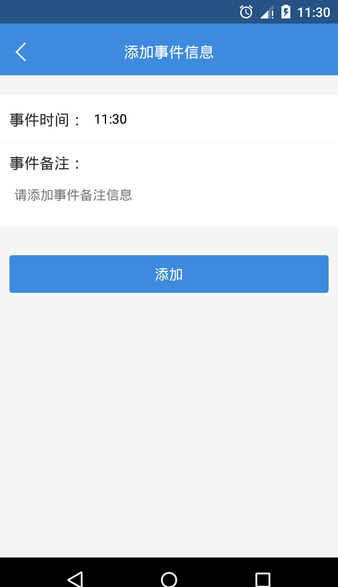
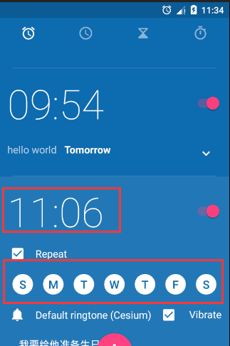

app的开发假如设计到事件提醒的话，在app本身里面假如软件不打开的话是不能进行提醒的，所以我们通过在添加提醒事件的时候，通过系统的闹铃来进行事件的提醒：

**步骤一：先设置提醒的时间和内容**

**步骤二：设置系统闹铃提醒**

    
    
     private void createAlarm(String message, int hour, int minutes, int resId) {
            ArrayList<Integer> testDays = new ArrayList<>();
            testDays.add(Calendar.MONDAY);//周一
            testDays.add(Calendar.TUESDAY);//周二
            testDays.add(Calendar.WEDNESDAY);//周三
            testDays.add(Calendar.THURSDAY);//周四
            testDays.add(Calendar.FRIDAY);//周五
            testDays.add(Calendar.SATURDAY);//周六
            testDays.add(Calendar.SUNDAY);//周日
            String packageName = getApplication().getPackageName();
            Uri ringtoneUri = Uri.parse("android.resource://" + packageName + "/" + resId);
            //action为AlarmClock.ACTION_SET_ALARM
            Intent intent = new Intent(AlarmClock.ACTION_SET_ALARM)
                    //闹钟的小时
                    .putExtra(AlarmClock.EXTRA_HOUR, hour)
                    //闹钟的分钟
                    .putExtra(AlarmClock.EXTRA_MINUTES, minutes)
                    //响铃时提示的信息
                    .putExtra(AlarmClock.EXTRA_MESSAGE, message)
                    //用于指定该闹铃触发时是否振动
                    .putExtra(AlarmClock.EXTRA_VIBRATE, true)
                    //一个 content: URI，用于指定闹铃使用的铃声，也可指定 VALUE_RINGTONE_SILENT 以不使用铃声。
                    //如需使用默认铃声，则无需指定此 extra。
                    .putExtra(AlarmClock.EXTRA_RINGTONE, ringtoneUri)
                    //一个 ArrayList，其中包括应重复触发该闹铃的每个周日。
                    // 每一天都必须使用 Calendar 类中的某个整型值（如 MONDAY）进行声明。
                    //对于一次性闹铃，无需指定此 extra
                    .putExtra(AlarmClock.EXTRA_DAYS, testDays)
                    //如果为true，则调用startActivity()不会进入手机的闹钟设置界面
                    .putExtra(AlarmClock.EXTRA_SKIP_UI, true);
            if (intent.resolveActivity(getPackageManager()) != null) {
                startActivity(intent);
            }
        }

**步骤二：设置后的效果**

