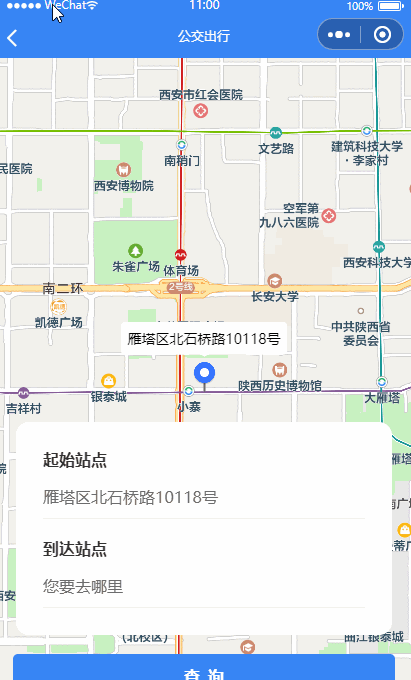

> **博主介绍：**
> 本人专注于Android/java/数据库/微信小程序技术领域的开发，以及有好几年的计算机毕业设计方面的实战开发经验和技术积累；尤其是在安卓（Android）的app的开发和微信小程序的开发，很是熟悉和了解；本人也是多年的Android开发人员；希望我发布的此篇文件可以帮助到您；
>
> 🍅 **希望此文章可以帮助到您** 🍅

**目录**

微信小程序文章推荐

效果显示

主要实现逻辑

一、前端界面

二、js逻辑处理

1：获取定位数据

2：关键字模糊搜索

3：位置导航

三、留个脚印吧

* * *

#### 微信小程序文章推荐

[微信小程序布局图片上面显示文字](https://blog.csdn.net/u014388322/article/details/128492276
"微信小程序布局图片上面显示文字")

[微信小程序实现左边图片右边文字效果](https://blog.csdn.net/u014388322/article/details/128611635
"微信小程序实现左边图片右边文字效果")

[微信小程序获取当前日期和时间](https://blog.csdn.net/u014388322/article/details/128318270
"微信小程序获取当前日期和时间")

[微信小程序绘制地图轨迹线路](https://blog.csdn.net/u014388322/article/details/128223282
"微信小程序绘制地图轨迹线路")

[微信小程序绘制marker](https://blog.csdn.net/u014388322/article/details/131555857
"微信小程序绘制marker")

[微信小程序之绘制多个marker以及调用手机地图软件导航](https://blog.csdn.net/u014388322/article/details/132086484
"微信小程序之绘制多个marker以及调用手机地图软件导航")

#### 效果显示

​

####  主要实现逻辑

1：获取定位数据

2：通过关键字搜索自己想去的位置信息

3：调用小程序api插件进行线路规划

#### 一、前端界面

> <view style="position: relative;width: 100%;height: 100%;">  
>
>
> <map class="mapUI" id="myMap" latitude="{{latitude}}"
> longitude="{{longitude}}" markers="{{markers}}"
> bindmarkertap="bindmarkertap" data-id="{{markers}}" scale="14"
> covers="{{covers}}" style="position: absolute;"></map>
>
> <view style="position: absolute;bottom: 0rpx;width: 100%;">
>
> <view class="tipInforyinhuan">
>
> <view class="tipInforTop">
>
> <view class="zoomtop">  
>
>
> <view class="loginInput">
>
> <view class="loginTip">起始站点</view>
>
> <view class="inputInfor" bindtap="choiceStart">
>
> {{starName}}
>
> </view>
>
> <view class="lineView"></view>
>
> <view class="loginTip" style="margin-top: 35rpx;">到达站点</view>
>
> <view class="inputInfor" bindtap="choiceEnd">
>
> {{endName}}
>
> </view>
>
> <view class="lineView"></view>
>
> </view>
>
> </view>
>
> </view>
>
> </view>
>
> <view class="btninfor" style="padding-bottom: 30rpx;">
>
> <view class="subButton" hover-class='view-box-btn-hover' hover-start-
> time='5' bindtap="orderListener">
>
> <text space="ensp">查 询</text>
>
> </view>
>
> </view>
>
> </view>
>
> </view>

#### 二、js逻辑处理

##### 1：获取定位数据

> wx.getLocation({
>
> success: res => {
>
> console.log(res);
>
> this.setData({
>
> location: res,
>
> latitude: res.latitude,
>
> longitude: res.longitude,
>
> // markers: this.data.markers,
>
> startPoint: {
>
> name: "我的位置",
>
> latitude: res.latitude,
>
> longitude: res.longitude
>
> },
>
> })
>
> },
>
> })

##### 2：关键字模糊搜索

> var that = this;
>
> // 实例化API核心类
>
> var qqmapsdk = new QQMapWX({ key: ' **你申请的key文件** '});
>
> wx.showNavigationBarLoading();
>
> qqmapsdk.getSuggestion({
>
> //获取输入框值并设置keyword参数
>
> keyword: e.detail.value, //用户输入的关键词，可设置固定值,如keyword:'KFC'
>
> region: '西安', //设置城市名，限制关键词所示的地域范围，非必填参数
>
> success: function (res) {//搜索成功后的回调
>
> console.log(res);
>
> wx.hideNavigationBarLoading();
>
> that.setData({ //设置suggestion属性，将关键词搜索结果以列表形式展示
>
> resultData: res.data
>
> });
>
> },
>
> fail: function (error) {
>
> console.error(error);
>
> },
>
> complete: function (res) {
>
> console.log(res);
>
> }
>
> });

说明：其中的key文件需要自己去腾讯地图开发者品台进行申请

##### 3：位置导航

> orderListener: function () {  
>
>
> if (this.data.endName == '请选择到达站点信息') {
>
> wx.showToast({
>
> title: '请选择到达站点信息',
>
> icon: 'none'
>
> })
>
> return
>
> }
>
> **const key = '您申请的key';**
>
> const referer = 'pony';
>
> const endPoint = JSON.stringify(this.data.endPoint);
>
> const startPoint = this.data.startPoint ?
> JSON.stringify(this.data.startPoint) : '';
>
> const navigation = this.data.isNavigate ? 1 : 0;
>
> let url = 'plugin://routePlan/index?mode=transit&key=' + key + '&referer=' +
> referer + '&startPoint=' + startPoint + '&endPoint=' + endPoint +
> '&navigation=' + navigation;
>
> console.log("log_-----url-----", url)
>
> wx.navigateTo({
>
> url
>
> });
>
>  
>
>
> },

#### 三、留个脚印吧

> 大家要是感觉此篇文章有意义；那就给个关注、点赞，收藏吧；
>
> 🍅 **也可以关注文档末尾公众号** 🍅

