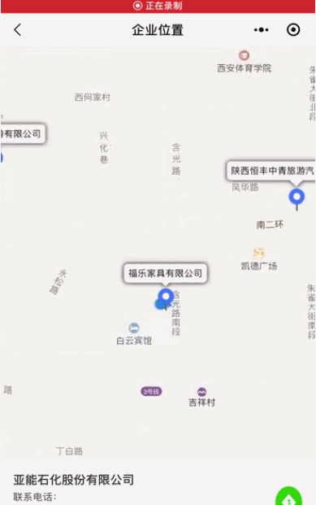

**此文章是为了说明使用微信小程序在腾讯地图上绘制多个marker地图点；然后点击某一个marker进行导航的信息；具体的功能演示如下：**

#### 一、功能演示

#### 二、前端布局代码

> <view style="display: flex;flex-direction: column;">
>
> **//地图的布局文件信息**
>
> ** <map class="mapUI" id="myMap" scale="13" bindmarkertap="bindmarkertap"
> data-index="{{index}}" show-location markers="{{markers}}"
> latitude="{{latitude}}" longitude="{{longitude}}" show-location></map>**
>
> **//以下是点击地图marker之后，下方显示的内容信息**
>
> <view class="topshowinfor">
>
> <view class="tipInforTop" style="position: fixed;width: 100%;top: 0px;">
>
> <view class="zoomtop">
>
> <view class="inputInfor" bindtap="looksearch" style="display: flex;flex-
> direction: row;justify-content: center;align-items: center;">
>
> <view>
>
> 企业名称搜索
>
> </view>
>
> </view>
>
> </view>
>
> </view>
>
> </view>  
>
>
> <view class="ALLinputInfor">
>
> <view wx:if="{{isAll==false}}">
>
> <view class="image-parent" bindtap="showAllAddress">
>
> <image class='allImg' mode='widthFix'
> src='/pages/image/yuanadd.png'></image>
>
> <view class="child">显示全部</view>
>
> </view>
>
> </view>
>
> </view>
>
> </view>  
>
>
> <view class="bottomShow">
>
> <view class="bottomStart">
>
> <view>
>
> <view>{{choiceModel.name}}</view>
>
> <view class="carAddress">
>
> <view style="white-space: nowrap;"> 联系电话：</view>
>
> <view class="totalInfor">15249243002</view>
>
> </view>
>
> <view class="carAddress">
>
> <view style="white-space: nowrap;"> 企业地址：</view>
>
> <view class="totalInfor">{{choiceModel.addr}}</view>
>
> </view>
>
> </view>
>
> <view>
>
> <image src="/pages/image/naivicon.png" class="naviImg"
> bindtap="naviListener"></image>
>
> </view>
>
> </view>
>
> </view>

#### 三、js逻辑处理代码

##### 1：marker点击

> 首先是通过方法 **bindmarkertap** 监听用户的点击事件，具体方法如下；
>
> bindmarkertap(event) {
>
> var that = this;
>
> var index = event.detail
>
> console.log("log_-----queryBean-----", index.markerId)
>
> **for (var i = 0; i < this.data.companyAddress.length; i++) {**
>
> if (i == index.markerId) {
>
> that.data.posIndex = i;
>
> that.data.markers[i].callout.borderColor = "#FF0000";
>
> that.data.markers[i].callout.color = "#FF0000";
>
> } else {
>
> that.data.markers[i].callout.borderColor = "#c3c3c3";
>
> that.data.markers[i].callout.color = "#333333";
>
> }
>
> **}**
>
> that.setData({
>
> choiceModel: this.data.companyAddress[that.data.posIndex],
>
> markers: that.data.markers
>
> })
>
> },

###### 说明一：

因为是存在多个数据，所在在用户点击的时候需要循环一下数据，然后通过点击的markerid和数据的makerid进行判断，然后对点击的marker
修改它的外边框的颜色；也就是代码：

> **that.data.markers[i].callout.borderColor = "#FF0000";**
>
> **that.data.markers[i].callout.color = "#FF0000";**

###### 说明二：

> that.setData({
>
> choiceModel: this.data.companyAddress[that.data.posIndex],
>
> markers: that.data.markers
>
> })

这块的代码是为了获取用户点击的数组的指定值；这里的值需要给前端的界面进行显示

##### 2：按钮导航

###### 1：点击按钮

> <view>
>
> <image src="/pages/image/naivicon.png" class="naviImg"
> bindtap="naviListener"></image>
>
> </view>

###### 2：js导航代码

> naviListener: function (e) {
>
> wx.openLocation({
>
> latitude: parseFloat(this.data.choiceModel.latitude), //维度
>
> longitude: parseFloat(this.data.choiceModel.longitude), //经度
>
> name: this.data.choiceModel.name, //目的地定位名称
>
> scale: 15, //缩放比例
>
> address: this.data.choiceModel.addr //导航详细地址
>
> })
>
> },

说明：这块的代码是小程序官方提供的代码；直接使用就可以了

