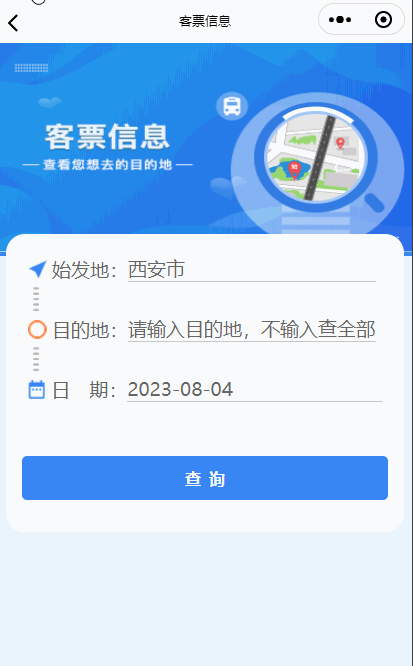

> **博主介绍：**
> 本人专注于Android/java/数据库/微信小程序技术领域的开发，以及有好几年的计算机毕业设计方面的实战开发经验和技术积累；尤其是在安卓（Android）的app的开发和微信小程序的开发，很是熟悉和了解；本人也是多年的Android开发人员；希望我发布的此篇文件可以帮助到您；
>
> 🍅 **希望此文章可以帮助到您** 🍅

**目录**

微信小程序文章推荐

实现的效果

效果显示

一、前端界面

二、js逻辑处理

三、留个脚印吧

* * *

#### 微信小程序文章推荐

[微信小程序布局图片上面显示文字_小程序图片上面显示文字怎么操作_Android毕业设计源码的博客-
CSDN博客](https://blog.csdn.net/u014388322/article/details/128492276
"微信小程序布局图片上面显示文字_小程序图片上面显示文字怎么操作_Android毕业设计源码的博客-CSDN博客")

[微信小程序绘制线路以及marker轨迹移动_微信小程序地图画路线_Android毕业设计源码的博客-
CSDN博客](https://blog.csdn.net/u014388322/article/details/131579949
"微信小程序绘制线路以及marker轨迹移动_微信小程序地图画路线_Android毕业设计源码的博客-
CSDN博客")[微信小程序实现左边图片右边文字效果_微信小程序图片文字左右布局_Android毕业设计源码的博客-
CSDN博客](https://blog.csdn.net/u014388322/article/details/128611635
"微信小程序实现左边图片右边文字效果_微信小程序图片文字左右布局_Android毕业设计源码的博客-CSDN博客")

[微信小程序获取当前日期和时间_微信小程序获取当前时间_Android毕业设计源码的博客-
CSDN博客](https://blog.csdn.net/u014388322/article/details/128318270
"微信小程序获取当前日期和时间_微信小程序获取当前时间_Android毕业设计源码的博客-CSDN博客")

[微信小程序之获取定位数据以及通过坐标获取详细地址数据_定位小程序源码_Android毕业设计源码的博客-
CSDN博客](https://blog.csdn.net/u014388322/article/details/128223138
"微信小程序之获取定位数据以及通过坐标获取详细地址数据_定位小程序源码_Android毕业设计源码的博客-CSDN博客")
[微信小程序绘制地图轨迹线路_微信小程序polyline_Android毕业设计源码的博客-
CSDN博客](https://blog.csdn.net/u014388322/article/details/128223282
"微信小程序绘制地图轨迹线路_微信小程序polyline_Android毕业设计源码的博客-CSDN博客")

[微信小程序绘制marker_Android毕业设计源码的博客-
CSDN博客](https://blog.csdn.net/u014388322/article/details/131555857
"微信小程序绘制marker_Android毕业设计源码的博客-CSDN博客")

[微信小程序之绘制多个marker以及调用手机地图软件导航_Android毕业设计源码的博客-
CSDN博客](https://blog.csdn.net/u014388322/article/details/132086484
"微信小程序之绘制多个marker以及调用手机地图软件导航_Android毕业设计源码的博客-CSDN博客")

#### 效果显示

#### 一、前端界面

> <view class="inputInfor" bindtap="bindDateChange">
>
> <view style="display: flex;flex-direction: row; align-items: center;">
>
> <image src="../image/rilistart.png" class="startcss"
> mode="scaleToFill"></image> <view style="margin-left: 10rpx;white-
> space:nowrap;display: flex;flex-direction: row;">
>
> 日 期：
>
> </view>
>
> <view style="width:75%;">
>
> ** <picker mode="date" value="{{date}}" start="{{startData}}"
> bindchange="bindDateChange">**
>
> ** <view class="picker">**
>
> **{ {nowData}}**
>
> ** </view>**
>
> ** </picker>**
>
> <view class="lineView">
>
> </view>
>
> </view>
>
> </view>
>
> </view>

#### 二、js逻辑处理

##### 1：获取当前时间

> this.setData({
>
> nowData: this.formatData(new Date()),
>
> })

##### 2：通过formatData方法获取时间

> formatData: function (date) {
>
> const year = date.getFullYear()
>
> const month = (date.getMonth() + 1 < 10 ? '0' + (date.getMonth() + 1) :
> date.getMonth() + 1);
>
> const day = date.getDate() < 10 ? '0' + date.getDate() : date.getDate();
>
> const hour = date.getHours()
>
> const minute = date.getMinutes()
>
> const second = date.getSeconds()
>
> // return year + '-' + month + '-' + day + ' ' + hour + ':' + minute + ':' +
> second
>
> return year + '-' + month + '-' + day
>
> // return year + '年' + month + '月' + day + '日'
>
> },

说明：对于方法里面的时分秒可以根据自己的需求看是否需要进行获取

#####  3：滚轮滑动监听

> bindDateChange: function (e) {
>
> var riqiInfor = e.detail.value;
>
> var dateArr = riqiInfor.split("-")
>
> console.log("log_idcardInfor:", dateArr[0] + "年" + dateArr[1] + "月" +
> dateArr[2] + "日")
>
> console.log('picker发送选择改变，携带值为', e.detail.value)
>
> this.setData({
>
> nowData: dateArr[0] + "-" + dateArr[1] + "-" + dateArr[2]
>
> })
>
> },

说明：通过此方法就可以拿到自己选择的时间数据了；

#### 三、留个脚印吧

> 大家要是感觉此篇文章有意义；那就给个关注、点赞，收藏吧；
>
> 🍅 **也可以关注文档末尾公众号** 🍅

