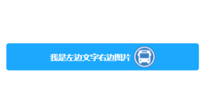

> **博主介绍：**
> 本人专注于Android/java/数据库/微信小程序技术领域的开发，以及有好几年的计算机毕业设计方面的实战开发经验和技术积累；尤其是在安卓（Android）的app的开发和微信小程序的开发，很是熟悉和了解；本人也是多年的Android开发人员；希望我发布的此篇文件可以帮助到您；
>
> 🍅 **希望此文章可以帮助到您** 🍅

**目录**

微信小程序文章推荐

实现的效果：

一、前端xml布局文件

二、css文件

三、左边文字右边图片效果

四、留个脚印吧

* * *

#### 微信小程序文章推荐

[微信小程序布局图片上面显示文字_小程序图片上面显示文字怎么操作_Android毕业设计源码的博客-
CSDN博客](https://blog.csdn.net/u014388322/article/details/128492276
"微信小程序布局图片上面显示文字_小程序图片上面显示文字怎么操作_Android毕业设计源码的博客-CSDN博客")

[微信小程序绘制线路以及marker轨迹移动_微信小程序地图画路线_Android毕业设计源码的博客-
CSDN博客](https://blog.csdn.net/u014388322/article/details/131579949
"微信小程序绘制线路以及marker轨迹移动_微信小程序地图画路线_Android毕业设计源码的博客-
CSDN博客")[微信小程序实现左边图片右边文字效果_微信小程序图片文字左右布局_Android毕业设计源码的博客-
CSDN博客](https://blog.csdn.net/u014388322/article/details/128611635
"微信小程序实现左边图片右边文字效果_微信小程序图片文字左右布局_Android毕业设计源码的博客-CSDN博客")

[微信小程序获取当前日期和时间_微信小程序获取当前时间_Android毕业设计源码的博客-
CSDN博客](https://blog.csdn.net/u014388322/article/details/128318270
"微信小程序获取当前日期和时间_微信小程序获取当前时间_Android毕业设计源码的博客-CSDN博客")

[微信小程序之获取定位数据以及通过坐标获取详细地址数据_定位小程序源码_Android毕业设计源码的博客-
CSDN博客](https://blog.csdn.net/u014388322/article/details/128223138
"微信小程序之获取定位数据以及通过坐标获取详细地址数据_定位小程序源码_Android毕业设计源码的博客-CSDN博客")
[微信小程序绘制地图轨迹线路_微信小程序polyline_Android毕业设计源码的博客-
CSDN博客](https://blog.csdn.net/u014388322/article/details/128223282
"微信小程序绘制地图轨迹线路_微信小程序polyline_Android毕业设计源码的博客-CSDN博客")

[微信小程序绘制marker_Android毕业设计源码的博客-
CSDN博客](https://blog.csdn.net/u014388322/article/details/131555857
"微信小程序绘制marker_Android毕业设计源码的博客-CSDN博客")

[微信小程序之绘制多个marker以及调用手机地图软件导航_Android毕业设计源码的博客-
CSDN博客](https://blog.csdn.net/u014388322/article/details/132086484
"微信小程序之绘制多个marker以及调用手机地图软件导航_Android毕业设计源码的博客-CSDN博客")

#### 实现的效果：

#### 一、前端xml布局文件

> <view class="chuxingItem">
>
> <image class="img" src="/pages/image/banche.png"></image>
>
> <view style="font-size: 30rpx;margin-left: 15rpx;">班车查询</view>
>
> </view>
>
> <view class="chuxingItem">
>
> <image class="img" src="/pages/image/banche.png"></image>
>
> <view style="font-size: 30rpx;margin-left: 15rpx;">信息查询</view>
>
> </view>

#### 二、css文件

> //主背景颜色修改
>
> page {
>
> background-color: #f3f3f3;
>
> }
>
> .chuxingItem {
>
> **display: flex;**
>
> **flex-direction: row;**
>
> align-items: center;
>
> }
>
> .img{
>
> width: 46rpx;
>
> height: 52rpx;
>
> }

实现步骤说明：

**1：设置布局的css样式为display: flex;**

**2：设置css让布局横向排列，也就是设置flex-direction: row;**

**3：让布局中的内容居中align-items: center;**

其实主要实现的主要代码就是 **display: flex; flex-direction: row; 也**就是让布局横向排列就可以了；

#### 三、左边文字右边图片效果

#####  1、前端界面

> <view style="margin-top: 100px;">
>
> <view class=" **showView** ">
>
> ** <view style="color: #fff;font-weight: bold;">我是左边文字右边图片</view>**
>
> ** <image src="../image/iconzhan.png" style="width: 80rpx;height:
> 80rpx;margin-left: 10rpx;"></image>**
>
> </view>
>
> </view>

##### 2、css代码处理

> .showView {
>
> display: flex;
>
> **flex-direction: row;**
>
> **align-items: center;**
>
> **justify-content: center;**
>
> background-color: #1CA8FD;
>
> margin: 30rpx;
>
> border-radius: 10rpx;
>
> padding: 10rpx
>
> }

其实就是调整一下内容的显示次序就可以了

#### 四、留个脚印吧

> 大家要是感觉此篇文章有意义；那就给个关注、点赞，收藏吧；
>
> 🍅 **也可以关注文档末尾公众号** 🍅

