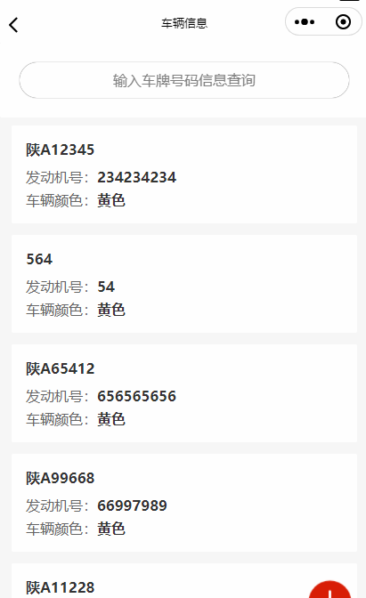

> **博主介绍：**
> 本人专注于Android/java/数据库/微信小程序技术领域的开发，以及有好几年的计算机毕业设计方面的实战开发经验和技术积累；尤其是在安卓（Android）的app的开发和微信小程序的开发，很是熟悉和了解；本人也是多年的Android开发人员；希望我发布的此篇文件可以帮助到您；
>
> 🍅 **希望此文章可以帮助到您** 🍅

**目录**

微信小程序文章推荐

效果显示

一、前端界面

二、下部分设置

三、留个脚印吧

* * *

#### 微信小程序文章推荐

[微信小程序布局图片上面显示文字](https://blog.csdn.net/u014388322/article/details/128492276
"微信小程序布局图片上面显示文字")

[微信小程序实现左边图片右边文字效果](https://blog.csdn.net/u014388322/article/details/128611635
"微信小程序实现左边图片右边文字效果")

[微信小程序获取当前日期和时间](https://blog.csdn.net/u014388322/article/details/128318270
"微信小程序获取当前日期和时间")

[微信小程序绘制地图轨迹线路](https://blog.csdn.net/u014388322/article/details/128223282
"微信小程序绘制地图轨迹线路")

[微信小程序绘制marker](https://blog.csdn.net/u014388322/article/details/131555857
"微信小程序绘制marker")

[微信小程序之绘制多个marker以及调用手机地图软件导航](https://blog.csdn.net/u014388322/article/details/132086484
"微信小程序之绘制多个marker以及调用手机地图软件导航")

#### 效果显示

说明：也就是页面在滑动的时候，顶部的搜索框布局是估计的；他不会随着下面部分的滚动也进行移动；

#### 一、前端界面

    
    
    <view >
      <view style="position: fixed;width: 100%;top: 0px;">
        <view >
            <input type="text" class="inputInfor" placeholder="输入车牌号码信息查询"   placeholder-class="center"/>
        </view>
        </view>
    </view>

说明：主要就是设置布局的css样式；

> **position: fixed;width: 100%;top: 0px;**

设置此代码之后就可以不在滚动；但是他会遮挡下面的布局；所以对于下面的布局；还需设置一个 **margin-top: 170rpx;**
这个值可以根据自己的需求进行设置就可以了

#### 二、下部分设置

> <view class="listinforyihuan" **style="margin-top: 170rpx;"** >
>
> <view wx:for="{{companyData}}" wx:key="{{index}}" data-index="{{index}}"
> bindtap="lookCompany">
>
> <view class="tipInforyinhuan">
>
> <view class="startinfor">
>
> <view class="tuijianName">{{item.vno}}</view>
>
> <view class="listZoomyh">
>
> <view class="zoomnryh">
>
> <view>发动机号：</view>
>
> <view class="inforzoomyh">{{item.engineNumber}}</view>
>
> </view>
>
> <view class="zoomnryh">
>
> <view>车辆颜色：</view>
>
> <view class="inforzoomyh">黄色</view>
>
> </view>
>
> </view>
>
> </view>
>
> </view>
>
> </view>
>
> </view>

#### 三、留个脚印吧

> 大家要是感觉此篇文章有意义；那就给个关注、点赞，收藏吧；
>
> 🍅 **也可以关注文档末尾公众号** 🍅

