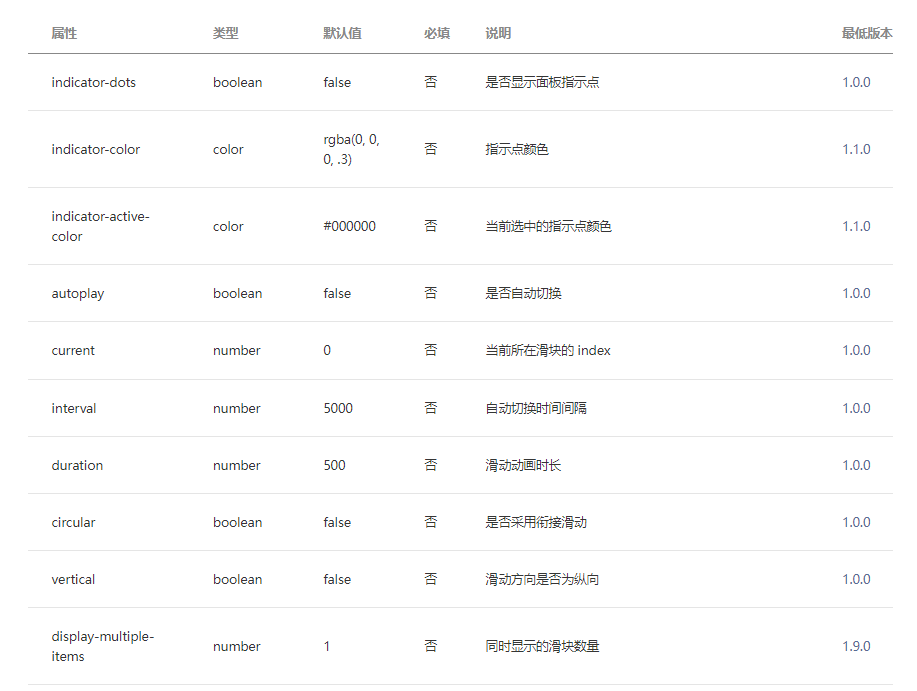

> **博主介绍：**
> 本人专注于Android/java/数据库/微信小程序技术领域的开发，以及有好几年的计算机毕业设计方面的实战开发经验和技术积累；尤其是在安卓（Android）的app的开发和微信小程序的开发，很是熟悉和了解；本人也是多年的Android开发人员；希望我发布的此篇文件可以帮助到您；
>
> 🍅 **希望此文章可以帮助到您** 🍅

#### 微信小程序文章推荐

[微信小程序布局图片上面显示文字](https://blog.csdn.net/u014388322/article/details/128492276
"微信小程序布局图片上面显示文字")

[微信小程序实现左边图片右边文字效果](https://blog.csdn.net/u014388322/article/details/128611635
"微信小程序实现左边图片右边文字效果")

[微信小程序获取当前日期和时间](https://blog.csdn.net/u014388322/article/details/128318270
"微信小程序获取当前日期和时间")

[微信小程序绘制地图轨迹线路](https://blog.csdn.net/u014388322/article/details/128223282
"微信小程序绘制地图轨迹线路")

[微信小程序绘制marker](https://blog.csdn.net/u014388322/article/details/131555857
"微信小程序绘制marker")

[微信小程序之绘制多个marker以及调用手机地图软件导航](https://blog.csdn.net/u014388322/article/details/132086484
"微信小程序之绘制多个marker以及调用手机地图软件导航")

#### 效果显示

#### 一、前端界面

> <swiper indicator-dots="{{indicatorDots}}" autoplay="{{autoplay}}"
> interval="{{interval}}" duration="{{duration}}" class="bannerinfor"
> style="padding-top: 10rpx;">
>
> <block wx:for="{{imgUrls}}">
>
> <swiper-item>
>
> <view class="bg">
>
> <image src="{{item}}" class="slide-image" mode='aspectFill'></image>
>
> </view>
>
> </swiper-item>
>
> </block>
>
> </swiper>

说明：主要使用的是 **swiper** 组件进行实现的

#### 二、js逻辑处理

对于轮播图的控制是在data里面设置参数控制的；具体代码如下：

> data: {
>
> typeData: [],
>
> recommendData: [],
>
> resultData: [],
>
> indicatorDots: true,
>
> autoplay: true,
>
> interval: 5000,
>
> duration: 1000,
>
> imgUrls: [
>
> 'https://img95.699pic.com/photo/40218/4050.jpg_wh300.jpg',
>
> 'https://img95.699pic.com/photo/40200/4239.jpg_wh300.jpg'
>
> ],
>
> },

具体属性值：

也可以查看小程序文档：[swiper |
微信开放文档](https://developers.weixin.qq.com/miniprogram/dev/component/swiper.html
"swiper | 微信开放文档")

#### 三、css样式代码

> .bannerinfor{
>
> height: 270rpx;
>
> margin-left: 30rpx;
>
> margin-right: 30rpx;
>
> }

#### 三、留个脚印吧

> 大家要是感觉此篇文章有意义；那就给个关注、点赞，收藏吧；
>
> 🍅 **也可以关注文档末尾公众号** 🍅

