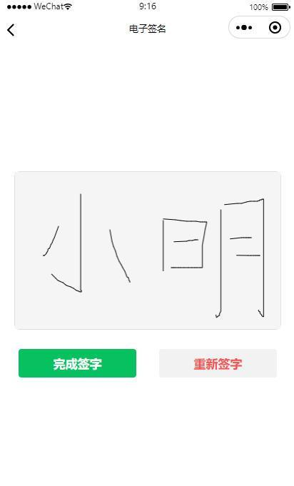

主要实现的方式在通过控件“canvas”进行绘制实现的；实现的效果图如下：

**1：wxml布局文件**

    
    
    <view>
        <view class="pageUI">
            <view class="paper">
                <canvas class="canvastyle" canvas-id="canvasId" id='canvasId' bindtouchstart="bindtouchstart" bindtouchmove="bindtouchmove"></canvas>
            </view>
            <view class="writebox">
                <button  size="default" type="primary" bindtap="export" style="width: 300rpx;margin-right: 30rpx;">完成签字</button>
                <button size="default" type="warn" bindtap="clear"  style="width: 300rpx;margin-left: 30rpx;">重新签字</button>
            </view>
        </view>
    </view>

**2：css文件**

    
    
    .pageUI{
        height: 100vh;
        display: flex;
        flex-direction: column;
        align-items: center;
        justify-content: center;
    }
    
    
    .paper {
        width: 90%;
        border: 1px solid #dedede;
        height: 400rpx;
        border-radius:15rpx;
    }
    
    
    
    .signBtn {
        display: flex;
        margin-top: 20px;
    }
    
    .canvastyle {
        height: 100%;
        width: 100%;
        background-color: #f5f5f5;
    }
    
    .writebox {
        
        display: flex;
        padding: 50rpx;
        justify-content: space-between;
    }
    
    .cusstyle {
        width: 200rpx;
    }

**3：js文件代码**

    
    
    Page({
        data: {
            flagMove: false,//默认未签名
            context: null,
    
        },
        onLoad: function (options) {
            let context = wx.createCanvasContext('canvasId')
            this.setData({
                context: context
            })
            context.draw();
        },
        bindtouchstart(e) {
            console.log("bindtouchstart", e);
            this.data.context.moveTo(e.changedTouches[0].x, e.changedTouches[0].y)
        },
        // 触摸移动
        bindtouchmove(e) {
            console.log("bindtouchstart", e);
            this.setData({
                flagMove: true,
            })
            this.data.context.lineTo(e.changedTouches[0].x, e.changedTouches[0].y);
            this.data.context.stroke();
            this.data.context.draw(true);
            this.data.context.moveTo(e.changedTouches[0].x, e.changedTouches[0].y);
        },
        /**清空画布 */
        clear() {
            this.data.context.clearRect(0, 0, 600, 700);//清空画布
            this.data.context.draw();
            this.setData({
                flagMove: false
            })
        },
        /**导出图片 */
        export() {
            const that = this;
            if (!that.data.flagMove) {
                console.log('签名获取失败，请稍后重试');
                return;
            }
            that.data.context.draw(true, wx.canvasToTempFilePath({
                x: 0,
                y: 0,
                fileType: 'jpg',
                canvasId: 'canvasId',
                success(res) {
                    const { tempFilePath } = res;
    
                    let pages = getCurrentPages();
                    let prevPage = pages[pages.length - 2];
    
                    prevPage.setData({
                        signImage: tempFilePath,
                    })
                    wx.navigateBack({
                        delta: 1,
                    })
    
                    console.log('手写签名，签字图片', tempFilePath)
                },
                fail() {
                    showToast('签名提交失败');
                }
            }))
        },
    })

