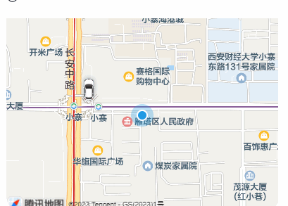
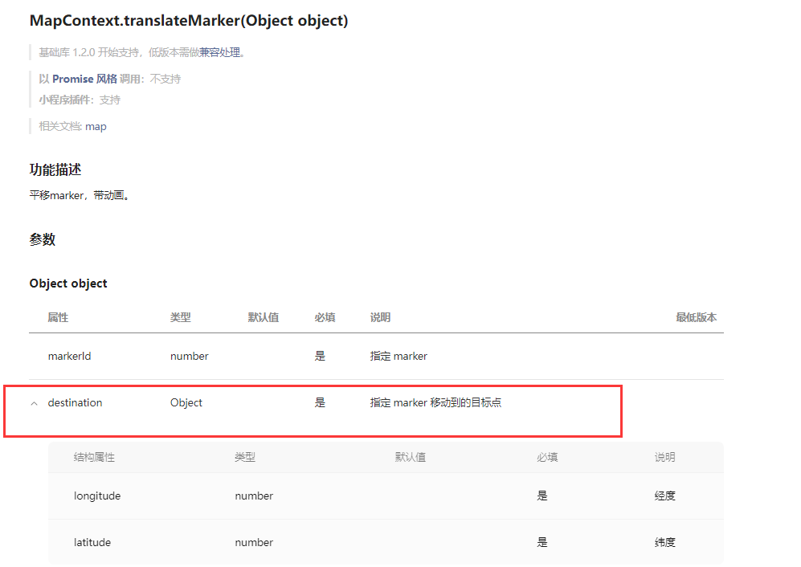
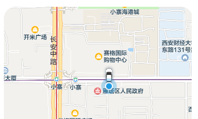

> **博主介绍：**
> 本人专注于Android/java/数据库/微信小程序技术领域的开发，以及有好几年的计算机毕业设计方面的实战开发经验和技术积累；尤其是在安卓（Android）的app的开发和微信小程序的开发，很是熟悉和了解；本人也是多年的Android开发人员；希望我发布的此篇文件可以帮助到您；
>
> 🍅 **希望此文章可以帮助到您** 🍅

**目录**

微信小程序文章推荐

效果显示

一、前端界面

二、js逻辑处理

1：定义第一个点的坐标

2：定义第二个点的坐标

三、说明

四、留个脚印吧

* * *

#### 微信小程序文章推荐

[微信小程序布局图片上面显示文字](https://blog.csdn.net/u014388322/article/details/128492276
"微信小程序布局图片上面显示文字")

[微信小程序实现左边图片右边文字效果](https://blog.csdn.net/u014388322/article/details/128611635
"微信小程序实现左边图片右边文字效果")

[微信小程序获取当前日期和时间](https://blog.csdn.net/u014388322/article/details/128318270
"微信小程序获取当前日期和时间")

[微信小程序绘制地图轨迹线路](https://blog.csdn.net/u014388322/article/details/128223282
"微信小程序绘制地图轨迹线路")

[微信小程序绘制marker](https://blog.csdn.net/u014388322/article/details/131555857
"微信小程序绘制marker")

[微信小程序之绘制多个marker以及调用手机地图软件导航](https://blog.csdn.net/u014388322/article/details/132086484
"微信小程序之绘制多个marker以及调用手机地图软件导航")

#### 效果显示

说明：此功能是在微信小程序上实现的；其实原理就是两个坐标点之间的移动；具体可以看一下小程序的说明文档：[MapContext.translateMarker(Object
object) |
微信开放文档](https://developers.weixin.qq.com/miniprogram/dev/api/media/map/MapContext.translateMarker.html
"MapContext.translateMarker\(Object object\) | 微信开放文档")

####  一、前端界面

> <view class="mapshow">
>
> ** <map class="mapUI" id="myMap" markers="{{markers}}"
> polyline="{{polyline}}" include-points='{{points}}' latitude="{{latitude}}"
> longitude="{{longitude}}" covers="13" show-location></map>**
>
> </view>

说明：这块我在做的时候这个地图是圆角显示的，如下图：

对于地图而言直接设置他的border-radius: 45rpx;是没有效果的；必须要在他的外层套一层View；然后在view上设置圆角才可以的：

    
    
    .mapshow{
      margin: 25rpx;
      transform: translateY(0);
      border-radius: 45rpx;
      overflow:hidden;
    }

#### 二、js逻辑处理

##### 1：定义第一个点的坐标

    
    
      data: {
        latitude: "",
        longitude: "",
        markers: [{
          id: 9001,
          latitude: 34.222893,
          longitude: 108.946898,
          name: "终点",
          iconPath: '../image/mocar.png',
          content: "111",
          width: '30px',
          height: '45px',
        }],
      },

##### 2：定义第二个点的坐标

    
    
      /**
       * 生命周期函数--监听页面加载
       */
      onLoad() {
        var mapCtx = wx.createMapContext("myMap");
    
        wx.getLocation({
          isHighAccuracy: true, // 开启地图精准定位
          type: 'gcj02', // 地图类型写这个
          success: res => {
            console.log(res);
            this.setData({
              mylatitude: res.latitude,
              mylongitude: res.longitude,
              location: res,
              latitude: res.latitude,
              longitude: res.longitude
            })
    
         
            mapCtx.translateMarker({
              markerId: 9001,
              destination: {
                latitude:  res.latitude,
                longitude: res.longitude,
              },
              rotate: 0,
              autoRotate: true,
              duration: 8000,
              animationEnd: function () {
                console.log('marker end')
              },
              fail: function (res) {
                console.log(res)
              }
            })
    
    
          },
        })
    
     
    
      },

说明：我这看因为是模拟实现此功能；所以第二个点的坐标使用的是我的定位数据；也就是获取到自己的坐标数据之后， **marker**
也就是点的位置移动到我所在的位置；

**定位数据获取：**

> wx.getLocation();

**点的移动：**

> mapCtx.translateMarker({
>
> markerId: 9001,
>
> destination: {
>
> latitude: res.latitude,
>
> longitude: res.longitude,
>
> },
>
> rotate: 0,
>
> autoRotate: true,
>
> duration: 8000,
>
> animationEnd: function () {
>
> console.log('marker end')
>
> },
>
> fail: function (res) {
>
> console.log(res)
>
> }
>
> })

说明：这块的 **markerId** 一定是需要定义的第一个点的id才可以，因为需要一一对应；

#### 三、说明

>
> 对于真实的项目开发，坐标点一定的很多的；所以当多个点移动的时候，通过每个点的markerid，就可以拿到对应的点的数据；然后获取最新的点的数据，使用点的移动的方法进行实现就可以了

#### 四、留个脚印吧

> 大家要是感觉此篇文章有意义；那就给个关注、点赞，收藏吧；
>
> 🍅 **也可以关注文档末尾公众号** 🍅

