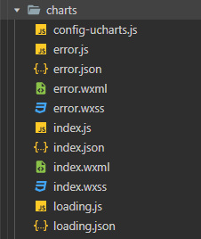
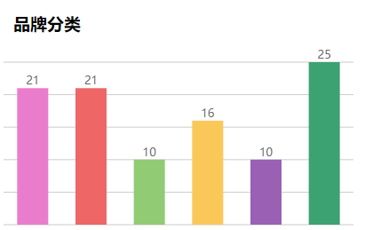

> **博主介绍：**
> 本人专注于Android/java/数据库/微信小程序技术领域的开发，以及有好几年的计算机毕业设计方面的实战开发经验和技术积累；尤其是在安卓（Android）的app的开发和微信小程序的开发，很是熟悉和了解；本人也是多年的Android开发人员；希望我发布的此篇文件可以帮助到您；
>
> 🍅 **希望此文章可以帮助到您** 🍅

#### 微信小程序文章推荐

[微信小程序布局图片上面显示文字](https://blog.csdn.net/u014388322/article/details/128492276
"微信小程序布局图片上面显示文字")

[微信小程序实现左边图片右边文字效果](https://blog.csdn.net/u014388322/article/details/128611635
"微信小程序实现左边图片右边文字效果")

[微信小程序获取当前日期和时间](https://blog.csdn.net/u014388322/article/details/128318270
"微信小程序获取当前日期和时间")

[微信小程序绘制地图轨迹线路](https://blog.csdn.net/u014388322/article/details/128223282
"微信小程序绘制地图轨迹线路")

[微信小程序绘制marker](https://blog.csdn.net/u014388322/article/details/131555857
"微信小程序绘制marker")

[微信小程序之绘制多个marker以及调用手机地图软件导航](https://blog.csdn.net/u014388322/article/details/132086484
"微信小程序之绘制多个marker以及调用手机地图软件导航")

####

#### 图表说明：

> 使用的图标库是：[uCharts跨平台图表库](https://www.ucharts.cn/ "uCharts跨平台图表库")

说明：在使用之前需要先下载网站提供的js文件信息；下载完放在自己的小程序项目目录里面；

####

#### 一、效果演示

#### 二、json文件引入

> {
>
> "usingComponents": {
>
> **"qiun-wx-ucharts": "../charts/index"**
>
> }
>
> }

#### 三、前端代码

> <view class="charts-box">
>
> ** <qiun-wx-ucharts type="column" opts="{{optsZhu}}"
> chartData="{{chartDataZhu}}" />**
>
> </view>

#### 四、在js文件data设置样式

> optsZhu: {
>
> color: ["#5569f4",
>
> "#F97555",
>
> "#FAC858",
>
> "#EE6666",
>
> "#73C0DE",
>
> "#3CA272",
>
> "#FC8452",
>
> "#9A60B4",
>
> "#ea7ccc"],
>
> padding: [15, 15, 0, 5],
>
> legend: {},
>
> xAxis: {
>
> disableGrid: true,
>
> },
>
> yAxis: {
>
> data: [
>
> {
>
> disabled: true,
>
> min: 0
>
> }
>
> ]
>
> },
>
> extra: {
>
> column: {
>
> type: "group",
>
> width: 35,
>
> activeBgColor: "#000000",
>
> activeBgOpacity: 0.08
>
> }
>
> }
>
> },

#### 五、加载数据

> getServerDataZhu() {
>
> //模拟从服务器获取数据时的延时
>
> setTimeout(() => {
>
> let res = {
>
> categories: ["2016", "2017", "2018", "2019", "2020", "2021"],
>
> series: [
>
> {
>
> name: "目标值",
>
> data: [{ "value": 21, "color": "#ea7ccc" },
>
> { "value": 21, "color": "#EE6666" },
>
> { "value": 10, "color": "#91CB74" },
>
> { "value": 16, "color": "#FAC858" },
>
> { "value": 10, "color": "#9A60B4" },
>
> { "value": 25, "color": "#3CA272" }]
>
> }
>
> ]
>
> };
>
> this.setData({ chartDataZhu: JSON.parse(JSON.stringify(res)) });
>
> }, 500);
>
> },

说明：此处是柱状图需要加载的数据信息  

#### 六、留个脚印吧

> 大家要是感觉此篇文章有意义；那就给个关注、点赞，收藏吧；
>
> 🍅 **也可以关注文档末尾公众号** 🍅

